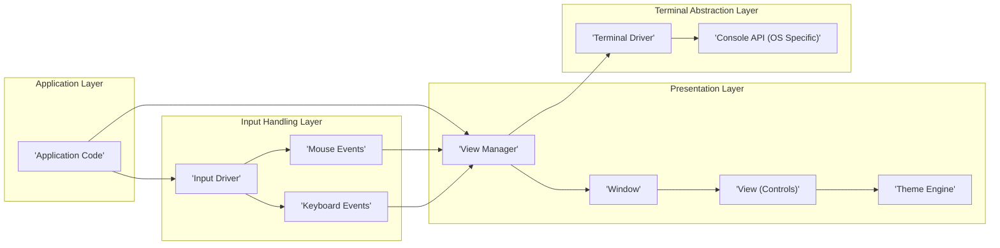
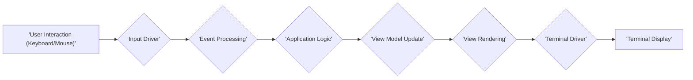

# Project Design Document: terminal.gui

**Version:** 1.1
**Date:** October 26, 2023
**Author:** Gemini (AI Language Model)

## 1. Introduction

This document provides a detailed design overview of the `terminal.gui` project, a cross-platform framework for building rich terminal user interfaces (TUIs) with .NET. This document serves as a foundation for understanding the project's architecture, components, and data flow, and will be used as a basis for subsequent threat modelling activities. This version includes more detailed descriptions of core components and potential security considerations.

## 2. Project Goals

The primary goals of the `terminal.gui` project are:

*   Provide a comprehensive and extensible set of UI controls for building interactive terminal applications.
*   Offer a truly cross-platform API that functions consistently across diverse operating systems (Windows, Linux, macOS) and a wide range of terminal emulators.
*   Empower developers to create visually appealing, highly functional, and user-friendly TUIs that rival the usability of traditional graphical applications.
*   Provide robust support for accessibility features, ensuring applications are usable by individuals with disabilities through technologies like screen readers.
*   Maintain a well-documented, intuitive, and easy-to-use API, lowering the barrier to entry for developers.
*   Foster an active and supportive community of developers through open collaboration and contribution.

## 3. High-Level Architecture

The `terminal.gui` framework employs a layered architecture, effectively abstracting the complexities of direct terminal interaction. This design promotes modularity and maintainability. The core components collaborate to manage the application lifecycle, process user input, and render the user interface.

*   **Application Layer:** This represents the developer's custom application code. It utilizes the `terminal.gui` framework's API to define the application's structure, behavior, and user interface elements.
*   **Presentation Layer:** This layer is responsible for the visual aspects of the application, managing how the UI is displayed and updated.
    *   **View Manager:**  A central component that orchestrates the rendering process. It manages the hierarchy of `View` objects, handles layout calculations, and ensures efficient screen updates.
    *   **Window:** Represents a top-level, independent container for `View` objects. It provides a boundary for the UI and manages its own input focus.
    *   **View (Controls):**  The fundamental building blocks of the user interface. These are reusable components like buttons, labels, text fields, and lists, each responsible for rendering itself and handling user interactions within its area.
    *   **Theme Engine:**  Manages the visual styling of the UI elements, allowing developers to customize the appearance of their applications through themes and color schemes.
*   **Input Handling Layer:** This layer is dedicated to capturing and processing user input from the terminal.
    *   **Input Driver:**  Provides an abstraction over the underlying terminal input mechanisms, handling differences in how keyboard and mouse events are reported across different terminals and operating systems.
    *   **Mouse Events:**  Specifically handles mouse interactions within the terminal window, such as clicks, drags, and scrolling.
    *   **Keyboard Events:**  Processes keyboard input, including character input, special key presses (like arrow keys, function keys), and key combinations.
*   **Terminal Abstraction Layer:** This layer isolates the framework from the specifics of the underlying terminal environment.
    *   **Terminal Driver:**  Provides a consistent, platform-independent interface for interacting with the terminal. It handles tasks like writing characters to the screen, reading input, and managing the cursor.
    *   **Console API (OS Specific):**  A thin wrapper around the operating system's native console API (e.g., the Windows Console API or ncurses on Linux/macOS). This layer handles the low-level communication with the terminal.

## 4. Key Components

*   **Application:** The primary entry point and container for a `terminal.gui` application. It initializes the framework, sets up the main window, and manages the application's main event loop, which drives the UI updates and input processing.
*   **Top-Level Windows:**  Represent the main windows of the application. They act as containers for other `View` objects and often correspond to distinct screens or dialogs within the application.
*   **Views:** The core UI building blocks. Specific examples include:
    *   `Label`: A simple control for displaying static, non-editable text.
    *   `Button`: A clickable control that triggers an action when activated by the user.
    *   `TextField`: Allows users to input and edit a single line of text.
    *   `TextView`: Provides a more advanced text editing area, supporting multi-line input, scrolling, and potentially syntax highlighting.
    *   `ListView`: Displays a scrollable list of selectable items.
    *   `TableView`: Presents data in a tabular format with rows and columns, often allowing for sorting and selection.
    *   `Dialog`: A specialized window, typically modal, used for presenting information to the user or prompting for input.
*   **Layout Managers:**  Components responsible for determining the size and position of `View` objects within their parent containers. They handle the complexities of arranging UI elements, adapting to different screen sizes and content.
*   **Event Handling:**  A crucial mechanism for responding to user interactions and system events. `terminal.gui` uses an event-driven model where user actions (like button clicks or key presses) trigger events that can be handled by application code.
*   **Colors and Themes:**  Provides a system for customizing the visual appearance of the UI. Developers can define themes with specific color palettes and apply them to their applications, ensuring visual consistency.
*   **Input Handling:**  Manages the reception and processing of keyboard and mouse input from the terminal, converting raw input into meaningful events that the application can respond to.
*   **Clipboard Support:** Enables users to copy and paste text within the terminal application, enhancing usability and data transfer.
*   **Accessibility Features:**  Includes support for technologies like screen readers, allowing visually impaired users to interact with `terminal.gui` applications. This involves providing semantic information about UI elements.

## 5. Data Flow

The typical data flow within a `terminal.gui` application involves user interaction triggering events, which are then processed by the application logic, potentially leading to updates in the application's data and subsequent UI rendering.

*   **User Interaction (Keyboard/Mouse):** The user interacts with the application by pressing keys on the keyboard or using the mouse within the terminal window.
*   **Input Driver:** The `Input Driver` component captures these raw input events from the terminal.
*   **Event Processing:** The framework's event processing system analyzes the input events to determine which UI element is the target of the interaction and what type of event occurred (e.g., a key press on a `TextField`, a click on a `Button`).
*   **Application Logic:** The application's custom code, specifically the event handlers associated with the targeted UI element, is executed. This logic might update the application's internal state or data.
*   **View Model Update:** If the application logic modifies data that is displayed in the UI, the corresponding view models (data structures that hold the data for the UI elements) are updated.
*   **View Rendering:** The `View Manager` and the individual `View` objects are notified of the changes. They then redraw themselves based on the updated view models, ensuring the UI reflects the current application state.
*   **Terminal Driver:** The `View Rendering` process generates commands that need to be sent to the terminal to update the display. The `Terminal Driver` translates these commands into terminal-specific escape sequences.
*   **Terminal Display:** The terminal emulator receives the escape sequences from the `Terminal Driver` and updates the displayed content accordingly, reflecting the changes made by the application.

## 6. Technology Stack

*   **Programming Language:** C#
*   **.NET Framework / .NET (.NET Core, .NET 5+)**: The runtime environment on which `terminal.gui` applications are built and executed.
*   **NuGet Packages:** The project relies on various NuGet packages for functionalities like cross-platform terminal handling and potentially other utilities.
*   **Operating Systems:** Designed for cross-platform compatibility, supporting Windows, Linux, and macOS.
*   **Terminal Emulators:** Compatible with a wide range of terminal emulators, including but not limited to xterm, iTerm2, GNOME Terminal, Windows Terminal, and various console applications.

## 7. Deployment Architecture

`terminal.gui` applications are typically deployed as self-contained executables. The deployment process generally involves:

*   **Compilation:** Compiling the C# source code into an executable binary using the .NET SDK.
*   **Dependency Packaging:**  Packaging any necessary dependencies, including .NET runtime components (if deploying as a self-contained application) and any required NuGet packages.
*   **Distribution:** Distributing the compiled executable and its dependencies to the target environment.

The application runs directly within the user's terminal environment without requiring a separate web server or graphical display system.

## 8. Security Considerations (Initial)

This section outlines initial security considerations relevant to `terminal.gui` applications. A more comprehensive security analysis will be performed during the threat modelling process.

*   **Input Validation and Sanitization:**  Applications must rigorously validate and sanitize all user input received through `TextFields`, `TextViews`, or other input mechanisms to prevent injection attacks (e.g., command injection, control sequence injection) or unexpected behavior.
*   **Dependency Management:**  Maintaining up-to-date dependencies (NuGet packages) is crucial to address known vulnerabilities in third-party libraries. Regularly scanning dependencies for security flaws is recommended.
*   **Sensitive Data Handling:** If the application processes or displays sensitive information, appropriate measures must be implemented to protect it. While TUIs might handle less sensitive data than GUI applications, considerations like preventing accidental disclosure in the terminal output are important.
*   **Terminal Control Sequence Injection:**  Care must be taken to prevent malicious users from injecting terminal control sequences that could manipulate the terminal's behavior in unintended ways (e.g., clearing the screen, changing colors unexpectedly).
*   **Code Injection Vulnerabilities:**  Avoid using techniques that could allow for the execution of arbitrary code, especially when dealing with external data or user-provided input.
*   **Permissions and Access Control:**  Ensure the application operates with the least necessary privileges in the target environment. Consider the file system and network access requirements of the application.
*   **Secure Configuration:** If the application relies on configuration files, ensure these files are stored securely and access is restricted to authorized users.
*   **Error Handling and Information Disclosure:** Implement robust error handling to prevent the disclosure of sensitive information in error messages or logs.

## 9. Assumptions

The following assumptions underpin this design document:

*   The target environment possesses a functional and compatible terminal emulator that supports the necessary terminal control sequences.
*   The .NET runtime environment (or a compatible version) is installed and available on the target system where the application will be executed.
*   Developers utilizing the `terminal.gui` framework possess a foundational understanding of C# programming and .NET development principles.

## 10. Out of Scope

This design document explicitly excludes the following aspects:

*   Granular implementation details of individual UI controls and their internal workings.
*   In-depth performance analysis and optimization strategies for the framework.
*   Specific testing methodologies and test case designs for `terminal.gui` applications.
*   A comprehensive security architecture and detailed mitigation strategies (these will be developed as a separate deliverable following the threat modelling process).
*   The design and implementation of example applications or specific use cases built using the `terminal.gui` framework.
