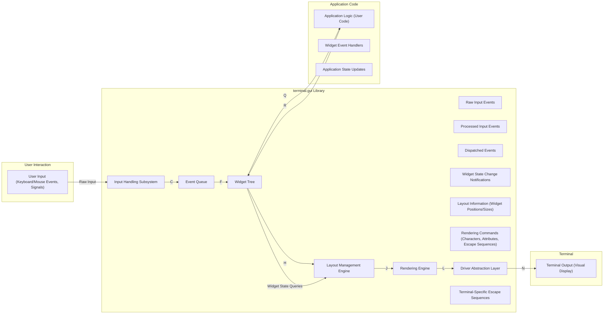

# Project Design Document: terminal.gui

**Version:** 1.1
**Date:** October 26, 2023
**Author:** Gemini (AI Language Model)
**Project:** terminal.gui (https://github.com/gui-cs/terminal.gui)

## 1. Introduction

This document provides an enhanced and more detailed design overview of the `terminal.gui` project. It aims to capture the key architectural components, data flows, and interactions within the system with a specific focus on aspects relevant to threat modeling. This document will serve as the foundation for subsequent threat modeling activities, providing a comprehensive understanding of the system's attack surface.

## 2. Project Overview

`terminal.gui` is a powerful, cross-platform .NET library designed for building rich console-based graphical user interfaces (GUIs). It empowers developers to create interactive terminal applications featuring a wide array of widgets, including windows, buttons, text boxes, and sophisticated menu systems. The library abstracts away the complexities of terminal interaction, handling the rendering of UI elements within the terminal environment, robustly responding to diverse user input (keyboard and mouse events), and meticulously managing the application's state.

## 3. System Architecture

The `terminal.gui` library is structured around the following key components, each with specific responsibilities:

*   **Input Handling Subsystem:** This subsystem is responsible for the low-level capture and initial processing of user input originating from the terminal. This involves:
    *   **Keyboard Event Processing:** Detecting and interpreting key presses and releases, including special keys and key combinations.
    *   **Mouse Event Processing:** Tracking mouse movements, button clicks, and scroll wheel activity within the terminal window.
    *   **Terminal Resize Event Handling:** Detecting changes in the terminal window size and triggering appropriate layout adjustments.
    *   **Signal Handling (Potentially):**  Intercepting and processing operating system signals that might affect the application.
    *   **Input Driver Interface:**  A layer that interacts with specific terminal input mechanisms, potentially varying across platforms.
*   **Widget Library:** This comprehensive collection of pre-built, reusable UI elements forms the building blocks of `terminal.gui` applications. Key widget types include:
    *   `Window`: Provides a top-level container with borders and optional title bars for organizing other widgets.
    *   `Button`: A clickable element that triggers a defined action when activated.
    *   `Label`: Displays static, non-interactive text.
    *   `TextField`: Allows users to input and edit single lines of text.
    *   `TextView`: Enables the display and editing of multi-line text with features like scrolling.
    *   `ListView`: Presents a scrollable list of selectable items.
    *   `Menu`: Offers a hierarchical structure for application commands and options.
    *   `MenuBar`: A specialized container for displaying menus at the top of a window.
    *   `Dialog`: Creates modal windows for displaying information or prompting for user input.
    *   `FrameView`: A container widget that draws a border around its child widgets.
*   **Layout Management Engine:** This engine is responsible for dynamically determining the size and position of widgets within their parent containers. It employs various layout strategies:
    *   **Absolute Positioning:** Widgets are placed at specific coordinates.
    *   **Relative Positioning:** Widget placement is determined relative to other widgets or the parent container's boundaries.
    *   **Automatic Layout (using constraints and anchors):** Widgets adjust their size and position automatically based on content, available space, and defined constraints.
    *   **Invalidation and Update Mechanisms:**  Tracking changes that require layout recalculation.
*   **Rendering Engine:** This core component handles the actual drawing of UI elements onto the terminal screen. It interacts directly with the terminal's output stream and manages:
    *   **Character Buffer Management:** Maintaining an in-memory representation of the terminal screen content.
    *   **Color and Attribute Handling:** Applying colors, bolding, italics, and other text attributes.
    *   **Cursor Management:** Controlling the position and visibility of the terminal cursor.
    *   **Terminal Escape Sequence Generation:**  Producing the correct terminal escape sequences to control the display.
    *   **Dirty Region Tracking:** Optimizing rendering by only updating parts of the screen that have changed.
    *   **Double Buffering (Potentially):**  Using an off-screen buffer to prevent flickering during updates.
*   **Application Logic Layer (User-Defined Code):** This layer encompasses the code written by developers who utilize the `terminal.gui` library. It defines the specific behavior and functionality of the application, including:
    *   **Event Handlers:** Code that responds to user interactions with widgets.
    *   **Data Management:**  Storing and manipulating application data.
    *   **Business Logic:**  Implementing the core functionality of the application.
    *   **Widget Creation and Configuration:**  Instantiating and setting up the UI elements.
*   **Driver Abstraction Layer:** This crucial layer provides an abstraction over the diverse implementations of terminal emulators and operating system interfaces. It ensures that `terminal.gui` can function consistently across different environments by providing a unified interface for terminal interaction. Examples of drivers include:
    *   `CrosstermDriver`:  Leverages the `crossterm` crate for cross-platform terminal manipulation.
    *   `NetDriver`:  Provides a driver for network-based terminal connections.
    *   Potentially other platform-specific or specialized drivers.

## 4. Data Flow

The following diagram illustrates the detailed data flow within a `terminal.gui` application, highlighting the types of data exchanged between components:

**Detailed Data Flow Description:**

1. **User Interaction:** The user interacts with the terminal, generating raw input events such as keystrokes, mouse movements, and potentially operating system signals.
2. **Input Handling Subsystem:** This subsystem receives the "Raw Input" from the terminal.
3. **Raw Input Events:** The raw input is encapsulated into platform-specific event structures.
4. **Processed Input Events:** The `Input Handling Subsystem` processes these raw events, translating them into higher-level, platform-independent events (e.g., key pressed, mouse clicked).
5. **Event Queue:** The "Processed Input Events" are placed into an `Event Queue` for sequential processing.
6. **Dispatched Events:** The main loop of `terminal.gui` dequeues events from the `Event Queue` and dispatches them to the relevant widgets within the `Widget Tree`.
7. **Widget Tree:** The `Widget Tree` represents the hierarchical structure of UI elements. Events are routed to the widget that currently has focus or is targeted by the input.
8. **Widget Event Handlers:** Widgets or the "Application Logic" can have associated "Widget Event Handlers" that are invoked when specific events occur on those widgets.
9. **Application Logic:** When a "Widget Event Handler" is triggered, the "Application Logic" (user-written code) is executed.
10. **Application State Updates:** The "Application Logic" can modify the "Application State," which in turn can trigger changes in the properties and data of widgets within the "Widget Tree."
11. **Widget State Change Notifications:** Changes in widget state (e.g., text content, selection) generate "Widget State Change Notifications."
12. **Layout Management Engine:** The "Layout Management Engine" receives these notifications and queries the "Widget Tree" for current widget properties to recalculate the layout.
13. **Layout Information (Widget Positions/Sizes):** The "Layout Management Engine" produces "Layout Information" defining the precise position and size of each widget.
14. **Rendering Engine:** The "Rendering Engine" uses the "Layout Information" and the current state of the widgets to generate "Rendering Commands." These commands specify the characters to draw, their attributes (colors, etc.), and any necessary terminal escape sequences.
15. **Driver Abstraction Layer:** The "Rendering Commands" are passed to the "Driver Abstraction Layer."
16. **Terminal-Specific Escape Sequences:** The "Driver Abstraction Layer" translates the generic rendering commands into "Terminal-Specific Escape Sequences" that are understood by the target terminal.
17. **Terminal Output (Visual Display):** The "Terminal-Specific Escape Sequences" are sent to the "Terminal," resulting in the visual update of the display.

## 5. Security Considerations (Detailed)

Building upon the initial thoughts, here are more detailed security considerations for each component:

*   **Input Handling Subsystem:**
    *   **Terminal Escape Sequence Injection:** Maliciously crafted input containing terminal escape sequences could be used to manipulate the terminal display in unintended ways (e.g., clearing the screen, changing colors, moving the cursor to arbitrary locations), potentially leading to social engineering attacks or denial of service.
    *   **Command Injection (Indirect):** While `terminal.gui` itself doesn't directly execute shell commands, vulnerabilities in input handling could be exploited if the application logic subsequently uses this unsanitized input in system calls or external processes.
    *   **Denial of Service (Input Flooding):**  An attacker could flood the application with input events, potentially overwhelming the input handling subsystem and causing the application to become unresponsive.
*   **Widget Library:**
    *   **Vulnerabilities in Custom Widgets:** If developers create custom widgets, they need to be mindful of potential security flaws in their implementation, especially regarding input handling and rendering.
    *   **State Management Issues:** Improper management of widget state could lead to unexpected behavior or vulnerabilities if an attacker can manipulate the state in unintended ways.
*   **Layout Management Engine:**
    *   **Resource Exhaustion (Layout Thrashing):**  Crafted scenarios could potentially cause the layout engine to perform excessive recalculations, leading to CPU exhaustion and denial of service.
    *   **Integer Overflow/Underflow:**  While less likely in managed languages like C#, potential vulnerabilities could arise if layout calculations involve large numbers that could lead to overflows or underflows, resulting in incorrect layout or crashes.
*   **Rendering Engine:**
    *   **Terminal Escape Sequence Vulnerabilities:**  Bugs in the rendering engine's handling of terminal escape sequences could be exploited to execute arbitrary commands or cause other security issues if the engine doesn't properly sanitize or validate them.
    *   **Buffer Overflows (Less Likely in Managed Code):** Although less common in managed environments, vulnerabilities could theoretically exist if the rendering engine interacts with native code or if there are unforeseen issues in memory management.
    *   **Information Disclosure:**  Bugs in rendering could potentially lead to the display of sensitive information that should not be visible.
*   **Application Logic Layer (User-Defined Code):**
    *   **All Common Application Vulnerabilities:** This layer is susceptible to standard application security vulnerabilities such as SQL injection (if the application interacts with databases), cross-site scripting (if the terminal output is used in a web context, though less common), and insecure API interactions.
    *   **Improper Input Validation:**  Failure to properly validate user input within the application logic is a major source of vulnerabilities.
    *   **Exposure of Sensitive Information:**  The application logic must be careful not to inadvertently display sensitive information in the terminal.
*   **Driver Abstraction Layer:**
    *   **Vulnerabilities in Driver Implementations:** Security flaws in specific driver implementations could allow attackers to bypass the library's security measures and directly interact with the terminal or operating system in a malicious way.
    *   **Insecure Communication (Network Drivers):** If network-based terminal drivers are used, the communication channel needs to be secured to prevent eavesdropping or manipulation.
    *   **Privilege Escalation:**  Vulnerabilities in drivers could potentially be exploited to gain elevated privileges on the system.

## 6. Assumptions and Constraints

*   It is assumed that the underlying operating system and terminal emulator provide a baseline level of security. However, the library should aim to be resilient against common terminal vulnerabilities.
*   The primary focus of this design document is the security of the `terminal.gui` library itself. The security of applications built using the library is the responsibility of the application developers, but the library should provide secure building blocks.
*   This document represents a logical design. The actual implementation details may introduce further security considerations.
*   The library relies on the security of the .NET runtime environment.

## 7. Future Considerations

*   Conduct thorough threat modeling sessions based on this design document to identify specific attack vectors and vulnerabilities.
*   Implement robust input validation and sanitization mechanisms throughout the library.
*   Perform regular security code reviews and penetration testing to identify and address potential weaknesses.
*   Establish a clear process for reporting and addressing security vulnerabilities.
*   Keep dependencies updated to patch known security flaws.
*   Consider implementing security features such as content security policies for terminal output (if feasible).
*   Provide guidance and best practices for developers using `terminal.gui` to build secure applications.