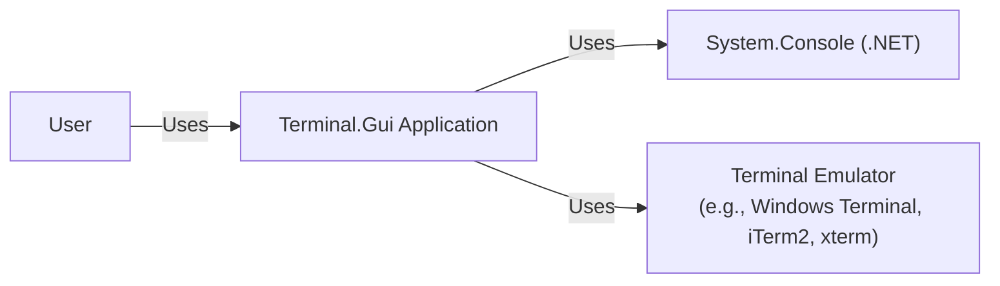
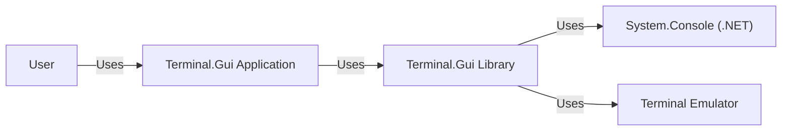
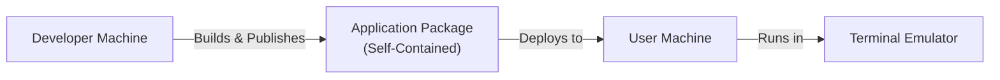
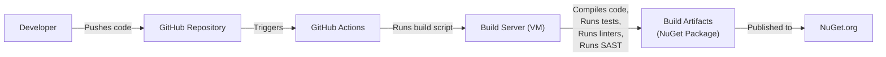

Okay, let's create a design document for the `terminal.gui` project.

# BUSINESS POSTURE

Business Priorities and Goals:

*   Provide a robust and user-friendly cross-platform .NET library for building terminal-based user interfaces (TUIs).
*   Enable developers to create modern-looking, interactive console applications with ease.
*   Offer a comprehensive set of UI controls and features, similar to those found in graphical user interface (GUI) frameworks.
*   Support a wide range of terminals and operating systems.
*   Maintain a high level of code quality, test coverage, and documentation.
*   Foster an active open-source community around the project.

Most Important Business Risks:

*   Inability to attract and retain developers due to usability issues, lack of features, or poor performance.
*   Security vulnerabilities that could be exploited in applications built using the library.
*   Compatibility issues with different terminals or operating systems, leading to a fragmented user experience.
*   Lack of adoption due to competition from other TUI or GUI frameworks.
*   Project abandonment or lack of maintenance, leading to outdated code and unresolved issues.

# SECURITY POSTURE

Existing Security Controls:

*   security control: Code Reviews: The project uses GitHub's pull request system, which inherently includes code reviews before merging changes. (Described in GitHub repository's contribution guidelines).
*   security control: Static Analysis: The project likely uses .NET's built-in static analysis tools (e.g., Roslyn analyzers) to identify potential code quality and security issues. (Implicit in .NET development).
*   security control: Test Coverage: The project has a suite of unit tests to ensure code correctness and prevent regressions. (Visible in the GitHub repository's test directory).

Accepted Risks:

*   accepted risk: The library itself does not handle sensitive data directly, but applications built using it might. The responsibility for securing sensitive data lies with the application developer.
*   accepted risk: The library does not perform any network communication directly. Any network-related security concerns are the responsibility of the application developer.
*   accepted risk: The library relies on the underlying terminal emulator for rendering and input handling. Any security vulnerabilities in the terminal emulator are outside the scope of this project.

Recommended Security Controls:

*   security control: Input Validation: Implement robust input validation within the library's controls to prevent injection attacks or unexpected behavior.
*   security control: Fuzz Testing: Introduce fuzz testing to identify potential vulnerabilities related to unexpected or malformed input.
*   security control: Dependency Management: Regularly review and update dependencies to address known vulnerabilities. Use tools like Dependabot.
*   security control: Security Audits: Conduct periodic security audits to identify and address potential vulnerabilities.

Security Requirements:

*   Authentication: Not directly applicable to the library itself. Applications built using the library may need to implement authentication mechanisms.
*   Authorization: Not directly applicable to the library itself. Applications built using the library may need to implement authorization mechanisms.
*   Input Validation:
    *   All user input received by the library's controls must be validated to ensure it conforms to expected formats and constraints.
    *   Validation should prevent common attack vectors such as buffer overflows, injection attacks, and unexpected control characters.
    *   Validation rules should be configurable by the application developer to accommodate different use cases.
*   Cryptography: Not directly applicable to the library itself, unless features like secure storage of settings are added. If so, use established .NET cryptography libraries.

# DESIGN

## C4 CONTEXT

Element Descriptions:

*   Element:
    *   Name: User
    *   Type: Person
    *   Description: A person interacting with a Terminal.Gui application.
    *   Responsibilities: Provides input to the application, views the application's output.
    *   Security controls: None (handled by the application and terminal emulator).

*   Element:
    *   Name: Terminal.Gui Application
    *   Type: Software System
    *   Description: An application built using the Terminal.Gui library.
    *   Responsibilities: Provides the application's functionality, manages the user interface, handles user input.
    *   Security controls: Input validation, application-specific security logic.

*   Element:
    *   Name: System.Console (.NET)
    *   Type: Software System
    *   Description: The .NET System.Console class, providing access to the console.
    *   Responsibilities: Provides low-level console input/output functionality.
    *   Security controls: Relies on the underlying operating system and terminal emulator.

*   Element:
    *   Name: Terminal Emulator
    *   Type: Software System
    *   Description: The terminal emulator used to run the application (e.g., Windows Terminal, iTerm2, xterm).
    *   Responsibilities: Renders the application's output, handles user input, provides terminal-specific features.
    *   Security controls: Terminal emulator's built-in security features.

## C4 CONTAINER

Element Descriptions:

*   Element:
    *   Name: User
    *   Type: Person
    *   Description: A person interacting with a Terminal.Gui application.
    *   Responsibilities: Provides input to the application, views the application's output.
    *   Security controls: None (handled by the application and terminal emulator).

*   Element:
    *   Name: Terminal.Gui Application
    *   Type: Container: Application
    *   Description: An application built using the Terminal.Gui library.
    *   Responsibilities: Provides the application's functionality, manages the user interface, handles user input.
    *   Security controls: Input validation, application-specific security logic.

*   Element:
    *   Name: Terminal.Gui Library
    *   Type: Container: Library
    *   Description: The Terminal.Gui library itself.
    *   Responsibilities: Provides UI controls, layout management, event handling, input processing.
    *   Security controls: Input validation within controls, safe handling of events.

*   Element:
    *   Name: System.Console (.NET)
    *   Type: Container: Library
    *   Description: The .NET System.Console class.
    *   Responsibilities: Provides low-level console input/output functionality.
    *   Security controls: Relies on the underlying operating system and terminal emulator.

*   Element:
    *   Name: Terminal Emulator
    *   Type: Container: Application
    *   Description: The terminal emulator used to run the application.
    *   Responsibilities: Renders the application's output, handles user input.
    *   Security controls: Terminal emulator's built-in security features.

## DEPLOYMENT

Possible Deployment Solutions:

1.  **Self-Contained .NET Application:** The application and the .NET runtime are bundled together into a single executable. This is the most portable option.
2.  **Framework-Dependent .NET Application:** The application relies on a pre-installed .NET runtime on the target system. This results in a smaller application size but requires the correct runtime to be installed.
3.  **NuGet Package:** The `Terminal.Gui` library is distributed as a NuGet package, which is then included in other .NET applications.

Chosen Solution (for Terminal.Gui library itself): NuGet Package.  Applications using it can choose either self-contained or framework-dependent deployment.

Deployment Diagram (for an application *using* Terminal.Gui, assuming self-contained deployment):

Element Descriptions:

*   Element:
    *   Name: Developer Machine
    *   Type: Node: Device
    *   Description: The machine used by the developer to build and package the application.
    *   Responsibilities: Compiles the code, builds the application package.
    *   Security controls: Developer machine security best practices.

*   Element:
    *   Name: Application Package (Self-Contained)
    *   Type: Node: Artifact
    *   Description: The self-contained application package, including the .NET runtime and all dependencies.
    *   Responsibilities: Contains all necessary files to run the application.
    *   Security controls: Code signing, integrity checks.

*   Element:
    *   Name: User Machine
    *   Type: Node: Device
    *   Description: The machine where the application is deployed and run.
    *   Responsibilities: Executes the application.
    *   Security controls: Operating system security, user account controls.

*   Element:
    *   Name: Terminal Emulator
    *   Type: Node: Software
    *   Description: The terminal emulator used to run the application.
    *   Responsibilities: Renders the application's output, handles user input.
    *   Security controls: Terminal emulator's built-in security features.

## BUILD

The `Terminal.Gui` project uses GitHub Actions for its build and CI/CD process.

Build Process Diagram:

Build Process Description:

1.  **Developer pushes code:** A developer pushes code changes to the `Terminal.Gui` GitHub repository.
2.  **GitHub Actions triggers:** The push triggers a GitHub Actions workflow.
3.  **Build server spins up:** GitHub Actions provisions a virtual machine (build server).
4.  **Build script runs:** The build script (defined in the workflow) is executed on the build server. This script typically performs the following steps:
    *   **Compiles code:** Compiles the `Terminal.Gui` source code using the .NET SDK.
    *   **Runs tests:** Executes the unit test suite to ensure code correctness.
    *   **Runs linters:** Analyzes the code for style and potential issues using linters (e.g., StyleCop).
    *   **Runs SAST:** Performs static application security testing (SAST) to identify potential vulnerabilities. (This is a *recommended* addition, not currently confirmed to be present).
5.  **Build artifacts created:** If all steps are successful, build artifacts are created. In this case, the primary artifact is a NuGet package.
6.  **Artifacts published:** The NuGet package is published to NuGet.org, making it available for developers to use.

Security Controls in Build Process:

*   security control: **Automated Build:** The build process is fully automated using GitHub Actions, reducing the risk of manual errors and ensuring consistency.
*   security control: **Version Control:** All code changes are tracked in the Git repository, providing a clear audit trail.
*   security control: **Code Reviews:** Pull requests require code reviews before merging, ensuring that multiple developers have reviewed the changes.
*   security control: **Testing:** Automated unit tests are run as part of the build process, helping to prevent regressions and identify bugs early.
*   security control: **Linting:** Linters are used to enforce code style and identify potential issues.
*   security control: **SAST (Recommended):** Static application security testing should be integrated into the build process to identify potential vulnerabilities.
*   security control: **Dependency Management (Recommended):** Tools like Dependabot should be used to automatically identify and update outdated dependencies with known vulnerabilities.

# RISK ASSESSMENT

Critical Business Processes:

*   Software development and maintenance of the `Terminal.Gui` library.
*   Distribution of the library via NuGet.org.
*   Community engagement and support.

Data to Protect and Sensitivity:

*   **Source Code:** The source code of the `Terminal.Gui` library itself is publicly available on GitHub. While not sensitive in the traditional sense, its integrity is crucial. Unauthorized modifications could introduce vulnerabilities or break functionality. Sensitivity: Medium (due to integrity concerns).
*   **User Data (Indirect):** The library itself does not handle user data directly. However, applications built using the library *may* handle sensitive user data. The responsibility for protecting this data lies with the application developers. Sensitivity: Variable (depends on the application).
*   **Build Artifacts (NuGet Package):** The integrity of the published NuGet package is critical. A compromised package could be used to distribute malicious code to developers. Sensitivity: High.
*   **API Keys/Secrets (for CI/CD):** Any API keys or secrets used in the GitHub Actions workflows (e.g., for publishing to NuGet.org) must be protected. Sensitivity: High.

# QUESTIONS & ASSUMPTIONS

Questions:

*   Are there any specific compliance requirements (e.g., accessibility standards) that the library needs to meet?
*   What are the specific terminal emulators and operating systems that are officially supported?
*   What is the expected level of user input sanitization to be performed by applications using the library?
*   Are there plans to add features that would require handling sensitive data directly within the library (e.g., secure storage of settings)?
*   What is the process for handling security vulnerability reports?
*   Is there a dedicated security contact for the project?
*   What SAST tools are currently used, or are planned to be used, in the CI pipeline?
*   What is the current strategy for managing dependencies and addressing known vulnerabilities in those dependencies?

Assumptions:

*   BUSINESS POSTURE: The project prioritizes ease of use, cross-platform compatibility, and community engagement.
*   BUSINESS POSTURE: The project has a moderate risk appetite, typical of an open-source project.
*   SECURITY POSTURE: The project follows basic secure coding practices, but there is room for improvement in terms of proactive security measures.
*   SECURITY POSTURE: The .NET framework and underlying operating system provide a baseline level of security.
*   DESIGN: The library's design is modular and extensible, allowing for future enhancements and features.
*   DESIGN: Developers using the library are responsible for securing their own applications and handling sensitive data appropriately.
*   DESIGN: The build process is automated and reliable, using GitHub Actions.
*   DESIGN: The primary distribution method for the library is via NuGet.org.