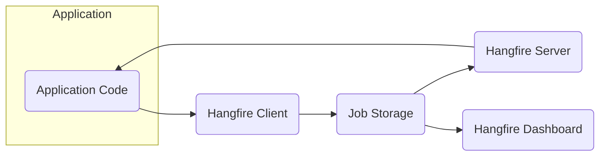
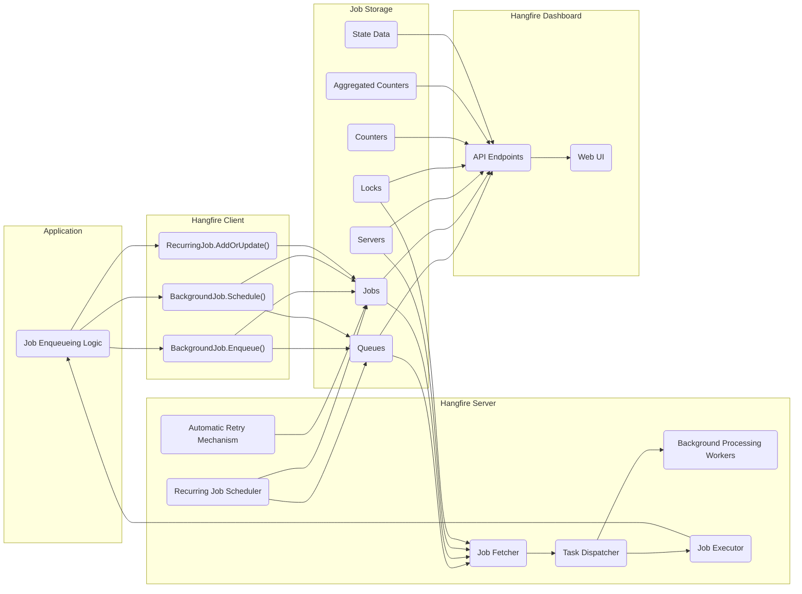

# Project Design Document: Hangfire

**Version:** 1.1
**Date:** October 26, 2023
**Author:** AI Software Architect

## 1. Introduction

This document provides a detailed design overview of Hangfire, an open-source library for .NET developers that enables the straightforward and reliable execution of background jobs. This document aims to provide a comprehensive understanding of Hangfire's architecture, components, and data flow, serving as a foundation for subsequent threat modeling activities.

## 2. Goals and Objectives

The primary goals of Hangfire are to:

*   Provide a simple and intuitive method for executing background tasks in .NET applications.
*   Ensure the reliable execution of background jobs, even in scenarios involving application restarts or server failures.
*   Offer a persistent storage mechanism for maintaining job information and state.
*   Provide a user-friendly dashboard for monitoring and managing background job operations.
*   Support diverse background job types, including fire-and-forget, delayed, and recurring tasks.
*   Be extensible and adaptable to accommodate varying application requirements.

## 3. System Architecture

### 3.1. High-Level Architecture

*   **Application:** The .NET application integrating Hangfire to enqueue and manage background jobs.
*   **Hangfire Client:** The library integrated within the application, facilitating interaction with Hangfire, primarily for job enqueueing.
*   **Job Storage:** A persistent storage solution (e.g., SQL Server, Redis, MongoDB) utilized by Hangfire to store job details, status, and queues.
*   **Hangfire Server:** A background process or a collection of processes responsible for retrieving jobs from storage, executing them, and updating their status.
*   **Hangfire Dashboard:** A web-based user interface for monitoring and managing background jobs, built upon the data within the job storage.

### 3.2. Detailed Architecture

## 4. Component Descriptions

*   **Job Enqueueing Logic (Application):** The section of the application code responsible for creating and enqueuing background jobs using the Hangfire client library.
    *   Utilizes methods such as `BackgroundJob.Enqueue`, `BackgroundJob.Schedule`, and `RecurringJob.AddOrUpdate`.
    *   Serializes job parameters and method information for storage within the Job Storage.

*   **Hangfire Client:** The .NET library providing the API for interacting with Hangfire.
    *   **`BackgroundJob.Enqueue()`:** Enqueues a fire-and-forget job, intended for immediate processing by an available worker.
    *   **`BackgroundJob.Schedule()`:** Enqueues a job to be processed at a specific time in the future.
    *   **`RecurringJob.AddOrUpdate()`:** Defines or updates a job that will be executed according to a recurring schedule (e.g., using a cron expression).

*   **Job Storage:** The persistent storage mechanism employed by Hangfire to manage job-related data. The specific implementation is configurable. Common options include:
    *   **Queues:** Stores lists of job identifiers awaiting processing. Different queues can be configured to manage job prioritization.
    *   **Jobs:** Stores comprehensive details about each background job, including its current state, parameters, creation timestamp, and execution history.
    *   **Servers:** Tracks active Hangfire Server instances and their respective capabilities.
    *   **Locks:** Implements distributed locking to prevent race conditions during job processing and scheduling operations.
    *   **Counters:** Stores various performance metrics and statistical data.
    *   **Aggregated Counters:** Aggregates counter data to facilitate easier querying and visualization.
    *   **State Data:** Maintains a history of state transitions for each job (e.g., Enqueued, Processing, Succeeded, Failed).

*   **Hangfire Server:** The background process responsible for processing enqueued jobs. Multiple server instances can operate concurrently to enhance scalability.
    *   **Background Processing Workers:** Threads or processes that actively poll the job queues for new jobs to execute.
    *   **Task Dispatcher:** Responsible for distributing fetched jobs to available processing workers.
    *   **Job Fetcher:** Retrieves jobs from the storage queues, considering priority and availability.
    *   **Job Executor:** Deserializes job parameters and executes the actual job logic within the application's execution context.
    *   **Recurring Job Scheduler:** Periodically checks for recurring jobs that need to be enqueued based on their defined schedules.
    *   **Automatic Retry Mechanism:** Manages job failures by automatically retrying execution based on pre-configured retry policies.

*   **Hangfire Dashboard:** A web-based interface for monitoring and managing Hangfire operations.
    *   **Web UI:** Presents a visual overview of job statuses, queues, server instances, and other relevant information. Enables actions such as triggering recurring jobs, retrying failed jobs, and deleting existing jobs.
    *   **API Endpoints:** Provides programmatic access to job data and management functionalities, utilized by the Web UI and potentially other integrated applications.

## 5. Data Flow

The typical data flow for a background job within Hangfire proceeds as follows:

1. **Job Enqueueing:** The application code utilizes the Hangfire client to enqueue a new background job. This process involves serializing the job's method and its associated parameters.
2. **Storage:** The Hangfire client writes the job information (initially setting its state to "Enqueued") to the Job Storage, placing the job's unique identifier within the appropriate queue.
3. **Job Fetching:** A Hangfire Server instance's Job Fetcher continuously monitors the Job Storage queues for newly available jobs.
4. **Job Acquisition:** Upon identifying an available job, the Job Fetcher attempts to acquire a lock on that job. This prevents concurrent processing by other server instances.
5. **Job Execution:** The Task Dispatcher assigns the acquired job to an available Background Processing Worker. The Job Executor then deserializes the job parameters and executes the corresponding method within the application's environment.
6. **State Updates:** During and after the execution phase, the Job Executor updates the job's state within the Job Storage (e.g., transitioning from "Processing" to "Succeeded" or "Failed"). These state transitions are recorded within the State Data.
7. **Monitoring:** The Hangfire Dashboard queries the Job Storage to retrieve job details, server statuses, and other relevant metrics for display within its Web UI.

For recurring jobs, the data flow includes:

1. The Recurring Job Scheduler periodically evaluates the configured recurring jobs against their defined schedules.
2. When a recurring job's schedule aligns with the current time, a new instance of that job is enqueued, following the standard job enqueueing process.

## 6. Security Considerations

This section outlines potential security considerations relevant to Hangfire, which will be further investigated during the threat modeling process.

*   **Authentication and Authorization for Dashboard Access:** Access to the Hangfire Dashboard must be restricted to authenticated and authorized users. Insufficient access controls could allow unauthorized individuals to view sensitive job data, trigger arbitrary jobs, or delete existing jobs.
*   **Data Protection within Job Storage:** Sensitive data contained within job parameters or results stored in the Job Storage requires protection. Depending on the chosen storage mechanism, implementing encryption at rest and in transit should be considered.
*   **Input Validation for Job Parameters:** Job parameters passed to background jobs should undergo rigorous validation to prevent injection vulnerabilities (e.g., SQL injection if job parameters are used in database queries executed by the job).
*   **Deserialization Vulnerabilities:** If job parameters involve complex objects, vulnerabilities within the deserialization process could be exploited by malicious actors.
*   **Access Control for Job Execution:** While Hangfire doesn't inherently provide granular control over which servers can execute specific jobs, the underlying infrastructure and application logic should ensure that only authorized processes are capable of running Hangfire Server instances.
*   **Denial of Service (DoS) Attacks:** Malicious actors might attempt to overwhelm the Hangfire Server and its underlying infrastructure by enqueuing a large volume of resource-intensive jobs. Implementing rate limiting and queue management strategies is crucial.
*   **Dependency Management Security:** Vulnerabilities present in Hangfire's dependencies could introduce security risks. Regularly updating and performing security scans on dependencies is essential.
*   **Information Disclosure through Logging and Error Messages:** Error messages and logging configurations should be carefully reviewed to avoid inadvertently exposing sensitive information.
*   **Cross-Site Scripting (XSS) Vulnerabilities in the Dashboard:** The Hangfire Dashboard, being a web application, is susceptible to XSS attacks if user-provided data is not properly sanitized before rendering.
*   **Cross-Site Request Forgery (CSRF) Vulnerabilities in the Dashboard:** The Hangfire Dashboard should implement CSRF protection mechanisms to prevent malicious requests originating from external websites.

## 7. Deployment Considerations

Hangfire offers flexible deployment options, adaptable to various application architectures and requirements. Common deployment scenarios include:

*   **Integrated within the Application Process:** The Hangfire Server can run as an integral part of the main application process. This approach is suitable for smaller applications or when prioritizing simplicity.
*   **Separate Background Service Deployment:** The Hangfire Server can be deployed as a distinct background process, such as a Windows Service, a Linux daemon, or within a containerized environment. This provides enhanced isolation and scalability.
*   **Cloud-Based Service Deployment:** Hangfire can be deployed on cloud platforms like Azure or AWS, leveraging their managed services for storage and compute resources.

The selection of the Job Storage provider significantly influences deployment considerations. For instance, utilizing SQL Server necessitates a running SQL Server instance, while opting for Redis requires a functional Redis server.

## 8. Future Considerations

*   **Enhanced Monitoring and Alerting Capabilities:** Integrating with more advanced monitoring and alerting systems could provide deeper insights into job processing performance and potential issues.
*   **Improved Job Prioritization Mechanisms:** Implementing more sophisticated methods for prioritizing jobs within queues could optimize resource utilization.
*   **Expanded Support for Storage Providers:** Increasing the number of supported Job Storage providers would offer greater flexibility in choosing the appropriate storage solution.
*   **Fine-grained Authorization Controls:** Implementing more granular authorization controls for job execution and dashboard access could further enhance the security posture.

This document provides a comprehensive design overview of Hangfire. The information presented herein will serve as the foundation for conducting a thorough threat model to identify and mitigate potential security vulnerabilities.
