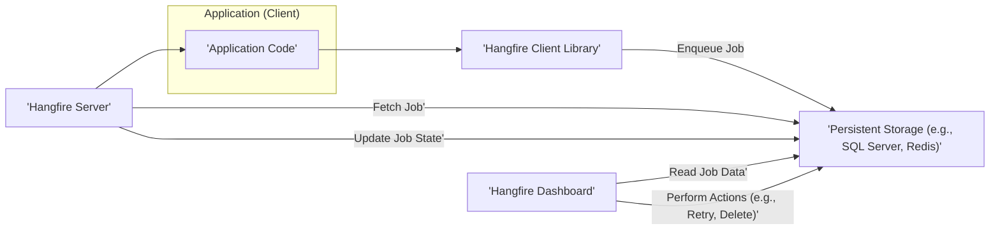
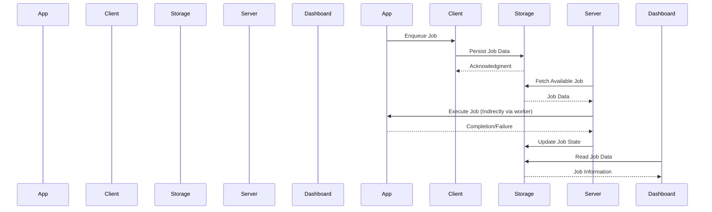

# Project Design Document: Hangfire

**Version:** 1.1
**Date:** October 26, 2023
**Author:** AI Software Architect

## 1. Introduction

This document provides an enhanced architectural design of Hangfire, an open-source library for .NET that simplifies background job processing. This revision aims to offer a more detailed and refined understanding of Hangfire's architecture, focusing on aspects critical for security analysis and threat identification. This document serves as a foundational resource for subsequent threat modeling activities.

## 2. Goals and Objectives

The primary goal of this design document remains to clearly articulate the architecture of Hangfire, with a heightened emphasis on elements pertinent to security analysis and threat identification. Specific objectives include:

*   Providing a more granular description of Hangfire's core components.
*   Elaborating on the interactions and dependencies between these components.
*   Detailing the data flow within the system, highlighting sensitive data paths.
*   Identifying key technologies, dependencies, and their potential security implications.
*   Presenting a more comprehensive overview of security considerations based on the architectural design.

## 3. High-Level Architecture

Hangfire employs a client-server architecture underpinned by persistent storage. The fundamental components are:

*   **Client:** The application initiating background jobs.
*   **Server:** The processing engine responsible for fetching and executing jobs.
*   **Storage:** The durable repository for managing job information, state, and queues.
*   **Dashboard (Optional):** A web-based interface for monitoring and administering background jobs.

## 4. Component Details

This section offers a more in-depth examination of each core component, detailing their responsibilities and key features.

### 4.1. Hangfire Client Library

*   **Purpose:** To provide a programming interface for applications to enqueue background jobs.
*   **Responsibilities:**
    *   Serializing job method calls and arguments into a format suitable for storage.
    *   Interacting with the configured persistent storage to persist job metadata.
    *   Offering various job types, including fire-and-forget, delayed execution, and recurring schedules.
*   **Key Features:**
    *   Fluent API for easy job enqueueing.
    *   Support for method overloads and complex argument types.
    *   Configuration options for specifying storage connection details and other client-side settings.
    *   Extensibility points for custom job serialization.

### 4.2. Hangfire Server

*   **Purpose:** To process enqueued background jobs.
*   **Responsibilities:**
    *   Continuously polling the persistent storage for pending jobs.
    *   Fetching jobs from designated queues based on priority and availability.
    *   Deserializing job metadata to reconstruct the method call and arguments.
    *   Executing the background job logic within a worker thread.
    *   Updating the job's state in the persistent storage (e.g., `Processing`, `Succeeded`, `Failed`).
    *   Managing job retries according to configured policies, including exponential backoff.
    *   Handling job failures and logging error details.
*   **Key Features:**
    *   Multi-threaded processing for concurrent job execution.
    *   Support for named queues to prioritize different types of jobs.
    *   Automatic retry mechanisms with configurable parameters.
    *   Logging and monitoring integration for tracking job execution and server health.
    *   Extensibility points for custom job execution logic and state management.

### 4.3. Persistent Storage

*   **Purpose:** To provide durable storage for all Hangfire-related data.
*   **Responsibilities:**
    *   Persisting job definitions, including the target method and its arguments.
    *   Managing job queues and their ordering for processing.
    *   Tracking the lifecycle of each job through various states.
    *   Ensuring data integrity and consistency, often through transactional operations.
    *   Providing efficient querying capabilities for job retrieval and monitoring.
*   **Supported Storage Providers (Examples):**
    *   SQL Server: Utilizing relational database features for robust data management.
    *   Redis: Leveraging its in-memory data structure store for high-performance queue management.
    *   PostgreSQL: Another relational database option with strong ACID properties.
    *   MySQL: A popular open-source relational database.
    *   Custom implementations through Hangfire's storage provider interface.
*   **Data Stored (Examples):**
    *   Serialized job invocation details (assembly name, type name, method name, arguments).
    *   Job state information (creation time, start time, end time, last execution attempt).
    *   Queue assignments for routing jobs to appropriate servers.
    *   Exception details and stack traces for failed jobs.
    *   Server registration information for tracking active Hangfire server instances.
    *   Counters and statistics for dashboard reporting.

### 4.4. Hangfire Dashboard (Optional)

*   **Purpose:** To offer a user interface for monitoring and managing Hangfire jobs and servers.
*   **Responsibilities:**
    *   Presenting real-time status of background jobs (e.g., enqueued, processing, succeeded, failed).
    *   Allowing users to filter and search for specific jobs based on various criteria.
    *   Providing insights into server activity, including CPU and memory usage.
    *   Enabling administrative actions such as retrying failed jobs, deleting completed jobs, and triggering recurring jobs.
    *   Displaying performance metrics and historical data related to job processing.
*   **Key Features:**
    *   Web-based interface accessible through a browser.
    *   Configurable authentication and authorization to control access.
    *   Real-time updates via server-sent events or WebSockets.
    *   Extensibility through custom pages and widgets.
    *   Integration with application authentication schemes.

## 5. Data Flow

The typical progression of a background job within Hangfire involves these key stages:

1. **Job Enqueueing:** An application utilizes the Hangfire client library to initiate a background job.
    *   The client library serializes the details of the job to be executed (the method and its parameters).
    *   This serialized representation is then persisted within the configured storage mechanism.
    *   The newly enqueued job is placed into a designated queue within the storage, awaiting processing.
2. **Job Processing:** Hangfire servers continuously monitor the persistent storage for new jobs.
    *   When a server instance is available and capacity allows, it fetches a job from the appropriate queue.
    *   The server deserializes the stored job details, reconstructing the method call and arguments.
    *   The server then executes the specified method with the provided parameters within a worker thread.
3. **State Updates:** Throughout the job execution lifecycle, the Hangfire server updates the job's status within the storage.
    *   State transitions reflect the job's progress, including `Processing`, `Succeeded`, or `Failed`.
    *   In the event of a job failure, detailed exception information and retry attempt details are recorded in the storage.
4. **Dashboard Interaction (Optional):** Users can leverage the Hangfire dashboard to observe and manage jobs.
    *   The dashboard queries the persistent storage to retrieve up-to-date job information.
    *   Authenticated and authorized users can perform actions such as retrying failed jobs or deleting completed jobs, which results in updates to the storage.

## 6. Security Considerations (Detailed)

This section expands on the security considerations, providing more specific potential threats and mitigation strategies.

*   **Storage Security:**
    *   **Threats:** Unauthorized access to the storage could lead to data breaches (exposure of job parameters or sensitive data), job manipulation (altering job state or details), or denial of service (deleting or corrupting job data).
    *   **Mitigations:**
        *   Implement strong authentication and authorization for access to the persistent storage (e.g., database credentials, access keys).
        *   Encrypt sensitive job data at rest using storage-level encryption or application-level encryption before storing.
        *   Encrypt data in transit between Hangfire components and the storage using TLS/SSL.
        *   Regularly audit storage access logs for suspicious activity.
        *   Follow the security best practices recommended by the specific storage provider.
*   **Dashboard Authentication and Authorization:**
    *   **Threats:** Unauthorized access to the dashboard could allow malicious actors to view sensitive job data, trigger unintended job executions, or disrupt background processing.
    *   **Mitigations:**
        *   Implement robust authentication mechanisms for the dashboard (e.g., username/password, OAuth 2.0, integration with existing application authentication).
        *   Enforce strong password policies.
        *   Utilize role-based access control (RBAC) to restrict access to specific dashboard features based on user roles.
        *   Protect the dashboard endpoint with appropriate network security measures.
        *   Regularly review and update dashboard access controls.
*   **Communication Security:**
    *   **Threats:** If communication between Hangfire components (client to storage, server to storage, dashboard to storage) is not secured, it could be vulnerable to eavesdropping (intercepting sensitive data) or tampering (modifying data in transit).
    *   **Mitigations:**
        *   Enforce TLS/SSL for all communication channels, especially between the Hangfire server and the persistent storage, and between the dashboard and the storage.
        *   Ensure proper certificate management for TLS/SSL.
        *   Consider using VPNs or private networks for communication within the Hangfire infrastructure.
*   **Job Data Security:**
    *   **Threats:** Job parameters might contain sensitive information that, if exposed, could lead to privacy violations or security breaches. Logging or storing this data in plain text increases the risk.
    *   **Mitigations:**
        *   Avoid passing sensitive data as job parameters if possible.
        *   If sensitive data is necessary, encrypt it before enqueuing the job and decrypt it within the job execution context.
        *   Configure logging to avoid logging sensitive job parameters.
        *   Implement secure coding practices to prevent unintentional exposure of sensitive data during job processing.
*   **Dependency Security:**
    *   **Threats:** Vulnerabilities in Hangfire's dependencies (e.g., storage provider libraries, .NET framework) could be exploited to compromise the system.
    *   **Mitigations:**
        *   Regularly update Hangfire and all its dependencies to the latest stable versions.
        *   Monitor security advisories for known vulnerabilities in used libraries.
        *   Implement a process for patching vulnerabilities promptly.
*   **Configuration Security:**
    *   **Threats:** Misconfigured Hangfire settings, such as exposed connection strings or weak authentication credentials, can create security loopholes.
    *   **Mitigations:**
        *   Store sensitive configuration data (e.g., connection strings, API keys) securely using environment variables, secrets management services, or encrypted configuration files.
        *   Restrict access to configuration files and settings.
        *   Regularly review and audit Hangfire configuration.
*   **Code Injection:**
    *   **Threats:** If job parameters are not properly validated and are used in dynamic code execution or constructing database queries within the job, it could lead to code injection or SQL injection vulnerabilities.
    *   **Mitigations:**
        *   Sanitize and validate all input received as job parameters.
        *   Avoid dynamic code execution based on user-provided input.
        *   Use parameterized queries or ORM frameworks to prevent SQL injection.

## 7. Deployment Considerations

The manner in which Hangfire is deployed significantly impacts its security profile:

*   **Single Instance:** Client and server reside within the same application process. While simple, it might limit scalability and isolation. Security relies heavily on the application's security measures.
*   **Separate Server Process:** The Hangfire server runs as an independent process (e.g., a Windows Service, a console application). This offers better resource isolation and scalability. Secure communication between the application and the server (via storage) is crucial.
*   **Web Farm/Load Balanced Environment:** Multiple Hangfire servers process jobs. Requires a shared and consistently accessible persistent storage. Security considerations include securing the shared storage and ensuring consistent configuration across servers.
*   **Containerized Environments (e.g., Docker, Kubernetes):** Hangfire components are packaged in containers. Container security best practices (e.g., minimal images, vulnerability scanning, secure orchestration) are essential.
*   **Cloud Environments (e.g., Azure, AWS):** Leveraging cloud infrastructure and services. Security relies on properly configuring cloud security features (e.g., network security groups, IAM roles, encryption services).

## 8. Technology Stack

*   **Core Programming Language:** C# (.NET)
*   **Storage Abstraction:** Hangfire provides an abstraction layer, allowing pluggable storage providers.
*   **Example Storage Providers:**
    *   SQL Server (using ADO.NET)
    *   Redis (using libraries like StackExchange.Redis)
    *   PostgreSQL (using Npgsql)
    *   MySQL (using MySqlConnector)
*   **Web Framework (for Dashboard):** ASP.NET Core
*   **Key NuGet Dependencies (Examples):**
    *   `Hangfire.Core` (core library)
    *   `Hangfire.SqlServer` (SQL Server storage provider)
    *   `Hangfire.Redis` (Redis storage provider)
    *   `Microsoft.AspNetCore.App` (for dashboard)
    *   Logging libraries (e.g., `Microsoft.Extensions.Logging`)
    *   Serialization libraries (e.g., `Newtonsoft.Json`)

## 9. Future Considerations

*   Implementation of more fine-grained authorization controls within the dashboard, allowing for more specific permission management.
*   Enhanced encryption options for job data, potentially allowing for per-job encryption keys.
*   Deeper integration with security auditing and logging frameworks for improved traceability.
*   Exploration of additional storage providers and their security characteristics.
*   Consideration of features to mitigate denial-of-service attacks targeting the job processing pipeline.

This revised document provides a more detailed and security-focused perspective on the Hangfire architecture. This enhanced understanding is crucial for conducting thorough threat modeling and implementing appropriate security measures to protect applications utilizing Hangfire.
