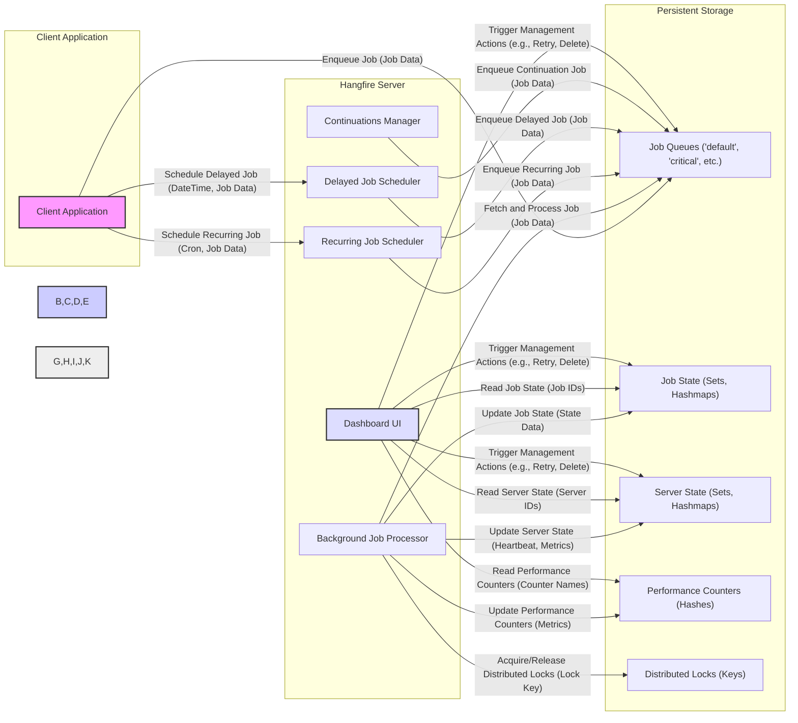

## Project Design Document: Hangfire Background Job Processing System (Improved)

**1. Introduction**

This document provides an enhanced and detailed design overview of the Hangfire background job processing system. It elaborates on the system's architecture, key components, data flow, and security considerations. This document serves as a robust foundation for subsequent threat modeling activities.

**2. Goals and Objectives**

The primary goal of Hangfire is to provide a robust, reliable, and developer-friendly system for executing background jobs within .NET applications. Key objectives include:

*   **Guaranteed Job Execution:** Ensure jobs are executed at least once, even in scenarios involving application restarts, server failures, or network interruptions.
*   **Horizontal Scalability:** Support scaling out the processing of background jobs by adding more Hangfire Server instances.
*   **Durable Persistence:** Store job definitions, state, and execution history persistently across application restarts and server outages.
*   **Comprehensive Monitoring and Management:** Offer a rich user interface for real-time monitoring of job status, server health, and system performance, along with management capabilities.
*   **Flexible Extensibility:** Allow developers to easily integrate custom job types, storage providers, and authorization mechanisms.

**3. System Architecture**

Hangfire employs a decoupled client-server architecture, relying on a persistent storage mechanism for coordination and state management.

**4. Component Details**

*   **Client Application:** The application responsible for initiating background job execution. It utilizes the Hangfire client library to interact with the Hangfire system.
    *   Responsibilities:
        *   Defining the logic and data for background jobs.
        *   Enqueuing immediate background jobs to specific queues.
        *   Scheduling recurring jobs with cron-like expressions.
        *   Scheduling delayed jobs for execution at a future time.
        *   Creating continuation jobs that execute upon the successful completion of a parent job.
*   **Hangfire Server:** The core processing engine responsible for fetching, executing, and managing background jobs. Multiple server instances can run concurrently for increased throughput and resilience.
    *   **Background Job Processor:** Continuously monitors configured job queues for new jobs. Upon retrieving a job, it deserializes the job data and executes the associated job handler.
        *   Responsibilities:
            *   Establishing connections to the Persistent Storage.
            *   Polling configured job queues for available jobs.
            *   Acquiring distributed locks to ensure exclusive job processing.
            *   Deserializing job arguments and metadata.
            *   Invoking the appropriate job execution logic.
            *   Handling job retries based on configured policies.
            *   Updating job state (succeeded, failed, processing, etc.) in the Persistent Storage.
    *   **Recurring Job Scheduler:** Periodically checks the definitions of recurring jobs and enqueues them into the appropriate job queues based on their defined cron schedules.
        *   Responsibilities:
            *   Reading recurring job definitions (including cron expressions and job data) from the Persistent Storage.
            *   Calculating the next execution time for each recurring job.
            *   Enqueuing recurring jobs into the designated job queues when their scheduled time arrives.
    *   **Delayed Job Scheduler:** Monitors the scheduled execution times of delayed jobs and enqueues them into the appropriate job queues when their delay period has elapsed.
        *   Responsibilities:
            *   Monitoring the scheduled execution times of delayed jobs stored in the Persistent Storage.
            *   Enqueuing delayed jobs into the designated job queues once their scheduled time is reached.
    *   **Continuations Manager:** Observes the state transitions of parent jobs and enqueues continuation jobs when their parent jobs reach a successful completion state.
        *   Responsibilities:
            *   Monitoring the state of parent jobs for successful completion.
            *   Retrieving the definitions of associated continuation jobs.
            *   Enqueuing continuation jobs into the appropriate job queues.
    *   **Dashboard UI:** A web-based interface providing real-time insights into the Hangfire system's status and allowing for administrative actions.
        *   Responsibilities:
            *   Displaying the status of enqueued, processing, succeeded, failed, and deleted jobs.
            *   Showing detailed information about individual jobs, including execution logs and exception details.
            *   Presenting server statistics, such as active workers and queue lengths.
            *   Allowing manual intervention, such as retrying failed jobs, deleting jobs, and triggering recurring jobs.
*   **Persistent Storage:** The central repository for all Hangfire data, ensuring durability and consistency. Supported storage providers include SQL Server, Redis, and others.
    *   **Job Queues ('default', 'critical', etc.):**  Ordered collections of enqueued jobs waiting to be processed. Different queues can be used to prioritize job execution.
        *   Data Stored: Unique job identifier, serialized job type and arguments, enqueue time, priority, state.
    *   **Job State (Sets, Hashmaps):** Stores the current state and historical information for each job.
        *   Data Stored: Job identifier, current state (e.g., Enqueued, Processing, Succeeded, Failed), start time, end time, last execution attempt, number of retries, exception details (if any).
    *   **Server State (Sets, Hashmaps):**  Tracks the status and capabilities of active Hangfire Server instances.
        *   Data Stored: Server identifier, last heartbeat timestamp, list of queues being processed by the server, server metrics (e.g., CPU usage).
    *   **Performance Counters (Hashes):** Stores various performance metrics and statistics for monitoring and analysis.
        *   Data Stored: Counters for processed jobs, failed jobs, enqueued jobs, and other relevant metrics, often aggregated over time.
    *   **Distributed Locks (Keys):**  Used to ensure exclusive access to resources and prevent race conditions, particularly during job processing and scheduling.
        *   Data Stored: Lock identifier, timestamp of acquisition, server instance that acquired the lock.

**5. Data Flow**

1. **Job Creation and Enqueueing:** The Client Application utilizes the Hangfire client library to serialize job details (method, arguments) and enqueues the job into a specific Job Queue within the Persistent Storage.
2. **Job Retrieval and Processing:** A Hangfire Server instance continuously monitors its configured Job Queues. Upon finding an available job, it acquires a distributed lock for that job, retrieves the job data from the Persistent Storage, deserializes it, and executes the associated job logic.
3. **State Updates during Processing:** As the job progresses, the Hangfire Server updates the Job State in the Persistent Storage, reflecting the current status (e.g., "Processing").
4. **State Updates on Completion/Failure:** Upon successful completion or failure of a job, the Hangfire Server updates the Job State with the final status, completion time, and any relevant output or error information.
5. **Monitoring via Dashboard:** The Dashboard UI queries the Persistent Storage to retrieve and display real-time information about job status, server health, and performance metrics.
6. **Recurring Job Scheduling Flow:** The Recurring Job Scheduler periodically reads recurring job definitions from the Persistent Storage and enqueues new instances of these jobs into the appropriate Job Queues based on their cron schedules.
7. **Delayed Job Scheduling Flow:** The Delayed Job Scheduler monitors the scheduled execution times of delayed jobs stored in the Persistent Storage and enqueues them into the appropriate Job Queues when their delay period expires.
8. **Continuation Job Flow:** When a parent job successfully completes, the Continuations Manager retrieves the definition of its associated continuation job and enqueues it into the appropriate Job Queue.

**6. Deployment Model**

Hangfire offers flexible deployment options to suit various application needs and environments:

*   **In-Process (Embedded):** The Hangfire Server runs within the same application process as the Client Application. Suitable for development, testing, or small-scale applications with low job volume.
    *   Pros: Simplest deployment, no separate infrastructure required.
    *   Cons: Reduced reliability as server failures impact job processing, limited scalability.
*   **Dedicated Server (Out-of-Process):** The Hangfire Server runs as a separate process or service, independent of the Client Application. This provides better reliability and scalability.
    *   Pros: Improved reliability and fault tolerance, better resource isolation, enhanced scalability by adding more server instances.
    *   Cons: More complex deployment and management compared to in-process.
*   **Cloud-Based Deployment:** Hangfire can be deployed on cloud platforms like Azure or AWS, leveraging managed services for storage (e.g., Azure SQL, Redis) and compute (e.g., Azure App Service, EC2).
    *   Pros: High availability, automatic scaling, managed infrastructure, integration with other cloud services.
    *   Cons: Potential vendor lock-in, cost considerations for managed services.
*   **Containerized Deployment (Docker, Kubernetes):**  Hangfire Server instances can be containerized and orchestrated using platforms like Docker and Kubernetes, enabling highly scalable and resilient deployments.
    *   Pros: Consistent environment, easy scaling and management, improved resource utilization.
    *   Cons: Requires expertise in containerization technologies.

**7. Security Considerations**

*   **Authentication and Authorization for Dashboard UI:**
    *   **Risk:** The default Hangfire Dashboard UI lacks authentication, making it accessible to anyone who knows the endpoint. This allows unauthorized viewing and manipulation of jobs.
    *   **Mitigation:** **Mandatory implementation of authentication and authorization mechanisms** for the Dashboard UI. This can be achieved through various methods, including ASP.NET Core Identity, OAuth 2.0, or custom authentication providers. Implement role-based access control to restrict actions based on user roles.
*   **Secure Storage of Connection Strings:**
    *   **Risk:** Storing database connection strings directly in configuration files or code exposes sensitive credentials.
    *   **Mitigation:** Utilize secure configuration management techniques such as Azure Key Vault, AWS Secrets Manager, or environment variables with restricted access. Avoid hardcoding credentials.
*   **Protection of Sensitive Job Data:**
    *   **Risk:** Background jobs might process sensitive information that needs to be protected.
    *   **Mitigation:** Encrypt sensitive job arguments and data at rest in the Persistent Storage and in transit if necessary. Consider using data protection APIs provided by the underlying storage provider or application-level encryption.
*   **Input Validation and Sanitization:**
    *   **Risk:** Malicious or malformed job arguments can lead to unexpected behavior, code injection vulnerabilities, or denial-of-service attacks.
    *   **Mitigation:** Implement robust input validation and sanitization on all job arguments before processing. Use parameterized queries or ORM frameworks to prevent SQL injection.
*   **Denial of Service (DoS) Prevention:**
    *   **Risk:** Attackers could flood the job queues with a large number of jobs, overwhelming the system and preventing legitimate jobs from being processed.
    *   **Mitigation:** Implement queue monitoring and alerting. Consider rate limiting job enqueueing from specific sources. Implement mechanisms to prioritize critical jobs.
*   **Code Injection Vulnerabilities:**
    *   **Risk:** If job handlers are dynamically loaded or constructed based on external input, it could lead to code injection vulnerabilities.
    *   **Mitigation:** Avoid dynamic loading of job handlers based on untrusted input. Use a predefined set of job types and ensure proper input validation.
*   **Cross-Site Scripting (XSS) in Dashboard UI:**
    *   **Risk:** If user-provided data is not properly sanitized in the Dashboard UI, it could lead to XSS vulnerabilities.
    *   **Mitigation:** Sanitize all user inputs and outputs in the Dashboard UI to prevent the execution of malicious scripts. Utilize anti-XSS libraries.
*   **Cross-Site Request Forgery (CSRF) in Dashboard UI:**
    *   **Risk:** Attackers could trick authenticated users into performing unintended actions on the Hangfire Dashboard.
    *   **Mitigation:** Implement CSRF protection mechanisms, such as anti-forgery tokens, in the Dashboard UI.
*   **Secure Communication:**
    *   **Risk:** Communication between the Client Application and the Persistent Storage, and between Hangfire Server instances and the Persistent Storage, might be vulnerable to eavesdropping or tampering.
    *   **Mitigation:** Ensure secure communication channels by using TLS/SSL encryption for connections to the Persistent Storage.

**8. Technology Stack**

*   **.NET Framework or .NET Core (.NET 6+ recommended):** The primary runtime environment for Hangfire.
*   **ASP.NET Core (for Dashboard UI):** Used for building the web-based monitoring and management interface.
*   **Persistent Storage Provider:**
    *   **SQL Server:** A robust and widely used relational database.
    *   **Redis:** An in-memory data store often used for caching and message queuing.
    *   Other community-supported providers (e.g., PostgreSQL, MySQL).
*   **Newtonsoft.Json or System.Text.Json:** For serialization and deserialization of job data.
*   **Various NuGet Packages:**  Including libraries for logging (e.g., Serilog, NLog), dependency injection, and other utilities.

**9. Future Considerations**

*   **Enhanced Real-time Monitoring and Alerting:** Implement more granular monitoring metrics and integrate with alerting systems for proactive issue detection.
*   **Improved Scalability and Performance Optimizations:** Explore further optimizations for job processing throughput and resource utilization.
*   **Support for Additional Storage Providers:** Consider adding official support for more persistent storage options based on community demand.
*   **Integration with Cloud-Native Services:** Enhance integration with cloud-specific services for monitoring, logging, tracing, and auto-scaling.
*   **Advanced Job Scheduling Features:** Explore features like time zone awareness for recurring jobs and more complex scheduling patterns.
*   **Improved Dashboard UI/UX:** Continuously improve the user interface and user experience of the Hangfire Dashboard.

This improved document provides a more detailed and comprehensive design overview of the Hangfire background job processing system, emphasizing key aspects relevant for understanding its architecture and security considerations for effective threat modeling.