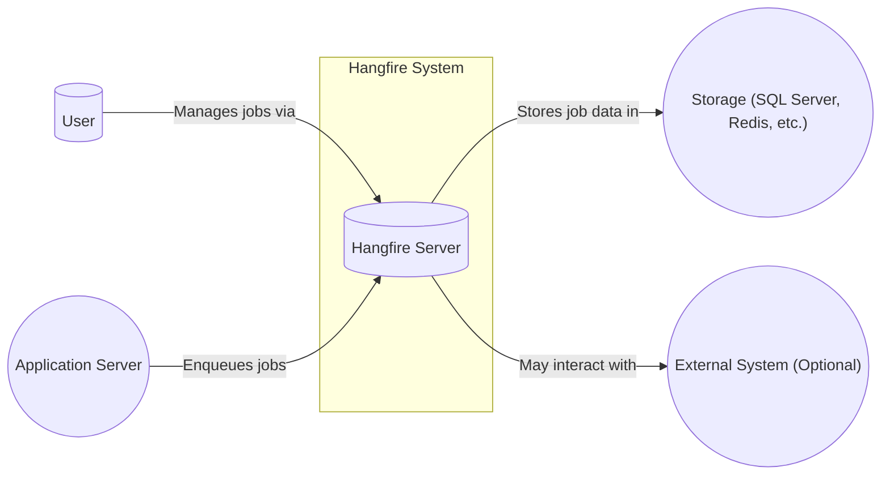
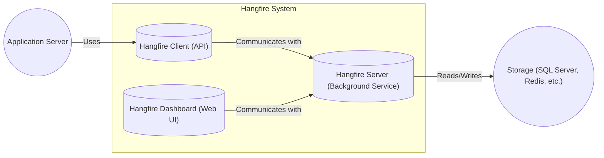
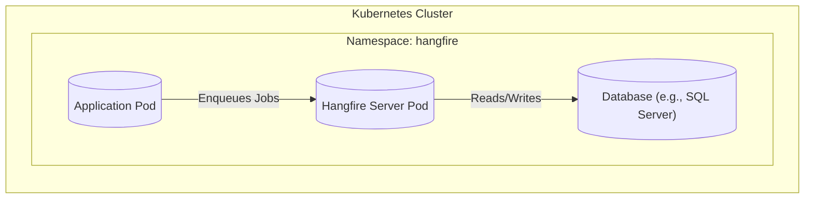
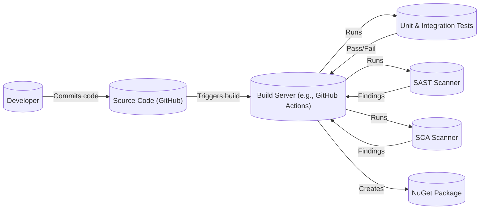

Okay, let's create a design document for Hangfire based on the provided GitHub repository.

# BUSINESS POSTURE

Hangfire is an open-source library that simplifies background job processing in .NET and .NET Core applications.  It's designed to be easy to use, reliable, and scalable.

Priorities and Goals:

*   Provide a simple and reliable way to perform background processing in .NET applications.
*   Minimize the operational overhead of managing background jobs.
*   Offer a persistent and resilient job execution environment.
*   Support various storage options for job data.
*   Enable scaling to handle a large number of background jobs.
*   Provide visibility into job status and history.
*   Allow extensibility for custom needs.

Business Risks:

*   Job execution failure:  If Hangfire fails to execute jobs reliably, it can disrupt business processes that depend on those jobs. This is the most critical risk.
*   Data loss:  Loss of job data (e.g., due to storage failures) can lead to incomplete or incorrect processing.
*   Performance bottlenecks:  If Hangfire is not properly configured or scaled, it can become a performance bottleneck, slowing down the entire application.
*   Security vulnerabilities:  Vulnerabilities in Hangfire or its dependencies could be exploited to compromise the application or its data.
*   Operational complexity:  If Hangfire is difficult to configure, monitor, or troubleshoot, it can increase operational costs and reduce developer productivity.
*   Lack of support for specific storage providers: If a user's preferred storage provider is not supported, they may be unable to use Hangfire.

# SECURITY POSTURE

Existing Security Controls:

*   security control: Input validation: Hangfire performs input validation on job arguments to prevent injection attacks. (Source: Code analysis and documentation).
*   security control: Authentication and Authorization: Hangfire supports integration with ASP.NET Core's authentication and authorization mechanisms, allowing control over who can access the Hangfire dashboard and manage jobs. (Source: Documentation and samples).
*   security control: Data protection: Hangfire supports encryption of sensitive data stored in the backing storage. (Source: Documentation).
*   security control: Regular updates: The Hangfire project is actively maintained, with regular releases that include security patches. (Source: GitHub repository).
*   security control: Dependency management: Hangfire uses standard .NET dependency management practices, allowing users to manage and update dependencies. (Source: GitHub repository).
*   security control: Extensibility: Hangfire's extensibility allows developers to implement custom security controls if needed. (Source: Documentation).

Accepted Risks:

*   accepted risk: Reliance on backing storage security: Hangfire's security depends on the security of the chosen backing storage (e.g., SQL Server, Redis).  If the storage is compromised, the job data could be compromised as well.
*   accepted risk: Default configuration: The default configuration of Hangfire may not be suitable for all environments and may require customization for optimal security.
*   accepted risk: Third-party library vulnerabilities: Hangfire depends on third-party libraries, which may have their own security vulnerabilities.

Recommended Security Controls:

*   security control: Implement robust monitoring and alerting for Hangfire to detect and respond to any security incidents or performance issues promptly.
*   security control: Regularly review and update Hangfire and its dependencies to the latest versions to address any known security vulnerabilities.
*   security control: Conduct regular security assessments and penetration testing of the application that uses Hangfire to identify and address any potential vulnerabilities.
*   security control: Implement least privilege access control for the Hangfire dashboard and API.
*   security control: Use a secure connection string and credentials for accessing the backing storage.
*   security control: Enable encryption at rest and in transit for the backing storage.

Security Requirements:

*   Authentication:
    *   The Hangfire dashboard should be protected by authentication to prevent unauthorized access.
    *   Integration with existing authentication systems (e.g., ASP.NET Core Identity) should be supported.
    *   Multi-factor authentication should be considered for enhanced security.

*   Authorization:
    *   Role-based access control (RBAC) should be implemented to restrict access to specific Hangfire features and data based on user roles.
    *   Granular permissions should be available to control access to different job types, queues, and operations.

*   Input Validation:
    *   All input to Hangfire, including job arguments, should be strictly validated to prevent injection attacks.
    *   A whitelist approach to input validation is preferred.
    *   Input validation should be performed on both the client-side (e.g., in the web UI) and the server-side.

*   Cryptography:
    *   Sensitive data stored in the backing storage should be encrypted at rest.
    *   Communication between Hangfire components and the backing storage should be encrypted in transit (e.g., using TLS).
    *   Strong cryptographic algorithms and key management practices should be used.

# DESIGN

## C4 CONTEXT

Context Diagram Element List:

*   Element:
    *   Name: User
    *   Type: Person
    *   Description: A person who interacts with the Hangfire dashboard to manage jobs and monitor their status.
    *   Responsibilities: Managing jobs, monitoring job status, configuring Hangfire settings.
    *   Security controls: Authentication, Authorization.

*   Element:
    *   Name: Application Server
    *   Type: Software System
    *   Description: The application server that hosts the application code that enqueues background jobs.
    *   Responsibilities: Enqueueing jobs, processing job results.
    *   Security controls: Input validation, secure communication with Hangfire.

*   Element:
    *   Name: Hangfire Server
    *   Type: Software System
    *   Description: The Hangfire server that processes background jobs.
    *   Responsibilities: Fetching jobs from storage, executing jobs, updating job status, handling retries.
    *   Security controls: Input validation, data protection, secure communication with storage.

*   Element:
    *   Name: Storage (SQL Server, Redis, etc.)
    *   Type: Software System
    *   Description: The persistent storage used by Hangfire to store job data.
    *   Responsibilities: Storing job data, providing access to job data.
    *   Security controls: Data encryption at rest, access control, secure communication.

*   Element:
    *   Name: External System (Optional)
    *   Type: Software System
    *   Description: An external system that Hangfire jobs may interact with.
    *   Responsibilities: Varies depending on the specific system.
    *   Security controls: Depends on the specific system.

## C4 CONTAINER

Container Diagram Element List:

*   Element:
    *   Name: Application Server
    *   Type: Software System
    *   Description: The application server that hosts the application code.
    *   Responsibilities: Enqueueing jobs, processing job results.
    *   Security controls: Input validation, secure communication with Hangfire.

*   Element:
    *   Name: Hangfire Client (API)
    *   Type: Container
    *   Description: The client-side API for interacting with Hangfire.  Typically integrated within the Application Server.
    *   Responsibilities: Enqueueing jobs, retrieving job status.
    *   Security controls: Input validation, secure communication with Hangfire Server.

*   Element:
    *   Name: Hangfire Server (Background Service)
    *   Type: Container
    *   Description: The background service that processes jobs.
    *   Responsibilities: Fetching jobs from storage, executing jobs, updating job status, handling retries.
    *   Security controls: Input validation, data protection, secure communication with storage.

*   Element:
    *   Name: Hangfire Dashboard (Web UI)
    *   Type: Container
    *   Description: The web-based user interface for managing and monitoring jobs.
    *   Responsibilities: Displaying job information, allowing users to manage jobs.
    *   Security controls: Authentication, Authorization, Input validation.

*   Element:
    *   Name: Storage (SQL Server, Redis, etc.)
    *   Type: Container
    *   Description: The persistent storage used by Hangfire.
    *   Responsibilities: Storing job data, providing access to job data.
    *   Security controls: Data encryption at rest, access control, secure communication.

## DEPLOYMENT

Possible Deployment Solutions:

1.  **In-Process Hosting:** Hangfire Server runs within the same process as the ASP.NET Core application. Simplest deployment, suitable for smaller applications.
2.  **Out-of-Process Hosting:** Hangfire Server runs as a separate process (e.g., Windows Service, console application, or in a separate container).  Better for scalability and resilience.
3.  **Cloud-Based Hosting:** Deploying Hangfire Server to a cloud platform (e.g., Azure Web Apps, AWS Elastic Beanstalk, Kubernetes). Offers scalability, managed infrastructure, and integration with cloud services.

Chosen Solution (Out-of-Process Hosting with Kubernetes):

Deployment Diagram Element List:

*   Element:
    *   Name: Application Pod
    *   Type: Deployment Node
    *   Description: Kubernetes Pod running the application code.
    *   Responsibilities: Hosting the application logic, enqueuing jobs via the Hangfire Client.
    *   Security controls: Network policies, container security context, image vulnerability scanning.

*   Element:
    *   Name: Hangfire Server Pod
    *   Type: Deployment Node
    *   Description: Kubernetes Pod running the Hangfire Server.
    *   Responsibilities: Processing background jobs.
    *   Security controls: Network policies, container security context, image vulnerability scanning, resource limits.

*   Element:
    *   Name: Storage (Database - e.g., SQL Server)
    *   Type: Deployment Node
    *   Description: The database server (e.g., SQL Server, managed instance) used for persistent storage.
    *   Responsibilities: Storing job data.
    *   Security controls: Database firewall, access control, encryption at rest and in transit, auditing.

*   Element:
    *   Name: Kubernetes Cluster
    *   Type: Deployment Environment
    *   Description: The Kubernetes cluster managing the deployment.
    *   Responsibilities: Orchestrating containers, managing resources, providing networking.
    *   Security controls: RBAC, network policies, pod security policies, cluster-level security auditing.

*   Element:
    *   Name: Namespace: hangfire
    *   Type: Deployment Environment
    *   Description: Kubernetes namespace to isolate Hangfire related resources.
    *   Responsibilities: Providing logical separation for Hangfire deployment.
    *   Security controls: Resource quotas, network policies.

## BUILD

The build process for Hangfire involves multiple steps, from code compilation to creating NuGet packages.

Build Process Description:

1.  **Developer Commits Code:** Developers commit code changes to the Hangfire repository on GitHub.
2.  **Build Trigger:** A commit triggers a build process on a build server (e.g., GitHub Actions).
3.  **Compilation:** The build server compiles the source code.
4.  **Unit & Integration Tests:** Automated unit and integration tests are executed.
5.  **SAST Scanning:** Static Application Security Testing (SAST) tools (e.g., SonarQube) analyze the source code for potential security vulnerabilities.
6.  **SCA Scanning:** Software Composition Analysis (SCA) tools (e.g., Dependabot, Snyk) scan the project's dependencies for known vulnerabilities.
7.  **NuGet Package Creation:** If all tests and scans pass, a NuGet package is created.
8.  **Artifact Publication:** The NuGet package is published to a package repository (e.g., NuGet.org).

Security Controls:

*   security control: Build Automation: The build process is automated using GitHub Actions, ensuring consistency and repeatability.
*   security control: Unit & Integration Tests: Automated tests help ensure code quality and prevent regressions.
*   security control: SAST Scanning: SAST tools identify potential security vulnerabilities in the source code.
*   security control: SCA Scanning: SCA tools identify known vulnerabilities in project dependencies.
*   security control: Build Artifact Signing: NuGet packages can be signed to ensure their integrity and authenticity.
*   security control: Least Privilege: Build server should have only necessary permissions.

# RISK ASSESSMENT

Critical Business Processes:

*   Reliable background job execution: This is the core function of Hangfire and is critical for any business process that relies on asynchronous tasks.
*   Scheduled task execution: Many businesses rely on scheduled tasks (e.g., sending emails, generating reports), and Hangfire provides this functionality.

Data Sensitivity:

*   Job arguments: These can contain sensitive data, depending on the specific job. Sensitivity varies greatly depending on the application. Examples include:
    *   Personally Identifiable Information (PII)
    *   Financial data
    *   Authentication tokens
    *   Internal system identifiers
*   Job metadata: This includes information about the job itself, such as its status, execution history, and any errors that occurred. This data is generally less sensitive than job arguments but may still contain information that should be protected.
*   Hangfire configuration data: This includes connection strings, API keys, and other settings. This data is highly sensitive and must be protected.

# QUESTIONS & ASSUMPTIONS

Questions:

*   What specific storage providers are planned to be used with Hangfire in different environments (development, staging, production)?
*   What are the expected job throughput and latency requirements?
*   What are the specific compliance requirements (e.g., GDPR, HIPAA) that need to be considered?
*   What is the existing monitoring and alerting infrastructure?
*   What is the process for managing secrets (e.g., connection strings, API keys)?
*   Are there any specific external systems that Hangfire jobs will interact with, and what are their security considerations?
*   What level of access will different user roles have within the Hangfire Dashboard?

Assumptions:

*   BUSINESS POSTURE: The organization has a moderate risk appetite, balancing the need for rapid development with the need for security and reliability.
*   SECURITY POSTURE: The organization has a basic security program in place, including vulnerability management and access control.
*   DESIGN: The application using Hangfire will be deployed to a Kubernetes cluster. The primary backing storage will be a managed SQL Server instance. The build process will utilize GitHub Actions.