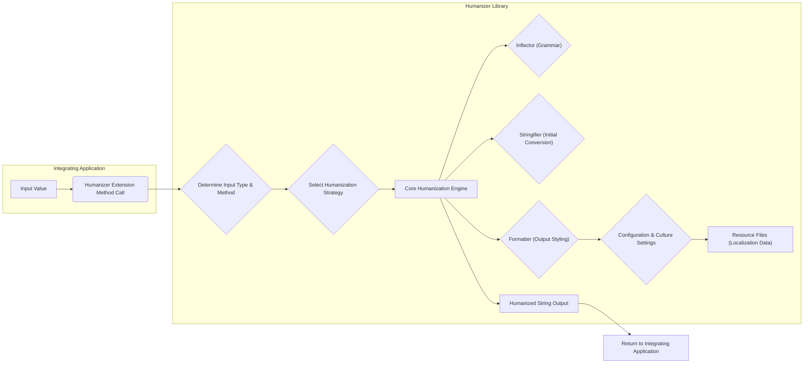
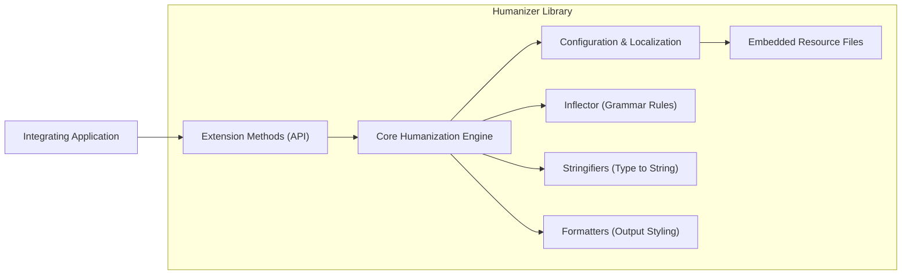
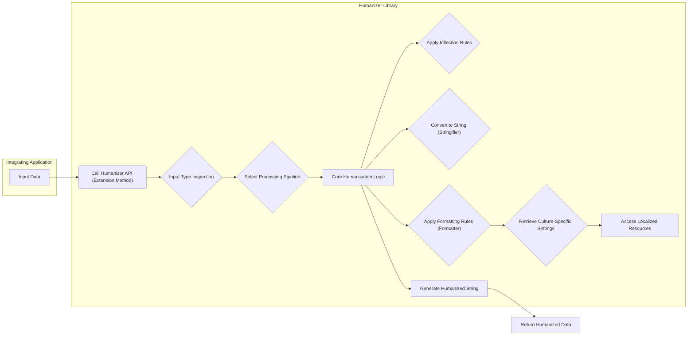

# Project Design Document: Humanizer Library

**Version:** 1.1
**Date:** October 26, 2023
**Author:** AI Software Architect

## 1. Introduction

This document provides an enhanced design description of the Humanizer library project, based on the codebase available at [https://github.com/humanizr/humanizer](https://github.com/humanizr/humanizer). This revised document aims for greater clarity and detail regarding the library's architecture, components, and data flow, specifically to facilitate more effective threat modeling.

## 2. Goals

*   Deliver a highly detailed and unambiguous architectural overview of the Humanizer library.
*   Precisely define the key components and their interactions within the library.
*   Thoroughly describe the data flow within the library and its various integration points with consuming applications.
*   Establish a robust and actionable foundation for conducting comprehensive threat modeling activities.
*   Present the design in a format that is easily digestible and valuable for both security professionals and developers.

## 3. Scope

This document focuses exclusively on the internal design and functionality of the Humanizer library itself. It encompasses the core humanization capabilities, extension mechanisms, and intended usage patterns within integrating .NET applications. The scope explicitly excludes the design of applications that utilize the Humanizer library, as well as the infrastructure involved in the library's development, testing, or distribution (such as the NuGet infrastructure).

## 4. Architectural Overview

The Humanizer library is architected as a collection of extension methods and supporting classes designed to enhance the human readability of data by transforming machine-oriented formats into more user-friendly representations. Its operation is primarily confined to the memory space of the application that integrates it.

### 4.1. Key Components

*   **Core Humanization Engine:** This central component encapsulates the primary logic for performing various humanization transformations. It comprises specific classes and algorithms dedicated to:
    *   **Date and Time Humanization:** Converting `DateTime` and `TimeSpan` values into relative time descriptions (e.g., "a minute ago", "in 3 weeks").
    *   **Number Humanization:** Transforming numerical values into more readable formats, including ordinal numbers (e.g., "1st", "2nd"), rounding to significant figures, and representing large numbers with abbreviations (e.g., "1.5K", "10M").
    *   **String Humanization:**  Applying transformations to strings, such as title casing, kebab-casing, underscore casing, and pluralization/singularization.
    *   **Collection Humanization:**  Formatting collections of items into human-readable lists with appropriate separators and conjunctions.
    *   **Byte Size Humanization:** Converting byte counts into human-friendly size units (e.g., "1 KB", "10 MB", "1 GB").
    *   **Precision Humanization:**  Formatting numbers with specific levels of precision.
*   **Extension Methods:** Humanizer leverages C# extension methods extensively to provide a seamless and intuitive API for developers. These methods extend the functionality of built-in .NET types (e.g., `DateTime`, `int`, `string`) directly, allowing for a fluent coding style.
*   **Configuration and Localization Subsystem:** This subsystem manages settings that control humanization behavior, including:
    *   **Culture Selection:**  Enabling humanization to be performed according to the rules of different languages and regional settings.
    *   **Customization Options:** Providing mechanisms to override default humanization behavior for specific scenarios.
    *   **Resource Management:**  Loading and managing localized strings and cultural data.
*   **Inflector Component:** This specialized component is responsible for handling grammatical transformations of words, primarily focusing on:
    *   **Pluralization:** Converting singular nouns to their plural forms.
    *   **Singularization:** Converting plural nouns to their singular forms.
    *   **Irregular Word Handling:** Managing exceptions to standard pluralization/singularization rules.
*   **Stringifier Abstractions:** These define interfaces and abstract classes for converting various data types into their initial string representations before further humanization.
*   **Formatter Implementations:** Concrete implementations responsible for applying specific formatting rules to the intermediate or final humanized output (e.g., adding suffixes, prefixes, or applying specific number formats).
*   **Embedded Resource Files:** These files contain localized strings, cultural data (e.g., date and time formats, number separators), and potentially inflector rule sets for different languages.

### 4.2. Data Flow

The typical data flow within the Humanizer library when processing a humanization request follows these stages:

1. **Input Reception:** An integrating application invokes a Humanizer extension method or utilizes a Humanizer class, passing the value to be humanized (e.g., a `DateTime` object, an integer, a string).
2. **Type Determination and Strategy Selection:** The library determines the type of the input value and selects the appropriate humanization strategy based on the invoked method and the input type.
3. **Core Processing:**
    *   The input value is passed to the Core Humanization Engine.
    *   Depending on the type and the required transformation, the engine may utilize:
        *   The Inflector component for pluralization or singularization.
        *   Specific Stringifier implementations to obtain an initial string representation.
        *   Formatter implementations to apply formatting rules.
    *   The Configuration and Localization subsystem is consulted to apply culture-specific rules and settings.
    *   Localized strings and cultural data are retrieved from the embedded resource files as needed.
4. **Output Generation:** The Core Humanization Engine produces the final human-readable string representation of the input value.
5. **Return to Caller:** The humanized string is returned to the calling code within the integrating application.

### 4.3. Integration Points

The primary method of integrating the Humanizer library into other .NET applications is through the NuGet package ecosystem. The integration process typically involves:

*   **NuGet Package Installation:** Developers add the `Humanizer` NuGet package as a dependency to their project using a package manager.
*   **Namespace Inclusion:**  Developers import the necessary `Humanizer` namespaces into their code files to access the library's functionality.
*   **API Usage:** Developers invoke the provided extension methods or utilize the classes within the library to perform humanization operations on their data.

### 4.4. Trust Boundaries

The most significant trust boundary lies between the integrating application and the Humanizer library. The integrating application implicitly trusts the library to execute its intended functions correctly and without introducing security vulnerabilities. Additional trust boundaries include:

*   **Developer Trust in NuGet Feed:** Developers trust that the `Humanizer` package downloaded from official or trusted NuGet feeds has not been compromised.
*   **Library Trust in Embedded Resources:** The library assumes the integrity and validity of the embedded resource files containing localization data.

## 5. Security Considerations (For Threat Modeling)

While Humanizer is primarily a utility library, security considerations are crucial when assessing the overall security posture of applications that utilize it. Potential vulnerabilities or misuse scenarios can arise.

*   **Input Handling Vulnerabilities:**
    *   **Malicious Input Strings:**  Carefully crafted or excessively long input strings passed to string humanization functions could potentially lead to unexpected behavior, resource exhaustion (e.g., excessive memory allocation), or even denial-of-service conditions within the integrating application.
    *   **Culture-Specific Exploits:**  Certain cultural settings or locale data might contain unexpected or malicious patterns that could be triggered during localization, potentially leading to errors or unexpected behavior.
*   **Resource Consumption Issues:**
    *   **CPU Exhaustion:** Complex humanization operations, especially involving large collections or intricate string manipulations, could consume significant CPU resources, potentially impacting the performance and availability of the integrating application.
    *   **Memory Exhaustion:**  Humanizing very large data sets or deeply nested structures could lead to excessive memory allocation, potentially causing out-of-memory exceptions.
    *   **Algorithmic Complexity:**  Inefficient algorithms within the humanization logic could lead to performance bottlenecks or denial-of-service under specific input conditions.
*   **Dependency Chain Risks:**
    *   **Vulnerable Dependencies:**  Humanizer might rely on other third-party libraries. Vulnerabilities in these dependencies could indirectly affect the security of applications using Humanizer.
    *   **Supply Chain Attacks:**  Compromise of the NuGet package distribution mechanism could lead to the distribution of a tampered version of the Humanizer library.
*   **Information Disclosure Risks:**
    *   **Exposure of Sensitive Data:**  If humanization is applied to sensitive data without careful consideration, the humanized output might inadvertently reveal confidential information.
    *   **Verbose Error Messages:**  Detailed error messages or exceptions generated by the library could potentially expose internal implementation details or sensitive information to attackers.
*   **Indirect Code Injection Risks:**
    *   **Unsanitized Output:** While Humanizer itself doesn't execute code, if its output is directly used in contexts like web page rendering without proper sanitization (e.g., preventing cross-site scripting), it could indirectly contribute to code injection vulnerabilities in the integrating application.
*   **Localization and Resource Handling Vulnerabilities:**
    *   **Malicious Resource Files:** If the library allows for the use of external or custom resource files, there's a risk of malicious resource files being introduced, potentially leading to unexpected behavior or security breaches.
    *   **Incorrect Locale Handling:**  Bugs or vulnerabilities in the localization logic could lead to incorrect output, unexpected behavior, or even security vulnerabilities in applications relying on localized output.

## 6. Deployment

The Humanizer library is deployed as a NuGet package on platforms like NuGet.org. Integrating applications declare a dependency on this package. During the build process, the NuGet package is downloaded and its assemblies are included in the application's output. At runtime, the library's code is loaded into the application's process memory.

## 7. Threat Modeling Focus Areas

For effective threat modeling of systems incorporating the Humanizer library, the following areas warrant specific attention:

*   **Input Validation and Sanitization:**  Thoroughly analyze how the library handles various types of input, focusing on potential vulnerabilities related to malicious or unexpected data.
*   **Resource Management:** Evaluate the library's resource consumption patterns, particularly concerning CPU and memory usage, to identify potential denial-of-service vulnerabilities.
*   **Dependency Security:**  Investigate the security posture of the library's dependencies and implement measures to mitigate risks associated with vulnerable components.
*   **Supply Chain Security:**  Implement controls to ensure the integrity and authenticity of the Humanizer NuGet package.
*   **Information Disclosure:**  Assess the potential for the library to inadvertently expose sensitive information through its humanized output or error messages.
*   **Interaction with Integrating Applications:**  Analyze how the library's output is used within consuming applications to identify potential for secondary vulnerabilities like code injection.
*   **Localization Security:**  Scrutinize the mechanisms for handling localization data and resource files to prevent exploitation through malicious or corrupted locale information.

## 8. Diagrams

### 8.1. High-Level Component Diagram

### 8.2. Detailed Data Flow Diagram

## 9. Conclusion

This enhanced design document provides a more granular and comprehensive understanding of the Humanizer library's internal workings and its integration within larger systems. By detailing the architecture, components, and data flow, and by explicitly outlining potential security considerations, this document serves as a valuable resource for conducting thorough and effective threat modeling activities. This will ultimately contribute to building more secure applications that leverage the Humanizer library.