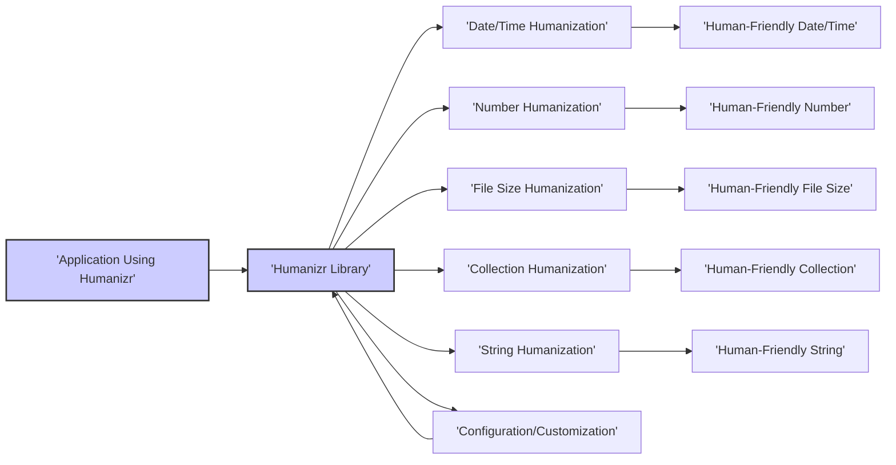

# Project Design Document: Humanizr Library

**Version:** 1.1
**Date:** October 26, 2023
**Author:** AI Software Architect

## 1. Introduction

This document provides an enhanced design overview of the `humanizr` library, a utility designed to transform machine-readable data into human-friendly formats. This detailed design serves as a critical input for subsequent threat modeling activities, enabling a comprehensive assessment of potential security vulnerabilities.

### 1.1. Purpose

The primary purpose of this document is to offer a clear and detailed architectural description of the `humanizr` library. It elaborates on the library's structure, the functionalities of its key components, and the pathways through which data is processed. This document is specifically crafted to facilitate effective threat modeling by providing a solid understanding of the system's inner workings.

### 1.2. Scope

This document encompasses the design of the core `humanizr` library, mirroring the structure and functionalities present in the linked GitHub repository. The focus is on the functional aspects of the library, detailing the various types of data humanization it offers and the overarching architectural design. Specific implementation details of individual humanization algorithms, as well as the library's build, testing, and deployment processes, are outside the scope of this document.

### 1.3. Goals

*   To provide a clear and comprehensive description of the `humanizr` library's architecture and its constituent components.
*   To illustrate the flow of data within the library with sufficient clarity.
*   To furnish the necessary level of detail required for conducting effective threat modeling exercises.
*   To strictly adhere to the specified formatting guidelines, utilizing markdown, valid mermaid syntax (with quoted node names), and avoiding the use of markdown tables.

## 2. High-Level Architecture

The `humanizr` library is structured as a collection of independent modules or functions, each dedicated to humanizing a specific data type. An application integrating the library will typically import the relevant module or function and supply the machine-readable value intended for humanization.

The fundamental interaction involves an application providing data to the `humanizr` library. The library then routes this data through the appropriate humanization logic and returns a representation that is more easily understood by humans.

## 3. Component Details

The `humanizr` library can be conceptually divided into the following key functional components:

*   **Date/Time Humanization:** This component is responsible for transforming date and time values into human-readable expressions.
    *   Input Examples: Unix timestamps, ISO 8601 date strings, `DateTime` objects.
    *   Output Examples: "a few seconds ago", "yesterday", "in 3 weeks".
*   **Number Humanization:** This component handles the conversion of numerical values into more easily digestible formats.
    *   Input Examples: `1000`, `1234567`, `99.95`.
    *   Output Examples: "1K", "1.23 million", "99.95".
*   **File Size Humanization:** This component specializes in converting file sizes, typically represented in bytes, into human-friendly units.
    *   Input Examples: `1024`, `1572864`, `2147483648`.
    *   Output Examples: "1 KB", "1.5 MB", "2 GB".
*   **Collection Humanization:** This component provides functionalities to represent collections or lists of items in a human-readable string format.
    *   Input Examples: `["apple", "banana", "cherry"]`, `[1, 2, 3]`.
    *   Output Examples: "apple, banana, and cherry", "1, 2, and 3".
*   **String Humanization:** This component offers various utilities to make strings more human-friendly, such as adding ordinal suffixes, converting casing, or pluralizing words based on a count.
    *   Input Examples: `"1"`, `"task"`, `"USER_NAME"`.
    *   Output Examples: `"1st"`, `"tasks"`, `"User Name"`.
*   **Configuration/Customization:** This component allows users to adjust the behavior of the humanization functions. This might involve setting the locale for language-specific formatting, defining custom units for file sizes, or specifying particular formatting rules.
    *   Input Examples: Locale codes (`"en-US"`, `"fr-FR"`), custom unit definitions (`{"kb": 1000}`), format strings.
    *   Output: Modification of the behavior of other humanization components.

## 4. Data Flow

The typical flow of data within the `humanizr` library proceeds as follows:

1. An application requires a piece of data to be presented in a human-friendly format.
2. The application imports the specific humanization function or module from the `humanizr` library that is appropriate for the data type.
3. The application passes the machine-readable data as an argument to the imported function.
4. The humanization function receives the input data and applies its internal processing logic, potentially taking into account any provided configuration settings.
5. The function generates the human-friendly representation of the input data.
6. The function returns the human-friendly output to the calling application.
7. The application then utilizes the human-friendly output, for example, by displaying it to a user.

## 5. Security Considerations (Initial)

While the `humanizr` library is primarily a utility and generally does not directly handle sensitive user data, it's important to consider potential security implications:

*   **Input Validation Vulnerabilities:**  Failure to properly validate input data could lead to unexpected errors or potentially exploitable behavior in the calling application. For instance, providing a very large string to a string humanization function might cause excessive memory consumption.
*   **Denial of Service (DoS) Potential:**  Although less likely, inefficient humanization logic could be exploited by providing specially crafted, large, or complex inputs that consume excessive resources (CPU, memory), potentially leading to a denial of service for the application using the library.
*   **Configuration Tampering:** If the library allows for external configuration, vulnerabilities in how these configurations are loaded or applied could allow malicious actors to alter the library's behavior in unintended ways. For example, a compromised configuration file could lead to incorrect or misleading humanized output.
*   **Dependency Vulnerabilities:** The library might rely on external third-party libraries. Security vulnerabilities present in these dependencies could indirectly impact the security of applications utilizing `humanizr`. Regular updates and security audits of dependencies are crucial.
*   **Locale Handling Issues:** Improper handling of locale settings could potentially lead to unexpected formatting or even security issues if locale data is sourced from untrusted locations. For example, a maliciously crafted locale file could introduce vulnerabilities.

These initial security considerations will be further investigated and detailed during the dedicated threat modeling phase.

## 6. Assumptions and Constraints

*   It is assumed that the `humanizr` library will be integrated and used within the context of a larger, encompassing application.
*   The `humanizr` library itself is not responsible for handling user authentication, authorization, or the storage of sensitive data.
*   The security of the application that incorporates the `humanizr` library is ultimately the responsibility of the developers of that application.
*   This design document is based on the current understanding of the `humanizr` library's functionality and structure as represented in the linked GitHub repository at the time of writing.

## 7. Future Considerations

*   **Enhanced Localization Support:** Expanding the library's capabilities to support a wider range of locales and cultural nuances in humanization, including more complex grammatical structures and regional formatting conventions.
*   **Pluggable Humanization Logic:** Providing a more robust and well-defined mechanism for users or developers to add custom humanization logic or extend the existing functionalities without modifying the core library.
*   **Performance Optimization for Specific Use Cases:**  Investigating and implementing performance optimizations tailored to specific humanization tasks or scenarios where the library is expected to handle large volumes of data or operate under tight performance constraints.
*   **Improved Error Handling and Reporting:** Enhancing the library's ability to gracefully handle invalid or unexpected input and provide more informative error messages to the calling application.
*   **Standardized Configuration Options:**  Developing a more standardized and consistent approach to configuration options across different humanization components to improve usability and reduce the learning curve.

This document provides an enhanced and more detailed understanding of the `humanizr` library's design. The information contained herein is essential for conducting a thorough and effective threat model to identify and mitigate potential security vulnerabilities.