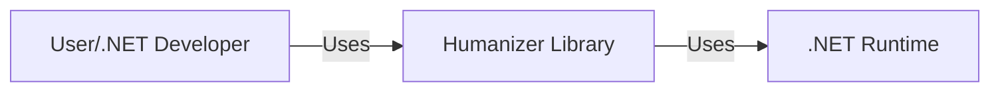
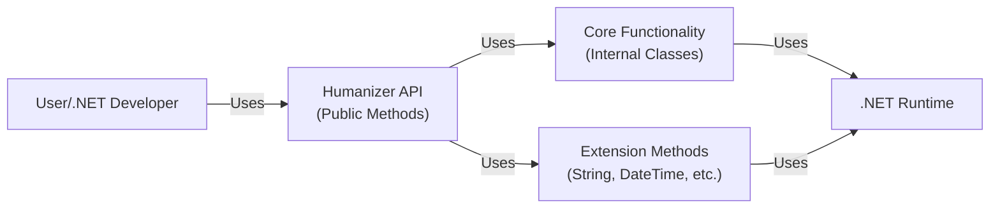
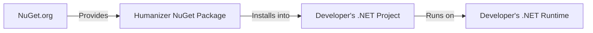
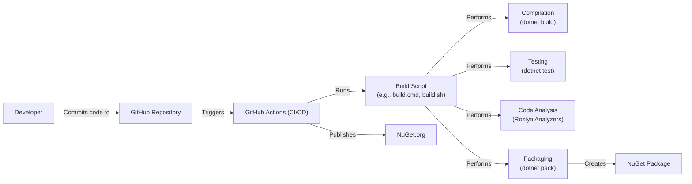

# BUSINESS POSTURE

Business Priorities and Goals:

*   Provide a library that helps developers manipulate and display strings, enums, dates, times, timespans, numbers, and quantities in a human-friendly format.
*   Offer a wide range of features to cover common string manipulation and formatting needs.
*   Support multiple languages and cultures.
*   Maintain high code quality, readability, and maintainability.
*   Ensure the library is performant and efficient.
*   Provide clear and comprehensive documentation.
*   Foster a welcoming and active community.

Business Risks:

*   Inconsistent or incorrect formatting results, leading to user confusion or misinterpretation.
*   Performance bottlenecks, especially with large inputs or complex formatting rules.
*   Lack of support for specific cultures or languages, limiting the library's usefulness in certain regions.
*   Security vulnerabilities, such as injection attacks if user-provided data is not properly handled.
*   Compatibility issues with different .NET versions or platforms.
*   Difficulties in maintaining the codebase due to its complexity or lack of clear structure.

# SECURITY POSTURE

Existing Security Controls:

*   security control: Input validation: The library appears to perform input validation in various places, such as checking for null or empty strings, validating enum values, and handling edge cases in date/time calculations. (Implicit in the code, no specific documentation section).
*   security control: Unit tests: The project has an extensive suite of unit tests, which helps ensure the correctness and reliability of the code, and can catch regressions that might introduce security issues. (Visible in the test projects within the repository).
*   security control: Code analysis: The project uses Roslyn analyzers to enforce code style and quality rules, which can help prevent common coding errors that might lead to security vulnerabilities. (Visible in .editorconfig and Directory.Build.props files).
*   security control: Dependency management: The project uses NuGet for dependency management, which allows for tracking and updating dependencies to address known vulnerabilities. (Visible in the .csproj files).

Accepted Risks:

*   accepted risk: The library primarily deals with formatting and display, which are generally low-risk operations. However, there's a potential risk if the formatted output is used in security-sensitive contexts without proper escaping or sanitization.
*   accepted risk: The library relies on the underlying .NET framework for many of its functionalities, and any vulnerabilities in the framework could potentially affect the library.

Recommended Security Controls:

*   security control: Add explicit security documentation outlining potential risks and recommended usage patterns to avoid vulnerabilities.
*   security control: Consider adding fuzz testing to identify unexpected behavior with unusual inputs.
*   security control: Implement regular security audits and penetration testing to identify and address potential vulnerabilities.

Security Requirements:

*   Authentication: Not applicable, as the library does not handle user authentication.
*   Authorization: Not applicable, as the library does not handle user authorization.
*   Input Validation:
    *   All input parameters should be validated to ensure they are within expected ranges and formats.
    *   Null or empty strings should be handled gracefully.
    *   Enum values should be validated against the defined enum type.
    *   Date/time inputs should be checked for valid ranges and formats.
    *   Numeric inputs should be checked for valid ranges and formats.
*   Cryptography: Not directly applicable, as the library does not perform cryptographic operations. However, if the library is used to format or display sensitive data, appropriate cryptographic measures should be taken at the application level.
*   Output Encoding: If the library's output is used in contexts where injection attacks are possible (e.g., HTML, SQL), proper output encoding or escaping should be applied at the application level.

# DESIGN

## C4 CONTEXT

Element Descriptions:

*   Element: User/.NET Developer
    *   Name: User/.NET Developer
    *   Type: Person
    *   Description: A developer who uses the Humanizer library in their .NET application.
    *   Responsibilities: Integrates Humanizer into their application, calls Humanizer's methods to format data, and handles the output appropriately.
    *   Security controls: Implements appropriate security measures in their application, such as input validation and output encoding, to prevent vulnerabilities when using Humanizer's output.

*   Element: Humanizer
    *   Name: Humanizer Library
    *   Type: Software System
    *   Description: The Humanizer library, which provides methods for formatting strings, enums, dates, times, timespans, numbers, and quantities.
    *   Responsibilities: Provides a set of APIs for formatting data in a human-friendly way, handles localization and internationalization, and ensures performance and efficiency.
    *   Security controls: Performs input validation to prevent errors and potential vulnerabilities, relies on the .NET framework's security features.

*   Element: .NET Runtime
    *   Name: .NET Runtime
    *   Type: Software System
    *   Description: The .NET runtime environment, which provides the underlying platform for executing the Humanizer library.
    *   Responsibilities: Provides core functionalities such as string manipulation, date/time handling, number formatting, and culture-specific settings.
    *   Security controls: Implements security features such as code access security, type safety, and memory management.

## C4 CONTAINER

Element Descriptions:

*   Element: User/.NET Developer
    *   Name: User/.NET Developer
    *   Type: Person
    *   Description: A developer who uses the Humanizer library in their .NET application.
    *   Responsibilities: Integrates Humanizer into their application, calls Humanizer's methods to format data, and handles the output appropriately.
    *   Security controls: Implements appropriate security measures in their application, such as input validation and output encoding, to prevent vulnerabilities when using Humanizer's output.

*   Element: Humanizer API
    *   Name: Humanizer API (Public Methods)
    *   Type: Container
    *   Description: The public interface of the Humanizer library, exposing the methods that developers can use.
    *   Responsibilities: Provides a consistent and easy-to-use API for accessing Humanizer's features, handles input validation, and delegates to internal classes for core functionality.
    *   Security controls: Performs input validation to prevent errors and potential vulnerabilities.

*   Element: Core Functionality
    *   Name: Core Functionality (Internal Classes)
    *   Type: Container
    *   Description: The internal classes that implement the core logic of Humanizer.
    *   Responsibilities: Performs the actual formatting and manipulation of data, handles localization and internationalization, and ensures performance and efficiency.
    *   Security controls: Relies on the .NET framework's security features.

*   Element: Extension Methods
    *   Name: Extension Methods (String, DateTime, etc.)
    *   Type: Container
    *   Description: Extension methods that extend existing .NET types (e.g., String, DateTime) with Humanizer's functionalities.
    *   Responsibilities: Provides a convenient way to access Humanizer's features directly on .NET objects.
    *   Security controls: Relies on the .NET framework's security features.

*   Element: .NET Runtime
    *   Name: .NET Runtime
    *   Type: Software System
    *   Description: The .NET runtime environment.
    *   Responsibilities: Provides core functionalities.
    *   Security controls: Implements security features.

## DEPLOYMENT

Deployment Solutions:

1.  NuGet Package: The primary deployment method is via NuGet packages. Developers can install Humanizer directly into their projects using the NuGet package manager.
2.  Manual Build: Developers can clone the repository and build the library themselves. This is less common but provides more control over the build process.

Chosen Solution (NuGet Package):

Element Descriptions:

*   Element: NuGet.org
    *   Name: NuGet.org
    *   Type: Infrastructure Node
    *   Description: The public NuGet server that hosts the Humanizer package.
    *   Responsibilities: Provides a repository for storing and distributing NuGet packages.
    *   Security controls: Implements security measures to protect against unauthorized access and package tampering.

*   Element: Humanizer NuGet Package
    *   Name: Humanizer NuGet Package
    *   Type: Software Element
    *   Description: The compiled Humanizer library packaged as a NuGet package.
    *   Responsibilities: Contains the necessary assemblies and resources for using Humanizer in a .NET project.
    *   Security controls: Digitally signed to ensure authenticity and integrity.

*   Element: Developer's .NET Project
    *   Name: Developer's .NET Project
    *   Type: Software Element
    *   Description: The .NET project where the developer integrates Humanizer.
    *   Responsibilities: Contains the application code that uses Humanizer.
    *   Security controls: Implements appropriate security measures in their application.

*   Element: Developer's .NET Runtime
    *   Name: Developer's .NET Runtime
    *   Type: Infrastructure Node
    *   Description: The .NET runtime environment on the developer's machine or server.
    *   Responsibilities: Executes the .NET project, including the Humanizer library.
    *   Security controls: Implements security features.

## BUILD

Build Process Description:

1.  Developer commits code changes to the GitHub repository.
2.  GitHub Actions, the CI/CD system, is triggered by the commit.
3.  GitHub Actions executes the build script (e.g., `build.cmd` or `build.sh`).
4.  The build script performs the following steps:
    *   Compilation: Compiles the source code using `dotnet build`.
    *   Testing: Runs unit tests using `dotnet test`.
    *   Code Analysis: Performs static code analysis using Roslyn analyzers.
    *   Packaging: Creates a NuGet package using `dotnet pack`.
5.  The created NuGet package is then published to NuGet.org by GitHub Actions.

Security Controls:

*   security control: GitHub Actions: Provides a secure and automated build environment.
*   security control: Build Script: Defines the build steps and ensures consistency.
*   security control: Compilation: Uses the official .NET SDK for compilation, ensuring security features are enabled.
*   security control: Testing: Runs unit tests to catch regressions and potential vulnerabilities.
*   security control: Code Analysis: Uses Roslyn analyzers to enforce code style and quality rules, and to detect potential security issues.
*   security control: Packaging: Creates a NuGet package with appropriate metadata and signing.
*   security control: NuGet.org: Provides a secure repository for distributing the package.

# RISK ASSESSMENT

Critical Business Processes:

*   Providing accurate and reliable string formatting and manipulation.
*   Supporting a wide range of cultures and languages.
*   Maintaining a stable and performant library.

Data Protection:

*   The library itself does not handle or store sensitive data directly. However, it's crucial to consider how the *output* of the library is used. If the formatted output contains sensitive data (e.g., personally identifiable information, financial data), the application using Humanizer must take appropriate measures to protect that data, such as:
    *   Data Sensitivity: Low (if used for general formatting). Potentially higher if used to format sensitive data, but this is the responsibility of the application using Humanizer.
    *   Encryption: If sensitive data is being formatted, the application should encrypt it before passing it to Humanizer (if necessary) and after receiving the formatted output.
    *   Access Control: The application should restrict access to sensitive data, both before and after formatting.
    *   Logging and Auditing: The application should log and audit access to sensitive data, including any formatting operations performed by Humanizer.
    *   Output Encoding: If the formatted output is displayed in a web page or other context where injection attacks are possible, the application must properly encode or escape the output to prevent vulnerabilities.

# QUESTIONS & ASSUMPTIONS

Questions:

*   Are there any specific regulatory requirements or compliance standards that the library needs to adhere to? (Assumption: No specific requirements beyond general best practices for software development.)
*   Are there any plans to extend the library's functionality to handle more complex data types or formatting scenarios? (Assumption: The library will continue to evolve and add new features, but the core focus will remain on string, enum, date, time, timespan, number, and quantity formatting.)
*   Are there any performance benchmarks or targets that the library needs to meet? (Assumption: The library should be performant enough for common use cases, but there are no specific benchmarks defined.)

Assumptions:

*   Business Posture: The primary goal is to provide a useful and reliable library for .NET developers. Security is important, but it's not the top priority.
*   Security Posture: The library relies on the .NET framework's security features and follows general best practices for secure coding. There are no specific security certifications or audits required.
*   Design: The library is designed to be modular and extensible, allowing for future enhancements and community contributions.