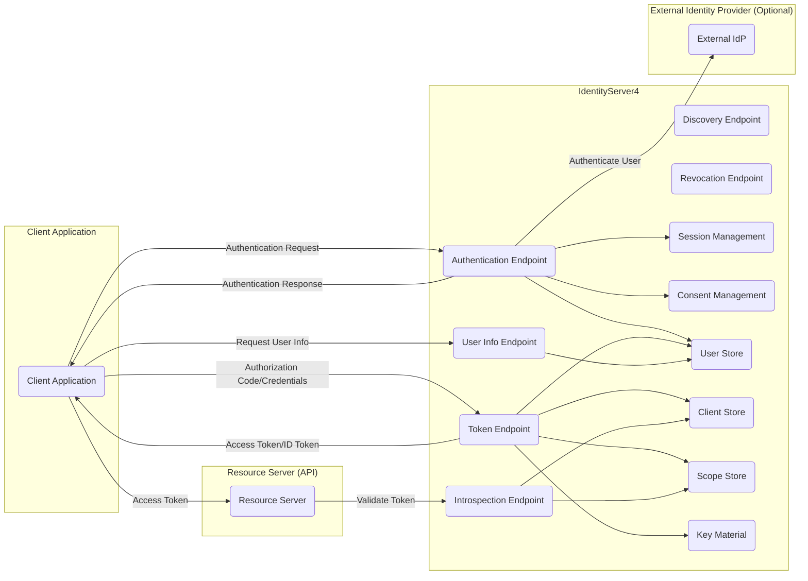
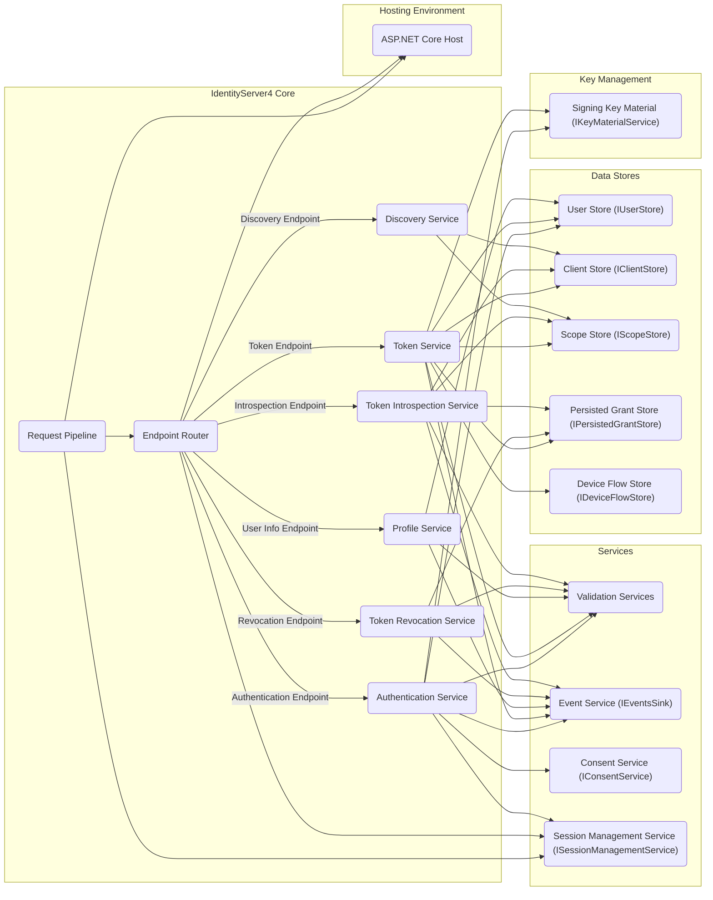
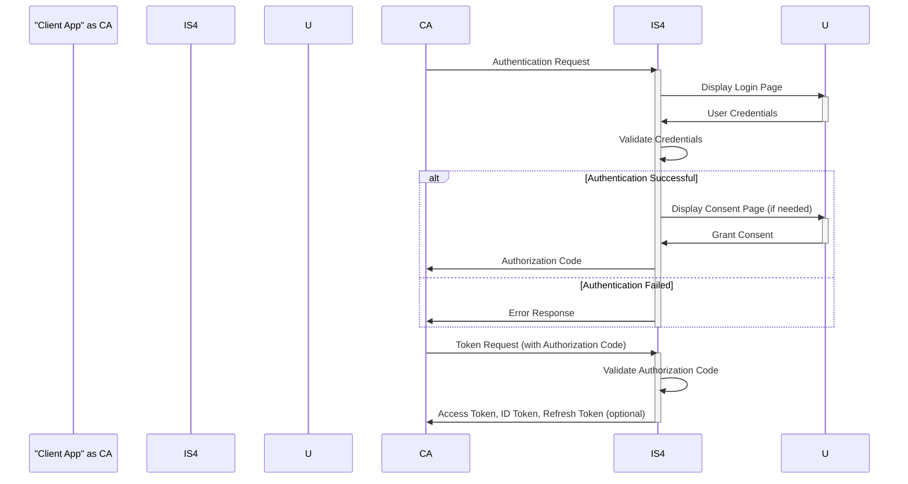
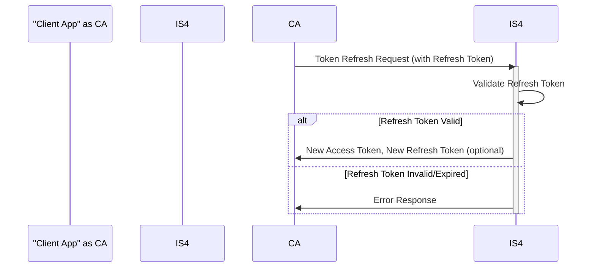
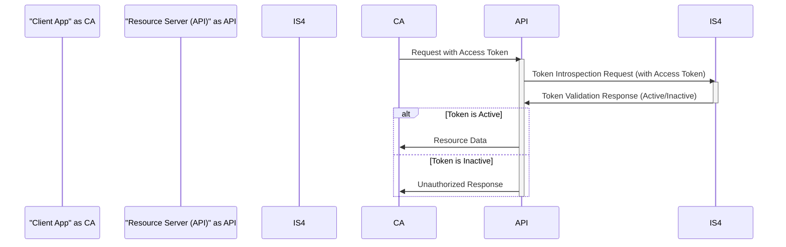

# Project Design Document: IdentityServer4

**Version:** 1.1
**Date:** October 26, 2023
**Author:** AI Software Architect

## 1. Introduction

This document provides an enhanced design overview of IdentityServer4, a robust and widely adopted open-source framework for ASP.NET Core. It implements the OpenID Connect and OAuth 2.0 protocols, offering a comprehensive solution for identity and access management. This detailed design aims to facilitate a thorough understanding of IdentityServer4's architecture, core components, and critical data flows, serving as a solid foundation for subsequent threat modeling exercises.

## 2. Goals and Objectives

The primary objectives of IdentityServer4 are to:

*   Serve as a centralized and secure authority for authentication and authorization across diverse applications.
*   Implement and adhere to industry-standard protocols, specifically OpenID Connect and OAuth 2.0.
*   Enable seamless single sign-on (SSO) experiences for users accessing multiple applications.
*   Provide support for a wide range of client types, including web applications, mobile applications, and APIs.
*   Offer a highly extensible and customizable platform to meet specific organizational needs.
*   Manage user identities and credentials securely, adhering to best practices.

## 3. System Architecture

IdentityServer4 employs a modular and extensible architecture, promoting flexibility and customization. Its core components interact to process authentication and authorization requests efficiently.

### 3.1. High-Level Architecture

### 3.2. Component-Level Architecture

## 4. Key Components

This section provides a more detailed explanation of the core components within IdentityServer4 and their respective functionalities. Note the interfaces mentioned often represent points of extensibility.

*   **Authentication Endpoint:**  The entry point for user authentication. It handles requests involving username/password credentials or redirects users to configured external identity providers.
*   **Token Endpoint:** Responsible for issuing security tokens, including access tokens (for API authorization), ID tokens (containing user authentication information), and refresh tokens (for obtaining new access tokens without re-authentication).
*   **User Info Endpoint:**  Returns authenticated user claims (attributes) based on a valid access token. This allows client applications to retrieve user-specific information.
*   **Discovery Endpoint (/.well-known/openid-configuration):**  A crucial endpoint that exposes metadata about the IdentityServer instance. This includes supported OAuth 2.0 and OpenID Connect specifications, available endpoints, supported scopes, and public signing keys used for token verification.
*   **Revocation Endpoint:** Enables authorized clients to revoke issued access tokens and refresh tokens, effectively terminating their validity.
*   **Introspection Endpoint:** Allows resource servers (APIs) to validate the authenticity and validity of access tokens presented by client applications.
*   **Session Management:** Manages user authentication sessions within IdentityServer4, enabling features like single sign-out (SSO).
*   **Consent Management:** Handles the process of obtaining explicit user consent for client applications to access specific resources or user data. This is a critical aspect of user privacy and security.
*   **User Store (IUserStore):** An abstraction (interface) for accessing and managing user credentials and profile information. Implementations can connect to various data sources like relational databases, LDAP directories, or custom user stores.
*   **Client Store (IClientStore):**  Stores configuration details for registered client applications that rely on IdentityServer4. This includes allowed grant types, redirect URIs, post-logout redirect URIs, client secrets (if applicable), and allowed scopes.
*   **Scope Store (IScopeStore):** Defines the permissions (scopes) that clients can request and that users can consent to. Scopes represent specific access levels to resources.
*   **Persisted Grant Store (IPersistedGrantStore):**  Responsible for the persistent storage of authorization grants, refresh tokens, consent decisions, authorization codes, and other long-lived data. This ensures that authorizations persist across user sessions.
*   **Device Flow Store (IDeviceFlowStore):**  Specifically designed for storing data related to the device authorization grant flow, which is used for authenticating applications on devices with limited input capabilities (e.g., smart TVs).
*   **Key Material (IKeyMaterialService):** Manages the cryptographic keys used by IdentityServer4 for signing tokens (ensuring integrity and non-repudiation) and potentially for encrypting data. Secure management of these keys is paramount.
*   **Validation Services:** A collection of internal services responsible for validating various aspects of incoming requests and issued tokens, ensuring adherence to protocol specifications and security policies.
*   **Event Service (IEventsSink):**  Provides a mechanism for capturing and processing significant events within IdentityServer4, such as user logins, token issuance, and errors. This is valuable for auditing, monitoring, and security analysis.
*   **Consent Service (IConsentService):**  Implements the core logic for managing user consent, including storing and retrieving consent decisions.
*   **Session Management Service (ISessionManagementService):**  Handles the internal logic for managing user authentication sessions and facilitating single sign-out functionality.
*   **Request Pipeline:** The initial entry point for all incoming HTTP requests to IdentityServer4. It handles request processing and routing.
*   **Endpoint Router:**  Analyzes incoming requests and determines the appropriate endpoint handler based on the request path and other factors.
*   **Profile Service (IProfileService):**  Responsible for retrieving user claims (attributes) from the user store and populating the ID token and the User Info Endpoint response. This is a key point for customizing the information returned about a user.

## 5. Data Flow Diagrams

This section visually represents the key data flows within IdentityServer4 for common scenarios.

### 5.1. Authentication Flow (Authorization Code Grant)

### 5.2. Token Refresh Flow

### 5.3. API Access with Access Token

## 6. Security Considerations

Maintaining a strong security posture for IdentityServer4 is paramount. Key considerations include:

*   **Secure Key Management:**  Protecting the signing keys used for issuing tokens is critical. Implement secure storage mechanisms (e.g., Hardware Security Modules - HSMs, Azure Key Vault), enforce key rotation policies, and restrict access to these keys.
*   **Robust Input Validation:**  Thoroughly validate all inputs received by IdentityServer4, including authentication requests, token requests, redirect URIs, and user data. This helps prevent common injection attacks such as SQL injection, cross-site scripting (XSS), and command injection. For example, redirect URIs should be strictly whitelisted.
*   **Contextual Output Encoding:**  Ensure that all data rendered in responses, such as login pages, error messages, and user information, is properly encoded based on the output context (e.g., HTML encoding, URL encoding). This is crucial to prevent XSS vulnerabilities.
*   **Enforce Transport Layer Security (TLS):**  Mandate that all communication with IdentityServer4 occurs exclusively over HTTPS. This protects sensitive data like credentials and tokens from eavesdropping and man-in-the-middle attacks. Use strong TLS configurations and keep certificates up-to-date.
*   **Secure Client Authentication:**  Implement robust mechanisms for authenticating client applications. This typically involves the use of client secrets (which must be stored securely), client certificates, or other authentication methods as appropriate for the client type.
*   **Strict Authorization Enforcement:**  Carefully define and enforce scopes and claims to ensure that client applications and users only have access to authorized resources. Implement fine-grained authorization policies where necessary.
*   **Mitigation of Cross-Site Request Forgery (CSRF):**  Implement anti-CSRF tokens and other appropriate measures to prevent CSRF attacks, especially for interactive authentication flows.
*   **Implementation of Rate Limiting and Throttling:**  Employ rate limiting and throttling mechanisms to protect against denial-of-service (DoS) attacks and brute-force attempts on authentication endpoints.
*   **Comprehensive Auditing and Logging:**  Maintain detailed logs of security-related events, including authentication attempts, token issuance, errors, and administrative actions. This is essential for security monitoring, incident response, and compliance.
*   **Proactive Vulnerability Management:**  Regularly update IdentityServer4 and all its dependencies to patch known security vulnerabilities. Implement a process for monitoring security advisories and applying updates promptly.
*   **Secure Storage of Secrets:**  Client secrets, database connection strings, and other sensitive configuration data must be stored securely. Avoid storing secrets in plain text in configuration files. Consider using environment variables or dedicated secret management solutions.
*   **Secure Consent Management:**  Ensure the consent process is secure, transparent, and provides users with clear information about the data being accessed and the permissions being granted. Protect consent decisions from unauthorized modification.
*   **Secure Session Management:**  Protect session cookies using appropriate flags (e.g., HttpOnly, Secure, SameSite). Implement secure logout mechanisms to properly terminate user sessions.

## 7. Deployment Considerations

The security and performance of IdentityServer4 are significantly influenced by the deployment environment. Key considerations include:

*   **Secure Hosting Environment:**  Deploy IdentityServer4 to a secure and reliable hosting environment with appropriate security controls in place. Consider factors like network segmentation, access control, and physical security.
*   **Database Security:**  If using a database for persistent storage, ensure it is properly secured. This includes strong authentication, access controls, encryption at rest and in transit, and regular security audits.
*   **Load Balancing and High Availability:**  For production environments, implement load balancing and high availability configurations to ensure resilience and handle increased traffic. Secure communication between load balancers and IdentityServer instances.
*   **Robust Monitoring and Alerting:**  Set up comprehensive monitoring and alerting for critical metrics, performance indicators, and security events. This enables proactive identification and response to potential issues.
*   **Disaster Recovery Planning:**  Develop and regularly test a disaster recovery plan to ensure business continuity in the event of a system failure or outage.
*   **Secure Configuration Management:**  Manage configuration settings securely, avoiding the storage of sensitive information in version control systems. Use secure configuration providers and restrict access to configuration files.

## 8. Assumptions and Constraints

The following assumptions and constraints are relevant to this design document:

*   IdentityServer4 is assumed to be the primary and authoritative source for authentication and authorization within the system.
*   The design primarily focuses on standard OpenID Connect and OAuth 2.0 flows. Custom grant types or extensions are not detailed here.
*   While extensibility is a key feature of IdentityServer4, specific customizations and extensions are outside the scope of this document.
*   The document emphasizes the logical architecture and data flows, rather than specific implementation details or code-level specifics.

This improved design document provides a more comprehensive and detailed understanding of IdentityServer4, enhancing its value for threat modeling activities. By carefully considering the components, data flows, and security considerations outlined here, organizations can better identify and mitigate potential security risks associated with their identity and access management infrastructure.