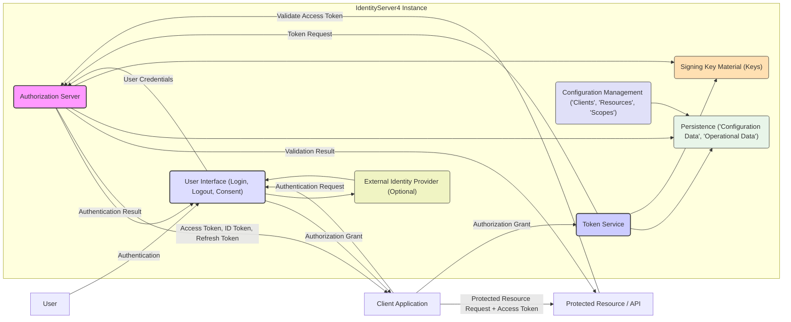

## Project Design Document: IdentityServer4 (Improved)

**1. Introduction**

This document provides a detailed architectural design overview of IdentityServer4, an open-source framework for ASP.NET Core implementing the OpenID Connect and OAuth 2.0 protocols. This document is specifically crafted to serve as a robust foundation for subsequent threat modeling activities. It meticulously outlines the key components, their interactions, and the overall architecture of a typical IdentityServer4 deployment, emphasizing security aspects relevant to threat identification.

**2. Goals**

*   Provide a clear, detailed, and security-focused description of the IdentityServer4 architecture.
*   Identify the core components, elaborating on their specific responsibilities and security implications.
*   Illustrate the primary data flows within the system with a focus on sensitive data handling.
*   Highlight critical security considerations inherent in the design, providing context for potential threats.
*   Serve as a comprehensive and actionable basis for identifying potential threats, vulnerabilities, and attack vectors.

**3. Target Audience**

This document is intended for security architects, cybersecurity engineers, developers, and anyone directly involved in the threat modeling process for systems leveraging IdentityServer4. It assumes a basic understanding of authentication and authorization concepts.

**4. Architectural Overview**

IdentityServer4 functions as a centralized and trusted authority for authentication and authorization within a system or organization. Its primary role is to issue security tokens (including access tokens, ID tokens, and refresh tokens) to authorized client applications after successfully authenticating users. Beyond token issuance, it provides endpoints for managing client registrations, resource definitions (APIs and identity data), and user consent. While IdentityServer4 handles authentication flows, user management itself is often delegated to external systems.

**5. Key Components and Security Implications**

*   **Authorization Server (AS):**
    *   **Responsibility:** The central engine for processing authorization requests. It authenticates clients, validates user sessions, issues authorization codes, and enforces authorization policies.
    *   **Security Implications:**  A prime target for attacks. Vulnerabilities here could lead to unauthorized access, privilege escalation, or denial of service. Secure coding practices, robust input validation, and protection against injection attacks are crucial. Key management for client authentication is also critical.
*   **Token Service (TS):**
    *   **Responsibility:** Responsible for the creation, signing, and issuance of security tokens. This includes access tokens, ID tokens, and refresh tokens.
    *   **Security Implications:**  Compromise of the token service or its signing keys would have severe consequences, allowing attackers to forge tokens and impersonate users or applications. Strong cryptographic practices, secure key storage (within SKM), and protection against key exfiltration are paramount.
*   **User Interface (UI):**
    *   **Responsibility:** Provides the user-facing elements for authentication (login forms), consent management (authorizing client access to resources), and potentially logout functionality.
    *   **Security Implications:** Susceptible to common web application vulnerabilities like Cross-Site Scripting (XSS), Cross-Site Request Forgery (CSRF), and session hijacking. Secure coding practices, proper input sanitization, and robust session management are essential. Secure communication over HTTPS is mandatory.
*   **Configuration Management (CM):**
    *   **Responsibility:** Manages the configuration data for IdentityServer4, including registered clients, API resources, identity resources (user claims), and scopes.
    *   **Security Implications:**  Unauthorized modification of configuration data could grant malicious clients access or expose sensitive information. Access to this component must be strictly controlled and audited. Secure storage of client secrets and other sensitive configuration data is vital.
*   **Signing Key Material (SKM):**
    *   **Responsibility:** Stores the cryptographic keys used to sign security tokens (typically JWTs). These keys are essential for verifying the integrity and authenticity of tokens.
    *   **Security Implications:** The most sensitive component. Compromise of signing keys allows attackers to forge valid tokens. Secure storage mechanisms (e.g., Hardware Security Modules - HSMs, Azure Key Vault), strict access control, and key rotation policies are critical.
*   **Persistence (P):**
    *   **Responsibility:**  Provides the underlying storage for configuration data, operational data (e.g., authorization grants, consent decisions), and potentially user data if IdentityServer4 manages local accounts.
    *   **Security Implications:** Requires robust security measures to protect against unauthorized access, data breaches, and data manipulation. This includes secure database configurations, encryption at rest and in transit, and proper access controls. Injection vulnerabilities in data access layers must be prevented.
*   **External Identity Provider (EXT_IDP) (Optional):**
    *   **Responsibility:**  Allows IdentityServer4 to delegate authentication to external systems like social login providers (Google, Facebook) or enterprise identity providers (Active Directory).
    *   **Security Implications:** The security posture of the integrated external identity provider directly impacts IdentityServer4. Secure communication protocols, proper configuration of trust relationships, and understanding the security practices of the external provider are important. Federation metadata management needs to be secure.

**6. Data Flow and Security Considerations**

The following outlines common data flows within IdentityServer4, highlighting security considerations at each step:

*   **Authentication Flow (Authorization Code Grant):**
    *   **Client Application redirects user to IdentityServer4 authorization endpoint (HTTPS):**  Ensures confidentiality of the request.
    *   **User authenticates via the User Interface:** Secure transmission of credentials (HTTPS), protection against credential stuffing and brute-force attacks, potentially involving MFA.
    *   **IdentityServer4 redirects user back to the client with an authorization code (HTTPS):**  Authorization code is short-lived and tied to the specific client and redirect URI to prevent misuse.
    *   **Client exchanges authorization code for tokens at the token endpoint (HTTPS, Client Authentication):**  Requires secure client authentication (e.g., client secret, client certificate) to prevent unauthorized token requests.
    *   **IdentityServer4 issues access token, ID token, and refresh token:** Tokens are signed using secure keys (SKM). Refresh tokens require secure storage and rotation mechanisms.
*   **Authentication Flow (Implicit Grant - Generally Discouraged for Sensitive Data):**
    *   **Client Application redirects user to IdentityServer4 authorization endpoint (HTTPS):** Ensures confidentiality.
    *   **User authenticates via the User Interface:** Similar security considerations as the Authorization Code Grant.
    *   **IdentityServer4 redirects user back to the client with tokens in the URL fragment (HTTPS):** Tokens are exposed in the browser history and potentially to other scripts on the page, making it less secure for sensitive data.
*   **Client Credentials Flow:**
    *   **Client application directly requests an access token from the token endpoint (HTTPS, Client Authentication):**  Secure client authentication is crucial. This flow is typically used for machine-to-machine communication where a user context is not required.
*   **Resource Owner Password Credentials Flow (Highly Discouraged):**
    *   **Client application sends user's username and password to the token endpoint (HTTPS, Client Authentication):**  Exposes user credentials to the client application, a significant security risk. Should be avoided whenever possible.
*   **Token Validation:**
    *   **Protected Resource receives a request with an access token:** The access token should be treated as a bearer token, requiring secure transmission.
    *   **Protected Resource communicates with IdentityServer4 (typically via introspection or JWT signature validation) to verify the token's validity (HTTPS):**  Ensures the token is authentic and has not been tampered with. Introspection requires secure communication and authentication between the protected resource and IdentityServer4.

**7. Security Considerations (Detailed)**

*   **Authentication:**
    *   **Threats:** Credential theft (phishing, keylogging), brute-force attacks, credential stuffing, session hijacking.
    *   **Mitigations:** Enforce strong password policies, implement multi-factor authentication (MFA), account lockout policies, monitor for suspicious login attempts, secure session management (HTTPOnly and Secure flags on cookies).
*   **Authorization:**
    *   **Threats:** Privilege escalation, unauthorized access to resources, confused deputy problem.
    *   **Mitigations:** Implement the principle of least privilege, define granular scopes and claims, enforce consent for sensitive data access, regularly review and audit client registrations and permissions.
*   **Token Management:**
    *   **Threats:** Token theft, token replay attacks, token forgery, refresh token abuse.
    *   **Mitigations:** Use strong cryptographic algorithms for token signing, enforce short-lived access tokens, implement refresh token rotation, securely store refresh tokens (consider encryption at rest), implement token revocation mechanisms.
*   **Communication Security:**
    *   **Threats:** Man-in-the-middle attacks, eavesdropping.
    *   **Mitigations:** Enforce HTTPS for all communication, use TLS 1.2 or higher with strong cipher suites, properly configure TLS certificates.
*   **Input Validation:**
    *   **Threats:** Injection attacks (SQL injection, XSS, command injection).
    *   **Mitigations:** Sanitize and validate all user inputs on both the client and server-side, use parameterized queries for database interactions, encode output to prevent XSS.
*   **Error Handling:**
    *   **Threats:** Information disclosure through overly verbose error messages.
    *   **Mitigations:** Avoid revealing sensitive information in error messages, log detailed errors securely for debugging purposes.
*   **Logging and Auditing:**
    *   **Threats:** Lack of visibility into security events, hindering incident response.
    *   **Mitigations:** Implement comprehensive logging of authentication attempts, authorization decisions, configuration changes, and other security-relevant events. Securely store and regularly review audit logs.
*   **Configuration Security:**
    *   **Threats:** Exposure of sensitive configuration data (client secrets, connection strings).
    *   **Mitigations:** Securely store configuration data (e.g., using environment variables, Azure Key Vault, HashiCorp Vault), restrict access to configuration files and databases.
*   **Deployment Security:**
    *   **Threats:** Vulnerabilities in the deployment environment, unauthorized access to the server.
    *   **Mitigations:** Harden the operating system and web server, apply security patches regularly, configure firewalls and network segmentation, implement intrusion detection/prevention systems.
*   **Key Management:**
    *   **Threats:** Compromise of signing keys, leading to token forgery.
    *   **Mitigations:** Use Hardware Security Modules (HSMs) or secure key vaults for storing signing keys, implement strict access control for key management, regularly rotate signing keys.

**8. Deployment Considerations and Security Impact**

The deployment environment significantly influences the security posture of IdentityServer4:

*   **On-Premises:** Requires managing the entire infrastructure security, including physical security, network security, and server hardening. Organizations have full control but also full responsibility for security.
*   **Cloud-Based (IaaS):**  Shared responsibility model. The cloud provider manages the underlying infrastructure security, while the organization is responsible for securing the operating system, applications, and data. Requires careful configuration of cloud security services.
*   **Cloud-Based (PaaS):**  The cloud provider manages more of the underlying infrastructure. Focus shifts to securing the application configuration and data. Still requires understanding the PaaS provider's security model.
*   **Containerized (Docker, Kubernetes):** Introduces container security considerations, such as image security, registry security, and orchestration platform security. Requires secure container image builds and runtime configurations.

**9. Out of Scope**

This document focuses on the core architectural design and security considerations of IdentityServer4 itself. The following are explicitly considered out of scope:

*   Specific implementation details of custom user stores, identity providers, or extension points.
*   Detailed configuration parameters and settings for particular deployment scenarios.
*   Specific code implementations of client applications interacting with IdentityServer4.
*   In-depth code-level vulnerability analysis of the IdentityServer4 framework codebase.
*   Detailed configurations of the underlying deployment infrastructure (e.g., specific firewall rules, load balancer configurations).
*   Security assessments of specific third-party libraries or dependencies used by IdentityServer4.

**10. Future Considerations**

*   Adoption of newer OAuth 2.1 features and best practices.
*   Integration with decentralized identity solutions.
*   Advanced threat detection and response capabilities within the identity platform.
*   Support for emerging authentication protocols and standards.

This improved document provides a more detailed and security-focused understanding of the IdentityServer4 architecture, making it a more effective tool for subsequent threat modeling activities.
