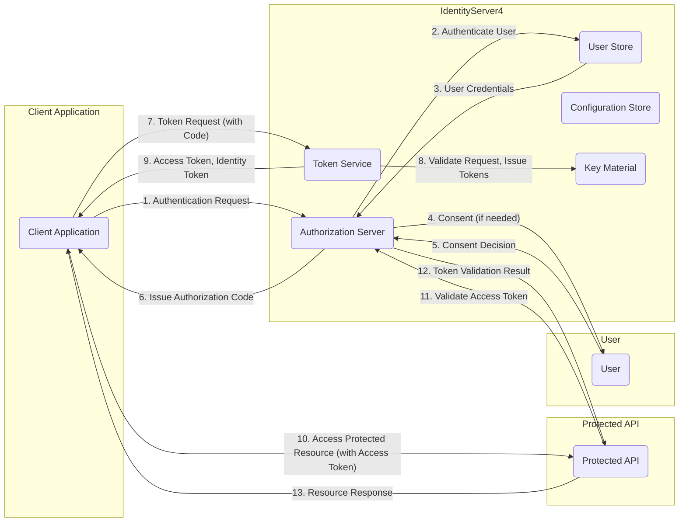

# Project Design Document: IdentityServer4

**Version:** 1.1
**Date:** October 26, 2023
**Author:** AI Software Architect

## 1. Introduction

This document provides a detailed architectural design of IdentityServer4, an open-source framework for ASP.NET Core that implements OpenID Connect and OAuth 2.0 protocols. This document serves as a foundation for subsequent threat modeling activities, providing a comprehensive understanding of the system's components, interactions, and data flows.

### 1.1. Purpose
*   To provide a comprehensive architectural overview of IdentityServer4 suitable for threat modeling.
*   To clearly define the key components, their responsibilities, and interactions within the system.
*   To highlight security boundaries and potential areas of risk.

### 1.2. Scope
*   This document covers the core architectural components and functionalities of IdentityServer4 as a framework.
*   It focuses on the logical architecture and key interactions between different parts of the system during standard authentication and authorization flows.
*   Configuration options are mentioned where they significantly impact the architecture or security.
*   Specific implementation details within consuming applications are outside the scope.

### 1.3. Target Audience
*   Security architects responsible for assessing the security of systems using IdentityServer4.
*   Threat modelers tasked with identifying potential vulnerabilities and attack vectors.
*   Developers building and maintaining applications that rely on IdentityServer4 for authentication and authorization.
*   Operations teams responsible for deploying and managing IdentityServer4 instances.

## 2. System Overview

IdentityServer4 acts as a standards-compliant OpenID Connect and OAuth 2.0 provider. It centralizes authentication and authorization logic, allowing applications to delegate these concerns to a trusted service. This improves security, simplifies application development, and enhances the user experience through single sign-on capabilities.

## 3. Architectural Design

The architecture of IdentityServer4 is modular, with distinct components working together to handle authentication and authorization requests.

### 3.1. Key Components
*   **Authorization Server ("Authorization Server")**: The core of IdentityServer4.
    *   Receives and processes authentication and authorization requests.
    *   Manages user sessions and consent.
    *   Issues security tokens (access tokens, identity tokens, refresh tokens).
    *   Exposes endpoints for token requests, authorization, and discovery.
*   **Clients ("Client Application")**: Applications that rely on IdentityServer4 for authentication and authorization.
    *   Represented by registered configurations within IdentityServer4.
    *   Can be web applications, mobile apps, single-page applications (SPAs), or machine-to-machine applications.
    *   Have specific configurations defining allowed grant types, redirect URIs, scopes, and secrets.
*   **Users ("User")**: Individuals or entities whose identities are managed by IdentityServer4.
    *   Their credentials and profile information are stored and managed within the **User Store**.
    *   Authenticated through various mechanisms configured within IdentityServer4.
*   **Identity Resources ("Identity Resource")**: Represent sets of user-related claims that clients can request.
    *   Examples include `profile`, `email`, and custom identity resources.
    *   Define the user information that can be included in identity tokens.
*   **API Resources ("API Resource")**: Represent APIs that are protected by IdentityServer4.
    *   Define the scopes required to access the API.
    *   The Authorization Server issues access tokens that grant clients permission to access these APIs.
*   **Token Service ("Token Service")**: Responsible for the creation and issuance of security tokens.
    *   Handles different token types based on the requested grant type and scopes.
    *   Signs tokens using configured **Key Material**.
*   **User Store ("User Store")**: The system responsible for storing and managing user credentials and profile information.
    *   Can be an internal database, an external identity provider (e.g., Active Directory, Azure AD), or a custom implementation.
    *   IdentityServer4 interacts with the **User Store** to authenticate users.
*   **Configuration Store ("Configuration Store")**: Stores the configuration data for IdentityServer4.
    *   Includes definitions for **Clients**, **API Resources**, and **Identity Resources**.
    *   Typically implemented using a database or in-memory storage for development.
*   **Key Material ("Key Material")**: Cryptographic keys used for signing and validating security tokens.
    *   Critical for the security and trust of the tokens.
    *   Should be securely stored and managed.

### 3.2. Logical Flow
The following outlines a typical authentication and authorization flow using the Authorization Code Grant:
1. A **Client Application** needs to access a protected resource on a **Protected API**.
2. The **Client Application** redirects the **User** to the **Authorization Server** with an authentication request.
3. The **Authorization Server** authenticates the **User** by interacting with the **User Store**.
4. The **Authorization Server** obtains consent from the **User** (if required) for the **Client Application** to access specific **Identity Resources** or **API Resources**.
5. The **Authorization Server** issues an authorization code to the **Client Application**.
6. The **Client Application** exchanges the authorization code for access and identity tokens by making a request to the **Token Service**.
7. The **Token Service** validates the request and issues security tokens (access token, identity token) signed with the **Key Material**.
8. The **Client Application** sends the access token to the **Protected API**.
9. The **Protected API** validates the access token with the **Authorization Server** (or by validating the signature using public keys).
10. If the token is valid and has the necessary scopes, the **Protected API** grants access to the requested resource.

### 3.3. Deployment Architecture
IdentityServer4 is a framework that is embedded within an ASP.NET Core application. Its deployment architecture depends on how the host application is deployed. Common deployment scenarios include:
*   **IIS (Internet Information Services)**: Suitable for on-premises Windows environments.
*   **Kestrel with a Reverse Proxy (e.g., Nginx, Apache)**: A common cross-platform deployment pattern.
*   **Cloud Platforms (e.g., Azure App Service, AWS Elastic Beanstalk, Google Cloud Run)**: Managed hosting environments.
*   **Containerized Environments (Docker, Kubernetes)**: Enables scalable and portable deployments.

### 3.4. Data Flow Diagram

## 4. Security Considerations

Security is paramount in an identity and access management system like IdentityServer4. Key considerations include:
*   **Authentication Mechanisms**:
    *   Support for various authentication methods (local accounts, social logins, federated identity providers).
    *   Configuration of strong password policies and multi-factor authentication (MFA).
*   **Authorization Flows**:
    *   Implementation of secure OAuth 2.0 grant types (Authorization Code Grant with PKCE recommended for SPAs and mobile apps).
    *   Proper validation of redirect URIs to prevent authorization code interception.
*   **Token Security**:
    *   Use of strong cryptographic algorithms for token signing (e.g., RS256).
    *   Secure storage and management of signing keys.
    *   Appropriate token lifetimes to minimize the window of opportunity for token theft.
    *   Protection against Cross-Site Scripting (XSS) to prevent token leakage.
*   **Data Protection**:
    *   Encryption of sensitive data at rest (e.g., client secrets, configuration data).
    *   Protection of data in transit using HTTPS.
*   **Consent Management**:
    *   Clear and granular consent screens for users to control data sharing.
    *   Auditing of consent decisions.
*   **Input Validation**:
    *   Rigorous validation of all inputs to prevent injection attacks.
*   **Logging and Auditing**:
    *   Comprehensive logging of authentication and authorization events for security monitoring and incident response.
*   **Rate Limiting and Denial of Service (DoS) Protection**:
    *   Implementation of rate limiting to prevent brute-force attacks and resource exhaustion.
*   **CORS (Cross-Origin Resource Sharing)**:
    *   Careful configuration of CORS policies to allow only trusted origins to interact with IdentityServer4.
*   **Content Security Policy (CSP)**:
    *   Configuration of CSP headers to mitigate XSS attacks.
*   **Client Secrets Management**:
    *   Secure storage and rotation of client secrets.
    *   Consider using more secure alternatives for public clients (e.g., PKCE).

## 5. Deployment Considerations
*   **Secure Key Management**:
    *   Utilize secure storage mechanisms for signing keys, such as Hardware Security Modules (HSMs) or Azure Key Vault.
    *   Implement key rotation policies.
*   **Secure Storage**:
    *   Encrypt the **Configuration Store** and **User Store** databases.
    *   Implement appropriate access controls to these stores.
*   **HTTPS Enforcement**:
    *   Ensure all communication with IdentityServer4 occurs over HTTPS.
    *   Configure HTTP Strict Transport Security (HSTS) headers.
*   **Regular Updates and Patching**:
    *   Keep IdentityServer4 and its dependencies up-to-date with the latest security patches.
*   **Monitoring and Alerting**:
    *   Implement monitoring for suspicious activity, failed login attempts, and configuration changes.
    *   Set up alerts for potential security breaches.
*   **Load Balancing and High Availability**:
    *   Deploy IdentityServer4 behind a load balancer for scalability and resilience.
    *   Consider a multi-instance deployment for high availability.
*   **Isolation**:
    *   Deploy IdentityServer4 in a secure network segment, isolated from less trusted applications.

## 6. Dependencies
IdentityServer4 relies on the following key technologies and libraries:
*   **ASP.NET Core**: The underlying web framework.
*   **.NET Standard Libraries**: Provides core functionalities.
*   **Microsoft.IdentityModel.\***: Libraries for handling JWTs and other security tokens.
*   **Entity Framework Core (Optional)**: For data persistence of configuration and operational data.
*   **Various NuGet Packages**: For logging, caching, and other supporting functionalities.

## 7. Conclusion
This document provides a detailed architectural blueprint of IdentityServer4, emphasizing its components, interactions, and crucial security considerations. This information is essential for conducting thorough threat modeling and implementing robust security measures. By understanding the architecture and potential vulnerabilities, security professionals and developers can effectively secure applications that rely on IdentityServer4 for authentication and authorization.