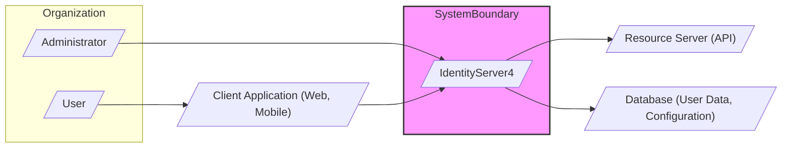

# BUSINESS POSTURE

- Business Priorities and Goals:
 - Secure Authentication and Authorization: IdentityServer4 aims to provide a robust and secure framework for managing authentication and authorization for modern applications and APIs.
 - Single Sign-On (SSO): It enables SSO across multiple applications, improving user experience and reducing authentication overhead.
 - Standards-Based:  Adherence to OpenID Connect and OAuth 2.0 standards ensures interoperability and security best practices.
 - Extensibility and Customization:  The framework is designed to be extensible and customizable to meet diverse business requirements.
 - Developer Productivity:  Provides a well-structured and documented framework, simplifying the implementation of security in applications.

- Business Risks:
 - Security Breaches: Vulnerabilities in IdentityServer4 or its configuration could lead to unauthorized access to applications and data.
 - Data Leaks: Misconfiguration or vulnerabilities could expose sensitive user data, such as credentials or personal information.
 - Service Unavailability: Downtime of IdentityServer4 can disrupt access to all applications relying on it.
 - Compliance Violations: Failure to properly implement and configure IdentityServer4 could lead to non-compliance with relevant regulations (e.g., GDPR, HIPAA).
 - Integration Issues:  Challenges in integrating IdentityServer4 with existing applications and infrastructure.
 - Complexity:  The complexity of identity and access management can lead to misconfigurations and security gaps if not properly managed.

# SECURITY POSTURE

- Existing Security Controls:
 - security control: Secure Software Development Lifecycle (SSDLC) - Implemented through GitHub repository practices, code reviews, and community contributions (Inferred from open-source nature and project maturity).
 - security control: Input Validation - Implemented within IdentityServer4 framework to validate requests and inputs (Described in IdentityServer4 documentation and code).
 - security control: Output Encoding - Implemented within IdentityServer4 framework to prevent output-based attacks like XSS (Described in IdentityServer4 documentation and code).
 - security control: Cryptography - Utilized for secure storage of secrets, token generation, and communication security (TLS) (Implemented within IdentityServer4 framework and underlying .NET platform).
 - security control: Authentication - Implemented by IdentityServer4 to authenticate users and clients (Core functionality of IdentityServer4).
 - security control: Authorization - Implemented by IdentityServer4 to authorize access to resources (Core functionality of IdentityServer4).
 - security control: Access Control - Implemented through scopes, claims, and policies within IdentityServer4 (Configurable within IdentityServer4).
 - security control: Security Audits - Likely performed by the IdentityServer4 team and community (Inferred from project maturity and security focus).
 - security control: Dependency Management - Utilizing NuGet package management to manage dependencies (Standard .NET practice).
 - security control: Regular Updates - Project is actively maintained with regular updates and security patches (Observed from GitHub repository activity).
 - accepted risk: Reliance on underlying infrastructure security - Assumes secure configuration and maintenance of the hosting environment (e.g., operating system, network, cloud provider).
 - accepted risk: Third-party dependency vulnerabilities - Potential vulnerabilities in NuGet packages used by IdentityServer4 (Mitigated by dependency management and updates).

- Recommended Security Controls:
 - security control: Automated Security Scanning - Implement automated SAST and DAST scanning in the CI/CD pipeline for IdentityServer4 and applications using it.
 - security control: Penetration Testing - Conduct regular penetration testing of IdentityServer4 deployments to identify vulnerabilities.
 - security control: Security Information and Event Management (SIEM) Integration - Integrate IdentityServer4 logs with a SIEM system for security monitoring and incident response.
 - security control: Web Application Firewall (WAF) - Deploy a WAF in front of IdentityServer4 to protect against common web attacks.
 - security control: Rate Limiting and Throttling - Implement rate limiting and throttling to prevent denial-of-service attacks and brute-force attempts.
 - security control: Security Awareness Training - Provide security awareness training to developers and operators working with IdentityServer4.
 - security control: Incident Response Plan - Develop and maintain an incident response plan specifically for IdentityServer4 related security incidents.

- Security Requirements:
 - Authentication:
  - Requirement: Support for multiple authentication methods (e.g., username/password, social logins, multi-factor authentication).
  - Requirement: Secure storage of user credentials using strong hashing algorithms.
  - Requirement: Protection against brute-force attacks and credential stuffing.
 - Authorization:
  - Requirement: Fine-grained authorization based on roles, claims, and policies.
  - Requirement: Support for different OAuth 2.0 flows and grant types.
  - Requirement: Secure enforcement of authorization policies.
 - Input Validation:
  - Requirement: Validate all inputs to prevent injection attacks (e.g., SQL injection, command injection, LDAP injection).
  - Requirement: Sanitize inputs to prevent cross-site scripting (XSS) attacks.
  - Requirement: Input validation should be applied on both client-side and server-side.
 - Cryptography:
  - Requirement: Use strong cryptographic algorithms and protocols for all sensitive operations.
  - Requirement: Secure key management practices for cryptographic keys.
  - Requirement: Protection of cryptographic keys from unauthorized access.
  - Requirement: Enforce HTTPS for all communication to protect data in transit.

# DESIGN

## C4 CONTEXT



- Context Diagram Elements:
 - Element:
  - Name: User
  - Type: Person
  - Description: End-users who access client applications and resources protected by IdentityServer4.
  - Responsibilities: Authenticating to access applications and resources.
  - Security controls: User authentication mechanisms (e.g., username/password, MFA) implemented by Client Application and IdentityServer4.
 - Element:
  - Name: Administrator
  - Type: Person
  - Description: Administrators responsible for configuring and managing IdentityServer4.
  - Responsibilities: Configuring clients, users, scopes, and other settings in IdentityServer4. Monitoring system health and security.
  - Security controls: Strong authentication for admin access to IdentityServer4, Role-Based Access Control (RBAC) within IdentityServer4 admin interface, audit logging of admin actions.
 - Element:
  - Name: Client Application
  - Type: Software System
  - Description: Applications (web, mobile, desktop) that rely on IdentityServer4 for user authentication and authorization.
  - Responsibilities: Redirecting users to IdentityServer4 for authentication, requesting access tokens, using access tokens to access protected resources.
  - Security controls: Secure storage of client secrets, proper implementation of OAuth 2.0 flows, input validation, protection against XSS and CSRF.
 - Element:
  - Name: Resource Server (API)
  - Type: Software System
  - Description: APIs that are protected by IdentityServer4 and require valid access tokens to access resources.
  - Responsibilities: Validating access tokens issued by IdentityServer4, enforcing authorization policies, providing protected resources.
  - Security controls: Token validation, authorization checks based on scopes and claims, input validation, protection against API-specific attacks.
 - Element:
  - Name: Database
  - Type: Data Store
  - Description: Database used by IdentityServer4 to store configuration data (clients, scopes, users, etc.) and operational data (tokens, grants).
  - Responsibilities: Persisting and retrieving IdentityServer4 data, ensuring data integrity and availability.
  - Security controls: Database access controls, encryption at rest and in transit, regular backups, vulnerability management for database system.
 - Element:
  - Name: IdentityServer4
  - Type: Software System
  - Description: The Identity and Access Management system responsible for authentication and authorization.
  - Responsibilities: Authenticating users and clients, issuing access tokens, managing user sessions, providing endpoints for token issuance and revocation, providing admin interface for configuration.
  - Security controls: All security controls listed in the SECURITY POSTURE section, secure configuration, regular security updates, monitoring and logging.

## C4 CONTAINER

```mermaid
flowchart LR
    subgraph "IdentityServer4 System"
        WebApp[/"Web Application"/]
        AdminUI[/"Admin UI"/]
        TokenService[/"Token Service API"/]
        UserService[/"User Service API"/]
        ConfigurationStore[/"Configuration Store (Database)"/]
        OperationalStore[/"Operational Store (Database)"/]
    end

    WebApp -- "HTTPS" --> TokenService
    WebApp -- "HTTPS" --> UserService
    AdminUI -- "HTTPS" --> TokenService
    AdminUI -- "HTTPS" --> UserService
    TokenService --> ConfigurationStore
    TokenService --> OperationalStore
    UserService --> ConfigurationStore
    UserService --> OperationalStore

    style "IdentityServer4 System" fill:#f9f,stroke:#333,stroke-width:2px
```

- Container Diagram Elements:
 - Element:
  - Name: Web Application
  - Type: Web Application
  - Description: The main web application component of IdentityServer4, handling user interactions, UI rendering, and core logic.
  - Responsibilities: Handling user login and logout flows, rendering UI for consent and other interactions, coordinating with Token Service and User Service.
  - Security controls: Input validation, output encoding, session management, protection against web application vulnerabilities, HTTPS enforcement.
 - Element:
  - Name: Admin UI
  - Type: Web Application
  - Description: Web-based administrative interface for managing IdentityServer4 configuration.
  - Responsibilities: Providing UI for managing clients, users, scopes, claims, and other IdentityServer4 settings.
  - Security controls: Strong authentication and authorization for admin access, RBAC, audit logging of admin actions, input validation, output encoding, HTTPS enforcement.
 - Element:
  - Name: Token Service API
  - Type: API Application
  - Description: API endpoints responsible for issuing, validating, and revoking tokens (access tokens, refresh tokens, ID tokens). Implements OAuth 2.0 and OpenID Connect protocols.
  - Responsibilities: Handling token requests, issuing tokens based on authentication and authorization, validating tokens, managing token lifecycle.
  - Security controls: Secure token generation and validation, protection of signing keys, rate limiting, input validation, HTTPS enforcement.
 - Element:
  - Name: User Service API
  - Type: API Application
  - Description: API endpoints for managing user accounts, profiles, and authentication-related user data.
  - Responsibilities: User registration, login, password management, profile management, user lookup, MFA management.
  - Security controls: Secure user data storage, strong password hashing, input validation, protection against account enumeration and brute-force attacks, HTTPS enforcement.
 - Element:
  - Name: Configuration Store (Database)
  - Type: Database
  - Description: Database storing IdentityServer4 configuration data, such as clients, scopes, identity resources, API resources, and persisted grants configuration.
  - Responsibilities: Persistent storage of configuration data, providing data to Token Service and User Service.
  - Security controls: Database access controls, encryption at rest and in transit, regular backups, vulnerability management for database system.
 - Element:
  - Name: Operational Store (Database)
  - Type: Database
  - Description: Database storing operational data, such as issued tokens, consent grants, device flow codes, and persisted grants runtime data.
  - Responsibilities: Persistent storage of operational data, supporting token management and session management.
  - Security controls: Database access controls, encryption at rest and in transit, regular backups, vulnerability management for database system, data retention policies.

## DEPLOYMENT

- Deployment Options:
 - On-Premises Deployment: Deploying IdentityServer4 on organization-managed infrastructure (servers, VMs).
 - Cloud Deployment (IaaS): Deploying IdentityServer4 on cloud provider infrastructure (e.g., AWS EC2, Azure VMs, GCP Compute Engine).
 - Cloud Deployment (PaaS/Containers): Deploying IdentityServer4 as containerized application on cloud PaaS or container orchestration platforms (e.g., Azure App Service, AWS ECS/EKS, GCP Cloud Run/GKE).

- Detailed Deployment (Cloud Deployment - PaaS/Containers):

```mermaid
flowchart LR
    subgraph "Cloud Provider (e.g., Azure, AWS, GCP)"
        subgraph "Load Balancer"
            LoadBalancer[/"Load Balancer"/]
        end
        subgraph "Compute Service (e.g., Kubernetes, App Service)"
            Instance1[/"IdentityServer4 Instance 1"/]
            Instance2[/"IdentityServer4 Instance 2"/]
            InstanceN[/"IdentityServer4 Instance N"/]
        end
        subgraph "Database Service (e.g., Azure SQL, AWS RDS, GCP Cloud SQL)"
            ConfigurationDatabase[/"Configuration Database"/]
            OperationalDatabase[/"Operational Database"/]
        end
        subgraph "Monitoring & Logging"
            MonitoringService[/"Monitoring Service"/]
            LoggingService[/"Logging Service"/]
        end
    end

    LoadBalancer --> Instance1
    LoadBalancer --> Instance2
    LoadBalancer --> InstanceN
    Instance1 --> ConfigurationDatabase
    Instance1 --> OperationalDatabase
    Instance2 --> ConfigurationDatabase
    Instance2 --> OperationalDatabase
    InstanceN --> ConfigurationDatabase
    InstanceN --> OperationalDatabase
    Instance1 --> MonitoringService
    Instance1 --> LoggingService
    Instance2 --> MonitoringService
    Instance2 --> LoggingService
    InstanceN --> MonitoringService
    InstanceN --> LoggingService

    style "Cloud Provider (e.g., Azure, AWS, GCP)" fill:#f9f,stroke:#333,stroke-width:2px
```

- Deployment Diagram Elements:
 - Element:
  - Name: Load Balancer
  - Type: Infrastructure Component
  - Description: Distributes incoming traffic across multiple IdentityServer4 instances for high availability and scalability.
  - Responsibilities: Traffic distribution, health checks, SSL termination.
  - Security controls: SSL/TLS configuration, DDoS protection, access control lists.
 - Element:
  - Name: IdentityServer4 Instance (1, 2, N)
  - Type: Container/VM Instance
  - Description: Instances of the IdentityServer4 application running in containers or VMs.
  - Responsibilities: Handling authentication and authorization requests, serving the web application and APIs.
  - Security controls: Container/VM image security, runtime security configurations, network segmentation, regular patching, security monitoring.
 - Element:
  - Name: Configuration Database
  - Type: Managed Database Service
  - Description: Managed database service (e.g., Azure SQL, AWS RDS, GCP Cloud SQL) for storing IdentityServer4 configuration data.
  - Responsibilities: Persistent storage of configuration data, high availability, backups, database management.
  - Security controls: Database access controls, encryption at rest and in transit, regular patching, vulnerability management provided by cloud provider.
 - Element:
  - Name: Operational Database
  - Type: Managed Database Service
  - Description: Managed database service for storing IdentityServer4 operational data (tokens, grants).
  - Responsibilities: Persistent storage of operational data, high availability, backups, database management.
  - Security controls: Database access controls, encryption at rest and in transit, regular patching, vulnerability management provided by cloud provider, data retention policies.
 - Element:
  - Name: Monitoring Service
  - Type: Monitoring Service
  - Description: Cloud-based monitoring service for collecting metrics and health status of IdentityServer4 instances and infrastructure.
  - Responsibilities: Monitoring application and infrastructure health, alerting on anomalies, performance monitoring.
  - Security controls: Secure access to monitoring data, audit logging of monitoring activities.
 - Element:
  - Name: Logging Service
  - Type: Logging Service
  - Description: Cloud-based logging service for collecting and analyzing logs from IdentityServer4 instances and infrastructure.
  - Responsibilities: Centralized logging, log analysis, security event detection, audit logging.
  - Security controls: Secure log storage, access controls to logs, log integrity, data retention policies.

## BUILD

```mermaid
flowchart LR
    subgraph "Developer Workstation"
        Developer[/"Developer"/]
        CodeEditor[/"Code Editor"/]
    end
    subgraph "Version Control (GitHub)"
        GitHub[/"GitHub Repository"/]
    end
    subgraph "CI/CD Pipeline (GitHub Actions)"
        CI[/"CI Server (GitHub Actions)"/]
        BuildAgent[/"Build Agent"/]
        Compiler[/"Compiler (.NET SDK)"/]
        TestRunner[/"Test Runner"/]
        SASTScanner[/"SAST Scanner"/]
        DependencyScanner[/"Dependency Scanner"/]
        ArtifactStorage[/"Artifact Storage"/]
    end

    Developer -- "Code Changes" --> CodeEditor
    CodeEditor -- "Commit & Push" --> GitHub
    GitHub -- "Webhook" --> CI
    CI --> BuildAgent
    BuildAgent -- "Checkout Code" --> GitHub
    BuildAgent -- "Compile Code" --> Compiler
    BuildAgent -- "Run Tests" --> TestRunner
    BuildAgent -- "Run SAST Scan" --> SASTScanner
    BuildAgent -- "Run Dependency Scan" --> DependencyScanner
    BuildAgent -- "Build Artifacts" --> ArtifactStorage
    ArtifactStorage -- "Publish Artifacts" --> DeploymentEnvironment[/"Deployment Environment"/]

    style "Developer Workstation" fill:#ccf,stroke:#333,stroke-width:1px
    style "Version Control (GitHub)" fill:#ccf,stroke:#333,stroke-width:1px
    style "CI/CD Pipeline (GitHub Actions)" fill:#f9f,stroke:#333,stroke-width:2px
```

- Build Process Elements:
 - Element:
  - Name: Developer
  - Type: Person
  - Description: Software developer working on IdentityServer4 project or applications using it.
  - Responsibilities: Writing code, committing changes, creating pull requests.
  - Security controls: Secure workstation, code review participation, security awareness training.
 - Element:
  - Name: Code Editor
  - Type: Software Application
  - Description: Integrated Development Environment (IDE) or code editor used by developers.
  - Responsibilities: Code editing, local testing, code analysis.
  - Security controls: Code editor security features, plugins for security analysis, secure configuration.
 - Element:
  - Name: GitHub Repository
  - Type: Version Control System
  - Description: GitHub repository hosting the IdentityServer4 source code.
  - Responsibilities: Source code management, version control, collaboration, pull request management.
  - Security controls: Access controls, branch protection, code review enforcement, vulnerability scanning of repository.
 - Element:
  - Name: CI Server (GitHub Actions)
  - Type: Automation Service
  - Description: GitHub Actions used for continuous integration and continuous delivery.
  - Responsibilities: Automating build, test, and deployment pipelines, orchestrating build agents.
  - Security controls: Secure configuration of CI pipelines, access controls to CI/CD configurations, audit logging of CI/CD activities.
 - Element:
  - Name: Build Agent
  - Type: Compute Instance
  - Description: Virtual machine or container executing build steps in the CI/CD pipeline.
  - Responsibilities: Checking out code, compiling code, running tests, performing security scans, building artifacts.
  - Security controls: Secure build environment, hardened operating system, minimal software installed, regular patching.
 - Element:
  - Name: Compiler (.NET SDK)
  - Type: Software Tool
  - Description: .NET SDK used to compile IdentityServer4 source code.
  - Responsibilities: Compiling source code into executable binaries.
  - Security controls: Using trusted and verified compiler versions, compiler security features.
 - Element:
  - Name: Test Runner
  - Type: Software Tool
  - Description: Tool used to execute automated unit tests and integration tests.
  - Responsibilities: Running tests, reporting test results, ensuring code quality.
  - Security controls: Secure test execution environment, test data management.
 - Element:
  - Name: SAST Scanner
  - Type: Security Tool
  - Description: Static Application Security Testing (SAST) scanner to analyze source code for security vulnerabilities.
  - Responsibilities: Identifying potential security vulnerabilities in code, reporting findings.
  - Security controls: Regularly updated vulnerability rules, accurate vulnerability detection, integration with CI/CD pipeline.
 - Element:
  - Name: Dependency Scanner
  - Type: Security Tool
  - Description: Tool to scan project dependencies for known vulnerabilities.
  - Responsibilities: Identifying vulnerable dependencies, reporting findings, ensuring dependency security.
  - Security controls: Regularly updated vulnerability database, accurate vulnerability detection, integration with CI/CD pipeline.
 - Element:
  - Name: Artifact Storage
  - Type: Storage Service
  - Description: Storage location for build artifacts (e.g., NuGet packages, container images).
  - Responsibilities: Secure storage of build artifacts, versioning, artifact management.
  - Security controls: Access controls, encryption at rest and in transit, integrity checks, vulnerability scanning of artifacts.
 - Element:
  - Name: Deployment Environment
  - Type: Target Environment
  - Description: Target environment where IdentityServer4 is deployed (e.g., staging, production).
  - Responsibilities: Running IdentityServer4 application, providing runtime environment.
  - Security controls: Deployment environment security controls as described in DEPLOYMENT section.

# RISK ASSESSMENT

- Critical Business Processes:
 - User Authentication: Verifying the identity of users accessing applications and resources.
 - User Authorization: Controlling access to resources based on user identity and permissions.
 - Single Sign-On (SSO): Providing seamless access to multiple applications with a single login.
 - API Security: Securing APIs and protecting sensitive data exposed through APIs.
 - Identity and Access Management: Centralized management of user identities, roles, and permissions.

- Data Sensitivity:
 - User Credentials (Passwords, MFA secrets): Highly Sensitive - Confidentiality and integrity are critical. Unauthorized access or compromise can lead to account takeover and data breaches.
 - User Personal Data (Name, Email, Profile Information): Sensitive - Confidentiality is important to protect user privacy and comply with regulations like GDPR.
 - Client Secrets: Highly Sensitive - Confidentiality is critical. Compromise can lead to unauthorized access to IdentityServer4 and protected resources.
 - Configuration Data (Clients, Scopes, Resources): Sensitive - Integrity and availability are important for proper functioning of IdentityServer4.
 - Audit Logs: Sensitive - Integrity and availability are important for security monitoring and incident response.
 - Access Tokens and Refresh Tokens: Sensitive - Confidentiality is important to prevent unauthorized access to resources.

# QUESTIONS & ASSUMPTIONS

- Questions:
 - What are the specific regulatory compliance requirements for the organization using IdentityServer4 (e.g., GDPR, HIPAA, PCI DSS)?
 - What is the expected scale and performance requirements for IdentityServer4 deployment?
 - What are the specific authentication methods and identity providers that need to be supported?
 - What are the integration requirements with existing identity management systems or directories?
 - What is the organization's risk appetite and tolerance for security vulnerabilities?
 - What are the specific monitoring and logging requirements for security and operational purposes?
 - What is the incident response process in case of a security breach or service disruption?

- Assumptions:
 - IdentityServer4 will be deployed in a cloud environment using containers and managed database services.
 - Standard security best practices will be followed for infrastructure and application configuration.
 - Regular security updates and patching will be applied to IdentityServer4 and its dependencies.
 - Security monitoring and logging will be implemented to detect and respond to security incidents.
 - Developers and operators have basic security awareness training.
 - The organization has a defined incident response plan, which will be extended to cover IdentityServer4.