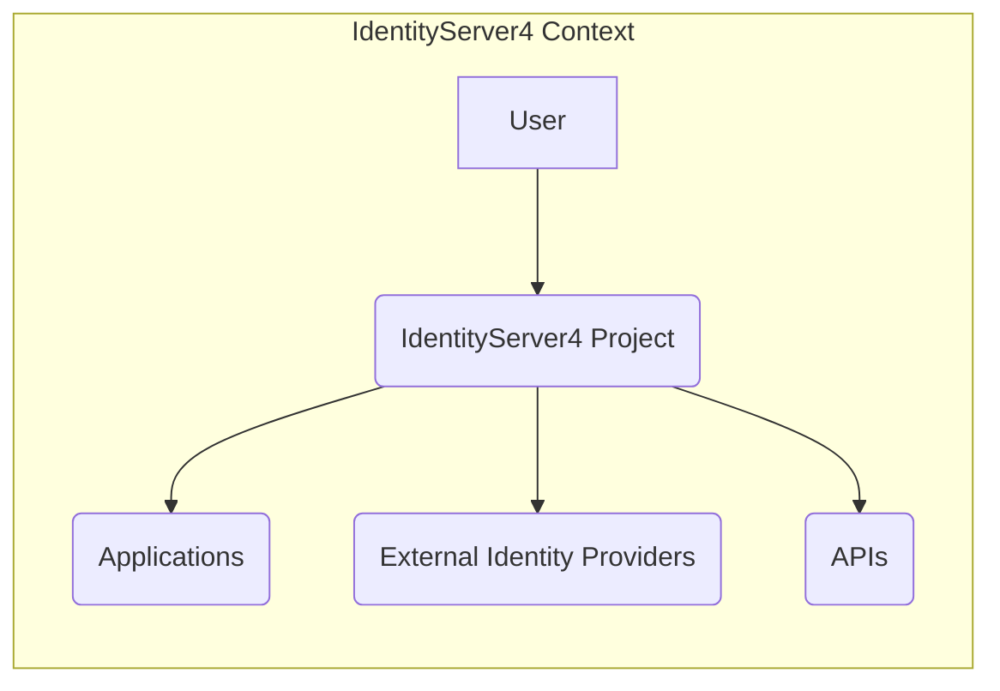
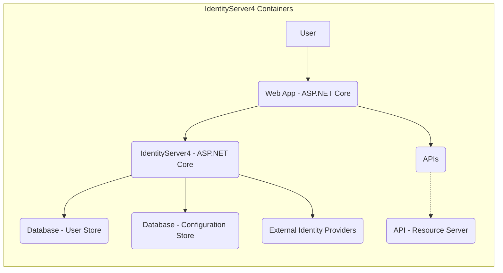
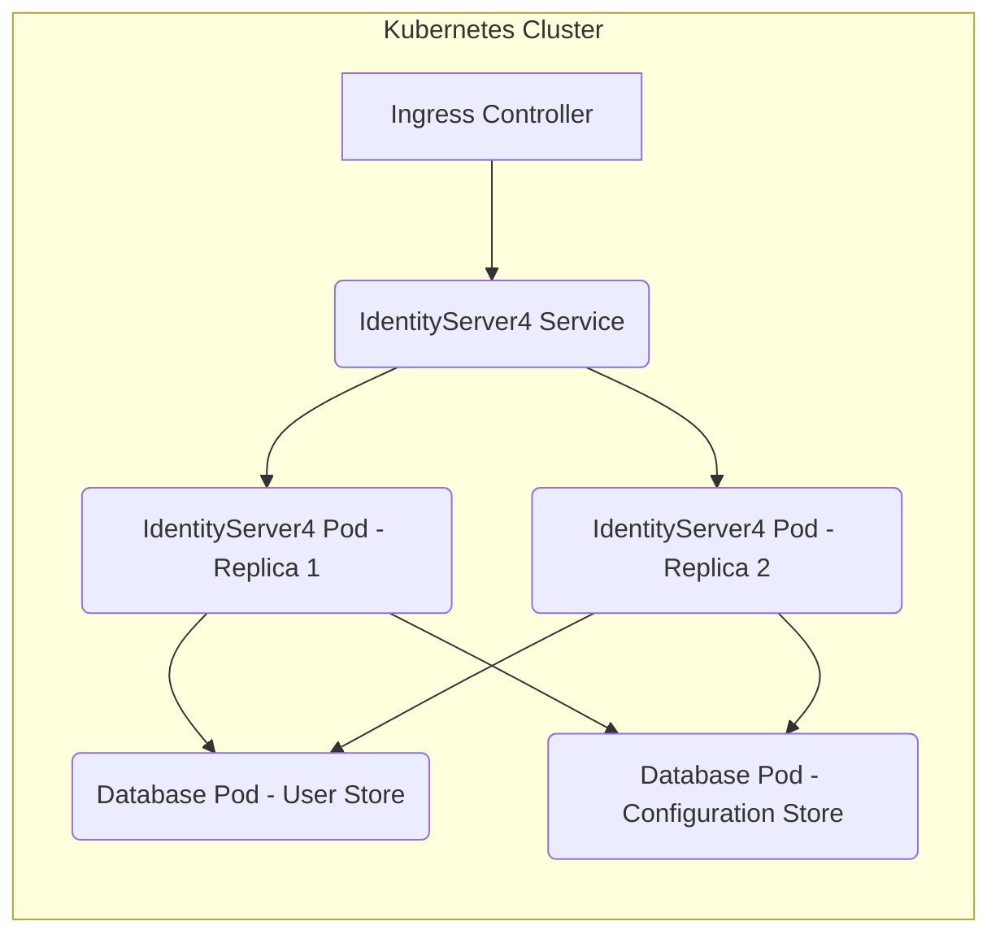
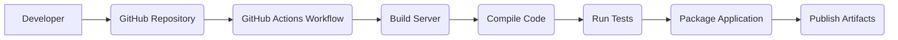

Okay, let's create a design document for the IdentityServer4 project.

# BUSINESS POSTURE

IdentityServer4 is a widely used OpenID Connect and OAuth 2.0 framework for ASP.NET Core. It's designed to provide a centralized authentication and authorization service for web applications, APIs, and mobile apps.

Priorities:

*   Provide a standards-compliant and secure implementation of OpenID Connect and OAuth 2.0.
*   Enable single sign-on (SSO) across multiple applications.
*   Protect APIs and resources with access tokens.
*   Offer extensibility to accommodate various authentication and authorization scenarios.
*   Maintain a high level of security and protect user data.
*   Provide good developer experience.

Goals:

*   Become the go-to solution for implementing OpenID Connect and OAuth 2.0 in ASP.NET Core applications.
*   Maintain a strong community and ecosystem.
*   Continuously improve security and performance.

Business Risks:

*   Vulnerabilities in the framework could lead to unauthorized access to applications and user data.
*   Incorrect implementation or configuration by developers could expose security flaws.
*   Lack of maintenance or updates could make the framework vulnerable to new threats.
*   Competition from other identity providers could reduce adoption.
*   Failure to comply with relevant regulations (e.g., GDPR) could result in legal and financial penalties.

# SECURITY POSTURE

Existing Security Controls:

*   security control: Implements industry-standard protocols (OpenID Connect and OAuth 2.0) with built-in security features. (Described in the official specification of those protocols and implemented in the code).
*   security control: Supports various grant types, including authorization code flow with PKCE, client credentials, and resource owner password credentials (with appropriate warnings). (Described in documentation and implemented in the code).
*   security control: Provides mechanisms for token validation and revocation. (Described in documentation and implemented in the code).
*   security control: Allows configuration of allowed scopes and claims. (Described in documentation and implemented in the code).
*   security control: Supports HTTPS for secure communication. (Described in documentation and implemented in the code).
*   security control: Offers options for signing and encrypting tokens. (Described in documentation and implemented in the code).
*   security control: Provides extensibility points for custom security logic. (Described in documentation and implemented in the code).
*   security control: Regular security audits and penetration testing (assumed, but should be explicitly stated in the project's security documentation).
*   security control: Dependency management to address vulnerabilities in third-party libraries. (Visible in the project's dependency files).

Accepted Risks:

*   accepted risk: Reliance on developers to correctly configure and use the framework.
*   accepted risk: Potential for vulnerabilities in third-party libraries used by IdentityServer4.
*   accepted risk: The framework itself is no longer actively maintained (since 2022), increasing the risk of unpatched vulnerabilities over time.

Recommended Security Controls:

*   security control: Implement a robust vulnerability disclosure program.
*   security control: Provide clear and comprehensive security guidance for developers.
*   security control: Conduct regular security training for the development team.
*   security control: Integrate static and dynamic application security testing (SAST and DAST) into the CI/CD pipeline.
*   security control: Implement a Content Security Policy (CSP) to mitigate XSS attacks.
*   security control: Implement robust logging and monitoring to detect and respond to security incidents.

Security Requirements:

*   Authentication:
    *   Support for multi-factor authentication (MFA).
    *   Secure storage of user credentials (e.g., using hashing and salting).
    *   Protection against brute-force attacks.
    *   Account lockout mechanisms.
*   Authorization:
    *   Fine-grained access control based on roles and permissions.
    *   Support for different authorization models (e.g., RBAC, ABAC).
    *   Secure handling of authorization codes and access tokens.
*   Input Validation:
    *   Validation of all user inputs to prevent injection attacks (e.g., SQL injection, XSS).
    *   Strict validation of redirect URIs.
    *   Enforcement of input length and format restrictions.
*   Cryptography:
    *   Use of strong, industry-standard cryptographic algorithms.
    *   Secure key management practices.
    *   Protection of sensitive data in transit and at rest.
    *   Regular review and update of cryptographic configurations.

# DESIGN

## C4 CONTEXT

Element Descriptions:

*   Element:
    *   Name: User
    *   Type: Person
    *   Description: A person who interacts with applications and APIs secured by IdentityServer4.
    *   Responsibilities: Authenticates with IdentityServer4, grants consent for applications to access resources.
    *   Security controls: Strong passwords, MFA (if enabled).

*   Element:
    *   Name: IdentityServer4 Project
    *   Type: Software System
    *   Description: The OpenID Connect and OAuth 2.0 framework.
    *   Responsibilities: Issues and validates tokens, manages user authentication and authorization, provides endpoints for OpenID Connect and OAuth 2.0 flows.
    *   Security controls: Implements OpenID Connect and OAuth 2.0 specifications, token validation, HTTPS, signing and encryption of tokens.

*   Element:
    *   Name: Applications
    *   Type: Software System
    *   Description: Web applications, mobile apps, or SPAs that rely on IdentityServer4 for authentication and authorization.
    *   Responsibilities: Redirects users to IdentityServer4 for login, requests tokens, uses tokens to access APIs.
    *   Security controls: Securely stores client secrets, validates tokens, uses HTTPS.

*   Element:
    *   Name: External Identity Providers
    *   Type: Software System
    *   Description: Third-party identity providers (e.g., Google, Facebook) that IdentityServer4 can integrate with.
    *   Responsibilities: Authenticates users, provides user information to IdentityServer4.
    *   Security controls: Implements secure authentication protocols (e.g., OpenID Connect, SAML).

*   Element:
    *   Name: APIs
    *   Type: Software System
    *   Description: APIs that are protected by IdentityServer4.
    *   Responsibilities: Provides access to resources based on valid access tokens.
    *   Security controls: Validates access tokens, enforces authorization policies.

## C4 CONTAINER

Element Descriptions:

*   Element:
    *   Name: User
    *   Type: Person
    *   Description: A person who interacts with the web application.
    *   Responsibilities: Authenticates with IdentityServer4, grants consent.
    *   Security controls: Strong passwords, MFA (if enabled).

*   Element:
    *   Name: Web App - ASP.NET Core
    *   Type: Web Application
    *   Description: The client application that uses IdentityServer4.
    *   Responsibilities: Initiates authentication requests, handles redirects, receives and validates tokens.
    *   Security controls: Securely stores client secrets, validates tokens, uses HTTPS.

*   Element:
    *   Name: IdentityServer4 - ASP.NET Core
    *   Type: Web Application
    *   Description: The IdentityServer4 implementation running on ASP.NET Core.
    *   Responsibilities: Handles OpenID Connect and OAuth 2.0 flows, issues and validates tokens, manages user sessions.
    *   Security controls: Implements OpenID Connect and OAuth 2.0 specifications, token validation, HTTPS, signing and encryption of tokens.

*   Element:
    *   Name: Database - User Store
    *   Type: Database
    *   Description: Stores user information (e.g., usernames, passwords, claims).
    *   Responsibilities: Provides user data for authentication and authorization.
    *   Security controls: Secure storage of credentials (hashing, salting), access control, encryption at rest (if applicable).

*   Element:
    *   Name: Database - Configuration Store
    *   Type: Database
    *   Description: Stores IdentityServer4 configuration data (e.g., clients, scopes, resources).
    *   Responsibilities: Provides configuration data for IdentityServer4.
    *   Security controls: Access control, encryption at rest (if applicable).

*   Element:
    *   Name: External Identity Providers
    *   Type: Software System
    *   Description: Third-party identity providers.
    *   Responsibilities: Authenticates users, provides user information.
    *   Security controls: Implements secure authentication protocols.

*   Element:
    *   Name: APIs
    *   Type: Web Application
    *   Description: The client application that uses IdentityServer4.
    *   Responsibilities: Initiates authentication requests, handles redirects, receives and validates tokens.
    *   Security controls: Securely stores client secrets, validates tokens, uses HTTPS.

*   Element:
    *   Name: API - Resource Server
    *   Type: Web API
    *   Description: An API protected by IdentityServer4.
    *   Responsibilities: Validates access tokens, provides access to resources.
    *   Security controls: Token validation, authorization policies.

## DEPLOYMENT

Possible Deployment Solutions:

1.  Standalone deployment on a virtual machine or physical server.
2.  Deployment to a container orchestration platform (e.g., Kubernetes, Docker Swarm).
3.  Deployment to a cloud platform's PaaS offering (e.g., Azure App Service, AWS Elastic Beanstalk).

Chosen Solution (for detailed description): Deployment to Kubernetes.

Element Descriptions:

*   Element:
    *   Name: Ingress Controller
    *   Type: Load Balancer
    *   Description: Exposes the IdentityServer4 service to external traffic.
    *   Responsibilities: Routes incoming requests to the IdentityServer4 service.
    *   Security controls: TLS termination, potentially a Web Application Firewall (WAF).

*   Element:
    *   Name: IdentityServer4 Service
    *   Type: Kubernetes Service
    *   Description: A Kubernetes service that provides a stable endpoint for accessing the IdentityServer4 pods.
    *   Responsibilities: Load balances traffic across the IdentityServer4 pods.
    *   Security controls: Network policies to restrict traffic.

*   Element:
    *   Name: IdentityServer4 Pod - Replica 1 & 2
    *   Type: Container
    *   Description: A pod running the IdentityServer4 application container. Multiple replicas provide high availability.
    *   Responsibilities: Handles OpenID Connect and OAuth 2.0 flows, issues and validates tokens.
    *   Security controls: Container image security scanning, least privilege principle, resource limits.

*   Element:
    *   Name: Database Pod - User Store
    *   Type: Container
    *   Description: A pod running the database for user information.
    *   Responsibilities: Stores and retrieves user data.
    *   Security controls: Database security best practices (e.g., strong passwords, encryption, access control).

*   Element:
    *   Name: Database Pod - Configuration Store
    *   Type: Container
    *   Description: A pod running the database for IdentityServer4 configuration.
    *   Responsibilities: Stores and retrieves configuration data.
    *   Security controls: Database security best practices.

## BUILD

The build process for IdentityServer4 involves compiling the source code, running tests, and packaging the application for deployment. Since IdentityServer4 is open-source and hosted on GitHub, it likely uses GitHub Actions for CI/CD.

Security Controls in the Build Process:

*   security control: Code review: All code changes are reviewed by other developers before merging. (GitHub Pull Requests).
*   security control: Static analysis: SAST tools (e.g., SonarQube) are used to identify potential security vulnerabilities in the code. (Can be integrated into GitHub Actions).
*   security control: Dependency scanning: Tools like Dependabot are used to identify and update vulnerable dependencies. (GitHub feature).
*   security control: Automated testing: Unit and integration tests are run to ensure code quality and prevent regressions. (GitHub Actions).
*   security control: Build automation: The entire build process is automated using GitHub Actions, reducing the risk of manual errors.
*   security control: Artifact signing: Build artifacts (e.g., NuGet packages) can be signed to ensure their integrity.

# RISK ASSESSMENT

Critical Business Processes:

*   User authentication and authorization.
*   Single sign-on (SSO) across applications.
*   API protection.
*   Management of user identities and access.

Data Sensitivity:

*   User credentials (usernames, passwords, etc.): Highly sensitive.
*   Personally Identifiable Information (PII): Sensitive, subject to regulations like GDPR.
*   Access tokens and refresh tokens: Highly sensitive, as they grant access to resources.
*   Client secrets: Highly sensitive, as they authenticate applications.
*   Configuration data (clients, scopes, resources): Moderately sensitive, as it defines the security policies.

# QUESTIONS & ASSUMPTIONS

Questions:

*   What specific security audits and penetration tests have been conducted on IdentityServer4?
*   What is the process for handling security vulnerabilities reported by the community?
*   What are the specific cryptographic algorithms and key management practices used?
*   Are there any specific compliance requirements (e.g., HIPAA, PCI DSS) that need to be considered?
*   What monitoring and logging capabilities are in place to detect and respond to security incidents?
*   What is the disaster recovery plan for IdentityServer4?

Assumptions:

*   BUSINESS POSTURE: The organization deploying IdentityServer4 has a basic understanding of security best practices.
*   SECURITY POSTURE: The underlying infrastructure (e.g., operating systems, databases) is properly secured.
*   DESIGN: Developers will follow secure coding practices when integrating with IdentityServer4.
*   DESIGN: The deployment environment will be configured with appropriate network security controls.
*   DESIGN: Regular backups of the databases will be performed.
*   DESIGN: IdentityServer4 is no longer actively maintained.