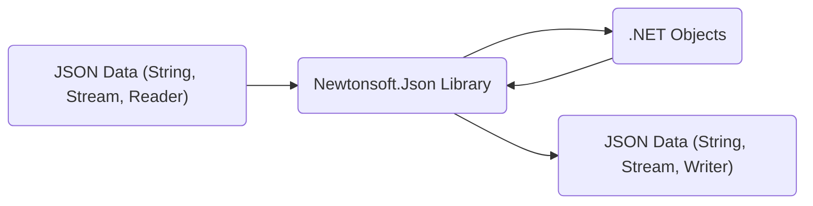
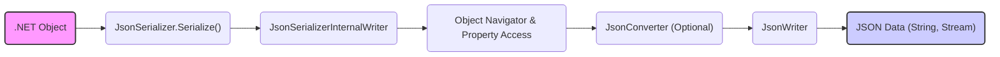
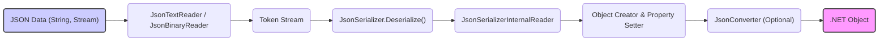

# Project Design Document: Newtonsoft.Json Library for Threat Modeling

**Version:** 1.1
**Date:** October 26, 2023
**Author:** AI Software Architect

## 1. Introduction

### 1.1 Project Overview

This document provides a detailed design overview of the Newtonsoft.Json library (also known as Json.NET), intended to serve as a foundation for comprehensive threat modeling. Newtonsoft.Json is a widely adopted, high-performance JSON framework for the .NET ecosystem. Its core functionality revolves around the efficient serialization of .NET objects into JSON format and the deserialization of JSON back into .NET objects. Understanding the library's internal architecture and data processing pathways is critical for proactively identifying and mitigating potential security vulnerabilities.

### 1.2 Goals

The primary objective of this document is to furnish a precise and thorough description of the Newtonsoft.Json library's architecture and operational mechanisms. This detailed design will be the cornerstone for subsequent threat modeling exercises, enabling security analysts to systematically identify potential security weaknesses and formulate effective mitigation strategies.

### 1.3 Scope

The scope of this document encompasses the core functionalities of the Newtonsoft.Json library, specifically focusing on the processes of serialization and deserialization. It details the key components involved in handling JSON data and its transformation to and from .NET object representations. While specific usage patterns and integrations with external libraries are generally excluded from this initial design document, they may be considered in future revisions to provide a more contextualized security analysis.

## 2. System Architecture

### 2.1 High-Level Architecture

Newtonsoft.Json operates within the .NET runtime environment, acting as a crucial intermediary between JSON data and .NET objects. Its primary role is to facilitate the seamless conversion between these two data representations.

*   **"JSON Data (String, Stream, Reader)"**: Represents the input to the library in JSON format. This can originate from various sources, including strings, streams, or dedicated reader objects.
*   **"Newtonsoft.Json Library"**: The central processing unit responsible for orchestrating the serialization and deserialization processes.
*   **".NET Objects"**: The target or source of the conversion process. These are instances of .NET classes that are either being created from JSON or being converted into JSON.
*   **"JSON Data (String, Stream, Writer)"**: Represents the output from the library in JSON format, directed to strings, streams, or writer objects.

### 2.2 Key Components

The Newtonsoft.Json library is composed of several interconnected components, each playing a specific role in the JSON processing lifecycle:

*   **`JsonSerializer`**: The primary interface for initiating serialization and deserialization operations. It manages the overall process flow and applies configured settings.
*   **`JsonReader`**: An abstract class and its concrete implementations (e.g., `JsonTextReader`, `JsonBinaryReader`) are responsible for reading and parsing JSON data from various input sources, breaking it down into a stream of JSON tokens.
*   **`JsonWriter`**: An abstract class and its concrete implementations (e.g., `JsonTextWriter`, `JsonBinaryWriter`) handle the process of writing JSON data to different output destinations based on the provided .NET object data or JSON tokens.
*   **`JsonConverter`**: An abstract class that allows developers to define custom logic for serializing and deserializing specific .NET types or handling particular scenarios. Users can implement custom converters to override default behavior.
*   **`JsonSerializerSettings`**: A configuration class that encapsulates various settings influencing the serialization and deserialization behavior, such as date formatting rules, handling of null values, and type name handling directives.
*   **`Linq to JSON (JObject, JArray, JToken, etc.)`**: Provides a dynamic, in-memory object model for representing and manipulating JSON data without requiring predefined .NET classes. This allows for flexible querying and modification of JSON structures.
*   **`Json.NET Schema`**: Offers functionalities for defining and validating JSON documents against predefined schemas, ensuring data integrity and structure compliance.
*   **`Json.NET BSON`**: Extends the library's capabilities to support serialization and deserialization to and from the Binary JSON (BSON) format, often used for data storage and network transmission.

### 2.3 Dependencies

Newtonsoft.Json primarily relies on the foundational classes provided by the .NET Base Class Library (BCL). It intentionally minimizes external dependencies to maintain a lightweight footprint and reduce potential dependency conflicts.

## 3. Data Flow

The data flow within Newtonsoft.Json varies depending on the direction of the conversion process (serialization or deserialization).

### 3.1 Serialization (Object to JSON)

1. A ".NET Object" is passed as input to the `JsonSerializer.Serialize()` method, initiating the serialization process.
2. `JsonSerializer` delegates the core serialization logic to the `JsonSerializerInternalWriter`.
3. "Object Navigator & Property Access" component within `JsonSerializerInternalWriter` introspects the .NET object, iterating through its properties and fields to extract data.
4. "JsonConverter (Optional)" instances, if registered or applicable to the current type, intercept the process to provide custom serialization logic for specific data types or scenarios.
5. `JsonWriter` receives the data and writes the corresponding JSON tokens (e.g., object start, property names, values, array start, etc.) to the output.
6. "JSON Data (String, Stream)" is the final output, representing the serialized object in JSON format, written to the specified destination (string, stream, etc.).

### 3.2 Deserialization (JSON to Object)

1. "JSON Data (String, Stream)" is provided as input to a concrete implementation of `JsonReader`, such as `JsonTextReader` for string input or `JsonBinaryReader` for BSON.
2. "Token Stream" is generated by the `JsonReader` as it parses the input JSON data, breaking it down into individual tokens representing elements like objects, arrays, properties, and values.
3. The "Token Stream" is passed to the `JsonSerializer.Deserialize()` method, initiating the deserialization process.
4. `JsonSerializer` delegates the core deserialization logic to the `JsonSerializerInternalReader`.
5. "Object Creator & Property Setter" component within `JsonSerializerInternalReader` analyzes the token stream and creates an instance of the target .NET type. It then populates the object's properties based on the data present in the JSON tokens.
6. "JsonConverter (Optional)" instances, if registered or applicable to the current type, intercept the process to provide custom deserialization logic for specific data types or scenarios.
7. ".NET Object" is the final output, representing the deserialized JSON data as an instance of the specified .NET class.

## 4. Security Considerations

This section highlights potential security vulnerabilities and risks associated with the Newtonsoft.Json library. These points will serve as key areas of focus during the subsequent threat modeling process.

*   **Deserialization of Untrusted Data:** Deserializing JSON data from untrusted or unvalidated sources poses a significant security risk. Maliciously crafted JSON payloads can exploit vulnerabilities in the deserialization process, leading to:
    *   **Arbitrary Code Execution:** Exploiting type name handling (`TypeNameHandling`) settings to instantiate and execute arbitrary code. Improperly configured `TypeNameHandling.All` or `TypeNameHandling.Auto` are particularly dangerous.
    *   **Remote Code Execution (RCE):**  Chaining deserialization vulnerabilities with other application weaknesses to achieve remote code execution.
    *   **Denial of Service (DoS):**  Crafting JSON payloads that consume excessive resources (CPU, memory) during deserialization, leading to application crashes or unresponsiveness. This can involve deeply nested objects or excessively large arrays.
    *   **Information Disclosure:**  Manipulating the deserialization process to expose sensitive information that should not be accessible.
*   **Injection Attacks:** While not directly susceptible to SQL injection, vulnerabilities can arise in custom `JsonConverter` implementations or in how the deserialized data is subsequently used within the application. This could potentially lead to:
    *   **Cross-Site Scripting (XSS):** If deserialized data is directly rendered in a web page without proper sanitization.
    *   **Command Injection:** If deserialized data is used to construct system commands without proper validation.
*   **Denial of Service (DoS) via Malformed JSON:** Providing malformed or excessively complex JSON input can overwhelm the parser, leading to resource exhaustion and denial of service.
*   **Integer Overflow/Underflow:**  While less common, vulnerabilities might exist in the handling of extremely large numerical values during parsing, potentially leading to unexpected behavior or crashes.
*   **Schema Validation Bypass:** If JSON schema validation is employed, vulnerabilities in the validation logic itself could allow malicious JSON payloads that violate the schema to pass undetected.
*   **BSON Specific Vulnerabilities:** When using the BSON serialization format, potential vulnerabilities specific to the BSON specification or its implementation in Newtonsoft.Json should be considered.

## 5. Deployment Considerations

Newtonsoft.Json is typically integrated as a library within various types of .NET applications. Its deployment context significantly influences the potential attack surface and the impact of vulnerabilities. Common deployment scenarios include:

*   **Web APIs (ASP.NET Core, ASP.NET):**  Used extensively for handling request and response payloads in JSON format. This is a high-risk area due to exposure to external, potentially untrusted input.
*   **Desktop Applications (WPF, WinForms):** Can be used for local data serialization or for communication with remote services. The risk level depends on the source of the JSON data.
*   **Mobile Applications (Xamarin):** Used for data persistence and communication with backend services. Security considerations are similar to web APIs if communicating with external sources.
*   **Cloud Services (Azure Functions, AWS Lambda):** Often used for processing events and data in JSON format. Input validation is crucial in these environments.
*   **Microservices Architectures:** Facilitates communication between services using JSON. Trust boundaries between services need careful consideration.
*   **Console Applications and Background Services:** Used for various data processing tasks. The source of the JSON data dictates the level of risk.

The security of applications utilizing Newtonsoft.Json heavily relies on secure coding practices, proper input validation, and careful configuration of the library's settings.

## 6. Assumptions and Constraints

*   This design document primarily focuses on the core serialization and deserialization functionalities of the Newtonsoft.Json library.
*   The analysis assumes the use of a reasonably recent and stable version of the Newtonsoft.Json library. Older versions might contain known vulnerabilities not addressed here.
*   Application-level security measures, such as authentication, authorization, and input sanitization performed *outside* of the Newtonsoft.Json library, are not within the direct scope of this document. However, their interaction with the library is acknowledged.
*   A foundational understanding of JSON data structures and general .NET development concepts is assumed.

## 7. Out of Scope

The following aspects are explicitly excluded from the scope of this design document to maintain focus and clarity:

*   Detailed examination of specific code implementations and internal algorithms within the Newtonsoft.Json library.
*   Performance benchmarks and optimization strategies.
*   In-depth analysis of specific, publicly disclosed vulnerabilities (these will be addressed during the threat modeling process).
*   Comparison with or analysis of alternative JSON serialization libraries.
*   Detailed discussion of licensing and legal aspects.

## 8. Future Considerations

Potential enhancements and future directions for this design document include:

*   Developing more granular diagrams illustrating the internal workflows of specific components like `JsonSerializerInternalReader` and `JsonSerializerInternalWriter`.
*   Providing a detailed analysis of the security implications of various extension points offered by the library, such as custom resolvers and contract providers.
*   Creating a comprehensive matrix outlining the security impact of different `JsonSerializerSettings` configurations.
*   Including detailed sequence diagrams for common serialization and deserialization scenarios.
*   Adding specific examples of vulnerable code patterns and corresponding secure coding practices when using Newtonsoft.Json.
