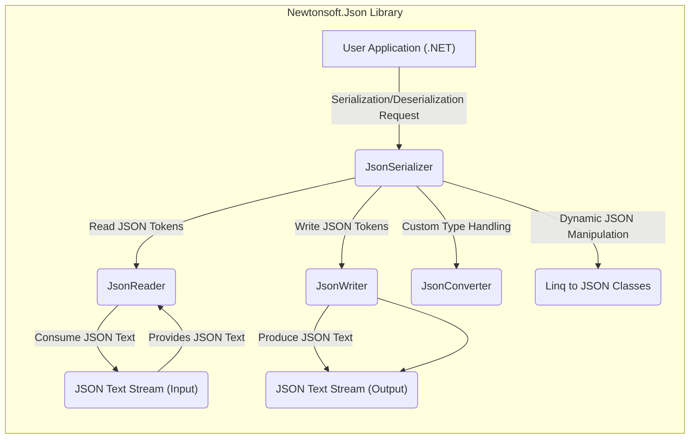
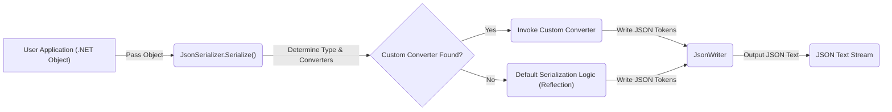
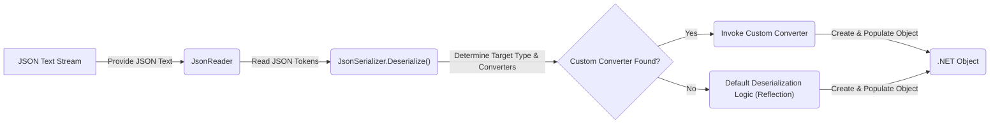

# Project Design Document: Newtonsoft.Json

**Version:** 2.0
**Date:** October 26, 2023
**Author:** AI Software Architect

## 1. Project Overview

Newtonsoft.Json is a high-performance JSON framework for .NET. It provides comprehensive functionality for serializing .NET objects into JSON format and deserializing JSON back into .NET objects. Its flexibility and robust feature set have made it a widely adopted library in the .NET ecosystem. This document details the library's architecture to facilitate effective threat modeling.

## 2. Goals and Objectives

The core objectives of the Newtonsoft.Json library are:

* **Efficient Serialization:**  To convert .NET object graphs into JSON strings with minimal overhead.
* **Robust Deserialization:** To reliably convert JSON strings into corresponding .NET object instances, handling various JSON structures and data types.
* **Extensibility:** To allow developers to customize the serialization and deserialization processes for specific needs through features like custom converters and attributes.
* **Comprehensive Feature Set:** To support advanced JSON features, including LINQ to JSON for querying and manipulating JSON documents programmatically.
* **Developer Friendliness:** To provide a clear and intuitive API that is easy for developers to use and integrate into their applications.

## 3. Target Audience

This design document is primarily intended for:

* Security architects and engineers responsible for performing threat modeling and security assessments of applications using Newtonsoft.Json.
* Software developers seeking a deeper understanding of the library's internal workings for debugging, extending, or securing their code.
* DevOps engineers involved in the deployment and maintenance of applications utilizing this library.

## 4. Scope

This document focuses on the architectural design of the core serialization and deserialization functionalities within the `Newtonsoft.Json.dll` assembly. The scope includes:

* The primary classes and interfaces involved in the serialization and deserialization pipelines.
* The flow of data and control during these processes.
* Key extension points and customization mechanisms.

The scope explicitly excludes:

* Implementation details of individual methods or algorithms within the library.
* The library's build process, testing framework, or release management.
* Specific usage patterns or code examples.
* External integrations or third-party libraries that might interact with Newtonsoft.Json.

## 5. High-Level Architecture

Newtonsoft.Json employs a component-based architecture centered around the `JsonSerializer`. This orchestrator leverages specialized components for reading and writing JSON, and allows for customization through converters.

* **User Application (.NET):** The application code that initiates serialization or deserialization operations using the Newtonsoft.Json library.
* **JsonSerializer:** The central orchestrating component. It manages the overall serialization and deserialization process, selecting appropriate readers, writers, and converters.
* **JsonReader:** Responsible for parsing JSON text from an input stream or string, breaking it down into a stream of JSON tokens.
* **JsonWriter:** Responsible for generating JSON text and writing it to an output stream or string, based on the provided JSON tokens.
* **JsonConverter:** An abstract class that developers can implement to provide custom logic for serializing and deserializing specific .NET types. This allows for fine-grained control over the JSON representation.
* **Linq to JSON Classes:** A set of classes (e.g., `JObject`, `JArray`, `JToken`) that provide a dynamic, in-memory representation of JSON data, enabling querying and manipulation using LINQ.
* **JSON Text Stream (Input):** Represents the source of the JSON data being deserialized (e.g., a string, a file stream, a network stream).
* **JSON Text Stream (Output):** Represents the destination for the serialized JSON data (e.g., a string, a file stream, a network stream).

## 6. Component Details

This section provides a more detailed look at the key components and their responsibilities:

* **`JsonSerializer`:**
    * **Orchestration:**  Manages the entire serialization and deserialization lifecycle.
    * **Settings Management:**  Holds configuration settings that influence the process, such as formatting options, null value handling, and type name handling.
    * **Converter Resolution:**  Identifies and utilizes appropriate `JsonConverter` instances based on the type being processed and registered converters.
    * **Object Tracking:**  Manages object references to handle circular dependencies and prevent infinite loops during serialization.
    * **Entry Points:** Provides the primary `Serialize()` and `Deserialize()` methods.

* **`JsonReader`:**
    * **Tokenization:** Reads the input JSON text and breaks it down into a sequence of JSON tokens (e.g., `StartObject`, `PropertyName`, `String`, `EndArray`).
    * **Navigation:** Provides methods to move through the stream of tokens and access the current token's type and value.
    * **Error Handling:** Detects and reports errors in the JSON syntax.
    * **Supported Formats:** Can handle various JSON formats, including standard JSON and JSON with comments (depending on settings).

* **`JsonWriter`:**
    * **Token Emission:** Provides methods to write different types of JSON tokens to the output stream.
    * **Formatting:**  Applies formatting rules (e.g., indentation, spacing) based on the serializer settings.
    * **Output Management:**  Handles writing the generated JSON text to the specified output stream.
    * **State Management:**  Keeps track of the current JSON structure to ensure valid JSON is produced.

* **`JsonConverter`:**
    * **Custom Serialization:** Allows developers to define custom logic for converting specific .NET types to JSON.
    * **Custom Deserialization:** Allows developers to define custom logic for converting JSON structures back into specific .NET types.
    * **Registration:** Converters can be registered globally or on a per-serialization/deserialization basis.
    * **Type Specificity:** Converters are typically designed to handle one or a limited set of related types.

* **Linq to JSON Classes:**
    * **Dynamic Representation:** Provides a flexible, in-memory tree structure to represent JSON data.
    * **Querying:** Enables querying JSON data using LINQ expressions.
    * **Manipulation:** Allows for adding, removing, and modifying JSON elements programmatically.
    * **Creation:** Provides methods to create JSON objects and arrays from scratch.

## 7. Data Flow

The following diagrams illustrate the typical flow of data during serialization and deserialization:

### 7.1. Serialization Data Flow

1. The user application provides a .NET object to the `JsonSerializer.Serialize()` method.
2. The `JsonSerializer` determines the type of the object and searches for applicable `JsonConverter` instances.
3. If a custom converter is found, it is invoked to handle the serialization of that specific type.
4. If no custom converter is found, the default serialization logic (typically using reflection to access object properties) is employed.
5. The chosen serialization mechanism (custom converter or default logic) instructs the `JsonWriter` to write the corresponding JSON tokens to the output stream.
6. The `JsonWriter` generates the final JSON text stream.

### 7.2. Deserialization Data Flow

1. The `JsonReader` consumes the JSON text stream and provides a stream of JSON tokens to the `JsonSerializer.Deserialize()` method.
2. The `JsonSerializer` determines the target .NET type to deserialize into and searches for applicable `JsonConverter` instances.
3. If a custom converter is found for the target type, it is invoked to handle the deserialization.
4. If no custom converter is found, the default deserialization logic (typically using reflection to create an instance of the target type and populate its properties from the JSON data) is employed.
5. The chosen deserialization mechanism (custom converter or default logic) creates and populates the .NET object based on the JSON data.
6. The deserialized .NET object is returned to the user application.

## 8. Security Considerations

This section highlights potential security considerations relevant to the Newtonsoft.Json library, crucial for threat modeling:

* **Deserialization of Untrusted Data:** This is a primary attack vector.
    * **Type Confusion Attacks:** Malicious JSON can be crafted to force deserialization into unexpected types, potentially leading to code execution if those types have exploitable side effects in their constructors or setters.
    * **Gadget Chain Exploitation:** Attackers can construct JSON payloads that, when deserialized, trigger a chain of method calls leading to arbitrary code execution. This often involves leveraging existing classes within the application or its dependencies.
    * **Resource Exhaustion (DoS):**  Large or deeply nested JSON structures can consume excessive memory or CPU resources during deserialization, leading to denial of service.
    * **Infinite Loops:**  Carefully crafted circular references in JSON data can potentially cause infinite loops during deserialization if not handled correctly by the library or custom converters.

* **Custom Converters:** While offering flexibility, poorly implemented custom converters can introduce vulnerabilities.
    * **Logic Errors:** Bugs in custom converter code can lead to incorrect deserialization, data corruption, or even security vulnerabilities.
    * **Information Disclosure:** Custom converters might inadvertently serialize sensitive information that should not be exposed.
    * **Bypass Security Measures:**  Custom converters could potentially bypass built-in security checks or sanitization routines.

* **Denial of Service (DoS):**
    * **Large Payloads:**  Processing extremely large JSON payloads can overwhelm server resources.
    * **Deeply Nested Objects:** Deserializing deeply nested objects can lead to stack overflow exceptions or excessive memory allocation.

* **Information Disclosure:**
    * **Serialization of Sensitive Data:**  Default serialization behavior might inadvertently expose sensitive information present in .NET objects. Developers need to be mindful of what data is being serialized.
    * **Error Handling:**  Verbose error messages during deserialization could reveal internal application details to attackers.

* **Dependency Vulnerabilities:** While Newtonsoft.Json is a mature library, vulnerabilities in its own dependencies (if any, though it has very few) could pose a risk. Keeping the library updated is crucial.

## 9. Deployment Considerations

When deploying applications using Newtonsoft.Json, consider the following security aspects:

* **NuGet Package Integrity:** Ensure the integrity of the Newtonsoft.Json NuGet package by verifying its source and using signed packages to prevent the use of compromised versions.
* **Regular Updates:** Keep the Newtonsoft.Json library updated to the latest stable version to benefit from bug fixes and security patches.
* **Secure Configuration:**  Review and configure serialization settings appropriately, especially when dealing with untrusted data. Consider using settings like `TypeNameHandling` with caution due to potential deserialization vulnerabilities.
* **Input Validation:**  Even with a secure JSON library, validate the structure and content of incoming JSON data before deserialization to mitigate potential attacks.

## 10. Future Considerations

Potential future developments or changes in Newtonsoft.Json that could impact its design and security include:

* **Adoption of new JSON standards or specifications.**
* **Performance optimizations that might introduce new security considerations.**
* **Enhancements to built-in security features to mitigate deserialization vulnerabilities.**
* **Changes to the API or internal architecture that could affect existing security best practices.**

This document provides a comprehensive architectural overview of the Newtonsoft.Json library, serving as a valuable resource for understanding its inner workings and identifying potential security considerations for effective threat modeling.