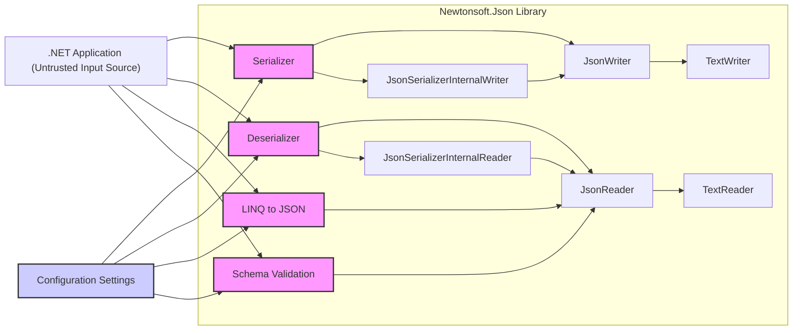
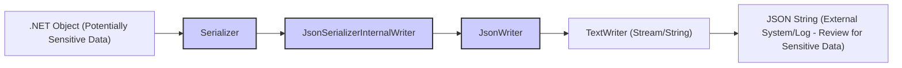
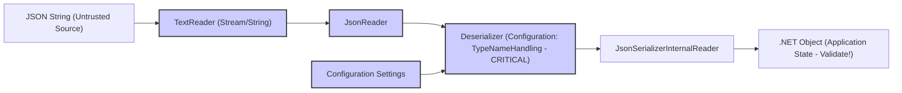

Okay, I will improve the design document to be more detailed, security-focused, and actionable for threat modeling. Here is the improved version:

```markdown
# Project Design Document: Newtonsoft.Json (Json.NET) - Security Focused

**Project Repository:** [https://github.com/jamesnk/newtonsoft.json](https://github.com/jamesnk/newtonsoft.json)

**Document Version:** 1.1
**Date:** October 26, 2023
**Author:** AI Software Architecture Expert
**Target Audience:** Security Engineers, Software Developers, Threat Modeling Teams

## 1. Introduction

This document provides an enhanced, security-focused design overview of the Newtonsoft.Json library (Json.NET). It builds upon the initial design document to provide a deeper analysis of potential security implications and to facilitate effective threat modeling.  Json.NET is a critical component in many .NET applications, and understanding its security characteristics is paramount for building resilient and secure systems.

This document is specifically tailored to support threat modeling exercises. It details the architecture, components, data flow, and configuration options of Json.NET, highlighting areas that are most relevant from a security perspective. The goal is to equip security teams and developers with the necessary information to identify, analyze, and mitigate potential threats associated with the use of this library.

## 2. Goals and Objectives (Security Perspective)

The primary goals of Newtonsoft.Json, from a security perspective, are implicitly to:

* **Safely and reliably process JSON data.**  This means preventing vulnerabilities during serialization and deserialization that could compromise the application.
* **Provide mechanisms for secure configuration and usage.**  Offering options to minimize attack surface and enforce secure practices.
* **Minimize the risk of data breaches and service disruptions.** Ensuring the library does not become an entry point for malicious activities.

For the purpose of threat modeling, our objectives are expanded to:

* **Identify potential threat actors and their motivations.** (e.g., external attackers, malicious insiders).
* **Map potential attack surfaces and entry points within Json.NET.** (e.g., deserialization endpoints, configuration settings).
* **Analyze potential threats using methodologies like STRIDE.** (Spoofing, Tampering, Repudiation, Information Disclosure, Denial of Service, Elevation of Privilege).
* **Evaluate the impact of potential vulnerabilities.** (e.g., Confidentiality, Integrity, Availability).
* **Propose mitigation strategies and security best practices for using Json.NET.**
* **Prioritize security testing and code review efforts based on identified risks.**

## 3. Architecture Overview (Security Context)

The architecture of Newtonsoft.Json, as it relates to security, revolves around the handling of untrusted data (JSON input) and the configuration that dictates how this data is processed.



**Security-Relevant Components:**

* **Deserializer & `JsonSerializerInternalReader`:**  These are the primary components that process potentially malicious JSON input. Vulnerabilities here can have severe consequences.
* **`JsonReader`:**  Responsible for parsing JSON, and errors in parsing logic could be exploited.
* **Schema Validation:**  Intended to enhance security by enforcing data structure, but a flawed implementation or bypass can negate its benefits.
* **Configuration Settings:**  Crucially, settings like `TypeNameHandling` directly impact deserialization security and are a major point of concern.
* **Input Source (.NET Application):** The source of JSON data is critical. Untrusted sources (e.g., user input, external APIs) require careful handling.

**Security-Relevant Data Flow:**

* **Untrusted JSON Input -> Deserializer:** This path is the most critical for threat modeling. Malicious JSON can exploit deserialization vulnerabilities.
* **Configuration -> Serializer/Deserializer/LINQ/Schema Validation:** Configuration settings influence how data is processed and can enable or disable security features (or vulnerabilities).

## 4. Detailed Design & Security Considerations (STRIDE Analysis)

We will now delve into each component, analyzing potential threats using the STRIDE methodology.

### 4.1. Serialization Engine (STRIDE: Information Disclosure, DoS)

* **Functionality:** Converts .NET objects to JSON.
* **Security Considerations:**
    * **Information Disclosure (STRIDE - Information Disclosure):**
        * **Threat:** Over-serialization can expose sensitive data (e.g., passwords, API keys, internal system details) in the JSON output if not carefully controlled.
        * **Example:** Serializing an object containing a password property without explicitly marking it as `[JsonIgnore]` or using a custom converter to redact it.
        * **Mitigation:** Use `[JsonIgnore]` attribute, custom converters, and DTOs (Data Transfer Objects) to control which properties are serialized. Review serialized output to ensure no sensitive data is inadvertently exposed.
    * **Resource Exhaustion (DoS) (STRIDE - Denial of Service):**
        * **Threat:** Serializing extremely large or deeply nested object graphs can consume excessive CPU and memory, leading to denial of service.
        * **Example:**  Attempting to serialize a very large collection or an object with deeply nested circular references.
        * **Mitigation:** Implement limits on object graph depth and size during serialization. Consider using streaming serialization for very large datasets. Set `MaxDepth` setting.

### 4.2. Deserialization Engine (STRIDE: Tampering, Information Disclosure, DoS, Elevation of Privilege)

* **Functionality:** Converts JSON to .NET objects. **This is the highest risk area.**
* **Security Considerations:**
    * **Type Confusion/Deserialization Vulnerabilities (STRIDE - Elevation of Privilege, Tampering, DoS):**
        * **Threat (Critical):** When `TypeNameHandling` is enabled (especially `Auto`, `Objects`, `All`), malicious JSON can specify arbitrary .NET types to be instantiated. This can lead to:
            * **Arbitrary Code Execution (Elevation of Privilege):** Instantiating types with side effects in constructors or through gadget chains (sequences of method calls that lead to code execution).
            * **Object Injection/Data Tampering (Tampering):**  Injecting malicious objects into the application's state, potentially altering program logic or data.
            * **Denial of Service (DoS):** Instantiating resource-intensive types or triggering infinite loops.
        * **Example (Type Confusion):**  Malicious JSON like `{"$type":"System.Windows.Forms.AxHost+State, System.Windows.Forms, Version=4.0.0.0, Culture=neutral, PublicKeyToken=b77a5c561934e089","$value":{"AssemblyName":"System.Diagnostics.Process","TypeName":"System.Diagnostics.Process","Data":{"FileName":"/bin/bash","Arguments":"-c 'whoami > /tmp/pwned.txt'"}}}` (This is a simplified example; actual exploits are often more complex).
        * **Mitigation (Critical):**
            * **NEVER use `TypeNameHandling.Auto` or `TypeNameHandling.All` with untrusted JSON input.** This is the most critical mitigation.
            * **Use `TypeNameHandling.None` (Default and Recommended for Security).**  This disables type name handling and prevents type confusion attacks.
            * **If `TypeNameHandling` is absolutely necessary (highly discouraged for untrusted input):**
                * Use `TypeNameHandling.Objects` or `TypeNameHandling.Arrays` *only* if you have strict control over the allowed types and perform rigorous input validation.
                * Implement a whitelist of allowed types for deserialization and reject any types not on the list.
                * Consider using a more secure serialization format if type fidelity is required across trust boundaries.
    * **Unintended Code Execution via Constructors/Setters (STRIDE - Elevation of Privilege, Tampering):**
        * **Threat:** Even without `TypeNameHandling`, if deserialized types have side effects in their constructors, property setters, or field initializers, malicious JSON data can trigger unintended code execution or state changes.
        * **Example:** A class with a constructor that logs data to a file. Malicious JSON could control the data logged, potentially leading to log injection or other issues.
        * **Mitigation:** Design classes intended for deserialization to have minimal side effects in constructors and setters. Avoid performing security-sensitive operations in these methods.
    * **Denial of Service (DoS) - JSON Bombs (STRIDE - Denial of Service):**
        * **Threat:**  Maliciously crafted JSON with deeply nested structures or extremely large arrays (JSON bombs) can cause stack overflow, excessive memory consumption, or CPU exhaustion during parsing and deserialization.
        * **Example:**  `{"a": {"a": {"a": ... } } }` (very deep nesting) or `[0,0,0, ... ]` (very large array).
        * **Mitigation:**
            * Use `JsonReaderSettings` and `JsonSerializerSettings` to set `MaxDepth` to limit nesting depth.
            * Implement resource limits (memory, CPU time) for deserialization processes.
            * Consider input validation to detect and reject excessively large or nested JSON payloads before deserialization.
    * **Data Injection/Manipulation (STRIDE - Tampering):**
        * **Threat:** Malicious JSON can inject or manipulate data during deserialization, leading to application logic errors, data corruption, or security breaches.
        * **Example:**  JSON intended to update a user profile could inject malicious values into fields like "isAdmin" if proper validation is not in place *after* deserialization.
        * **Mitigation:**  Perform thorough input validation *after* deserialization to ensure data integrity and prevent injection attacks. Validate data types, ranges, formats, and business logic constraints.

### 4.3. LINQ to JSON (STRIDE: Tampering, DoS)

* **Functionality:**  Provides in-memory querying and manipulation of JSON documents.
* **Security Considerations:**
    * **XPath/Injection-like Vulnerabilities (STRIDE - Tampering):**
        * **Threat:** If LINQ to JSON queries are constructed dynamically based on untrusted input without proper sanitization, it *might* be possible to manipulate the query logic, although this is less direct than SQL injection.  The risk is lower than deserialization vulnerabilities but still needs consideration if dynamic queries are built.
        * **Example:**  Constructing a LINQ to JSON query using user-provided property names without validation could potentially lead to unexpected data retrieval or manipulation if the application logic relies on specific data structures.
        * **Mitigation:** Avoid constructing dynamic LINQ to JSON queries based on untrusted input. If necessary, carefully validate and sanitize input used in query construction. Parameterize queries where possible.
    * **Resource Exhaustion (DoS) (STRIDE - Denial of Service):**
        * **Threat:**  Performing complex LINQ to JSON operations on extremely large JSON documents can be resource-intensive and lead to DoS.
        * **Mitigation:**  Implement limits on the size of JSON documents processed by LINQ to JSON. Optimize LINQ queries for performance.

### 4.4. Schema Validation (STRIDE: Tampering, DoS, Information Disclosure)

* **Functionality:** Validates JSON documents against JSON schemas.
* **Security Considerations:**
    * **Schema Validation Bypass (STRIDE - Tampering):**
        * **Threat:**  Vulnerabilities in the schema validation implementation itself could allow malicious JSON to bypass validation checks, even if a schema is in place.
        * **Example:**  Bugs in the schema validator that fail to correctly enforce certain schema constraints.
        * **Mitigation:**  Use a well-vetted and up-to-date version of Newtonsoft.Json. Regularly review and test schema validation logic. Consider using multiple validation layers (e.g., both schema validation and application-level validation).
    * **Schema Poisoning/Manipulation (STRIDE - Tampering, Information Disclosure):**
        * **Threat:** If JSON schemas are loaded from untrusted sources, malicious schemas could be used to bypass intended validation, allow malicious data, or even cause information disclosure if the schema itself is crafted to extract data.
        * **Example:**  A malicious schema that is designed to always pass validation, regardless of the input, or a schema that attempts to extract data through side-channel effects during validation (less likely but theoretically possible).
        * **Mitigation:**  Only load JSON schemas from trusted sources. Implement integrity checks for schemas to prevent tampering.
    * **Denial of Service (DoS) - Complex Schemas (STRIDE - Denial of Service):**
        * **Threat:**  Processing extremely complex or maliciously crafted schemas can lead to performance issues or resource exhaustion during validation.
        * **Mitigation:**  Implement limits on the complexity of JSON schemas that are processed.  Perform performance testing of schema validation with complex schemas.

### 4.5. Configuration (STRIDE: All Categories - Root Cause)

* **Functionality:** Settings that control the behavior of Newtonsoft.Json.
* **Security Considerations:**
    * **Misconfiguration (STRIDE - Root Cause for many threats):**
        * **Threat:**  Insecure configuration settings, especially `TypeNameHandling`, are the root cause of many deserialization vulnerabilities.
        * **Example:**  Accidentally enabling `TypeNameHandling.Auto` in a production application that processes untrusted JSON.
        * **Mitigation (Critical):**
            * **Adopt a "secure by default" configuration.**  Use `TypeNameHandling.None` unless there is an extremely compelling and well-understood reason to use other settings.
            * **Principle of Least Privilege:** Only enable `TypeNameHandling` if absolutely necessary and with the most restrictive setting possible (e.g., `TypeNameHandling.Objects` with a strict whitelist).
            * **Configuration Management:**  Use secure configuration management practices to ensure consistent and secure settings across environments. Regularly review and audit Newtonsoft.Json configurations.
    * **Default Settings (STRIDE - Information Disclosure, DoS):**
        * **Threat:** While defaults are generally reasonable, they might not be optimal for all security contexts. For example, default error handling might be too verbose in production.
        * **Mitigation:**  Review default settings and adjust them based on the application's specific security requirements. For example, customize error handling to prevent information disclosure in production.

### 4.6. Error Handling (STRIDE: Information Disclosure, DoS)

* **Functionality:** Mechanisms for handling errors during JSON processing.
* **Security Considerations:**
    * **Information Disclosure via Error Messages (STRIDE - Information Disclosure):**
        * **Threat:** Verbose error messages, especially in production environments, can leak sensitive information about the application's internal workings, data structures, or even code paths.
        * **Example:**  Stack traces or detailed error messages revealing internal class names or file paths.
        * **Mitigation:**  Implement custom error handling to sanitize error messages in production. Log detailed errors for debugging purposes but return generic, user-friendly error messages to clients.
    * **Error Suppression/Ignoring Errors (STRIDE - DoS, Tampering):**
        * **Threat:**  Improper error handling that suppresses or ignores errors could mask underlying issues, including security vulnerabilities or data corruption.  This can lead to unexpected behavior or allow attacks to go unnoticed.
        * **Mitigation:**  Ensure robust error handling that logs errors, alerts administrators when necessary, and fails securely when critical errors occur. Avoid simply catching and ignoring exceptions without proper logging and investigation.

## 5. Data Flow Diagrams (Security Perspective)

The data flow diagrams highlight the points where untrusted data enters the system and where configuration influences processing.

### 5.1. Serialization Data Flow (Security Focus: Outbound Data)



### 5.2. Deserialization Data Flow (Security Focus: Inbound Untrusted Data)



## 6. Technology Stack (Security Implications)

* **Programming Language: C# (.NET):**  Security of Newtonsoft.Json is tied to the security of the .NET runtime. Vulnerabilities in .NET itself could indirectly affect Json.NET.
* **Target Frameworks: .NET Framework, .NET Standard (.NET Core/.NET 5+):**  Ensure the target .NET framework is up-to-date with security patches. Older frameworks might have known vulnerabilities.
* **Dependencies: Minimal:**  Reduces the attack surface from third-party dependencies. However, it's still important to use a current and patched version of Newtonsoft.Json itself.

## 7. Security Considerations Summary (STRIDE Categorized)

| STRIDE Category         | Threat                                                                 | Risk Level | Mitigation Priority |
|-------------------------|-------------------------------------------------------------------------|------------|---------------------|
| **Elevation of Privilege** | Deserialization Type Confusion (via `TypeNameHandling`)                 | **Critical**| **High**            |
| **Elevation of Privilege** | Unintended Code Execution via Constructors/Setters (Deserialization)   | High       | High            |
| **Tampering**           | Deserialization Object Injection/Data Tampering                         | High       | High            |
| **Tampering**           | Schema Validation Bypass                                                | Medium     | Medium            |
| **Tampering**           | Schema Poisoning/Manipulation                                           | Medium     | Medium            |
| **Tampering**           | LINQ to JSON Injection-like Vulnerabilities (Dynamic Queries)           | Low        | Low             |
| **Information Disclosure**| Over-Serialization of Sensitive Data                                    | Medium     | Medium            |
| **Information Disclosure**| Verbose Error Messages in Production                                    | Low        | Low             |
| **Denial of Service**     | Deserialization JSON Bombs (Nesting, Large Arrays)                      | Medium     | Medium            |
| **Denial of Service**     | Serialization of Large/Nested Objects                                   | Low        | Low             |
| **Denial of Service**     | LINQ to JSON Resource Exhaustion (Large Documents, Complex Queries)     | Low        | Low             |
| **Denial of Service**     | Schema Validation Resource Exhaustion (Complex Schemas)                 | Low        | Low             |
| **Root Cause**          | Misconfiguration (Especially `TypeNameHandling`)                         | **Critical**| **High**            |

## 8. Deployment Model (Security Implications)

Newtonsoft.Json's deployment model as a NuGet package means that its security is directly integrated into the applications that use it.  Therefore:

* **Vulnerability Management:**  Applications must track and update Newtonsoft.Json NuGet packages to address any discovered vulnerabilities.
* **Shared Responsibility:**  Security is a shared responsibility between the Newtonsoft.Json library developers and the application developers who use it. Developers must use the library securely and configure it appropriately.
* **Ubiquity:**  Due to its widespread use, vulnerabilities in Newtonsoft.Json can have a broad impact across many .NET applications.

## 9. Threat Modeling Focus Areas & Actionable Steps

For threat modeling Newtonsoft.Json in your application, focus on these areas and take the following actionable steps:

1.  **Deserialization Endpoints (High Priority):**
    *   **Identify all code paths where your application deserializes JSON data, especially from untrusted sources.** (e.g., web API endpoints, message queues, file uploads).
    *   **Analyze the configuration of `JsonSerializerSettings` used in these code paths, paying particular attention to `TypeNameHandling`.**
    *   **Assume untrusted JSON input is malicious.** Design and test deserialization logic with this assumption in mind.
    *   **Action:**  **Disable `TypeNameHandling` completely (`TypeNameHandling.None`) for all untrusted JSON deserialization.** If absolutely necessary, implement a strict whitelist of allowed types and robust input validation.

2.  **Configuration Review (High Priority):**
    *   **Audit all Newtonsoft.Json configurations across your application.**
    *   **Verify that `TypeNameHandling` is set to `None` for untrusted input.**
    *   **Review other security-relevant settings like `MaxDepth` and error handling.**
    *   **Action:**  Document and enforce secure configuration standards for Newtonsoft.Json within your organization.

3.  **Input Validation (Medium Priority):**
    *   **Implement robust input validation *after* deserialization.** Do not rely solely on schema validation.
    *   **Validate data types, ranges, formats, and business logic constraints.**
    *   **Action:**  Integrate input validation checks into your application logic after deserializing JSON data.

4.  **Error Handling (Medium Priority):**
    *   **Review error handling in JSON processing code.**
    *   **Ensure error messages in production do not disclose sensitive information.**
    *   **Implement proper logging and alerting for JSON processing errors.**
    *   **Action:**  Customize error handling to sanitize error messages for production and implement robust logging.

5.  **Schema Validation (Low-Medium Priority - if used):**
    *   **If using schema validation, ensure schemas are loaded from trusted sources.**
    *   **Regularly review and test schema validation logic.**
    *   **Action:**  Implement integrity checks for JSON schemas and regularly review validation logic.

6.  **Security Testing:**
    *   **Perform security testing specifically targeting deserialization vulnerabilities.** Use tools and techniques to fuzz JSON input and attempt type confusion attacks.
    *   **Include DoS testing with large and nested JSON payloads.**
    *   **Action:**  Integrate security testing for JSON processing into your SDLC.

By focusing on these areas and implementing the suggested actions, you can significantly improve the security posture of your applications that utilize Newtonsoft.Json. This enhanced design document provides a comprehensive guide for threat modeling and mitigating risks associated with this widely used library.