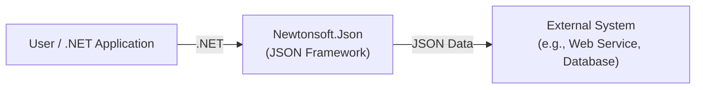
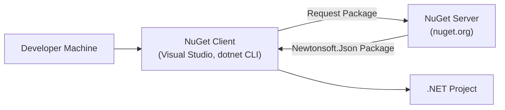
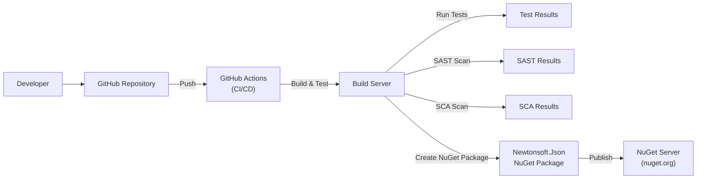

# BUSINESS POSTURE

Business Priorities and Goals:

*   Provide a high-performance, flexible, and comprehensive JSON framework for .NET.
*   Maintain wide compatibility across different .NET platforms and versions.
*   Offer a rich feature set to handle various JSON serialization and deserialization scenarios.
*   Be the de-facto standard JSON library for .NET developers.
*   Ensure ease of use and integration into existing and new projects.
*   Maintain backward compatibility where possible, minimizing breaking changes.
*   Provide good documentation and support to users.

Most Important Business Risks:

*   Security vulnerabilities that could lead to data breaches or system compromise.
*   Performance bottlenecks that could impact applications using the library.
*   Compatibility issues with different .NET versions or platforms, limiting adoption.
*   Loss of developer trust due to bugs, security issues, or poor support.
*   Competition from alternative JSON libraries.
*   Legal or licensing issues.

# SECURITY POSTURE

Existing Security Controls:

*   security control: The project uses GitHub's built-in security features, such as code scanning and dependency analysis. This is visible on the GitHub repository page.
*   security control: Regular updates and patches to address reported vulnerabilities. This can be inferred from the project's release history and commit messages.
*   security control: Extensive test suite to ensure functionality and prevent regressions. This is evident from the presence of a large number of test projects and files in the repository.
*   security control: Adherence to secure coding practices (though this needs further verification, it's a reasonable assumption for a widely used library).
*   security control: Signed NuGet packages to ensure integrity and authenticity.

Accepted Risks:

*   accepted risk: Reliance on third-party dependencies (though minimized, it's inherent in any software project).
*   accepted risk: Potential for zero-day vulnerabilities, as with any software.
*   accepted risk: The possibility of user error in implementing the library, leading to security issues in the consuming application.

Recommended Security Controls:

*   security control: Implement Static Application Security Testing (SAST) in the build pipeline to automatically scan for potential vulnerabilities.
*   security control: Implement Dynamic Application Security Testing (DAST) to test the library in a runtime environment.
*   security control: Conduct regular security audits and penetration testing.
*   security control: Establish a clear vulnerability disclosure and response process.
*   security control: Provide security guidance and best practices documentation for users.
*   security control: Implement Software Composition Analysis (SCA) to manage and monitor third-party dependencies for known vulnerabilities.

Security Requirements:

*   Authentication: Not directly applicable to this library, as it's a serialization/deserialization tool. Authentication is the responsibility of the application using the library.
*   Authorization: Not directly applicable. Authorization is the responsibility of the application using the library.
*   Input Validation:
    *   The library should handle malformed JSON input gracefully, without crashing or exposing vulnerabilities.
    *   The library should provide mechanisms for users to validate JSON against a schema (e.g., using `JSchema`).
    *   The library should protect against common JSON-related attacks, such as injection attacks.
*   Cryptography:
    *   If the library handles sensitive data, it should provide options for encryption and decryption, or integrate with existing .NET cryptographic libraries. This is not a primary function of the library, but it's a consideration for users.
    *   Any cryptographic operations should use strong, industry-standard algorithms and key management practices.
*   Other:
    *   The library should be designed to minimize its attack surface.
    *   The library should follow the principle of least privilege.

# DESIGN

## C4 CONTEXT

Elements Description:

*   Element:
    *   Name: User / .NET Application
    *   Type: User/System
    *   Description: A .NET application or developer using the Newtonsoft.Json library.
    *   Responsibilities:
        *   Utilizes Newtonsoft.Json for JSON serialization and deserialization.
        *   Provides configuration and settings to Newtonsoft.Json.
        *   Handles the results of serialization/deserialization.
    *   Security controls:
        *   Responsible for implementing application-level security controls, such as authentication, authorization, and input validation.

*   Element:
    *   Name: Newtonsoft.Json (JSON Framework)
    *   Type: System
    *   Description: The Newtonsoft.Json library itself.
    *   Responsibilities:
        *   Provides APIs for serializing .NET objects to JSON.
        *   Provides APIs for deserializing JSON to .NET objects.
        *   Handles various JSON data formats and structures.
        *   Offers configuration options for controlling serialization/deserialization behavior.
    *   Security controls:
        *   Handles malformed JSON input gracefully.
        *   Provides schema validation capabilities.
        *   Protects against JSON injection attacks.
        *   Signed NuGet packages.

*   Element:
    *   Name: External System (e.g., Web Service, Database)
    *   Type: System
    *   Description: An external system that interacts with the .NET application, providing or consuming JSON data.
    *   Responsibilities:
        *   Sends or receives JSON data.
        *   May have its own security requirements and controls.
    *   Security controls:
        *   Dependent on the specific external system. Should implement appropriate security measures for handling JSON data.

## C4 CONTAINER

Since Newtonsoft.Json is a single library, the container diagram is essentially the same as the context diagram, with the addition of internal components if we were to decompose the library further. For simplicity, we'll keep it at the library level.

Elements Description:

*   Element:
    *   Name: User / .NET Application
    *   Type: User/System
    *   Description: A .NET application or developer using the Newtonsoft.Json library.
    *   Responsibilities:
        *   Utilizes Newtonsoft.Json for JSON serialization and deserialization.
        *   Provides configuration and settings to Newtonsoft.Json.
        *   Handles the results of serialization/deserialization.
    *   Security controls:
        *   Responsible for implementing application-level security controls, such as authentication, authorization, and input validation.

*   Element:
    *   Name: Newtonsoft.Json (JSON Framework)
    *   Type: System
    *   Description: The Newtonsoft.Json library itself.
    *   Responsibilities:
        *   Provides APIs for serializing .NET objects to JSON.
        *   Provides APIs for deserializing JSON to .NET objects.
        *   Handles various JSON data formats and structures.
        *   Offers configuration options for controlling serialization/deserialization behavior.
    *   Security controls:
        *   Handles malformed JSON input gracefully.
        *   Provides schema validation capabilities.
        *   Protects against JSON injection attacks.
        *   Signed NuGet packages.

*   Element:
    *   Name: External System (e.g., Web Service, Database)
    *   Type: System
    *   Description: An external system that interacts with the .NET application, providing or consuming JSON data.
    *   Responsibilities:
        *   Sends or receives JSON data.
        *   May have its own security requirements and controls.
    *   Security controls:
        *   Dependent on the specific external system. Should implement appropriate security measures for handling JSON data.

## DEPLOYMENT

Deployment Solutions:

1.  NuGet Package Manager: The primary and recommended way to deploy Newtonsoft.Json is through NuGet. Developers add a package reference to their .NET project, and NuGet handles downloading, installing, and managing the library and its dependencies.
2.  Manual Download and Reference: Developers can download the Newtonsoft.Json DLL directly from the NuGet website or GitHub releases and manually add a reference to it in their project. This is less common and not recommended for managing updates.
3.  Private NuGet Feed: Organizations may host their own private NuGet feed to distribute internal libraries and control versions. Newtonsoft.Json could be deployed to such a feed.

Chosen Solution (NuGet Package Manager):

Elements Description:

*   Element:
    *   Name: Developer Machine
    *   Type: Workstation
    *   Description: The developer's computer where the .NET project is being developed.
    *   Responsibilities:
        *   Hosts the development environment (e.g., Visual Studio, VS Code).
        *   Runs the NuGet client.
        *   Contains the .NET project source code.
    *   Security controls:
        *   Developer machine security (e.g., antivirus, firewall, access controls).

*   Element:
    *   Name: NuGet Client (Visual Studio, dotnet CLI)
    *   Type: Software
    *   Description: The tool used to interact with the NuGet server and manage packages.
    *   Responsibilities:
        *   Sends requests to the NuGet server.
        *   Downloads packages.
        *   Installs packages into the .NET project.
        *   Manages package dependencies.
    *   Security controls:
        *   Uses HTTPS to communicate with the NuGet server.
        *   Verifies package signatures (if configured).

*   Element:
    *   Name: NuGet Server (nuget.org)
    *   Type: Server
    *   Description: The central repository for NuGet packages.
    *   Responsibilities:
        *   Hosts NuGet packages.
        *   Provides an API for searching and retrieving packages.
    *   Security controls:
        *   HTTPS for secure communication.
        *   Package signing.
        *   Vulnerability scanning of packages.

*   Element:
    *   Name: .NET Project
    *   Type: Project
    *   Description: The .NET project that depends on Newtonsoft.Json.
    *   Responsibilities:
        *   Contains the application code.
        *   References the Newtonsoft.Json library.
    *   Security controls:
        *   Application-level security controls.

*   Element:
    *   Name: Newtonsoft.Json Package
    *   Type: Artifact
    *   Description: The compiled Newtonsoft.Json library and associated files.
    *   Responsibilities:
        *   Provides the functionality for JSON serialization and deserialization.
    *   Security controls:
        *   Signed package to ensure authenticity and integrity.

## BUILD

Build Process Description:

1.  Developer commits and pushes code changes to the GitHub repository.
2.  GitHub Actions triggers a CI/CD workflow.
3.  The workflow checks out the code on a build server.
4.  The project is built (compiled).
5.  Unit tests are executed.
6.  SAST (Static Application Security Testing) tools scan the code for vulnerabilities.
7.  SCA (Software Composition Analysis) tools scan the dependencies for known vulnerabilities.
8.  If all tests and scans pass, a NuGet package is created.
9.  The NuGet package is signed.
10. The NuGet package is published to the NuGet server (nuget.org).

Security Controls in Build Process:

*   security control: GitHub Actions provides a secure and automated build environment.
*   security control: SAST scanning helps identify vulnerabilities in the code.
*   security control: SCA scanning helps identify vulnerabilities in dependencies.
*   security control: Unit tests ensure code quality and prevent regressions.
*   security control: NuGet package signing ensures the integrity and authenticity of the package.
*   security control: Build process should run with least privilege.

# RISK ASSESSMENT

Critical Business Processes:

*   Serialization and deserialization of JSON data within .NET applications. This is fundamental to many applications that interact with web services, databases, and other systems that use JSON.

Data Sensitivity:

*   The Newtonsoft.Json library itself does not inherently handle sensitive data. However, it is *used* to process data that may be highly sensitive, depending on the application. The sensitivity of the data depends entirely on the context in which the library is used.
    *   Examples:
        *   Personally Identifiable Information (PII)
        *   Financial data
        *   Authentication tokens
        *   Medical records
        *   Proprietary business data

# QUESTIONS & ASSUMPTIONS

Questions:

*   Are there any specific compliance requirements (e.g., GDPR, HIPAA, PCI DSS) that apply to applications using Newtonsoft.Json? This will influence the security recommendations for users of the library.
*   What is the expected threat model for applications using this library? (e.g., web applications, desktop applications, mobile applications). This will help prioritize security controls.
*   What level of security assurance is required for this library? (e.g., basic, moderate, high). This will affect the rigor of security testing and auditing.
*   Is there a formal process for handling security vulnerabilities reported by external researchers?

Assumptions:

*   BUSINESS POSTURE: The primary business goal is to provide a reliable and performant JSON library for the .NET ecosystem.
*   SECURITY POSTURE: The project maintainers are committed to security best practices, but there may be resource constraints limiting the implementation of advanced security measures.
*   DESIGN: The library is designed to be flexible and extensible, allowing users to customize its behavior. The deployment model relies primarily on NuGet. The build process is automated using GitHub Actions.