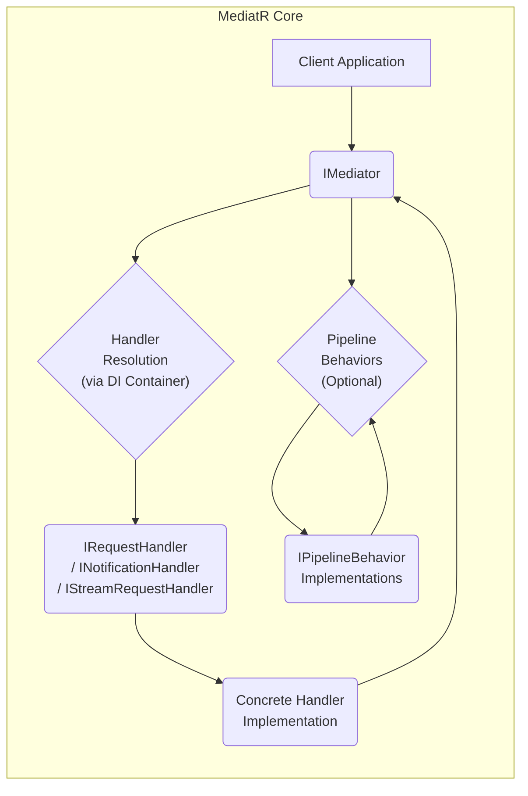

# Project Design Document: MediatR

**Version:** 1.1
**Date:** October 26, 2023
**Author:** AI Software Architect

## 1. Introduction

This document provides a detailed design overview of the MediatR library, a simple mediator implementation in .NET. This document aims to clearly articulate the architecture, components, and interactions within MediatR to facilitate effective threat modeling. It will serve as a foundation for identifying potential security vulnerabilities and designing appropriate mitigations.

## 2. Goals

The primary goals of this design document are to:

*   Provide a comprehensive and easily understandable explanation of MediatR's architecture and functionality.
*   Clearly identify the key components of MediatR and detail their specific responsibilities and interactions.
*   Illustrate the data flow within the library for different message types (requests, commands, notifications).
*   Serve as a robust basis for conducting thorough threat modeling exercises, enabling the identification of potential security weaknesses.

## 3. Scope

This document focuses on the core functionality of the MediatR library as represented in the linked GitHub repository. It covers the following aspects:

*   The `IMediator` interface and its standard implementations.
*   Request/Response patterns utilizing the `IRequest<TResponse>` and `IRequestHandler<TRequest, TResponse>` interfaces.
*   Command patterns utilizing the `IRequest` and `IRequestHandler<TRequest>` interfaces.
*   Notification patterns utilizing the `INotification` and `INotificationHandler<TNotification>` interfaces.
*   The concept and implementation of pipeline behaviors through the `IPipelineBehavior<TRequest, TResponse>` interface.
*   The underlying mechanisms for the registration and resolution of handlers and behaviors, emphasizing the role of dependency injection.
*   Asynchronous stream handling with `IStreamRequest<TResponse>` and its associated handler.

This document does not cover:

*   Specific, concrete implementations of handlers or behaviors developed within user applications that utilize MediatR.
*   Detailed configurations or integrations with specific dependency injection containers, although the fundamental reliance on dependency injection is discussed.
*   Advanced or community-developed extensions and features built on top of the core MediatR library.

## 4. High-Level Architecture

MediatR implements the mediator pattern, effectively decoupling the senders of requests, commands, or notifications from their respective handlers. The `IMediator` interface serves as the central point of communication and coordination.



**Components:**

*   **Client Application:** The entity that initiates requests, sends commands, or publishes notifications through the `IMediator`. This is the entry point for interactions with MediatR.
*   **IMediator:** The central interface within MediatR. It provides methods for sending requests (with or without responses), publishing notifications, and creating asynchronous streams. It orchestrates the process of finding and executing the appropriate handlers and behaviors.
*   **Handler Resolution (via DI Container):** The mechanism by which MediatR locates the correct handler(s) for a given message type. This process is intrinsically linked to and relies on a configured dependency injection (DI) container. MediatR uses the DI container to resolve instances of the required handler interfaces.
*   **IRequestHandler / INotificationHandler / IStreamRequestHandler:** These are the core handler interfaces.
    *   `IRequestHandler`: Defines the contract for handling requests that expect a single response or no response (commands).
    *   `INotificationHandler`: Defines the contract for handling notifications, where multiple handlers can respond to the same notification.
    *   `IStreamRequestHandler`: Defines the contract for handling requests that produce an asynchronous stream of responses.
*   **Concrete Handler Implementation:** The actual classes that implement the handler interfaces. These classes contain the specific business logic required to process a request, command, or notification.
*   **Pipeline Behaviors (Optional):**  Components that implement the `IPipelineBehavior` interface. These form a pipeline that can intercept and augment the processing flow of requests and commands. They allow for the implementation of cross-cutting concerns.

## 5. Detailed Design

### 5.1. IMediator Interface

The `IMediator` interface is the primary point of interaction with the MediatR library. It defines the following core methods:

*   `Task<TResponse> Send<TResponse>(IRequest<TResponse> request, CancellationToken cancellationToken = default)`:  Used to send a request that expects a response of type `TResponse`. The `CancellationToken` allows for graceful cancellation of the operation.
*   `Task<Unit> Send<TRequest>(TRequest request, CancellationToken cancellationToken = default) where TRequest : IRequest`: Used to send a command (a request that does not expect a response). `Unit` is a common way to represent a void return type in asynchronous operations.
*   `Task Publish<TNotification>(TNotification notification, CancellationToken cancellationToken = default)`: Used to publish a notification to all registered handlers for that notification type.
*   `Task Publish(object notification, CancellationToken cancellationToken = default)`: An overload of the `Publish` method that allows publishing a notification object without a specific generic type constraint.
*   `IAsyncEnumerable<TResponse> CreateStream<TRequest, TResponse>(TRequest request, CancellationToken cancellationToken = default) where TRequest : IStreamRequest<TResponse>`: Used to initiate a request that will produce an asynchronous stream of responses.

### 5.2. Request/Response Pattern

*   **IRequest\<TResponse> Interface:** A marker interface that signifies a request which expects a response of type `TResponse`.
*   **IRequestHandler\<TRequest, TResponse> Interface:** Defines the contract for handling requests of type `TRequest` and returning a response of type `TResponse`. Implementations of this interface encapsulate the core business logic for processing the specific request.

    ```mermaid
    sequenceDiagram
        participant "Client" as client
        participant "Mediator" as mediator
        participant "Handler Resolution" as resolution
        participant "RequestHandler" as handler
        client->>mediator: Send(IRequest<TResponse>)
        mediator->>resolution: Resolve IRequestHandler<TRequest, TResponse>
        resolution->>handler: Instantiate Handler
        mediator->>handler: Handle(TRequest, CancellationToken)
        handler-->>mediator: TResponse
        mediator-->>client: TResponse
    ```

### 5.3. Command Pattern

*   **IRequest Interface:** A marker interface for commands, which are requests that do not require a response.
*   **IRequestHandler\<TRequest> Interface:** Defines the contract for handling commands of type `TRequest`. Implementations contain the business logic for executing the command.

    ```mermaid
    sequenceDiagram
        participant "Client" as client
        participant "Mediator" as mediator
        participant "Handler Resolution" as resolution
        participant "CommandHandler" as handler
        client->>mediator: Send(IRequest)
        mediator->>resolution: Resolve IRequestHandler<TRequest>
        resolution->>handler: Instantiate Handler
        mediator->>handler: Handle(TRequest, CancellationToken)
        handler-->>mediator: Unit (or void)
        mediator-->>client: Unit (or void)
    ```

### 5.4. Notification Pattern

*   **INotification Interface:** A marker interface for notifications, which represent events that can be handled by multiple subscribers.
*   **INotificationHandler\<TNotification> Interface:** Defines the contract for handling notifications of type `TNotification`. Multiple handlers can be registered and will be invoked when a notification of this type is published.

    ```mermaid
    sequenceDiagram
        participant "Client" as client
        participant "Mediator" as mediator
        participant "Handler Resolution" as resolution
        participant "NotificationHandler1" as handler1
        participant "NotificationHandler2" as handler2
        client->>mediator: Publish(INotification)
        mediator->>resolution: Resolve INotificationHandler<TNotification>
        resolution->>handler1: Instantiate Handler 1
        mediator->>handler1: Handle(TNotification, CancellationToken)
        resolution->>handler2: Instantiate Handler 2
        mediator->>handler2: Handle(TNotification, CancellationToken)
        mediator-->>client: (Completion)
    ```

### 5.5. Pipeline Behaviors

*   **IPipelineBehavior\<TRequest, TResponse> Interface:** Defines a behavior that can intercept the processing pipeline for requests and commands. Behaviors are executed in a specific order, forming a chain around the actual handler execution. This allows for implementing cross-cutting concerns such as logging, validation, authorization, and transaction management.

    ```mermaid
    sequenceDiagram
        participant "Client" as client
        participant "Mediator" as mediator
        participant "Behavior 1" as behavior1
        participant "Behavior 2" as behavior2
        participant "Handler Resolution" as resolution
        participant "RequestHandler" as handler
        client->>mediator: Send(IRequest<TResponse>)
        mediator->>behavior1: Handle(TRequest, CancellationToken, RequestHandlerDelegate)
        behavior1->>behavior2: Handle(TRequest, CancellationToken, RequestHandlerDelegate)
        behavior2->>resolution: Resolve IRequestHandler<TRequest, TResponse>
        resolution->>handler: Handle(TRequest, CancellationToken)
        handler-->>behavior2: TResponse
        behavior2-->>behavior1: TResponse
        behavior1-->>mediator: TResponse
        mediator-->>client: TResponse
    ```

### 5.6. Handler Registration and Resolution

MediatR's functionality is tightly coupled with dependency injection (DI). Handlers and behaviors are typically registered with the DI container during application startup. When `IMediator.Send` or `IMediator.Publish` is called, MediatR utilizes the DI container to resolve the appropriate handler(s) and pipeline behaviors for the given message type. This resolution process is crucial for the decoupling and extensibility provided by MediatR.

### 5.7. Asynchronous Streams

*   **IStreamRequest\<TResponse> Interface:** A marker interface for requests that will produce a stream of responses asynchronously.
*   **IStreamRequestHandler\<TRequest, TResponse> Interface:** Defines the contract for handling stream requests. Implementations of this interface return an `IAsyncEnumerable<TResponse>`.

    ```mermaid
    sequenceDiagram
        participant "Client" as client
        participant "Mediator" as mediator
        participant "Handler Resolution" as resolution
        participant "StreamRequestHandler" as streamhandler
        client->>mediator: CreateStream(IStreamRequest<TResponse>)
        mediator->>resolution: Resolve IStreamRequestHandler<TRequest, TResponse>
        resolution->>streamhandler: Instantiate Handler
        mediator->>streamhandler: Handle(TRequest, CancellationToken)
        streamhandler-->>mediator: IAsyncEnumerable<TResponse>
        loop For each item in the stream
            mediator-->>client: TResponse
        end
    ```

## 6. Data Flow

The data flow within MediatR varies depending on the message type:

**Request/Response:**

1. The `Client Application` creates an instance of a class implementing `IRequest<TResponse>`.
2. The `Client Application` calls `IMediator.Send(request)`.
3. The `Mediator` uses the `Handler Resolution` mechanism (via the DI container) to locate the registered `IRequestHandler<TRequest, TResponse>`.
4. Any registered `Pipeline Behaviors` are executed in their defined order, potentially modifying the request or short-circuiting the pipeline.
5. The `Handle` method of the resolved `RequestHandler` is invoked with the request and cancellation token.
6. The `RequestHandler` processes the request and returns a response of type `TResponse`.
7. `Pipeline Behaviors` are executed in reverse order (post-processing), potentially modifying the response.
8. The `Mediator` returns the response to the `Client Application`.

**Command:**

1. The `Client Application` creates an instance of a class implementing `IRequest`.
2. The `Client Application` calls `IMediator.Send(command)`.
3. The `Mediator` uses `Handler Resolution` to locate the registered `IRequestHandler<TRequest>`.
4. `Pipeline Behaviors` are executed.
5. The `Handle` method of the `RequestHandler` is invoked.
6. The `RequestHandler` executes the command.
7. `Pipeline Behaviors` are executed in reverse order.
8. The `Mediator` returns control to the `Client Application`.

**Notification:**

1. The `Client Application` creates an instance of a class implementing `INotification`.
2. The `Client Application` calls `IMediator.Publish(notification)`.
3. The `Mediator` uses `Handler Resolution` to locate all registered `INotificationHandler<TNotification>` implementations.
4. The `Handle` method of each resolved `NotificationHandler` is invoked asynchronously with the notification.
5. The `Mediator` returns control to the `Client Application` after initiating the handling of all notifications.

**Asynchronous Streams:**

1. The `Client Application` creates an instance of a class implementing `IStreamRequest<TResponse>`.
2. The `Client Application` calls `IMediator.CreateStream(streamRequest)`.
3. The `Mediator` uses `Handler Resolution` to locate the registered `IStreamRequestHandler<TRequest, TResponse>`.
4. The `Handle` method of the `StreamRequestHandler` is invoked, returning an `IAsyncEnumerable<TResponse>`.
5. The `Client Application` iterates over the `IAsyncEnumerable`, receiving responses as they become available.

## 7. Security Considerations for Threat Modeling

Based on the architecture and data flow, potential security considerations for threat modeling include:

*   **Unauthorized Request Handling:** If handlers do not implement proper authorization checks, malicious actors could craft requests to perform unauthorized actions.
*   **Input Validation Failures:** Handlers that do not adequately validate input data are susceptible to injection attacks (e.g., SQL injection, command injection) or other forms of data manipulation.
*   **Denial of Service (DoS) Attacks:**  Maliciously crafted requests or a large volume of notifications could overload handlers or the system's resources, leading to a denial of service.
*   **Information Disclosure through Exceptions:** Unhandled exceptions or overly verbose error messages within handlers could expose sensitive information to attackers.
*   **Vulnerabilities in Dependencies:**  Security vulnerabilities in the MediatR library itself or its underlying dependencies (including the DI container) could be exploited.
*   **Malicious Pipeline Behaviors:** Compromised or intentionally malicious pipeline behaviors could intercept and manipulate requests or responses, bypass security checks, or inject malicious code.
*   **Cross-Tenant Data Access Issues:** In multi-tenant applications, improper scoping or lack of tenant isolation in handlers could lead to unauthorized access to data belonging to other tenants.
*   **Exposure of Sensitive Data:**  Handlers might inadvertently log or store sensitive data insecurely.
*   **Replay Attacks on Commands:**  If commands are not designed to be idempotent, attackers could replay previously successful commands to cause unintended side effects.
*   **Notification Flooding:** A malicious actor could publish a large number of notifications to overwhelm handlers or consume excessive resources.

## 8. Assumptions and Constraints

*   It is assumed that the underlying dependency injection container is configured securely and that only authorized components can register handlers and behaviors.
*   The security of applications using MediatR is heavily reliant on the secure implementation of the handlers and pipeline behaviors. MediatR provides the framework, but the developers are responsible for implementing secure logic within these components.
*   This design document focuses on the logical architecture and does not delve into the specific implementation details of the MediatR library's internal workings.
*   It is assumed that communication channels between the client application and the MediatR instance are appropriately secured (e.g., using HTTPS).

## 9. Threat Entry Points

Based on the design, the primary threat entry points for a system utilizing MediatR are:

*   **Client Application Interactions:** Any point where the client application can send requests, commands, or publish notifications to the `IMediator`. This includes API endpoints, user interfaces, and message queues.
*   **Dependency Injection Configuration:** If the DI container configuration is compromised, malicious actors could register their own handlers or behaviors to intercept or manipulate the message flow.

## 10. Future Considerations

*   Further exploration of advanced pipeline behavior patterns, such as conditional execution of behaviors or branching pipelines.
*   Investigation of potential security enhancements within the MediatR library itself, such as built-in authorization mechanisms or input validation helpers.
*   Development of comprehensive guidelines and best practices for implementing secure handlers and pipeline behaviors.
*   Consideration of adding metrics and monitoring capabilities to track the volume and types of messages being processed by MediatR.

This improved document provides a more detailed and structured understanding of MediatR's architecture, making it a more effective tool for threat modeling. The explicit identification of threat entry points and more concrete security considerations will aid in identifying and mitigating potential vulnerabilities.