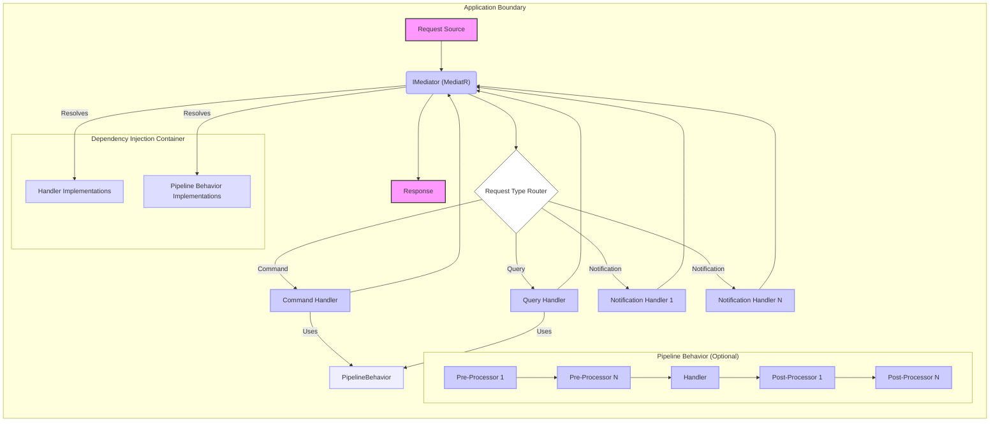

## Project Design Document: MediatR Integration (Improved)

**1. Introduction**

This document details the design of a system integrating the MediatR library (https://github.com/jbogard/mediatr) for facilitating in-process messaging. This design serves as the foundation for subsequent threat modeling activities. MediatR, a .NET library, implements a mediator pattern, decoupling request origins from their respective handlers. This design focuses on the architectural integration of MediatR within a hypothetical application, emphasizing key components, interactions, and data flows relevant to security considerations.

**2. Goals**

*   Provide a clear and comprehensive architectural blueprint for a system utilizing MediatR.
*   Explicitly identify and describe the key components and their interactions within the MediatR integration.
*   Illustrate the journey of requests and responses within the system.
*   Offer sufficient technical detail to enable effective and targeted threat modeling.

**3. Scope**

This document outlines the logical and conceptual architecture and data flow of a system employing MediatR. The focus is on the internal workings of the application and the role of MediatR. External integrations, infrastructure specifics, and deployment details are excluded unless directly impacting MediatR's functionality or security.

**4. System Overview**

The system leverages MediatR to implement architectural patterns such as Command Query Responsibility Segregation (CQRS) and event notification. Instead of direct inter-component method invocations, requests are dispatched to the `IMediator` interface. MediatR then routes these requests to the appropriate handler(s). This approach promotes loose coupling, enhances modularity, and improves the overall maintainability and testability of the application. The system relies on a dependency injection (DI) container to manage the lifecycle and dependencies of handlers and pipeline behaviors.

**5. Architectural Design**

**5.1. Components**

*   **Request Source:** The entity initiating an action within the application. Examples include:
    *   A user interface element (e.g., a button click).
    *   An API endpoint receiving an external request.
    *   A background service or scheduled job.
    *   Another internal component of the application.
*   **IMediator (MediatR):** The central interface provided by the MediatR library. It acts as the intermediary, receiving requests and dispatching them to the appropriate handlers.
*   **Request Type Router:** A logical component within MediatR responsible for determining the correct handler(s) to invoke based on the specific type of the incoming request object. This routing is typically based on convention or explicit configuration.
*   **Command Handler:** A component responsible for executing commands that alter the application's state. It receives a command object encapsulating the action to be performed and the necessary data.
*   **Query Handler:** A component responsible for retrieving data from the application's state without modifying it. It receives a query object specifying the data to be fetched and any filtering or sorting criteria.
*   **Notification Handler:** A component that reacts to events or notifications published through MediatR. Multiple notification handlers can subscribe to the same notification, allowing for decoupled event-driven behavior.
*   **Response:** The output generated by a command or query handler, which is returned to the originating request source. Notifications typically do not have a return value.
*   **Pipeline Behavior (Optional):** Interceptors that can be configured to execute before and/or after handlers. They enable the implementation of cross-cutting concerns such as:
    *   Logging
    *   Input validation
    *   Authorization checks
    *   Transaction management
    *   Performance monitoring
*   **Dependency Injection Container:**  An external component (e.g., Autofac, Microsoft.Extensions.DependencyInjection) responsible for managing the instantiation and lifecycle of handlers and pipeline behaviors. MediatR relies on the DI container to resolve handler dependencies.
*   **Handler Implementations:** Concrete classes that implement the `IRequestHandler<TRequest, TResponse>` or `INotificationHandler<TNotification>` interfaces, containing the business logic for handling specific requests or notifications.
*   **Pipeline Behavior Implementations:** Concrete classes that implement the `IPipelineBehavior<TRequest, TResponse>` interface, containing the logic for cross-cutting concerns.

**6. Data Flow**

The typical flow of a request through the system is as follows:

1. A **Request Source** creates a specific request object (either a command, query, or notification), encapsulating the necessary data.
2. The **Request Source** dispatches the request object to the `IMediator` interface.
3. The `IMediator`'s internal **Request Type Router** analyzes the type of the incoming request object.
4. Based on the request type, the **Request Type Router** identifies the corresponding handler(s) registered with the **Dependency Injection Container**.
5. **For Commands and Queries:**
    *   If **Pipeline Behaviors** are configured for the specific request type, the pre-processors within the pipeline are executed sequentially, in the order of registration.
    *   The `IMediator` resolves the appropriate **Command Handler** or **Query Handler** from the **Dependency Injection Container**.
    *   The request is dispatched to the resolved handler.
    *   The handler executes the business logic and generates a **Response** object.
    *   If **Pipeline Behaviors** are configured, the post-processors within the pipeline are executed sequentially.
    *   The **Response** is returned to the `IMediator`.
6. **For Notifications:**
    *   The `IMediator` identifies all registered **Notification Handlers** for the specific notification type from the **Dependency Injection Container**.
    *   The notification is dispatched to each registered **Notification Handler**.
    *   Each **Notification Handler** independently processes the notification. Notification handlers typically do not return a value.
7. The `IMediator` returns the **Response** (for commands and queries) to the originating **Request Source**.

**7. Security Considerations**

This section outlines potential security considerations arising from the MediatR integration design. These points will be further investigated during dedicated threat modeling sessions.

*   **Unauthorized Request Handling:** Ensure that only authorized request sources can trigger specific commands or queries. This can be enforced through:
    *   Authorization checks within the request source itself.
    *   Implementing authorization logic within pipeline behaviors.
    *   Utilizing attribute-based authorization on handlers.
*   **Input Validation Vulnerabilities:** Handlers must implement robust validation of incoming request data to prevent vulnerabilities such as:
    *   SQL injection (if query handlers directly construct database queries).
    *   Cross-site scripting (XSS) if handler outputs are directly rendered in a web UI.
    *   Command injection if handler logic executes external commands based on request data.
*   **Sensitive Data Exposure:** Avoid logging or unintentionally exposing sensitive information within:
    *   Request objects themselves.
    *   Response objects.
    *   During pipeline processing (e.g., in logging behaviors).
    *   In exception handling mechanisms.
*   **Denial of Service (DoS) Attacks:** Malicious actors might attempt to overwhelm the system by sending a large volume of requests. Mitigation strategies include:
    *   Implementing rate limiting at the request source or API gateway level.
    *   Employing circuit breaker patterns to prevent cascading failures.
    *   Proper resource management within handlers to prevent resource exhaustion.
*   **Security of Pipeline Behaviors:** Custom pipeline behaviors represent a potential attack surface. Ensure that:
    *   Behaviors are developed with security best practices in mind.
    *   Behaviors do not introduce new vulnerabilities (e.g., logging sensitive data).
    *   The order of pipeline behaviors is carefully considered, as the order can impact security enforcement.
*   **Notification Handling Security:** Consider the security implications of unauthorized components subscribing to and receiving notifications. This could lead to:
    *   Information disclosure if notifications contain sensitive data.
    *   The ability to trigger unintended actions if notification handlers perform state-changing operations.
*   **Injection Attacks via Request Objects:** If request objects are constructed based on external input, they could be susceptible to injection attacks if not properly sanitized or validated *before* being processed by handlers.
*   **Dependency Injection Configuration Vulnerabilities:** Ensure the DI container is configured securely to prevent:
    *   Registration of malicious or unintended handlers.
    *   Exposure of sensitive configuration data.
    *   Unexpected object lifecycles that could lead to security issues.

**8. Assumptions and Constraints**

*   The application operates within a single process, and MediatR is used for in-memory communication.
*   The registration of handlers and pipeline behaviors with the `IMediator` via the dependency injection container is assumed to be a secure and controlled process.
*   The underlying infrastructure and hosting environment are assumed to have their own security measures and controls in place.

**9. Future Considerations**

*   Integration with distributed tracing and logging systems to facilitate request tracking and auditing across different components and services.
*   Implementation of more granular and flexible authorization mechanisms within the MediatR pipeline, potentially using policy-based authorization.
*   Exploration of asynchronous request handling patterns for long-running or non-blocking operations to improve responsiveness.
*   Consideration of using message contracts or schemas to enforce the structure and validity of request and response objects.

This improved design document provides a more detailed and security-focused overview of a system utilizing MediatR. It serves as a more robust foundation for subsequent threat modeling activities, enabling a more comprehensive identification and mitigation of potential security risks.
