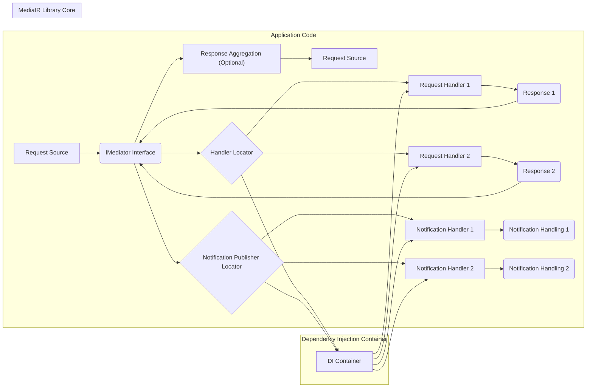
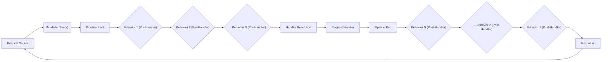

# Project Design Document: MediatR Library (Improved)

## 1. Introduction

### 1.1 Project Overview

MediatR is a lightweight .NET library implementing the Mediator pattern, Command Query Responsibility Segregation (CQRS), and Publish-Subscribe patterns for in-process messaging. It promotes decoupling by enabling communication between application components without direct dependencies. Requests are sent to a mediator, which dispatches them to appropriate handlers, and notifications are published to subscribers.

This document provides a detailed design overview of the MediatR library, specifically tailored for threat modeling and security analysis. It outlines the architecture, key components, data flow, and security considerations relevant to applications integrating MediatR.

### 1.2 Target Audience

This document is intended for:

*   Software Developers and Architects utilizing MediatR in their applications.
*   Security Engineers and Threat Modelers responsible for assessing the security posture of applications using MediatR.
*   Anyone seeking a comprehensive understanding of MediatR's internal design and its security implications.

### 1.3 Document Purpose

The primary purpose of this document is to serve as a robust foundation for threat modeling the MediatR library within the context of an application. By providing a clear and detailed design description, this document facilitates the identification of potential security vulnerabilities and the development of effective mitigation strategies.

## 2. System Architecture

### 2.1 High-Level Architecture Diagram

### 2.2 Architectural Overview

MediatR's architecture is centered around decoupling request initiation from request handling through an in-process mediator.  It relies heavily on Dependency Injection (DI) to manage handlers and behaviors. Key architectural elements are:

*   **`IMediator` Interface:** The central point of interaction with MediatR. Applications use this interface to send commands, queries, and publish notifications. It abstracts away the handler resolution and dispatching logic.
*   **Request Handlers (`IRequestHandler<TRequest, TResponse>`):**  Implementations of specific business logic for processing requests. Each handler is responsible for a particular type of request (`TRequest`) and produces a response (`TResponse`). Handlers are registered and resolved via the DI container.
*   **Notification Handlers (`INotificationHandler<TNotification>`):** Implementations that subscribe to and handle specific notification types (`TNotification`). Multiple handlers can subscribe to the same notification, enabling a publish-subscribe pattern.  These are also managed by the DI container.
*   **Pipeline Behaviors (`IPipelineBehavior<TRequest, TResponse>`):**  Implement cross-cutting concerns that execute before and after request handlers. Behaviors form a pipeline, allowing for modular and reusable logic like validation, authorization, logging, and transaction management.
*   **Dependency Injection (DI) Container:**  An external DI container is essential for MediatR. It's used to register and resolve handlers, notification handlers, and pipeline behaviors. MediatR is agnostic to the specific DI container used, supporting any container compatible with .NET's `IServiceProvider`.

## 3. Component Description

### 3.1 `IMediator` Interface

*   **Functionality:**  The core interface for application interaction with MediatR. Provides methods for:
    *   `Send<TResponse>(IRequest<TResponse> request)`: Sends a request to a single, designated handler and returns a response. Used for commands and queries where a single result is expected.
    *   `Send<TResponse>(IRequest<IEnumerable<TResponse>> request)`: Sends a request that can be handled by multiple handlers, returning a collection of responses. Useful for scenarios like retrieving data from multiple sources.
    *   `Publish(object notification)` / `Publish<TNotification>(TNotification notification)`: Publishes a notification to all registered notification handlers. Notifications are fire-and-forget events.
    *   `CreateStream<TResponse>(IStreamRequest<TResponse> request)`: Sends a streaming request to a handler, enabling asynchronous streaming of responses.
*   **Security Relevance:**  `IMediator` itself is primarily an orchestrator and doesn't enforce security directly. However, it's the central entry point for all operations, making it a strategic location to implement application-level security measures, such as:
    *   **Request Logging and Auditing:** Intercepting calls to `IMediator` to log request details for audit trails.
    *   **Global Exception Handling:** Implementing a wrapper around `IMediator` to handle exceptions consistently.
    *   **Contextual Authorization:**  Potentially using a decorator pattern around `IMediator` to enforce high-level authorization checks before requests are dispatched.

### 3.2 Request Handlers (`IRequestHandler<TRequest, TResponse>`)

*   **Functionality:**  Implement the core business logic for processing specific request types. They receive a request object and return a response. Handlers should be focused on business logic and delegate cross-cutting concerns to behaviors.
*   **Security Relevance:** Request handlers are the most critical components from a security perspective as they directly interact with application data and business rules. Security considerations include:
    *   **Input Validation:**  **Mandatory**. Handlers must rigorously validate all incoming request data to prevent injection attacks (SQL, command, etc.), data corruption, and unexpected behavior. Use strong typing and validation libraries.
    *   **Authorization:** **Crucial**. Handlers must enforce authorization rules to ensure that only authorized users or processes can execute the requested operations. Implement role-based access control (RBAC) or attribute-based access control (ABAC) as needed.
    *   **Data Access Control:** Handlers must implement secure data access patterns, adhering to the principle of least privilege. Use parameterized queries or ORMs to prevent SQL injection.
    *   **Sensitive Data Handling:**  Handlers dealing with sensitive data (PII, secrets) must implement appropriate security measures like encryption, masking, and secure storage. Avoid logging sensitive data.
    *   **Error Handling & Information Disclosure:**  Handlers should handle errors gracefully and avoid exposing sensitive information in error messages or stack traces. Implement proper exception handling and logging.

### 3.3 Notification Handlers (`INotificationHandler<TNotification>`)

*   **Functionality:**  Handle notifications published via `IMediator.Publish()`. They react to events within the application. Multiple handlers can respond to the same notification.
*   **Security Relevance:** While notifications are typically for events, security is still relevant:
    *   **Information Disclosure via Notifications:**  Ensure notifications do not inadvertently broadcast sensitive information to unintended handlers. Carefully design notification payloads.
    *   **Notification Storms & DoS:**  Poorly designed or excessive notifications can lead to performance issues or even denial of service if handlers perform resource-intensive operations. Consider rate limiting or throttling notification publishing if necessary.
    *   **Side-Effect Security:**  Actions performed by notification handlers (e.g., sending emails, updating external systems) must be secure. Validate data before external calls and handle failures gracefully.
    *   **Handler Execution Context:** Be mindful of the execution context of notification handlers, especially in concurrent environments. Ensure handlers are thread-safe if necessary.

### 3.4 Pipeline Behaviors (`IPipelineBehavior<TRequest, TResponse>`)

*   **Functionality:**  Implement cross-cutting concerns in a modular and reusable way. Behaviors form a pipeline that requests pass through before and after handlers. Common uses include:
    *   **Validation:** Centralized request validation.
    *   **Authorization:** Enforcing authorization rules before handlers execute.
    *   **Logging:** Request/response logging and auditing.
    *   **Transaction Management:**  Wrapping handler execution within transactions.
    *   **Caching:** Implementing caching logic for requests and responses.
    *   **Performance Monitoring:**  Measuring request processing time.
*   **Security Relevance:** Behaviors are powerful and have significant security implications:
    *   **Centralized Security Enforcement:** Behaviors are ideal for implementing centralized security policies like authorization and validation, ensuring consistent enforcement across all requests.
    *   **Authorization Behavior:** Implement an authorization behavior early in the pipeline to prevent unauthorized requests from reaching handlers.
    *   **Validation Behavior:** Implement a validation behavior to ensure requests are valid before processing, reducing the attack surface of handlers.
    *   **Security Logging & Auditing Behavior:** Implement a behavior to log security-relevant events, such as authorization failures, input validation errors, and sensitive data access.
    *   **Vulnerability Introduction via Behaviors:**  Incorrectly implemented behaviors can introduce vulnerabilities. For example, a poorly written validation behavior might bypass crucial checks, or a logging behavior might insecurely log sensitive data.
    *   **Behavior Pipeline Order:** The order of behaviors in the pipeline is critical for security. Ensure authorization behaviors execute *before* validation behaviors and logging behaviors execute appropriately to capture relevant events.

### 3.5 Dependency Injection Container

*   **Functionality:**  Manages the registration and resolution of handlers, notification handlers, and behaviors. MediatR relies on an external DI container for dependency management.
*   **Security Relevance:**  While not directly part of MediatR's code, the DI container configuration and security are vital:
    *   **Secure Registration:** Ensure only intended and trusted handlers, publishers, and behaviors are registered in the DI container. Prevent registration of malicious or unintended components.
    *   **Dependency Security:**  The security of the DI container itself and its dependencies is important. Keep DI container libraries updated and scan for vulnerabilities.
    *   **Configuration Security:**  Securely manage DI configuration, especially if it includes sensitive information like connection strings or API keys. Avoid hardcoding secrets in configuration files. Use secure configuration providers (e.g., Azure Key Vault, HashiCorp Vault).
    *   **Service Lifetime Management & Scope:**  Incorrect service lifetimes (e.g., singleton for stateful handlers in a web application) can lead to concurrency issues and potential vulnerabilities. Carefully consider the appropriate service lifetime (Singleton, Scoped, Transient) for handlers and behaviors.
    *   **Container Exposure:**  Limit the exposure of the DI container itself. Avoid directly exposing the container to untrusted code.

## 4. Data Flow

### 4.1 Request/Response Flow Diagram (Detailed Pipeline)

### 4.2 Detailed Data Flow Description

1.  **Request Initiation:** An application component initiates a request by calling `IMediator.Send(request)`.
2.  **Pipeline Invocation:** MediatR retrieves the configured pipeline for the request type. The pipeline is an ordered sequence of `IPipelineBehavior<TRequest, TResponse>` implementations.
3.  **Pre-Handler Behavior Execution:** Each behavior in the pipeline is executed sequentially *before* the request handler is invoked. Behaviors are executed in the order they are registered in the DI container. This phase is ideal for pre-processing tasks like validation, authorization, and logging.
4.  **Handler Resolution:** MediatR uses the DI container to resolve the appropriate `IRequestHandler<TRequest, TResponse>` implementation for the request type.
5.  **Handler Execution:** The resolved request handler is invoked to process the request and generate a response. This is where the core business logic resides.
6.  **Post-Handler Behavior Execution:** After the handler returns a response, the pipeline continues execution in *reverse* order. Behaviors are executed in the reverse order of their pre-handler execution. This phase is suitable for post-processing tasks like logging, auditing, and transaction commit/rollback.
7.  **Response Return:** The final behavior in the pipeline returns the response to the `IMediator.Send()` caller, which then returns it to the original "Request Source".

**Notification Flow:**

1.  **Notification Publication:** An application component calls `IMediator.Publish(notification)`.
2.  **Handler Resolution:** MediatR uses the DI container to resolve all registered `INotificationHandler<TNotification>` implementations for the notification type.
3.  **Handler Execution (Concurrent):** Each resolved notification handler is invoked, typically concurrently or asynchronously. The exact execution model might depend on the DI container and MediatR configuration.
4.  **No Response:** Notifications are fire-and-forget; no response is returned to the publisher.

## 5. Security Considerations (Detailed)

This section expands on the preliminary security considerations, providing more specific guidance for applications using MediatR.

*   **Input Validation (Defense in Depth):**
    *   **Behavior-Based Validation:** Implement a dedicated `ValidationBehavior` early in the pipeline to perform centralized request validation using libraries like FluentValidation. This ensures consistent validation across all requests.
    *   **Handler-Level Validation:**  *Additionally*, perform input validation within request handlers as a defense-in-depth measure. This is crucial for handling cases where behaviors might be bypassed or for more complex, handler-specific validation rules.
    *   **Schema Validation:** For API-driven applications, consider using schema validation (e.g., JSON Schema) to validate requests at the API gateway or within a behavior.

*   **Authorization (Centralized and Granular):**
    *   **Authorization Behavior:** Implement an `AuthorizationBehavior` early in the pipeline to enforce authorization policies *before* requests reach handlers. This provides centralized authorization enforcement.
    *   **Policy-Based Authorization:** Use policy-based authorization frameworks (e.g., .NET Authorization Policies) within the `AuthorizationBehavior` for flexible and maintainable authorization rules.
    *   **Handler-Level Authorization (Contextual):** For complex scenarios, perform additional authorization checks within request handlers based on specific business logic or data context.
    *   **Least Privilege:** Design authorization policies and handler logic to adhere to the principle of least privilege, granting only the necessary permissions.

*   **Logging and Auditing (Comprehensive and Secure):**
    *   **Auditing Behavior:** Implement an `AuditingBehavior` to log all requests, responses, and security-relevant events (authorization failures, validation errors).
    *   **Secure Logging:** Configure logging to securely store logs, protect them from unauthorized access, and prevent log injection vulnerabilities. Sanitize log messages to avoid logging sensitive data directly.
    *   **Audit Trails:** Ensure audit logs provide a clear and auditable trail of actions performed within the application, including user identity, timestamps, and request details.

*   **Dependency Injection Security (Hardening):**
    *   **Principle of Least Privilege for DI:** Register handlers and behaviors with the narrowest possible scope and access rights within the DI container.
    *   **Secure Configuration Management:** Use secure configuration providers (e.g., Azure Key Vault, HashiCorp Vault) to manage sensitive configuration data used by handlers and behaviors.
    *   **Dependency Scanning:** Regularly scan dependencies of the DI container and MediatR for known vulnerabilities.
    *   **Code Reviews of DI Configuration:**  Conduct code reviews of DI container configuration to identify potential misconfigurations or security weaknesses.

*   **Error Handling and Information Leakage Prevention:**
    *   **Global Exception Handling Behavior:** Implement a `GlobalExceptionHandlingBehavior` to catch exceptions within the pipeline and handle them consistently.
    *   **Error Masking:**  In production environments, mask detailed error messages and stack traces from being returned to clients. Log detailed error information securely for debugging purposes.
    *   **Custom Error Responses:** Return standardized and safe error responses to clients, avoiding information leakage.

*   **Cross-Site Scripting (XSS) and Injection Attack Prevention:**
    *   **Output Encoding:** If handlers or behaviors generate output rendered in web browsers or UIs, rigorously encode output to prevent XSS vulnerabilities. Use context-aware encoding.
    *   **Input Sanitization (Use with Caution):** While input validation is preferred, in specific cases, input sanitization might be necessary to remove potentially harmful characters. Use sanitization libraries carefully and understand their limitations.

*   **Denial of Service (DoS) Mitigation:**
    *   **Rate Limiting:** Implement rate limiting behaviors or middleware to protect against DoS attacks, especially for publicly accessible endpoints that trigger MediatR requests.
    *   **Resource Limits:** Configure resource limits (e.g., timeouts, thread pool limits) to prevent resource exhaustion from malicious or poorly performing requests or notification handlers.
    *   **Notification Throttling:** If notification handlers are resource-intensive, implement throttling mechanisms to limit the rate of notification processing.

*   **Information Disclosure Prevention:**
    *   **Data Minimization:** Design requests, responses, and notifications to minimize the amount of sensitive data transmitted.
    *   **Secure Data Handling in Handlers:**  Handlers should only access and process the data necessary for the requested operation.
    *   **Careful Logging of Sensitive Data:** Avoid logging sensitive data unnecessarily. If logging sensitive data is required for auditing, implement appropriate masking or encryption.

*   **Pipeline Security (Configuration and Order):**
    *   **Secure Pipeline Configuration:**  Carefully configure the behavior pipeline in the DI container. Only register trusted and necessary behaviors.
    *   **Behavior Order Review:**  Regularly review the order of behaviors in the pipeline to ensure security behaviors (authorization, validation) are executed appropriately and effectively.

## 6. Technologies Used

*   **Programming Language:** C# (.NET Standard 2.0 or later / .NET Framework 4.6.1 or later / .NET Core / .NET)
*   **Dependency Injection:**  Compatible with any DI container implementing `IServiceProvider` (e.g., `Microsoft.Extensions.DependencyInjection`, Autofac, StructureMap, Ninject, etc.).
*   **Asynchronous Programming:**  Built upon `async/await` for efficient non-blocking operations.
*   **NuGet Packages:** Distributed as NuGet packages for easy integration into .NET projects.

## 7. Deployment Model

MediatR is a library and is deployed as an integral part of the application that utilizes it. Its security in deployment is entirely dependent on the security of the host application and the deployment environment. Secure deployment practices for the application are crucial for the overall security posture.

## 8. Threat Modeling Considerations (Actionable)

For effective threat modeling of applications using MediatR, consider the following actionable steps:

1.  **Identify Request Handlers as Primary Attack Surface:** Focus threat modeling efforts on request handlers, as they contain business logic and data access points.
    *   **STRIDE Analysis per Handler:** Perform STRIDE (Spoofing, Tampering, Repudiation, Information Disclosure, Denial of Service, Elevation of Privilege) analysis for each request handler to identify potential threats related to input validation, authorization, data handling, and error handling.
    *   **Data Flow Diagrams per Handler:** Create data flow diagrams for critical request handlers to visualize data flow and identify potential points of vulnerability.

2.  **Analyze Pipeline Behaviors for Security Impact:** Examine pipeline behaviors for their security implications, both positive (security enhancements) and negative (potential vulnerabilities).
    *   **Behavior Functionality Review:**  For each behavior, analyze its functionality and potential security impact. Consider behaviors for authorization, validation, logging, and error handling as critical security components.
    *   **Behavior Order Assessment:**  Evaluate the order of behaviors in the pipeline to ensure security behaviors are executed in the correct sequence (e.g., authorization before validation).

3.  **Map Notifications and Handlers for Information Flow:** Analyze notification flows to identify potential information disclosure or DoS risks.
    *   **Notification Payload Review:** Review notification payloads to ensure they do not inadvertently expose sensitive information.
    *   **Notification Handler Analysis:** Analyze notification handlers for potential resource consumption and DoS vulnerabilities.

4.  **Assess Dependency Injection Configuration Security:** Review the DI container configuration for security misconfigurations and potential dependency vulnerabilities.
    *   **DI Registration Audit:** Audit DI registrations to ensure only trusted components are registered and that service lifetimes are appropriately configured.
    *   **Configuration Security Review:** Review DI configuration for secure management of sensitive data (connection strings, API keys).

5.  **Trace Data Flow Paths Through MediatR:**  Trace data flow paths through the MediatR pipeline for critical requests to identify potential points of vulnerability or data leakage.
    *   **End-to-End Request Tracing:** Trace the flow of sensitive data from request initiation to response return, identifying all components and behaviors involved.
    *   **Data Transformation Analysis:** Analyze data transformations within handlers and behaviors to ensure data integrity and prevent unintended data modification or exposure.

By focusing threat modeling efforts on these specific areas and using the actionable steps outlined above, security engineers and developers can effectively identify and mitigate potential security vulnerabilities in applications utilizing the MediatR library.