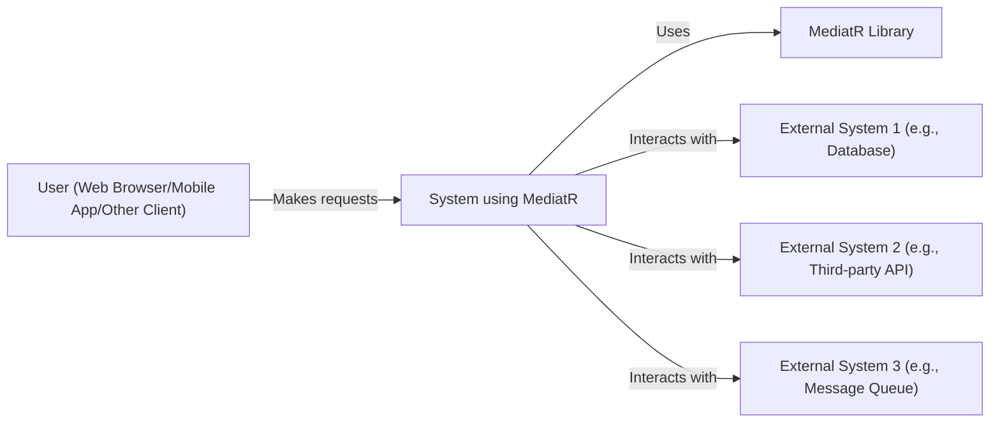
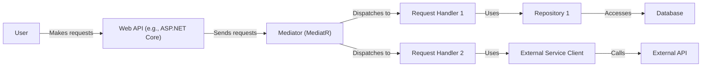
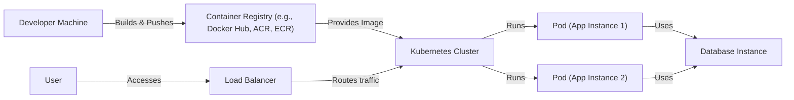
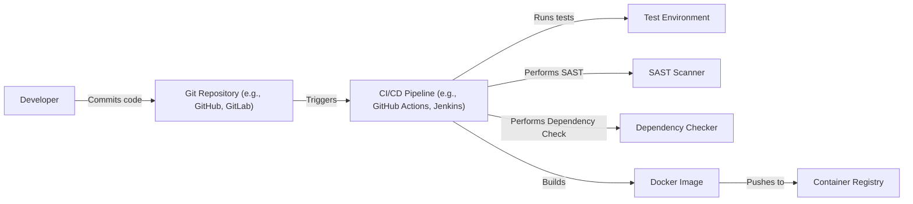

Okay, let's create a design document for the MediatR library, focusing on its use within a larger system and addressing security considerations.

# BUSINESS POSTURE

Business Priorities and Goals:

MediatR, as a library, doesn't directly address business problems. Instead, it facilitates a specific architectural pattern (mediator pattern) that aims to:

*   Reduce direct dependencies between different parts of an application.
*   Improve code maintainability and testability by decoupling request handling logic.
*   Promote a cleaner separation of concerns.
*   Simplify complex workflows by breaking them down into smaller, manageable units.

The *business goals* achieved by using MediatR are therefore indirect and relate to software development best practices:

*   Faster development cycles (due to improved maintainability).
*   Reduced risk of bugs (due to better testability and separation of concerns).
*   Easier onboarding of new developers (due to a more structured codebase).
*   More adaptable code that can respond to changing business requirements.

Most Important Business Risks:

*   Incorrect Implementation: If MediatR is misused (e.g., handlers become overly complex, the mediator itself becomes a bottleneck), it can negate its benefits and introduce new problems.  This is a *development process risk*.
*   Over-Engineering: For very simple applications, using MediatR might be overkill, adding unnecessary complexity. This is a *design risk*.
*   Dependency Management: Although MediatR itself has minimal external dependencies, the overall application using it will have its own set of dependencies. Managing these dependencies securely is crucial. This is a *supply chain risk*.
*   Security Vulnerabilities in Handlers: The code within the request handlers is where the actual business logic resides.  Vulnerabilities here are the primary security concern, and MediatR itself doesn't inherently mitigate these. This is an *application security risk*.

# SECURITY POSTURE

Existing Security Controls (as inferred from the library and common usage patterns):

*   security control: Dependency Management: The library itself has few dependencies, reducing the attack surface from external libraries. (Refer to the .csproj file in the repository).
*   security control: Code Simplicity: The core MediatR library is relatively small and focused, making it easier to audit and understand. (Review the source code in the repository).
*   security control: Promotes Testability: The design encourages writing unit tests for individual handlers, which can help catch security flaws early. (Testing is a general development practice, not explicitly enforced by MediatR).

Accepted Risks:

*   accepted risk: Handler Vulnerabilities: MediatR does not perform any input validation, output encoding, or authorization checks within the library itself. These are the responsibility of the developer implementing the handlers.
*   accepted risk: Asynchronous Processing Risks: If using asynchronous handlers, developers must be aware of potential issues like race conditions, deadlocks, and exception handling in asynchronous contexts.
*   accepted risk: Over-reliance on Mediator: Developers might be tempted to put too much logic into the mediator itself or create overly complex handler chains, leading to performance or maintainability issues.

Recommended Security Controls (High Priority):

*   security control: Input Validation: Implement robust input validation in *every* request handler to prevent common vulnerabilities like injection attacks (SQL injection, command injection, XSS).
*   security control: Output Encoding: Ensure proper output encoding is used when data is rendered to prevent XSS vulnerabilities. This is particularly relevant if handlers are used in web applications.
*   security control: Authorization: Implement authorization checks within handlers to ensure that users have the necessary permissions to perform the requested actions.
*   security control: Secure Configuration Management: If handlers rely on configuration settings (e.g., database connection strings, API keys), these should be stored and managed securely.
*   security control: Logging and Monitoring: Implement comprehensive logging and monitoring to detect and respond to security incidents.  Log relevant events within handlers, and monitor for unusual activity.
*   security control: Dependency Scanning: Regularly scan all project dependencies (including MediatR and any libraries used within handlers) for known vulnerabilities.
*   security control: Static Code Analysis: Integrate static code analysis tools (SAST) into the development pipeline to identify potential security flaws in handlers.

Security Requirements:

*   Authentication: MediatR itself does not handle authentication. Authentication should be handled *before* a request reaches the mediator. This is typically done at the application's entry point (e.g., API controller, web page).
*   Authorization: Authorization checks *should* be performed within the relevant request handlers.  Each handler should verify that the authenticated user (or system) has the necessary permissions to execute the requested operation.
*   Input Validation: *Every* request handler should validate all input data it receives. This includes checking data types, lengths, formats, and allowed values.  Use a whitelist approach whenever possible (define what is allowed, reject everything else).
*   Cryptography: If handlers need to perform cryptographic operations (e.g., hashing passwords, encrypting data), they should use well-established cryptographic libraries and follow best practices (e.g., using appropriate key lengths, secure random number generators, avoiding deprecated algorithms). MediatR itself does not provide cryptographic functionality.
*   Error Handling: Handlers should handle errors gracefully and avoid leaking sensitive information in error messages.

# DESIGN

## C4 CONTEXT

C4 Context Element List:

*   Element:
    *   Name: User
    *   Type: Person
    *   Description: Represents any user or client application interacting with the system.
    *   Responsibilities: Initiates requests to the system.
    *   Security Controls: Authentication mechanisms (e.g., OAuth, JWT, API keys) at the system boundary.

*   Element:
    *   Name: System using MediatR
    *   Type: Software System
    *   Description: The overall application or system that utilizes the MediatR library for internal request handling.
    *   Responsibilities: Processes user requests, orchestrates business logic, interacts with external systems.
    *   Security Controls: Input validation, output encoding, authorization, secure configuration management, logging and monitoring, error handling.

*   Element:
    *   Name: MediatR Library
    *   Type: Library
    *   Description: The MediatR library itself, providing the mediator pattern implementation.
    *   Responsibilities: Facilitates communication between request senders and handlers.
    *   Security Controls: Limited attack surface due to small codebase and few dependencies.

*   Element:
    *   Name: External System 1 (e.g., Database)
    *   Type: Software System
    *   Description: An external system, such as a database, that the main system interacts with.
    *   Responsibilities: Stores and retrieves data.
    *   Security Controls: Database security best practices (e.g., access control, encryption, auditing).

*   Element:
    *   Name: External System 2 (e.g., Third-party API)
    *   Type: Software System
    *   Description: An external system, such as a third-party API, that the main system interacts with.
    *   Responsibilities: Provides specific services or data.
    *   Security Controls: Secure API communication (e.g., HTTPS, API keys, rate limiting).

*   Element:
    *   Name: External System 3 (e.g., Message Queue)
    *   Type: Software System
    *   Description: An external system, such as a message queue, that the main system interacts with.
    *   Responsibilities: Asynchronous message processing.
    *   Security Controls: Secure message queue configuration (e.g., access control, encryption).

## C4 CONTAINER

C4 Container Element List:

*   Element:
    *   Name: User
    *   Type: Person
    *   Description: Represents any user or client application interacting with the system.
    *   Responsibilities: Initiates requests to the system.
    *   Security Controls: Authentication mechanisms (e.g., OAuth, JWT, API keys) at the Web API.

*   Element:
    *   Name: Web API (e.g., ASP.NET Core)
    *   Type: Container (Web Application)
    *   Description: The entry point for external requests.  Handles routing, authentication, and initial request processing.
    *   Responsibilities: Receives requests, authenticates users, forwards requests to the Mediator.
    *   Security Controls: Authentication, input validation (initial), rate limiting, TLS/HTTPS.

*   Element:
    *   Name: Mediator (MediatR)
    *   Type: Container (Component)
    *   Description: The MediatR mediator instance.  Receives requests and dispatches them to the appropriate handlers.
    *   Responsibilities: Routes requests to handlers based on request type.
    *   Security Controls: None directly within MediatR; relies on security controls in Web API and Handlers.

*   Element:
    *   Name: Request Handler 1
    *   Type: Container (Component)
    *   Description: A class that handles a specific type of request.  Contains business logic.
    *   Responsibilities: Processes a specific request, interacts with repositories or other services.
    *   Security Controls: Input validation, authorization, output encoding (if applicable), error handling.

*   Element:
    *   Name: Request Handler 2
    *   Type: Container (Component)
    *   Description: Another class that handles a different type of request.
    *   Responsibilities: Processes a specific request, interacts with repositories or other services.
    *   Security Controls: Input validation, authorization, output encoding (if applicable), error handling.

*   Element:
    *   Name: Repository 1
    *   Type: Container (Component)
    *   Description: A class that handles data access for a specific entity or data source.
    *   Responsibilities: Retrieves and persists data to the database.
    *   Security Controls: Parameterized queries (to prevent SQL injection), data validation.

*   Element:
    *   Name: Service 1
    *   Type: Container (Component)
    *   Description: A class that handles communication with an external service.
    *   Responsibilities: Makes requests to the External API.
    *   Security Controls: Secure API communication (HTTPS, API keys), input validation, error handling.

*   Element:
    *   Name: Database
    *   Type: Container (Database)
    *   Description: The database used by the application.
    *   Responsibilities: Stores and retrieves data.
    *   Security Controls: Database security best practices (access control, encryption, auditing).

*   Element:
    *   Name: External API
    *   Type: Container (External System)
    *   Description: A third-party API used by the application.
    *   Responsibilities: Provides specific services or data.
    *   Security Controls: Managed by the third-party provider; the application should use secure communication (HTTPS, API keys).

## DEPLOYMENT

Possible Deployment Solutions:

1.  **Cloud-Based (e.g., Azure App Service, AWS Elastic Beanstalk, Google App Engine):** The application is packaged and deployed as a web application to a managed cloud platform.
2.  **Containerized (e.g., Docker, Kubernetes):** The application is containerized using Docker and deployed to a container orchestration platform like Kubernetes.
3.  **Virtual Machine (e.g., Azure VM, AWS EC2):** The application is deployed to a virtual machine running a web server (e.g., IIS, Nginx).
4.  **On-Premise Server:** The application is deployed to a physical or virtual server within the organization's own data center.

Chosen Solution (for detailed description): **Containerized (Docker & Kubernetes)**

Deployment Element List:

*   Element:
    *   Name: Developer Machine
    *   Type: Infrastructure Node
    *   Description: The developer's workstation where code is written and built.
    *   Responsibilities: Code development, building Docker images.
    *   Security Controls: Local development environment security (e.g., firewall, antivirus).

*   Element:
    *   Name: Container Registry (e.g., Docker Hub, ACR, ECR)
    *   Type: Infrastructure Node
    *   Description: A repository for storing and managing Docker images.
    *   Responsibilities: Stores Docker images, provides images to the Kubernetes cluster.
    *   Security Controls: Access control, image scanning for vulnerabilities.

*   Element:
    *   Name: Kubernetes Cluster
    *   Type: Infrastructure Node
    *   Description: The Kubernetes cluster where the application is deployed.
    *   Responsibilities: Orchestrates container deployment, scaling, and management.
    *   Security Controls: Kubernetes security best practices (e.g., RBAC, network policies, pod security policies).

*   Element:
    *   Name: Pod (App Instance 1)
    *   Type: Infrastructure Node
    *   Description: A running instance of the application container.
    *   Responsibilities: Executes the application code.
    *   Security Controls: Container security best practices (e.g., minimal base image, non-root user).

*   Element:
    *   Name: Pod (App Instance 2)
    *   Type: Infrastructure Node
    *   Description: Another running instance of the application container (for scaling and redundancy).
    *   Responsibilities: Executes the application code.
    *   Security Controls: Container security best practices (e.g., minimal base image, non-root user).

*   Element:
    *   Name: Database Instance
    *   Type: Infrastructure Node
    *   Description: The database instance used by the application.
    *   Responsibilities: Stores and retrieves data.
    *   Security Controls: Database security best practices (access control, encryption, auditing).

*   Element:
    *   Name: Load Balancer
    *   Type: Infrastructure Node
    *   Description: Distributes incoming traffic across multiple application instances.
    *   Responsibilities: Load balancing, SSL termination (potentially).
    *   Security Controls: Secure configuration, DDoS protection (potentially).
* Element:
    * Name: User
    * Type: Person
    * Description: User accessing application.
    * Responsibilities: Access application.
    * Security Controls: Authentication.

## BUILD

Build Process Description:

1.  **Code Commit:** Developers commit code changes to a Git repository (e.g., GitHub, GitLab).
2.  **CI/CD Trigger:** The code commit triggers a CI/CD pipeline (e.g., GitHub Actions, Jenkins).
3.  **Testing:** The pipeline runs automated tests (unit tests, integration tests) in a test environment.
4.  **Static Analysis (SAST):** A SAST scanner analyzes the source code for potential security vulnerabilities.
5.  **Dependency Checking:** A dependency checker scans the project's dependencies for known vulnerabilities.
6.  **Build:** If all tests and security checks pass, the pipeline builds a Docker image containing the application.
7.  **Push to Registry:** The Docker image is pushed to a container registry (e.g., Docker Hub, Azure Container Registry, Amazon ECR).

Security Controls in Build Process:

*   security control: Git Repository Access Control: Restrict access to the Git repository to authorized developers only.
*   security control: CI/CD Pipeline Security: Secure the CI/CD pipeline itself (e.g., using secrets management, access control).
*   security control: Automated Testing: Run comprehensive automated tests to catch bugs and potential security flaws early.
*   security control: Static Application Security Testing (SAST): Integrate SAST tools to identify vulnerabilities in the source code.
*   security control: Dependency Scanning: Use tools to scan project dependencies for known vulnerabilities.
*   security control: Container Image Scanning: Scan the built Docker image for vulnerabilities before pushing it to the registry.
*   security control: Build Artifact Signing: Digitally sign build artifacts to ensure their integrity.

# RISK ASSESSMENT

Critical Business Processes:

*   The critical business processes depend on the *specific application* using MediatR. MediatR itself is a technical enabler, not a business process. Examples of business processes that *might* be supported by an application using MediatR:
    *   User registration and authentication.
    *   Order processing.
    *   Financial transactions.
    *   Data management and reporting.
    *   Content delivery.

Data Sensitivity:

*   Again, this depends on the *specific application*.  MediatR doesn't handle data directly, but the handlers within the application will.  Examples of data that *might* be handled:
    *   Personally Identifiable Information (PII): Names, addresses, email addresses, phone numbers (High Sensitivity).
    *   Financial Data: Credit card numbers, bank account details (High Sensitivity).
    *   Authentication Credentials: Usernames, passwords, API keys (High Sensitivity).
    *   Business Data: Sales figures, customer data, internal documents (Variable Sensitivity - depends on the specific data).
    *   Application Configuration Data: Database connection strings, API keys (High Sensitivity).
    *   User Generated Content: Comments, posts, uploaded files (Variable Sensitivity).

# QUESTIONS & ASSUMPTIONS

Questions:

*   What specific type of application will be using MediatR? (e.g., web application, API, background service)
*   What external systems will the application interact with? (e.g., databases, third-party APIs, message queues)
*   What are the specific security requirements of the application? (e.g., compliance regulations, data sensitivity)
*   What is the deployment environment for the application? (e.g., cloud, on-premise, containerized)
*   What is the existing CI/CD pipeline and build process?
*   What level of logging and monitoring is required?

Assumptions:

*   BUSINESS POSTURE: The organization values code quality, maintainability, and security.
*   SECURITY POSTURE: The organization has a basic understanding of secure software development practices. There are existing security controls for authentication.
*   DESIGN: The application will be designed using a modular approach, with clear separation of concerns. The application will likely interact with at least one external system (e.g., a database). The deployment will be containerized using Docker and Kubernetes. The build process will involve a CI/CD pipeline with automated testing and security checks.