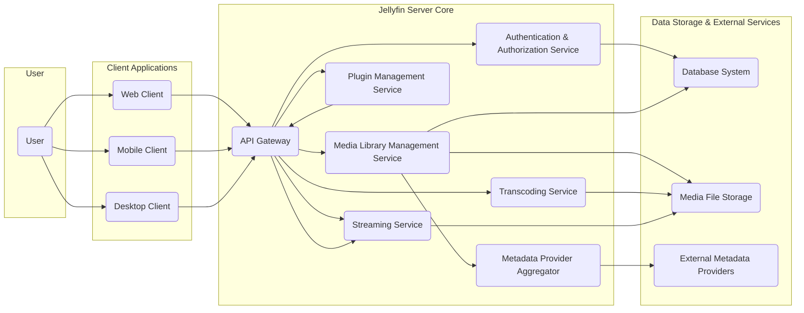
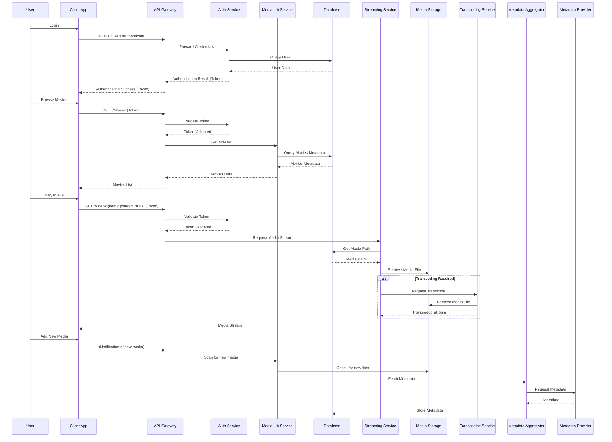

## Project Design Document: Jellyfin Media Server (Improved)

**1. Introduction**

This document provides an enhanced design overview of the Jellyfin media server project. Jellyfin is a free and open-source media system designed to give users complete control over their media libraries. It serves as an alternative to proprietary solutions, emphasizing user privacy and freedom. This document details the system's architecture, component interactions, and data flow, serving as a critical input for subsequent threat modeling activities.

**2. Goals**

* To provide a more detailed and refined overview of the Jellyfin system architecture.
* To clearly define the responsibilities and interactions of key components.
* To illustrate the data flow within the system with greater precision.
* To expand upon critical security considerations relevant to threat modeling.
* To serve as a comprehensive and accurate foundation for future threat modeling exercises and security analysis.

**3. Scope**

This document encompasses the core elements of the Jellyfin server and its interactions with various client types and external services. The scope includes:

* The Jellyfin server application and its internal modules.
* The web client interface and its communication with the server.
* Mobile and desktop client applications (described at a functional level).
* Media storage mechanisms and access patterns.
* The database system used for metadata and configuration.
* Authentication, authorization, and user management processes.
* The plugin architecture and its implications.
* Key external dependencies and integrations.

The following are explicitly excluded from the scope of this document:

* In-depth implementation details of specific client applications (mobile, desktop).
* Low-level code implementation specifics of individual server modules.
* Detailed network infrastructure beyond the immediate Jellyfin deployment environment.
* Specific configurations and customizations made by individual users.

**4. High-Level Architecture**

**5. Component Details**

* **User:** An individual who interacts with the Jellyfin system through a client application to access and manage media.

* **Client Applications:** Software interfaces used by users to interact with the Jellyfin server.
    * **Web Client:** A browser-based application providing a full-featured interface for media browsing, playback, and server management. It communicates with the server via RESTful API calls.
    * **Mobile Client:** Native applications for mobile operating systems (e.g., Android, iOS) designed for media consumption and some management tasks. They interact with the server's API.
    * **Desktop Client:** Native applications for desktop operating systems (e.g., Windows, macOS, Linux) offering a similar experience to the web client. They also communicate via the server's API.

* **Jellyfin Server Core:** The central application responsible for managing media, users, and streaming functionality.
    * **API Gateway:** The single entry point for all client requests. It handles request routing, authentication checks, and potentially rate limiting. It acts as a reverse proxy.
    * **Authentication & Authorization Service:** Manages user accounts, sessions, and access control.
        * Handles user registration, login, logout, and password management (including password reset).
        * Implements authentication mechanisms (e.g., username/password, potentially API keys).
        * Enforces authorization policies based on user roles and permissions for accessing specific media or server features.
    * **Media Library Management Service:** Responsible for organizing and maintaining the media library.
        * Scans configured media folders for new and updated files.
        * Identifies media types (movies, TV shows, music, etc.).
        * Organizes media into libraries based on user configuration.
        * Triggers metadata retrieval processes.
    * **Transcoding Service:** Converts media files into compatible formats for different client devices and network conditions.
        * Utilizes external libraries like FFmpeg for media encoding and decoding.
        * Supports on-the-fly transcoding for live streaming and background transcoding for pre-processing.
        * Manages transcoding profiles and settings.
    * **Metadata Provider Aggregator:**  Facilitates the retrieval of metadata for media items from various external sources.
        * Provides an abstraction layer for interacting with different metadata providers (e.g., TMDb, TheTVDB, MusicBrainz).
        * Caches retrieved metadata to improve performance and reduce API calls to external services.
    * **Plugin Management Service:** Enables the installation, management, and execution of plugins that extend Jellyfin's functionality.
        * Provides an API for plugins to interact with the core server.
        * Manages plugin dependencies and updates.
        * Handles plugin configuration and lifecycle.
    * **Streaming Service:** Manages the delivery of media streams to client applications.
        * Supports various streaming protocols (e.g., HLS, DASH, potentially WebSockets).
        * Handles session management for active streams.
        * May interact with the Transcoding Service to provide adaptive streaming.

* **Data Storage & External Services:**
    * **Database System:** Stores persistent data, including:
        * Media metadata (titles, descriptions, artwork, cast information).
        * User accounts and permissions.
        * Server configuration settings.
        * Plugin information and settings.
        * Session data.
        * Typically utilizes a relational database like SQLite (default), PostgreSQL, or MySQL.
    * **Media File Storage:** The physical storage location of the audio and video files.
        * Can be local file systems, network shares (SMB/CIFS, NFS), or cloud storage.
        * Access permissions are critical for security.
    * **External Metadata Providers:** Online services that provide metadata about media content.
        * Examples include The Movie Database (TMDb), TheTVDB, and MusicBrainz.
        * Communication typically occurs over HTTPS.

**6. Data Flow (Detailed)**

The following outlines more detailed data flow scenarios for common user interactions:

1. **User Authentication Flow:**
    * User attempts to log in via a **Client Application**.
    * **Client Application** sends a POST request containing login credentials to the **API Gateway** (`/Users/Authenticate`).
    * **API Gateway** forwards the credentials to the **Authentication & Authorization Service**.
    * **Authentication & Authorization Service** queries the **Database System** to verify the user's credentials.
    * **Database System** returns the user's stored credentials (hashed password).
    * **Authentication & Authorization Service** compares the provided credentials with the stored hash.
    * Upon successful authentication, the **Authentication & Authorization Service** generates a session token and stores it in the **Database System** (or a dedicated session store).
    * The session token is returned to the **API Gateway**.
    * **API Gateway** sends the session token back to the **Client Application**. Subsequent requests from the client will include this token for authentication.

2. **Browsing Media Library Flow:**
    * User navigates the media library within a **Client Application**.
    * **Client Application** sends a GET request to the **API Gateway** (e.g., `/Movies`, `/Shows`). The request includes the user's session token.
    * **API Gateway** validates the session token with the **Authentication & Authorization Service**.
    * **API Gateway** forwards the request to the **Media Library Management Service**.
    * **Media Library Management Service** queries the **Database System** for the requested media information.
    * **Database System** returns the relevant media metadata.
    * **Media Library Management Service** formats the data and returns it to the **API Gateway**.
    * **API Gateway** sends the media data back to the **Client Application**.

3. **Playing Media Flow:**
    * User selects a media item to play in a **Client Application**.
    * **Client Application** sends a request to the **API Gateway** to initiate playback (e.g., `GET /Videos/{ItemId}/stream.m3u8` for HLS). The request includes the session token.
    * **API Gateway** validates the session token.
    * **API Gateway** forwards the request to the **Streaming Service**.
    * **Streaming Service** retrieves the path to the media file from the **Database System**.
    * **Streaming Service** accesses the **Media File Storage** to retrieve the media file.
    * If transcoding is required (based on client capabilities or user settings), the **Streaming Service** requests the **Transcoding Service** to convert the media.
    * **Transcoding Service** retrieves the media file from **Media File Storage**, transcodes it, and provides the transcoded stream to the **Streaming Service**.
    * The **Streaming Service** delivers the media stream (either the original file or the transcoded stream) to the **Client Application**.

4. **Metadata Retrieval Flow:**
    * When new media is added or metadata needs to be refreshed, the **Media Library Management Service** identifies the media item.
    * **Media Library Management Service** queries the **Database System** to check if metadata already exists.
    * If metadata is missing or needs updating, the **Media Library Management Service** interacts with the **Metadata Provider Aggregator**.
    * **Metadata Provider Aggregator** selects appropriate **External Metadata Providers** based on configuration and media type.
    * **Metadata Provider Aggregator** sends requests to the **External Metadata Providers** (e.g., TMDb API).
    * **External Metadata Providers** return metadata (artwork, descriptions, etc.).
    * **Metadata Provider Aggregator** processes and normalizes the metadata.
    * **Media Library Management Service** stores the retrieved metadata in the **Database System**.

5. **Plugin Interaction Flow:**
    * A user installs a plugin through the **Web Client**.
    * The **Web Client** sends a request to the **API Gateway** to install the plugin.
    * **API Gateway** forwards the request to the **Plugin Management Service**.
    * **Plugin Management Service** downloads the plugin (if necessary), verifies its integrity, and installs it.
    * The **Plugin Management Service** may update the **Database System** with plugin information.
    * When a plugin needs to execute, the **API Gateway** or other server components interact with the **Plugin Management Service** to invoke the plugin's functionality. Plugins can interact with other server components and the **Database System** through defined APIs.

**7. Security Considerations (Expanded)**

* **Authentication and Authorization:**
    * **Strong Password Hashing:** Utilizing robust hashing algorithms (e.g., Argon2) with per-user salts to protect user passwords.
    * **Secure Session Management:** Employing secure session identifiers, proper session expiration, and protection against session fixation and hijacking attacks.
    * **Role-Based Access Control (RBAC):** Implementing a granular permission system based on user roles to restrict access to sensitive features and media.
    * **Multi-Factor Authentication (MFA):** Supporting MFA mechanisms (e.g., TOTP) to enhance account security.
    * **Brute-Force Protection:** Implementing rate limiting and account lockout mechanisms to prevent brute-force attacks on login endpoints.

* **Data Storage Security:**
    * **Media File Permissions:** Enforcing strict file system permissions on media files to prevent unauthorized access at the operating system level.
    * **Database Security:** Secure database configuration, strong authentication for database access, and potentially encryption of sensitive data at rest within the database.
    * **Backup and Recovery:** Implementing secure backup and recovery procedures to protect against data loss.

* **Network Security:**
    * **HTTPS Enforcement:** Mandating HTTPS for all communication between clients and the server to encrypt data in transit and prevent eavesdropping.
    * **Web Application Security:** Implementing measures to protect against common web application vulnerabilities, including:
        * **Cross-Site Scripting (XSS):** Input sanitization and output encoding to prevent injection of malicious scripts.
        * **Cross-Site Request Forgery (CSRF):** Utilizing anti-CSRF tokens to prevent unauthorized actions on behalf of authenticated users.
        * **SQL Injection:** Using parameterized queries or ORM frameworks to prevent injection of malicious SQL code.
    * **Rate Limiting:** Implementing rate limits on API endpoints to prevent denial-of-service attacks and abuse.
    * **Content Security Policy (CSP):** Utilizing CSP headers to control the resources that the browser is allowed to load, mitigating XSS risks.

* **Input Validation and Sanitization:**
    * **Strict Input Validation:** Thoroughly validating all user inputs on both the client and server-side to prevent injection attacks and data corruption.
    * **Data Sanitization:** Sanitizing user-provided data before storing it in the database or displaying it to prevent the execution of malicious code.

* **Dependency Management:**
    * **Regular Updates:** Regularly updating server software, libraries, and dependencies to patch known security vulnerabilities.
    * **Vulnerability Scanning:** Employing tools to scan dependencies for known vulnerabilities.
    * **Secure Sourcing:** Obtaining dependencies from trusted sources and verifying their integrity.

* **Plugin Security:**
    * **Plugin Verification:** Implementing mechanisms to verify the authenticity and integrity of plugins before installation.
    * **Sandboxing/Isolation:** Isolating plugins to limit their access to system resources and prevent them from compromising the entire server in case of a vulnerability.
    * **Permissions Model:** Implementing a permissions model for plugins to control their access to server APIs and resources.
    * **Code Review:** Encouraging or requiring code reviews for community-developed plugins.

* **Transcoding Security:**
    * **Secure Transcoding Engine:** Ensuring the transcoding engine (e.g., FFmpeg) is up-to-date and free from known vulnerabilities that could lead to remote code execution.
    * **Input Validation for Transcoding:** Validating media files before transcoding to prevent malicious files from exploiting vulnerabilities in the transcoding process.

* **Metadata Provider Security:**
    * **Secure Communication:** Using HTTPS for all communication with external metadata providers.
    * **Data Validation:** Validating data received from external providers to prevent the introduction of malicious content or exploits.

* **Logging and Monitoring:**
    * **Comprehensive Logging:** Logging security-related events, including login attempts, access violations, and API requests.
    * **Security Monitoring:** Implementing monitoring systems to detect suspicious activity and potential security breaches.
    * **Audit Trails:** Maintaining audit trails of important actions and configuration changes.

**8. Deployment Considerations**

* Jellyfin can be deployed on various operating systems (Linux, Windows, macOS) and architectures.
* Deployment options include bare metal servers, virtual machines, containerized environments (e.g., Docker, Kubernetes), and cloud platforms.
* Network configuration is critical, including firewall rules, port forwarding, and potentially the use of a reverse proxy.
* Considerations for scalability and high availability may involve load balancing, database replication, and distributed storage.
* Secure configuration of the underlying operating system and network infrastructure is essential.

**9. Future Considerations**

* Enhanced plugin security features, such as stricter sandboxing and more granular permissions.
* Improved multi-factor authentication options, including support for hardware security keys.
* More robust mechanisms for vulnerability scanning and automated patching.
* Integration with security information and event management (SIEM) systems for centralized logging and monitoring.
* Formal security audits and penetration testing.

This improved design document provides a more detailed and comprehensive understanding of the Jellyfin media server architecture. It elaborates on the responsibilities of each component, clarifies data flow, and expands upon critical security considerations. This enhanced documentation will serve as a valuable resource for conducting thorough threat modeling and security analysis of the Jellyfin project.