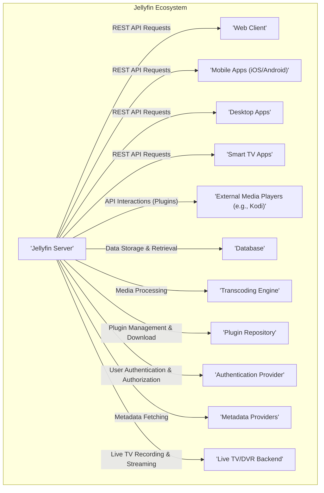
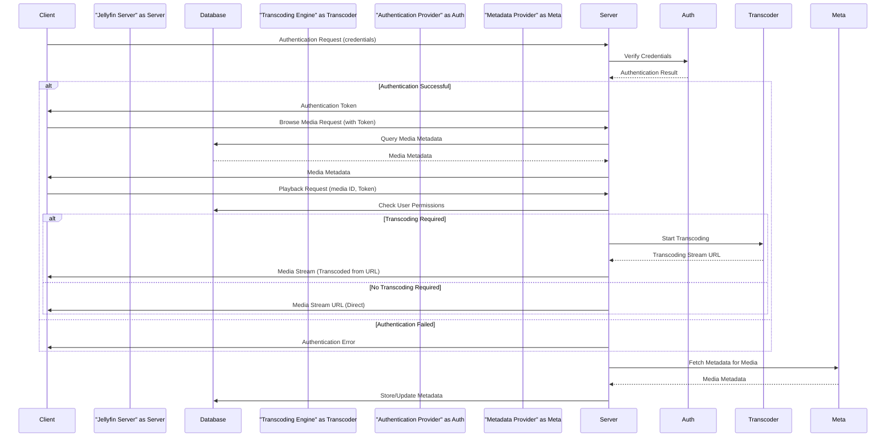

# Project Design Document: Jellyfin Media System

**Version:** 1.1
**Date:** October 26, 2023
**Author:** AI Software Architect

## 1. Introduction

This document provides an enhanced and more detailed design overview of the Jellyfin media system, an open-source alternative to proprietary media server solutions. This revised document builds upon the previous version, offering greater clarity and depth in describing the system's architecture, components, and data flow. This detailed design serves as a robust foundation for subsequent threat modeling activities. The design is primarily based on the information available in the official Jellyfin GitHub repository: [https://github.com/jellyfin/jellyfin](https://github.com/jellyfin/jellyfin).

## 2. Goals

The primary goals of Jellyfin are to:

*   Efficiently organize and manage personal media libraries, encompassing videos, music, and photos.
*   Seamlessly stream media content to a diverse range of client devices, including web browsers, mobile applications, smart televisions, and external media players.
*   Offer an intuitive and user-friendly interface for effortless browsing and playback of media.
*   Implement robust user authentication and authorization mechanisms to ensure secure access to media and server functionalities.
*   Facilitate extensibility and customization through a well-defined plugin system.
*   Maintain platform independence, enabling deployment and operation across various operating systems.
*   Provide features for metadata management, including fetching and editing information about media items.

## 3. High-Level Architecture

Jellyfin employs a client-server architecture, with the core processing and data management handled by the Jellyfin Server. Client applications interact with the server to access and consume media.

## 4. Component Descriptions

This section provides a more detailed description of the key components within the Jellyfin system.

*   **Jellyfin Server:**
    *   The central component, responsible for core functionalities including media library management, handling client requests via a RESTful API, media streaming, on-the-fly and scheduled transcoding, user authentication and authorization, and plugin lifecycle management.
    *   Operates as a background service or application on a designated host machine.
    *   Systematically scans and indexes media files from user-defined library paths, organizing them into a structured library.
    *   Retrieves rich metadata for media items (e.g., movie plots, cast information, album details, artist biographies) from configurable online sources.
    *   Manages user accounts, permissions, and access control to the media library.
*   **Web Client:**
    *   A primary user interface accessed through web browsers, enabling users to interact with the Jellyfin Server.
    *   Provides a comprehensive set of features, including browsing the media library, initiating media playback, managing user profiles, and configuring server settings.
    *   Communicates with the Jellyfin Server exclusively through secure REST API calls.
    *   Typically implemented using modern JavaScript frameworks, providing a dynamic and responsive user experience.
*   **Mobile Apps (iOS/Android):**
    *   Native applications designed for mobile platforms, offering optimized user interfaces for accessing Jellyfin on smartphones and tablets.
    *   Mirror the core functionalities of the web client, with adaptations for mobile interaction patterns.
    *   Communicate with the server using the same REST API.
*   **Desktop Apps:**
    *   Standalone applications available for desktop operating systems (Windows, macOS, Linux), providing a more integrated experience.
    *   Offer similar features to the web and mobile clients, potentially with additional platform-specific integrations.
    *   Interact with the Jellyfin Server via its REST API.
*   **Smart TV Apps:**
    *   Applications tailored for smart television platforms (e.g., Android TV, Roku, LG webOS, Samsung Tizen), focusing on media browsing and playback within the television environment.
    *   Designed for remote control navigation and large screen displays.
    *   Communicate with the server using API calls, potentially with optimizations for media streaming.
*   **External Media Players (e.g., Kodi):**
    *   Integration with external media players is achieved through plugins or addons, allowing users to leverage their preferred player's interface while accessing their Jellyfin library.
    *   These plugins act as bridges, translating requests and responses between the external player and the Jellyfin Server's API.
*   **Database:**
    *   A persistent storage mechanism responsible for housing critical data, including metadata about media files, user account information, server configurations, playback history, and plugin settings.
    *   Supports various relational database management systems (RDBMS) such as SQLite (default), MySQL, and PostgreSQL, allowing for scalability and flexibility.
    *   Proper security and maintenance of the database are paramount for the integrity and availability of the Jellyfin system.
*   **Transcoding Engine:**
    *   A crucial component responsible for converting media files into formats compatible with the requesting client device's capabilities.
    *   Primarily utilizes the FFmpeg library for its powerful media processing capabilities.
    *   Can perform on-the-fly transcoding for immediate playback or scheduled transcoding to prepare media in advance.
    *   Resource-intensive, requiring careful consideration of hardware resources and configuration.
*   **Plugin Repository:**
    *   A system for discovering, downloading, and installing extensions (plugins) that enhance Jellyfin's functionality.
    *   Plugins can provide a wide range of additions, such as new metadata providers, support for different media types, integration with external services, custom themes, and more.
    *   The Jellyfin Server manages the plugin lifecycle, including installation, updates, and removal.
*   **Authentication Provider:**
    *   Manages the process of verifying user identities and granting access to the system.
    *   Supports internal authentication (username/password stored within the Jellyfin database) and integration with external authentication providers like LDAP or OAuth 2.0 for centralized user management.
    *   Ensures that only authenticated and authorized users can access media and server settings.
*   **Metadata Providers:**
    *   External services or internal modules that provide metadata for media files.
    *   Examples include The Movie Database (TMDb), TheTVDB, and MusicBrainz.
    *   Jellyfin can be configured to use multiple metadata providers, allowing for comprehensive and accurate media information.
*   **Live TV/DVR Backend:**
    *   An optional component that enables users to watch and record live television.
    *   Integrates with TV tuners and Electronic Program Guides (EPGs) to provide live TV streaming and recording capabilities.
    *   Stores recordings for later playback, managed through the Jellyfin interface.

## 5. Data Flow

This section provides a more detailed breakdown of the data flow for key operations within the Jellyfin system.

*   **User Authentication Sequence:**
    1. A user attempts to log in via a client application (web, mobile, desktop).
    2. The client application sends the user's credentials (username and password or an authentication token from an external provider) to the Jellyfin Server through a secure channel (HTTPS).
    3. The Jellyfin Server forwards the credentials to the configured Authentication Provider for verification.
    4. The Authentication Provider verifies the credentials against its user database or external service.
    5. Upon successful authentication, the Authentication Provider returns a success confirmation to the Jellyfin Server.
    6. The Jellyfin Server generates a session token or cookie and sends it back to the client application.
    7. Subsequent requests from the client include this token for authentication and authorization.
*   **Media Library Scan and Metadata Retrieval Sequence:**
    1. The Jellyfin Server is configured with paths to media library folders.
    2. A scheduled task or manual trigger initiates a media library scan.
    3. The server iterates through the configured folders, identifying new or modified media files.
    4. For each media file, the server extracts basic metadata (filename, file size, etc.).
    5. The server uses identifiers (e.g., filename patterns, embedded metadata) to query configured Metadata Providers for detailed information (title, plot, cast, artwork).
    6. Metadata Providers return relevant information to the Jellyfin Server.
    7. The Jellyfin Server stores the extracted and fetched metadata in the Database, linking it to the corresponding media file.
*   **User Browsing Media Library Sequence:**
    1. A user navigates the media library using a client application.
    2. The client application sends API requests to the Jellyfin Server to retrieve lists of media items, potentially filtered by criteria (e.g., genre, recently added).
    3. The Jellyfin Server receives the request and queries the Database for the requested media metadata.
    4. The Database returns the matching media metadata to the Jellyfin Server.
    5. The Jellyfin Server formats the data and sends it back to the client application as a JSON response.
    6. The client application renders the media library information for the user.
*   **Media Playback Sequence:**
    1. A user selects a media item for playback in a client application.
    2. The client application sends a playback request to the Jellyfin Server, including the media item ID and the user's authentication token.
    3. The Jellyfin Server verifies the user's authorization to access the requested media.
    4. The server determines if transcoding is necessary based on the client's capabilities and the media's format.
    5. **If transcoding is required:**
        *   The Jellyfin Server instructs the Transcoding Engine to start converting the media.
        *   The Transcoding Engine processes the media and makes it available as a streaming URL.
        *   The Jellyfin Server provides the streaming URL to the client.
    6. **If transcoding is not required:**
        *   The Jellyfin Server provides a direct streaming URL to the original media file (or an optimized version if available).
    7. The client application streams the media data from the provided URL and begins playback.
*   **Plugin Installation and Interaction Sequence:**
    1. An administrator initiates plugin installation through the Jellyfin Server's web interface or by manually placing plugin files in the designated directory.
    2. The Jellyfin Server detects the new plugin and installs it, potentially downloading it from the Plugin Repository.
    3. The server loads and initializes the plugin.
    4. The plugin may register new API endpoints or modify existing ones within the Jellyfin Server.
    5. Client applications can interact with the plugin's functionalities by sending requests to the plugin's registered API endpoints, which are handled by the Jellyfin Server.

## 6. Security Considerations (Detailed)

This section expands upon the preliminary security considerations, providing more specific examples of potential threats and vulnerabilities.

*   **Authentication and Authorization:**
    *   **Threat:** Brute-force attacks against login forms to guess user credentials.
    *   **Threat:** Use of weak or default passwords by users.
    *   **Threat:** Session hijacking through Cross-Site Scripting (XSS) or man-in-the-middle attacks, allowing attackers to impersonate legitimate users.
    *   **Threat:** Insufficient role-based access control, granting users excessive permissions.
    *   **Threat:** Vulnerabilities in external authentication provider integrations (e.g., OAuth misconfigurations).
*   **API Security:**
    *   **Threat:** SQL Injection attacks targeting database queries through vulnerable API endpoints.
    *   **Threat:** Command Injection vulnerabilities if the API processes user-supplied data to execute system commands.
    *   **Threat:** Cross-Site Scripting (XSS) vulnerabilities in API responses rendered by client applications, allowing malicious scripts to be injected.
    *   **Threat:** Cross-Site Request Forgery (CSRF) attacks forcing authenticated users to perform unintended actions on the server.
    *   **Threat:** Exposure of sensitive information (e.g., API keys, internal paths) through improperly secured API endpoints or error messages.
    *   **Threat:** Lack of rate limiting on API endpoints, leading to denial-of-service (DoS) vulnerabilities.
*   **Media Handling:**
    *   **Threat:** Upload of maliciously crafted media files designed to exploit vulnerabilities in the transcoding engine (e.g., buffer overflows).
    *   **Threat:** Media files containing embedded scripts or malicious content that could be executed by client media players.
    *   **Threat:** Insecure file permissions on the server's media library folders, allowing unauthorized access or modification.
    *   **Threat:** Man-in-the-middle attacks intercepting media streams and potentially injecting malicious content.
*   **Database Security:**
    *   **Threat:** SQL Injection vulnerabilities allowing attackers to manipulate or extract sensitive data from the database.
    *   **Threat:** Unauthorized access to the database server due to weak credentials or misconfigurations.
    *   **Threat:** Data breaches resulting from compromised database backups or insecure storage of database credentials.
*   **Plugin Security:**
    *   **Threat:** Installation of malicious plugins that could compromise the server or user data.
    *   **Threat:** Vulnerabilities in poorly written plugins that could be exploited by attackers.
    *   **Threat:** Plugins requesting excessive permissions, potentially gaining unauthorized access to system resources or data.
    *   **Threat:** Supply chain attacks targeting plugin repositories or distribution channels.
*   **Network Security:**
    *   **Threat:** Lack of HTTPS encryption, exposing communication between clients and the server to eavesdropping and tampering.
    *   **Threat:** Exposure of the Jellyfin Server to the public internet without proper firewall rules and security configurations.
    *   **Threat:** Vulnerabilities in network protocols or services used by Jellyfin.
*   **Dependency Vulnerabilities:**
    *   **Threat:** Exploitation of known vulnerabilities in third-party libraries and components used by Jellyfin (e.g., FFmpeg, web framework libraries).
    *   **Mitigation:** Regular updates and patching of dependencies are crucial.

## 7. Future Directions

This design document reflects the current architecture of the Jellyfin system. Ongoing and future development efforts may include:

*   **Enhanced User Management:** Implementing more granular user roles and permissions, improving password reset mechanisms, and adding multi-factor authentication support.
*   **Improved Live TV and DVR Functionality:** Expanding support for different TV tuner types, enhancing the Electronic Program Guide (EPG) integration, and adding more sophisticated recording options.
*   **Robust Plugin Management and Security Controls:** Implementing stricter plugin sandboxing, automated plugin vulnerability scanning, and enhanced permission management for plugins.
*   **Integration with More External Services:** Expanding integration with streaming services, social media platforms, and smart home devices.
*   **Performance Optimizations:** Continuously improving the performance of media scanning, transcoding, and streaming through code optimization and architectural enhancements.
*   **Federated Server Capabilities:** Exploring the possibility of federating Jellyfin servers to allow users to share libraries or access content from multiple servers.
*   **Improved Metadata Handling:** Enhancing metadata editing capabilities and integrating with more diverse metadata sources.

This improved design document provides a more comprehensive and detailed understanding of the Jellyfin system's architecture, which is essential for conducting a thorough and effective threat model. The enhanced component descriptions, data flow diagrams, and detailed security considerations offer a solid foundation for identifying potential vulnerabilities and developing appropriate mitigation strategies.