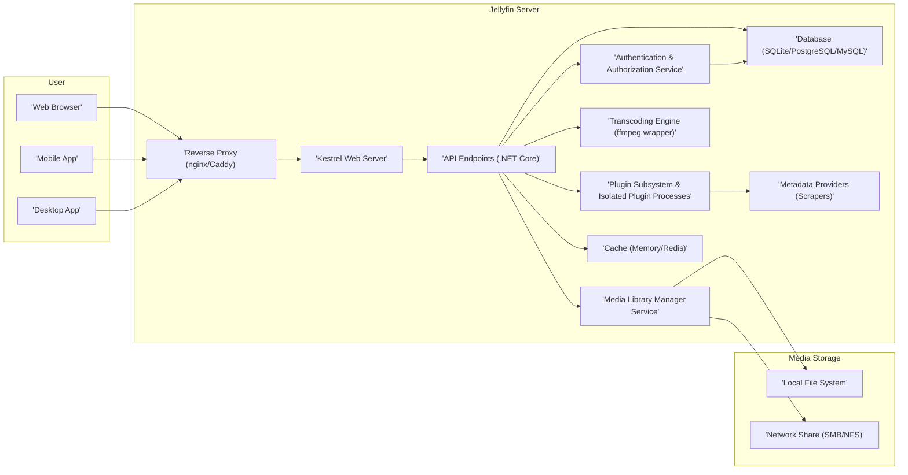
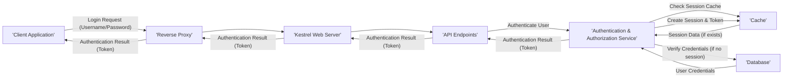
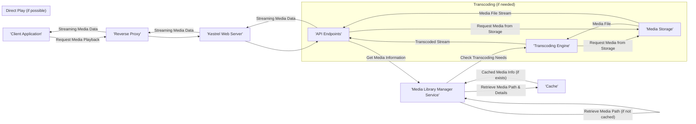
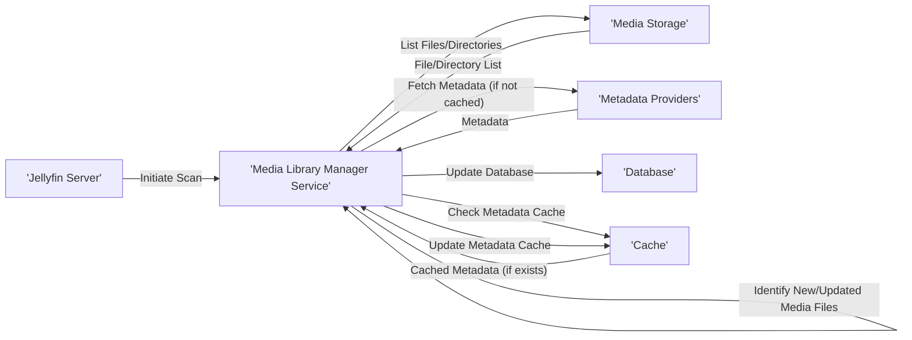

# Project Design Document: Jellyfin Media System

**Version:** 1.1
**Date:** October 26, 2023
**Author:** Gemini (AI Language Model)

## 1. Introduction

This document provides a detailed design overview of the Jellyfin media system. It outlines the system's architecture, key components, data flows, and technologies used. This document is intended to serve as a foundation for subsequent threat modeling activities.

### 1.1. Purpose

The primary purpose of this document is to provide a comprehensive understanding of the Jellyfin system's design. This understanding is crucial for identifying potential security vulnerabilities and developing appropriate mitigation strategies during the threat modeling process. This document aims to be a single source of truth for the system's architecture from a security perspective.

### 1.2. Scope

This document covers the core components of the Jellyfin server and its interactions with clients. It includes:

*   The Jellyfin server application, encompassing its core functionalities.
*   Web clients (browser-based), detailing their interaction with the server.
*   Mobile and desktop application clients, outlining their communication patterns.
*   Media storage, including local and network-based options.
*   Database interactions, focusing on data storage and retrieval.
*   Plugin architecture, describing how extensions integrate with the core system.
*   Authentication and authorization mechanisms, detailing user access control.

This document does not cover:

*   Specific implementation details of individual plugins beyond their interaction points with the core server.
*   Detailed implementation specifics of the client applications' internal workings.
*   Network infrastructure beyond the immediate Jellyfin deployment and its direct dependencies.
*   Third-party services integrated through plugins, unless their interaction directly impacts the core server's security.

### 1.3. Goals

The goals of this design document are to:

*   Clearly describe the architecture and components of the Jellyfin system, providing sufficient detail for security analysis.
*   Illustrate the key data flows within the system, highlighting sensitive data movement.
*   Identify the technologies and protocols used, enabling the assessment of known vulnerabilities.
*   Provide a solid basis for identifying potential security threats and attack vectors.
*   Serve as a reference point for security audits and penetration testing.

## 2. System Overview

Jellyfin is a free software media system that allows users to organize, manage, and stream their digital media files to various client devices. It consists of a central server application that manages the media library and provides streaming capabilities, and various client applications that users interact with. The server acts as the central hub, orchestrating media management, transcoding, and delivery.

### 2.1. Architecture Diagram

### 2.2. Component Descriptions

*   **Web Browser:** A standard web browser used to access the Jellyfin web interface, providing a primary means of interaction for users.
*   **Mobile App:** Native applications for mobile operating systems (e.g., Android, iOS) designed for media browsing and playback, often with offline capabilities.
*   **Desktop App:** Native applications for desktop operating systems (e.g., Windows, macOS, Linux) offering a richer user experience and potentially more advanced features.
*   **Reverse Proxy (nginx/Caddy):** An optional but recommended component for production deployments. It handles SSL termination, load balancing, and acts as a security front-end, protecting the Kestrel web server.
*   **Kestrel Web Server:** The cross-platform web server built into .NET, responsible for handling incoming HTTP/HTTPS requests and routing them to the API endpoints.
*   **API Endpoints (.NET Core):** The core application logic built using the .NET Core framework. It exposes RESTful APIs for client communication, handling requests for media information, playback, and administrative tasks.
*   **Authentication & Authorization Service:**  Manages user accounts, login sessions, and access control to media and features. This component is responsible for verifying user identities and enforcing permissions.
*   **Media Library Manager Service:** Responsible for scanning, organizing, and indexing media files from configured storage locations. It maintains the metadata and structure of the user's media library.
*   **Transcoding Engine (ffmpeg wrapper):**  A controlled interface to the ffmpeg library, responsible for converting media files into formats compatible with client devices. It manages transcoding profiles and resource allocation.
*   **Database (SQLite/PostgreSQL/MySQL):** Stores persistent data, including metadata about media files, user information, server settings, plugin configurations, and playback history.
*   **Plugin Subsystem & Isolated Plugin Processes:**  Allows extending Jellyfin's functionality through installable plugins. Plugins often run in isolated processes to enhance stability and security.
*   **Metadata Providers (Scrapers):** External services or local agents that fetch metadata (e.g., movie posters, descriptions, actor information) for media items, enriching the user experience.
*   **Cache (Memory/Redis):** An optional component used to cache frequently accessed data, such as metadata and user sessions, to improve performance and reduce database load.

## 3. Data Flow Diagrams

### 3.1. User Authentication

*   The client application sends a login request containing user credentials (username/password) to the reverse proxy.
*   The reverse proxy forwards the request to the Kestrel web server.
*   Kestrel routes the request to the appropriate API endpoint.
*   The API endpoint calls the Authentication & Authorization Service to authenticate the user.
*   The Authentication & Authorization Service first checks the cache for an existing session.
*   If a session exists in the cache, the session data is retrieved.
*   If no session exists, the service verifies the provided credentials against the user data stored in the database.
*   The database returns the stored user credentials for verification.
*   Upon successful authentication, the Authentication & Authorization Service creates a new session and generates an authentication token, storing the session in the cache.
*   The authentication result (including the token) is returned through the API endpoints, Kestrel, and the reverse proxy back to the client application.

### 3.2. Media Playback

*   The client application sends a request to initiate playback of a specific media item to the reverse proxy.
*   The request is forwarded through Kestrel to the appropriate API endpoint.
*   The API endpoint requests media information from the Media Library Manager Service.
*   The Media Library Manager attempts to retrieve media path and details from the cache.
*   If the information is not cached, the Media Library Manager retrieves it from its internal data structures.
*   The API endpoint determines if transcoding is necessary based on the client's capabilities and the media format.
*   **If transcoding is needed:**
    *   The Transcoding Engine requests the media file from Media Storage.
    *   Media Storage provides the media file to the Transcoding Engine.
    *   The Transcoding Engine transcodes the media and streams the output back to the API endpoints.
*   **If direct play is possible:**
    *   The API endpoints request the media file directly from Media Storage.
    *   Media Storage streams the media file to the API endpoints.
*   The API endpoints stream the media data (either transcoded or direct) back through Kestrel and the reverse proxy to the client application.

### 3.3. Media Library Scan

*   The Jellyfin server initiates a media library scan, either automatically or manually.
*   The Media Library Manager Service interacts with the configured Media Storage locations to list files and directories.
*   Media Storage returns the list of files and directories.
*   The Media Library Manager identifies new or updated media files based on timestamps and other criteria.
*   For each identified media file, the Media Library Manager checks the metadata cache.
*   If metadata is found in the cache, it is used.
*   If metadata is not cached, the Media Library Manager fetches metadata from configured Metadata Providers.
*   Metadata Providers return the retrieved metadata.
*   The Media Library Manager updates the database with the media file information and associated metadata.
*   The retrieved metadata is also stored in the cache for future access.

## 4. Security Considerations

This section outlines key security considerations for the Jellyfin system. These areas will be further explored during the threat modeling process.

*   **Authentication and Authorization:**
    *   **Threat:** Brute-force attacks on login attempts. **Mitigation:** Implement rate limiting and account lockout policies.
    *   **Threat:** Weak password policies. **Mitigation:** Enforce strong password requirements and consider multi-factor authentication.
    *   **Threat:** Session hijacking. **Mitigation:** Use secure session management with HTTP-only and secure flags, and implement session invalidation on logout.
    *   **Threat:** Privilege escalation. **Mitigation:** Implement role-based access control and ensure proper authorization checks for all actions.
    *   **Threat:** Insecure storage of user credentials. **Mitigation:** Store passwords using strong, salted hashing algorithms (e.g., Argon2).
*   **Data Security:**
    *   **Threat:** Man-in-the-middle attacks. **Mitigation:** Enforce HTTPS for all communication between clients and the server.
    *   **Threat:** Exposure of sensitive data at rest. **Mitigation:** Encrypt sensitive data in the database and consider encryption for media files at rest.
    *   **Threat:** Unauthorized access to media files. **Mitigation:** Ensure proper file system permissions are configured on the media storage.
    *   **Threat:** Data breaches through vulnerabilities. **Mitigation:** Regularly update the Jellyfin server and its dependencies to patch known vulnerabilities.
*   **Input Validation:**
    *   **Threat:** Cross-site scripting (XSS). **Mitigation:** Sanitize user inputs and encode outputs to prevent the execution of malicious scripts.
    *   **Threat:** SQL injection. **Mitigation:** Use parameterized queries or an ORM to prevent the injection of malicious SQL code.
    *   **Threat:** Command injection. **Mitigation:** Avoid executing external commands based on user input. If necessary, sanitize and validate input rigorously.
    *   **Threat:** Path traversal. **Mitigation:** Implement strict validation of file paths to prevent access to unauthorized files.
*   **Transcoding Security:**
    *   **Threat:** Exploitation of vulnerabilities in ffmpeg. **Mitigation:** Keep ffmpeg updated to the latest stable version and consider using sandboxing techniques.
    *   **Threat:** Resource exhaustion through excessive transcoding requests. **Mitigation:** Implement rate limiting and resource quotas for transcoding processes.
    *   **Threat:** Processing of malicious media files. **Mitigation:** Implement checks for potentially malicious content and consider running the transcoding process in a sandboxed environment.
*   **Plugin Security:**
    *   **Threat:** Malicious plugins compromising the server. **Mitigation:** Implement a secure plugin installation process with code signing and review.
    *   **Threat:** Vulnerable plugins introducing security flaws. **Mitigation:** Encourage plugin developers to follow security best practices and provide mechanisms for reporting vulnerabilities.
    *   **Threat:** Plugins accessing sensitive data without authorization. **Mitigation:** Implement a robust permission system for plugins and run plugins in isolated processes with limited privileges.
*   **Network Security:**
    *   **Threat:** Unauthorized access to the Jellyfin server. **Mitigation:** Configure firewalls to restrict access to necessary ports only.
    *   **Threat:** Denial-of-service (DoS) attacks. **Mitigation:** Implement rate limiting and consider using a reverse proxy with DDoS protection capabilities.
    *   **Threat:** Exposure of internal network details. **Mitigation:** Ensure the reverse proxy is properly configured to hide internal server information.
*   **Update Management:**
    *   **Threat:** Running outdated and vulnerable software. **Mitigation:** Implement a process for regularly updating the Jellyfin server and its dependencies.
    *   **Threat:** Tampering with update packages. **Mitigation:** Use secure channels for downloading updates and verify the integrity of update packages using checksums or signatures.

## 5. Deployment Considerations

Jellyfin can be deployed in various environments, each with its own security implications:

*   **Home Network:**
    *   **Security Implication:** Reliance on the home router's firewall, which may have default or weak configurations.
    *   **Recommendation:** Ensure the router's firewall is enabled and properly configured. Change default administrative credentials. Consider using a VPN for remote access.
*   **Cloud Environment (e.g., AWS, Azure, GCP):**
    *   **Security Implication:** Exposure to the public internet and potential misconfiguration of cloud security services.
    *   **Recommendation:** Utilize cloud provider's security features like security groups, network access controls (NACLs), and web application firewalls (WAFs). Implement strong identity and access management (IAM) policies.
*   **Docker/Containerized Environments:**
    *   **Security Implication:** Potential vulnerabilities in the container image and the container runtime environment.
    *   **Recommendation:** Use trusted base images, regularly scan images for vulnerabilities, and follow container security best practices, such as limiting container privileges and using resource constraints.
*   **Behind a Reverse Proxy:**
    *   **Security Implication:** The reverse proxy becomes a critical security component.
    *   **Recommendation:** Properly configure the reverse proxy for SSL termination, request filtering, and potentially DDoS protection. Ensure the communication between the reverse proxy and the Jellyfin server is secure (e.g., using a private network).

## 6. Technologies Used

*   **Backend Framework:** .NET Core
*   **Web Servers:** Kestrel (primary), nginx or Caddy (recommended reverse proxies)
*   **Databases:** SQLite (default for simple setups), PostgreSQL, MySQL (for more robust deployments)
*   **Transcoding Library:** ffmpeg
*   **Frontend Technologies:** HTML, CSS, JavaScript (with various frameworks and libraries)
*   **Operating Systems (Server):** Linux (recommended), Windows, macOS
*   **Operating Systems (Clients):**  Windows, macOS, Linux, Android, iOS, various smart TV platforms
*   **Communication Protocols:** HTTP/HTTPS, WebSocket (for real-time updates), various media streaming protocols (e.g., HLS, DASH)
*   **Caching Mechanisms:** In-memory caching, Redis (optional distributed caching)
*   **Plugin Development:**  .NET (primarily C#)

This document provides a more detailed and comprehensive design overview of the Jellyfin media system, offering a stronger foundation for effective threat modeling. The enhanced component descriptions, refined data flow diagrams, and expanded security considerations provide a more thorough understanding of the system's architecture and potential vulnerabilities.