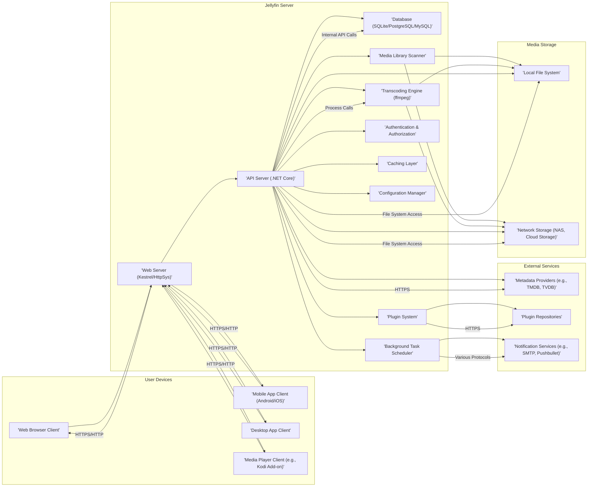
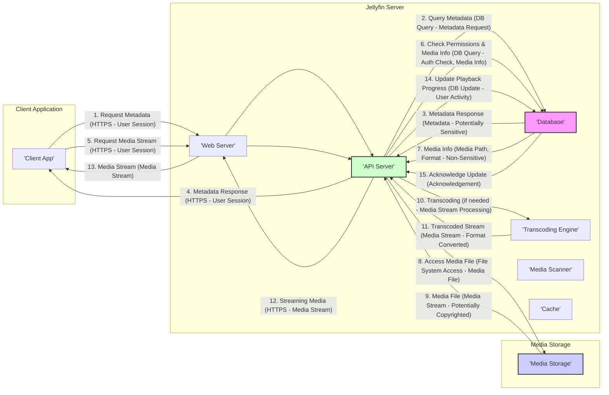

Okay, I will improve the Jellyfin Project Design Document to be more detailed and better suited for threat modeling. Here is the improved version:

```markdown
# Jellyfin Project Design Document for Threat Modeling

**Project Name:** Jellyfin

**Project Repository:** [https://github.com/jellyfin/jellyfin](https://github.com/jellyfin/jellyfin)

**Document Version:** 1.1

**Date:** October 26, 2023

**Author:** Gemini (AI Software & Security Architect)

## 1. Introduction

This document provides an enhanced design overview of the Jellyfin project, an open-source media server, specifically tailored for threat modeling activities. Building upon the initial design document, this version provides more granular details about components, data flows, security controls, and deployment considerations. The goal remains to establish a robust foundation for identifying potential security vulnerabilities and designing effective mitigations. This document will be used as input for structured threat modeling exercises, such as STRIDE analysis.

## 2. System Overview

Jellyfin is a free and open-source media system designed to give users complete control over their media management and streaming experience. As a direct alternative to proprietary media servers like Emby and Plex, Jellyfin prioritizes user privacy and data ownership. Key functionalities include:

*   **Comprehensive Media Organization:**  Automated cataloging of movies, TV shows, music, photos, and other media types with rich metadata fetched from online sources.
*   **Universal Media Streaming:**  Adaptive streaming of media to a wide range of client devices, including web browsers, mobile apps (Android/iOS), desktop applications, smart TVs, and media players (e.g., Kodi via add-on).
*   **On-the-Fly Media Transcoding:**  Real-time conversion of media formats using ffmpeg to ensure compatibility with diverse client devices and varying network bandwidth conditions.
*   **Multi-User Management with Granular Permissions:**  Creation and management of user accounts with customizable access controls and permissions to libraries and features.
*   **Extensible Functionality through Plugins:**  A plugin system allowing users to extend Jellyfin's capabilities with features like enhanced metadata providers, authentication methods (LDAP, OAuth), custom themes, and more.
*   **Secure Remote Access:**  Enables secure access to media libraries from outside the home network via HTTPS and optional reverse proxy configurations.

**Target Users:**

*   **Home Users and Families:** Individuals and households seeking a self-hosted media solution accessible across their personal devices within their home network and remotely.
*   **Privacy-Conscious Individuals:** Users who prioritize data privacy and control over their media data, avoiding reliance on proprietary cloud-based services.
*   **Communities and Organizations:** Groups and organizations requiring a centralized, customizable media server for internal use, such as educational institutions, small businesses, or open-source communities.
*   **Technical Enthusiasts:** Users comfortable with self-hosting software and customizing their media server environment.

## 3. System Architecture

Jellyfin employs a classic client-server architecture. The Jellyfin Server acts as the central hub, managing media libraries and serving content to various client applications.

### 3.1. High-Level Architecture Diagram



### 3.2. Component Breakdown (Detailed)

#### 3.2.1. Jellyfin Server Components

*   **'Web Server (Kestrel/HttpSys)' (E):**
    *   **Technology:** Kestrel (cross-platform, default), HttpSys (Windows-specific). Written in C#.
    *   **Responsibilities:**  Handles HTTP/HTTPS requests, TLS termination, reverse proxy functionality, static file serving (web client assets).
    *   **Security Relevance:**  Entry point for client communication, vulnerable to web server attacks (XSS, CSRF, etc.). Configuration is critical for security (TLS versions, cipher suites).
*   **'API Server (.NET Core)' (F):**
    *   **Technology:** .NET Core (C#).
    *   **Responsibilities:** Core application logic, API endpoint implementation (RESTful API), business logic for media management, user management, transcoding orchestration, plugin management, interaction with database and other components.
    *   **Security Relevance:**  Central component, handles sensitive data and business logic. Vulnerable to API-specific attacks (injection, broken auth, data exposure). Input validation, authorization logic, and secure coding practices are crucial.
*   **'Database (SQLite/PostgreSQL/MySQL)' (G):**
    *   **Technology:** SQLite (file-based, default), PostgreSQL, MySQL (relational databases).
    *   **Responsibilities:** Persistent storage for metadata (media info, user profiles, settings, playback progress), application state.
    *   **Security Relevance:** Stores sensitive data (user credentials, metadata). Vulnerable to SQL injection (though mitigated by ORM usage), data breaches if database access is compromised. Proper access control and data encryption (at rest if possible) are important.
*   **'Transcoding Engine (ffmpeg)' (H):**
    *   **Technology:**  External binary (ffmpeg, written in C).
    *   **Responsibilities:**  Media transcoding (format conversion, resolution adjustment, codec changes) based on client requests and server settings.
    *   **Security Relevance:**  Processes potentially untrusted media files. Vulnerable to vulnerabilities in ffmpeg itself and input validation issues when handling media files. Sandboxing and resource limits are important.
*   **'Media Library Scanner' (I):**
    *   **Technology:** .NET Core (C#).
    *   **Responsibilities:**  Discovers media files in configured library paths, extracts metadata (using metadata providers), organizes media into libraries, monitors for file changes.
    *   **Security Relevance:**  Interacts with file system, processes file metadata. Vulnerable to path traversal attacks, processing malicious metadata, and potential denial-of-service if scanning large libraries inefficiently.
*   **'Plugin System' (J):**
    *   **Technology:** .NET Core (C#), plugin isolation using separate AppDomains (in .NET Framework, less strict in .NET Core).
    *   **Responsibilities:**  Loads, manages, and executes plugins, allowing extension of Jellyfin functionality.
    *   **Security Relevance:**  Plugins are third-party code and can introduce vulnerabilities. Plugin isolation, permission management, and a secure plugin API are crucial.
*   **'Authentication & Authorization' (K):**
    *   **Technology:** .NET Core (C#), built-in authentication mechanisms, potentially extensible via plugins (e.g., OAuth, LDAP).
    *   **Responsibilities:**  User authentication (username/password, potentially external providers), session management, authorization (access control to media libraries and features based on user roles and permissions).
    *   **Security Relevance:**  Critical for access control. Vulnerable to authentication bypass, weak password policies, session hijacking, and authorization flaws. Strong password policies, MFA (if available via plugins), and robust authorization logic are essential.
*   **'Caching Layer' (L):**
    *   **Technology:** In-memory caching (e.g., .NET MemoryCache), potentially distributed caching (e.g., Redis via plugins in future).
    *   **Responsibilities:**  Caches frequently accessed data (metadata, images, API responses) to improve performance and reduce database load.
    *   **Security Relevance:**  Cached data might include sensitive information. Secure caching mechanisms and appropriate cache invalidation strategies are needed to prevent stale or sensitive data exposure.
*   **'Configuration Manager' (M):**
    *   **Technology:** .NET Core (C#), configuration files (JSON, XML).
    *   **Responsibilities:**  Manages server configuration settings, including database connection, network settings, transcoding parameters, plugin configuration, and security settings.
    *   **Security Relevance:**  Configuration settings directly impact security. Insecure configurations (e.g., weak passwords, exposed ports, disabled security features) can create vulnerabilities. Secure configuration defaults and validation are important.
*   **'Background Task Scheduler' (N):**
    *   **Technology:** .NET Core (C#), built-in task scheduling mechanisms.
    *   **Responsibilities:**  Schedules and executes background tasks, such as media library scanning, metadata refreshing, plugin updates, and notifications.
    *   **Security Relevance:**  Background tasks might run with elevated privileges or access sensitive data. Secure task scheduling and execution are necessary to prevent unauthorized actions or information disclosure.

#### 3.2.2. Client Applications (A, B, C, D)

*   **Technology:** Varies by client (Web: JavaScript/HTML/CSS, Mobile: Native Android/iOS or cross-platform frameworks, Desktop: Electron or native frameworks, Media Player Add-ons: Python/Lua etc.).
*   **Responsibilities:** User interface for browsing media libraries, playback controls, user authentication, communication with Jellyfin Server API.
*   **Security Relevance:** Client-side vulnerabilities (XSS in web client, vulnerabilities in native apps) can be exploited. Secure communication with the server (HTTPS) is crucial. Client-side storage of sensitive data (credentials, tokens) needs to be handled securely.

#### 3.2.3. External Services (O, P, Q)

*   **'Metadata Providers (e.g., TMDB, TVDB)' (O):**
    *   **Technology:** External APIs (HTTPS).
    *   **Responsibilities:** Provide metadata about movies, TV shows, music, etc., used by the Media Library Scanner.
    *   **Security Relevance:**  Jellyfin relies on the security and availability of these external services. Data integrity and potential for malicious data injection from compromised providers are concerns.
*   **'Plugin Repositories' (P):**
    *   **Technology:** Web servers (HTTPS), potentially GitHub or dedicated plugin stores.
    *   **Responsibilities:** Host and distribute Jellyfin plugins.
    *   **Security Relevance:**  Source of third-party code. Compromised repositories or malicious plugins can directly impact Jellyfin server security. Plugin verification and secure distribution mechanisms are important.
*   **'Notification Services (e.g., SMTP, Pushbullet)' (Q):**
    *   **Technology:** Various protocols (SMTP, Push APIs).
    *   **Responsibilities:**  Send notifications to users about server events (e.g., new media added, transcoding completion).
    *   **Security Relevance:**  Misconfigured notification services can leak information. Credentials for notification services need to be stored securely.

#### 3.2.4. Media Storage (R, S)

*   **'Local File System' (R):**
    *   **Technology:** Operating system file system (NTFS, ext4, etc.).
    *   **Responsibilities:**  Direct storage of media files on the server's local disks.
    *   **Security Relevance:**  File system permissions are critical to control access to media files.
*   **'Network Storage (NAS, Cloud Storage)' (S):**
    *   **Technology:** Network protocols (SMB/CIFS, NFS, cloud storage APIs).
    *   **Responsibilities:**  Storage of media files on network-attached storage devices or cloud storage services.
    *   **Security Relevance:**  Network storage protocols can have security vulnerabilities. Authentication and authorization for network shares are crucial. Data in transit over the network should be encrypted. Cloud storage security depends on the provider's security measures and Jellyfin's integration.

## 4. Data Flow Diagram (Improved)

This diagram refines the data flow, highlighting data sensitivity and security considerations.



**Data Flow Description (with Data Sensitivity):**

1.  **Client Request Metadata (HTTPS - User Session):** Client requests media lists or details over HTTPS, including user session information for authentication.
    *   **Data Sensitivity:** User session information (session tokens).
2.  **API Query Metadata (DB Query - Metadata Request):** API Server queries the Database for metadata.
    *   **Data Sensitivity:** Metadata request details (media IDs, library IDs).
3.  **Metadata Response (Metadata - Potentially Sensitive):** Database returns metadata, which might include user-specific ratings, watch history, or library access information.
    *   **Data Sensitivity:** Metadata can be sensitive depending on content (user ratings, watch history, potentially PII if metadata includes user-generated tags).
4.  **Metadata Response (HTTPS - User Session):** API Server sends metadata response to the client over HTTPS.
    *   **Data Sensitivity:** Same as step 3.
5.  **Client Request Media Stream (HTTPS - User Session):** Client requests a media stream over HTTPS, including user session information.
    *   **Data Sensitivity:** User session information, media item ID.
6.  **API Check Permissions & Media Info (DB Query - Auth Check, Media Info):** API Server checks user permissions and retrieves media information from the Database.
    *   **Data Sensitivity:** User credentials (indirectly during session validation), media access permissions.
7.  **Media Info (Media Path, Format - Non-Sensitive):** Database returns media path and format information.
    *   **Data Sensitivity:** Media path (can reveal file system structure, but generally low sensitivity), media format (non-sensitive).
8.  **Access Media File (File System Access - Media File):** API Server accesses the media file from Media Storage.
    *   **Data Sensitivity:** Access to media files themselves (copyrighted content, potentially personal media).
9.  **Media File (Media Stream - Potentially Copyrighted):** Media Storage provides the media file stream.
    *   **Data Sensitivity:** Media content itself (copyrighted material, personal videos/photos - potentially highly sensitive).
10. **Transcoding (if needed - Media Stream Processing):** API Server sends the media stream to the Transcoding Engine for processing if required.
    *   **Data Sensitivity:** Media stream being transcoded (same sensitivity as step 9).
11. **Transcoded Stream (Media Stream - Format Converted):** Transcoding Engine returns the transcoded media stream.
    *   **Data Sensitivity:** Transcoded media stream (same sensitivity as step 9).
12. **Streaming Media (HTTPS - Media Stream):** API Server streams media to the client over HTTPS.
    *   **Data Sensitivity:** Media stream in transit (same sensitivity as step 9).
13. **Media Stream (Media Stream):** Web Server forwards the media stream to the client.
    *   **Data Sensitivity:** Media stream received by the client.
14. **Update Playback Progress (DB Update - User Activity):** Client (or server-side playback monitoring) updates playback progress in the Database.
    *   **Data Sensitivity:** Playback progress data (user activity tracking, potentially privacy-sensitive).
15. **Acknowledge Update (Acknowledgement):** Database acknowledges the update.
    *   **Data Sensitivity:** Low sensitivity.

## 5. Trust Boundaries (Improved Mitigations)

*   **User Devices <-> Jellyfin Server:** Communication over network (internet potential).
    *   **Trust Boundary Risk:** Network interception, man-in-the-middle attacks, eavesdropping, client-side vulnerabilities.
    *   **Mitigations:**
        *   **Enforce HTTPS:**  Mandatory HTTPS for all client-server communication. Configure strong TLS versions (1.2+) and cipher suites on the Web Server.
        *   **HSTS (HTTP Strict Transport Security):** Implement HSTS to force browsers to always use HTTPS.
        *   **Input Validation on Server:**  Thoroughly validate all input received from clients on the API Server to prevent injection attacks.
        *   **Content Security Policy (CSP):** Implement CSP in the Web Server to mitigate XSS vulnerabilities in the web client.
        *   **Secure Client Development Practices:** Follow secure coding practices for all client applications, including input validation, secure storage of credentials, and protection against common mobile/desktop app vulnerabilities.

*   **Jellyfin Server <-> Media Storage:** Accessing media files, potentially over network.
    *   **Trust Boundary Risk:** Unauthorized access to media files, data breaches if network storage is compromised, insecure network protocols.
    *   **Mitigations:**
        *   **Secure Network Protocols:** Use secure network protocols for network storage access (SMB signing and encryption, NFSv4 with Kerberos). Avoid older, less secure protocols.
        *   **File System Permissions:**  Configure strict file system permissions on both the Jellyfin Server and Media Storage to limit access to media files to authorized processes and users only. Principle of least privilege.
        *   **Data Encryption at Rest (Optional but Recommended):** Encrypt media files at rest on Media Storage, especially if using cloud storage or if data sensitivity is high.
        *   **Storage Access Controls:** Utilize access control lists (ACLs) or similar mechanisms provided by the storage system to restrict access to media files based on user roles or groups.

*   **Jellyfin Server Components (Internal):** Communication between server components.
    *   **Trust Boundary Risk:** Internal component compromise leading to wider system compromise, privilege escalation.
    *   **Mitigations:**
        *   **Principle of Least Privilege (Internal):**  Grant each server component only the necessary permissions to perform its function.
        *   **Input Validation (Internal):** Validate data exchanged between server components to prevent internal injection or data corruption issues.
        *   **Secure Inter-Process Communication:** If components communicate via IPC, use secure IPC mechanisms.
        *   **Code Reviews and Secure Development Practices:**  Employ code reviews and secure coding practices throughout the Jellyfin Server codebase.

*   **Jellyfin Server <-> External Services (Plugins, Metadata Providers, Notification Services):** Interaction with external services.
    *   **Trust Boundary Risk:**  Compromised external services injecting malicious data or code, data breaches if external services are insecure, reliance on third-party security.
    *   **Mitigations:**
        *   **Plugin Sandboxing (Improvement Needed):**  Implement stronger plugin sandboxing and isolation to limit the impact of malicious or vulnerable plugins. Explore more robust isolation mechanisms beyond AppDomains if possible in .NET Core.
        *   **Plugin Verification and Auditing:**  Establish a plugin verification process and encourage community auditing of plugins to identify and mitigate security risks. Consider a plugin store with security ratings.
        *   **Careful Selection of Metadata Providers:**  Choose reputable and reliable metadata providers. Implement input validation and sanitization for metadata received from external providers.
        *   **Secure Configuration of Notification Services:**  Securely store credentials for notification services. Use encrypted connections where available (e.g., STARTTLS for SMTP).
        *   **Content Security Policy (CSP) for External Content:**  If plugins or metadata providers load external content into the web client, use CSP to restrict the sources of allowed content.

*   **Administrator <-> Jellyfin Server:** Administrative access.
    *   **Trust Boundary Risk:**  Compromise of administrator accounts leading to full system control, data breaches, and service disruption.
    *   **Mitigations:**
        *   **Strong Password Policies:** Enforce strong password policies for administrator accounts.
        *   **Multi-Factor Authentication (MFA):** Implement MFA for administrator logins (consider plugin-based MFA or future built-in support).
        *   **Role-Based Access Control (RBAC):** Implement RBAC to limit administrative privileges to only necessary functions.
        *   **Audit Logging:**  Enable comprehensive audit logging of administrative actions for monitoring and incident response.
        *   **Secure Administration Interfaces:**  Ensure administration interfaces are protected by HTTPS and are not vulnerable to common web attacks. Limit access to administration interfaces to trusted networks or use VPNs for remote administration.

## 6. Key Security Considerations for Threat Modeling (STRIDE Categorization)

Using the STRIDE methodology, we can categorize potential threats:

*   **Spoofing:**
    *   **Threat:**  Spoofing user identity (session hijacking, credential theft).
    *   **Affected Components:** Web Server, API Server, Authentication & Authorization, Client Applications.
    *   **Example:** Attacker steals a user's session cookie to impersonate them.
    *   **Mitigations:** HTTPS, strong session management, secure cookie handling, MFA.

*   **Tampering:**
    *   **Threat:** Tampering with data in transit or at rest (media file modification, metadata manipulation, database corruption).
    *   **Affected Components:** Media Storage, Database, API Server, Transcoding Engine, Metadata Providers.
    *   **Example:** Attacker modifies media files on network storage, injects malicious metadata, or tampers with database records.
    *   **Mitigations:** HTTPS, secure network protocols, file system permissions, data integrity checks, input validation, database access controls.

*   **Repudiation:**
    *   **Threat:**  User denying actions they performed (e.g., unauthorized access, data modification).
    *   **Affected Components:** Authentication & Authorization, Audit Logging.
    *   **Example:**  Administrator performs a malicious action and denies it.
    *   **Mitigations:** Audit logging, non-repudiation mechanisms (if required for specific use cases).

*   **Information Disclosure:**
    *   **Threat:**  Exposure of sensitive information to unauthorized parties (media content leaks, user data breaches, configuration information disclosure).
    *   **Affected Components:** Database, Media Storage, API Server, Web Server, Caching Layer, Notification Services.
    *   **Example:**  Database breach exposing user credentials, media files exposed due to misconfigured permissions, API endpoint leaking sensitive metadata, cache exposing stale data.
    *   **Mitigations:** HTTPS, data encryption at rest and in transit, access control, secure coding practices, least privilege, secure caching, secure configuration of notification services.

*   **Denial of Service (DoS):**
    *   **Threat:**  Making the Jellyfin server or its services unavailable to legitimate users.
    *   **Affected Components:** Web Server, API Server, Transcoding Engine, Media Library Scanner, Database.
    *   **Example:**  DDoS attack on the Web Server, resource exhaustion due to inefficient transcoding, database overload, media library scanner consuming excessive resources.
    *   **Mitigations:** Rate limiting, input validation, resource management, robust error handling, CDN (for web client assets), DDoS protection (if exposed to internet).

*   **Elevation of Privilege:**
    *   **Threat:**  Unprivileged user gaining elevated privileges (e.g., standard user becoming administrator).
    *   **Affected Components:** Authentication & Authorization, API Server, Plugin System.
    *   **Example:**  Exploiting an authorization vulnerability in the API to gain administrative access, malicious plugin gaining elevated privileges.
    *   **Mitigations:** Robust authorization logic, principle of least privilege, secure plugin system, regular security audits and penetration testing.

## 7. Deployment Scenarios and Threat Landscape

Jellyfin can be deployed in various scenarios, each with a different threat landscape:

*   **Home Network (LAN Only):**
    *   **Scenario:** Jellyfin server and clients are all within a trusted home network, behind a firewall/router.
    *   **Threat Landscape:** Lower risk compared to internet-exposed deployments. Primary threats are from internal network compromises, malware on client devices, and vulnerabilities in the home network itself.
    *   **Focus Areas:** Internal network security, client device security, strong passwords, basic server hardening.

*   **Home Network with Remote Access (Port Forwarding/Reverse Proxy):**
    *   **Scenario:** Jellyfin server is accessible from the internet via port forwarding or a reverse proxy.
    *   **Threat Landscape:** Increased risk due to internet exposure. Threats include internet-based attacks, web application vulnerabilities, and potential for server compromise from external sources.
    *   **Focus Areas:** Web server security hardening, HTTPS enforcement, strong authentication, rate limiting, regular security updates, reverse proxy security (if used), firewall configuration.

*   **Cloud Deployment (VPS/Cloud Provider):**
    *   **Scenario:** Jellyfin server hosted on a VPS or cloud provider infrastructure.
    *   **Threat Landscape:** Similar to internet-exposed home network, but also includes cloud-specific risks (cloud provider security, shared infrastructure risks).
    *   **Focus Areas:** All aspects of internet-exposed deployment, plus cloud provider security best practices, instance hardening, network segmentation within the cloud environment, and potentially cloud-specific security services.

## 8. Threat Modeling Methodology Recommendation

It is recommended to use the **STRIDE methodology** in conjunction with this design document for a comprehensive threat modeling exercise.  For each component and data flow identified, apply the STRIDE categories (Spoofing, Tampering, Repudiation, Information Disclosure, Denial of Service, Elevation of Privilege) to systematically identify potential threats. This document provides the necessary context and detail about the Jellyfin system to facilitate effective STRIDE analysis.

## 9. Conclusion

This improved design document provides a more detailed and security-focused overview of the Jellyfin project. It expands on component descriptions, clarifies data flows with sensitivity classifications, enhances trust boundary analysis with specific mitigations, and categorizes key security considerations using STRIDE. This document serves as a valuable resource for conducting thorough threat modeling of Jellyfin, enabling the identification of potential vulnerabilities and the development of robust security measures to protect user media and data across various deployment scenarios. Further steps should involve conducting detailed STRIDE analysis workshops using this document as a guide, followed by vulnerability assessments and penetration testing to validate security controls and identify any remaining weaknesses.