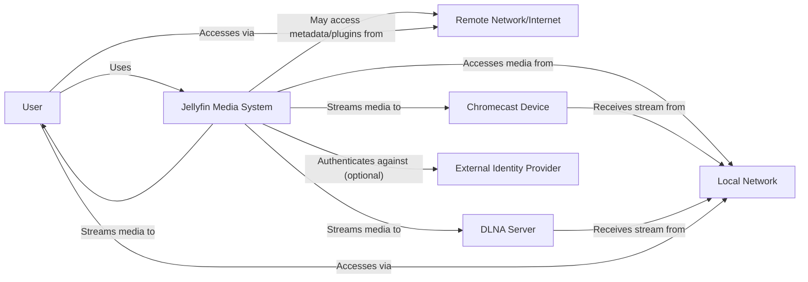
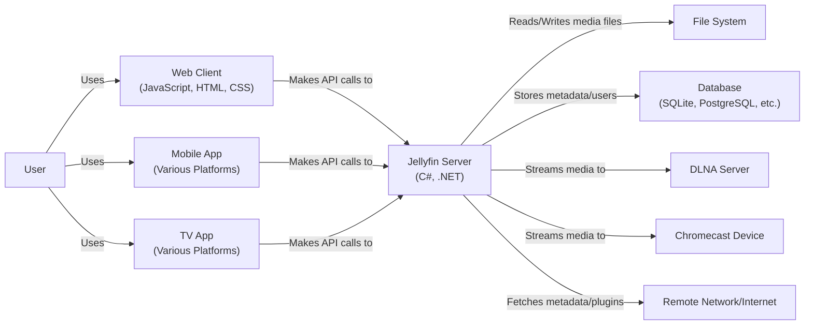
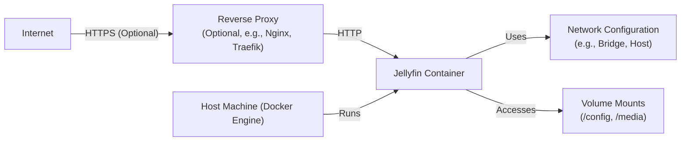
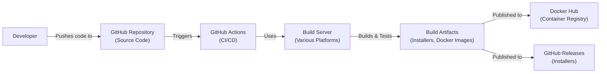

# BUSINESS POSTURE

Jellyfin is an open-source media system that allows users to collect, manage, and stream their media. It's a free alternative to proprietary solutions like Plex and Emby. Given its nature, the business posture can be inferred as follows:

Priorities and Goals:

*   Provide a stable, reliable, and feature-rich media server solution.
*   Maintain user privacy and control over their media data.
*   Foster a strong community around the project, encouraging contributions and user support.
*   Offer a viable, free alternative to commercial media server software.
*   Ensure broad platform compatibility (various operating systems, devices).
*   Continuous improvement and feature development based on community feedback.

Business Risks:

*   Reputational damage due to security vulnerabilities or data breaches.
*   Loss of user trust if the system proves unreliable or difficult to use.
*   Legal challenges related to copyright infringement if the software is misused.
*   Project stagnation due to lack of contributions or developer burnout.
*   Competition from established commercial players with more resources.
*   Difficulty in maintaining compatibility across a wide range of platforms and devices.
*   Inability to monetize the project, leading to sustainability issues (though this is less of a direct "business" risk for an open-source project and more of a project sustainability risk).

# SECURITY POSTURE

Existing Security Controls (based on common open-source practices and the nature of the project):

*   security control: Authentication: User authentication mechanisms (username/password, potentially multi-factor authentication via plugins). Implemented in Jellyfin server and client applications.
*   security control: Authorization: Access control to media libraries and server features based on user roles. Implemented in Jellyfin server.
*   security control: HTTPS Support: Ability to configure HTTPS for secure communication. Described in Jellyfin documentation.
*   security control: Regular Updates: Frequent releases to address bugs and security vulnerabilities. Managed through the GitHub repository and release process.
*   security control: Community Security Audits: Open-source nature allows for community scrutiny of the codebase. Implicit in the open-source model.
*   security control: Plugin System Security: A plugin system that, while offering extensibility, likely has some security considerations to prevent malicious plugins. Implemented in Jellyfin server.
*   security control: Input Validation: Some level of input validation to prevent common web vulnerabilities (e.g., XSS, SQL injection). Implemented in Jellyfin server and client applications.
*   security control: Rate Limiting: Measures to prevent brute-force attacks on login attempts. Implemented in Jellyfin server.
*   security control: Secure Configuration Defaults: While not always guaranteed, there's likely an effort to provide secure defaults for initial setup. Described in Jellyfin documentation.

Accepted Risks:

*   accepted risk: Reliance on Community Support: Security heavily relies on community contributions and vigilance.
*   accepted risk: Plugin Vulnerabilities: Third-party plugins may introduce security risks.
*   accepted risk: User Misconfiguration: Users may misconfigure security settings, exposing their server.
*   accepted risk: Limited Formal Security Audits: Unlike commercial software, there may be fewer formal, professional security audits.
*   accepted risk: Dependence on External Libraries: Vulnerabilities in third-party libraries used by Jellyfin can impact the system's security.

Recommended Security Controls:

*   Implement Content Security Policy (CSP) to mitigate XSS attacks.
*   Implement Subresource Integrity (SRI) to ensure that fetched resources haven't been tampered with.
*   Provide clear security guidelines and best practices for users setting up and maintaining their Jellyfin servers.
*   Establish a clear vulnerability reporting process.
*   Consider integrating with security scanning tools for automated vulnerability detection.
*   Implement robust logging and auditing features to track user activity and potential security incidents.

Security Requirements:

*   Authentication:
    *   Strong password policies (length, complexity).
    *   Protection against brute-force attacks.
    *   Optional multi-factor authentication (likely through plugins).
    *   Secure session management (e.g., using HttpOnly and Secure cookies).
*   Authorization:
    *   Granular access control to media libraries and server features.
    *   Role-based access control (admin, user, guest, etc.).
    *   Ability to restrict access based on IP address or network.
*   Input Validation:
    *   Strict validation of all user inputs to prevent XSS, SQL injection, and other injection attacks.
    *   Encoding of output to prevent XSS.
    *   Validation of file uploads to prevent malicious files from being uploaded.
*   Cryptography:
    *   Use of HTTPS for all communication between clients and the server.
    *   Secure storage of passwords (using strong hashing algorithms like bcrypt or Argon2).
    *   Protection of sensitive data at rest (if applicable, e.g., using encryption).
    *   Use of secure random number generators.

# DESIGN

## C4 CONTEXT

Element Descriptions:

*   Element:
    *   Name: User
    *   Type: Person
    *   Description: A person who uses Jellyfin to manage and stream their media.
    *   Responsibilities: Accessing the Jellyfin server, managing their media library, streaming media content, configuring their user settings.
    *   Security controls: Authentication, authorization, session management.

*   Element:
    *   Name: Jellyfin Media System
    *   Type: Software System
    *   Description: The core Jellyfin system, responsible for managing media, user accounts, and streaming.
    *   Responsibilities: Media library management, user authentication, streaming media, transcoding, plugin management, metadata fetching.
    *   Security controls: Authentication, authorization, input validation, HTTPS support, rate limiting, plugin security.

*   Element:
    *   Name: Remote Network/Internet
    *   Type: External System
    *   Description: The public internet, used for accessing external resources and potentially for remote access to the Jellyfin server.
    *   Responsibilities: Providing access to external metadata sources, plugin repositories, and potentially remote access to the Jellyfin server.
    *   Security controls: Firewall, intrusion detection/prevention systems (typically managed by the user's network infrastructure).

*   Element:
    *   Name: Local Network
    *   Type: External System
    *   Description: The user's local network, where media files are typically stored and where client devices connect.
    *   Responsibilities: Hosting media files, providing network connectivity for client devices.
    *   Security controls: Firewall, network segmentation (typically managed by the user's network infrastructure).

*   Element:
    *   Name: DLNA Server
    *   Type: External System
    *   Description: A DLNA-compatible server that can receive media streams from Jellyfin.
    *   Responsibilities: Receiving and playing media streams from Jellyfin.
    *   Security controls: Typically limited; relies on network security and device-specific security features.

*   Element:
    *   Name: Chromecast Device
    *   Type: External System
    *   Description: A Chromecast device that can receive media streams from Jellyfin.
    *   Responsibilities: Receiving and playing media streams from Jellyfin.
    *   Security controls: Relies on Google's security measures for Chromecast devices.

*   Element:
    *   Name: External Identity Provider
    *   Type: External System
    *   Description: An optional external identity provider (e.g., LDAP, OAuth provider) for user authentication.
    *   Responsibilities: Authenticating users.
    *   Security controls: Relies on the security of the external identity provider.

## C4 CONTAINER

Element Descriptions:

*   Element:
    *   Name: User
    *   Type: Person
    *   Description: A person who uses Jellyfin to manage and stream their media.
    *   Responsibilities: Accessing the Jellyfin server, managing their media library, streaming media content, configuring their user settings.
    *   Security controls: Authentication, authorization, session management.

*   Element:
    *   Name: Jellyfin Server (C#, .NET)
    *   Type: Container
    *   Description: The core server application, handling API requests, media management, and streaming.
    *   Responsibilities: API handling, media library management, user authentication, streaming, transcoding, plugin management.
    *   Security controls: Authentication, authorization, input validation, HTTPS support, rate limiting, plugin security.

*   Element:
    *   Name: Web Client (JavaScript, HTML, CSS)
    *   Type: Container
    *   Description: The web-based user interface for accessing Jellyfin.
    *   Responsibilities: Displaying the user interface, making API requests to the server.
    *   Security controls: Input validation, output encoding, secure communication (HTTPS).

*   Element:
    *   Name: Mobile App (Various Platforms)
    *   Type: Container
    *   Description: Native mobile applications for accessing Jellyfin on various platforms (iOS, Android).
    *   Responsibilities: Displaying the user interface, making API requests to the server.
    *   Security controls: Input validation, secure communication (HTTPS), secure storage of credentials.

*   Element:
    *   Name: TV App (Various Platforms)
    *   Type: Container
    *   Description: Native TV applications for accessing Jellyfin on various platforms (Android TV, tvOS, etc.).
    *   Responsibilities: Displaying the user interface, making API requests to the server.
    *   Security controls: Input validation, secure communication (HTTPS), secure storage of credentials.

*   Element:
    *   Name: DLNA Server
    *   Type: External System
    *   Description: A DLNA-compatible server.
    *   Responsibilities: Receiving and playing media streams from Jellyfin.
    *   Security controls: Network security, device security.

*   Element:
    *   Name: Chromecast Device
    *   Type: External System
    *   Description: A Chromecast device.
    *   Responsibilities: Receiving and playing media streams from Jellyfin.
    *   Security controls: Google's Chromecast security.

*   Element:
    *   Name: File System
    *   Type: Container
    *   Description: The file system where media files are stored.
    *   Responsibilities: Storing media files.
    *   Security controls: File system permissions, access control lists.

*   Element:
    *   Name: Database (SQLite, PostgreSQL, etc.)
    *   Type: Container
    *   Description: The database used to store metadata, user accounts, and other application data.
    *   Responsibilities: Storing and retrieving data.
    *   Security controls: Database access controls, encryption at rest (optional).

*   Element:
    *   Name: Remote Network/Internet
    *   Type: External System
    *   Description: The public internet.
    *   Responsibilities: Providing access to external resources.
    *   Security controls: Firewall, intrusion detection/prevention.

## DEPLOYMENT

Possible Deployment Solutions:

1.  Bare Metal/Virtual Machine: Installing Jellyfin directly onto an operating system (Windows, Linux, macOS) running on a physical or virtual machine.
2.  Docker Container: Deploying Jellyfin using the official Docker image.
3.  NAS Appliance: Installing Jellyfin on a Network Attached Storage (NAS) device, either through a built-in package manager or via Docker.
4.  Cloud Provider (e.g., AWS, Azure, GCP): Deploying Jellyfin on a cloud-based virtual machine or using a container orchestration service (e.g., Kubernetes).

Chosen Solution (for detailed description): Docker Container

Element Descriptions:

*   Element:
    *   Name: Internet
    *   Type: External System
    *   Description: The public internet.
    *   Responsibilities: Providing external access to the Jellyfin server.
    *   Security controls: Firewall, intrusion detection/prevention.

*   Element:
    *   Name: Host Machine (Docker Engine)
    *   Type: Infrastructure Node
    *   Description: The physical or virtual machine running the Docker Engine.
    *   Responsibilities: Running the Docker Engine, providing resources to the Jellyfin container.
    *   Security controls: Operating system security, Docker Engine security, firewall.

*   Element:
    *   Name: Jellyfin Container
    *   Type: Container Instance
    *   Description: The running instance of the Jellyfin Docker container.
    *   Responsibilities: Running the Jellyfin server application.
    *   Security controls: Container isolation, security context, capabilities.

*   Element:
    *   Name: Network Configuration (e.g., Bridge, Host)
    *   Type: Infrastructure Node
    *   Description: The Docker network configuration used by the Jellyfin container.
    *   Responsibilities: Providing network connectivity to the Jellyfin container.
    *   Security controls: Docker network security, firewall rules.

*   Element:
    *   Name: Volume Mounts (/config, /media)
    *   Type: Infrastructure Node
    *   Description: The volume mounts used to persist data outside the container.
    *   Responsibilities: Storing configuration files and media files.
    *   Security controls: File system permissions, access control lists.

*   Element:
    *   Name: Reverse Proxy (Optional, e.g., Nginx, Traefik)
    *   Type: Infrastructure Node
    *   Description: An optional reverse proxy used to handle HTTPS termination and other tasks.
    *   Responsibilities: Handling HTTPS termination, load balancing, caching.
    *   Security controls: HTTPS configuration, web application firewall (WAF).

## BUILD

The Jellyfin build process is primarily managed through GitHub Actions, leveraging automated workflows for building, testing, and packaging the software.

Build Process Description:

1.  Developers push code changes to the Jellyfin GitHub repository.
2.  This triggers GitHub Actions workflows defined in the repository.
3.  GitHub Actions spins up build servers (likely using various platforms to support different operating systems and architectures).
4.  The build server checks out the code from the repository.
5.  The build process compiles the code, runs unit tests, and potentially performs other checks (e.g., code style analysis, static analysis).
6.  If the build and tests are successful, build artifacts are created. These artifacts include:
    *   Installers for various operating systems (Windows, macOS, Linux).
    *   Docker images.
7.  The Docker images are pushed to Docker Hub, a container registry.
8.  The installers are published as GitHub Releases.

Security Controls in Build Process:

*   Automated Build: GitHub Actions provides a consistent and automated build process, reducing the risk of manual errors.
*   Version Control: All code changes are tracked in the Git repository, providing an audit trail.
*   Dependency Management: The project likely uses a dependency management system (e.g., NuGet for .NET) to manage external libraries.
*   Testing: Automated unit tests help ensure code quality and prevent regressions.
*   Static Analysis (Potentially): The build process may include static analysis tools to identify potential security vulnerabilities in the code.
*   Code Signing (Potentially): Installers may be digitally signed to ensure their authenticity and integrity.
*   Supply Chain Security: While not explicitly mentioned, there's an implicit need to be aware of supply chain security risks related to dependencies. Tools like Dependabot (for GitHub) can help identify vulnerable dependencies.

# RISK ASSESSMENT

Critical Business Processes:

*   Media Streaming: The core functionality of Jellyfin is to provide seamless and reliable media streaming to users. Any disruption to this service would significantly impact user experience.
*   Media Management: Users rely on Jellyfin to organize and manage their media libraries. Loss or corruption of this data would be a major issue.
*   User Account Management: Securely managing user accounts and access controls is crucial to protect user privacy and prevent unauthorized access to media.

Data Sensitivity:

*   Media Files: The sensitivity of media files varies greatly depending on the user. Some users may store personal photos and videos, while others may have legally obtained copyrighted content.
*   User Metadata: Jellyfin stores metadata about media files, including titles, descriptions, and potentially user-added information. This metadata could be considered sensitive.
*   User Account Information: Usernames, hashed passwords, and potentially email addresses are stored by Jellyfin. This information is highly sensitive and must be protected.
*   Usage Data: Jellyfin may collect usage data (e.g., viewing history), which could be considered sensitive by some users.
*   Configuration Data: Server configuration data, including network settings and potentially API keys, is highly sensitive and must be protected.

# QUESTIONS & ASSUMPTIONS

Questions:

*   What specific static analysis tools are used in the build process?
*   Are there any code signing procedures in place for released installers?
*   What are the specific mechanisms for handling user input validation to prevent injection attacks?
*   What are the specific database security configurations used in production deployments?
*   Are there any plans to implement more formal security audits or penetration testing?
*   What is the process for handling security vulnerabilities reported by the community?
*   What specific measures are in place to protect against supply chain attacks?
*   Are there any plans to implement more advanced security features, such as intrusion detection or prevention systems?
*   How is the plugin system secured to prevent malicious plugins from compromising the server?
*   What is the frequency of security-focused code reviews?

Assumptions:

*   BUSINESS POSTURE: The primary goal is to provide a free and open-source media server solution, prioritizing user privacy and control.
*   SECURITY POSTURE: Security relies heavily on community contributions and best practices, with limited formal security audits.
*   DESIGN: The deployment model is flexible, with Docker being a common and recommended approach. The build process is automated using GitHub Actions.