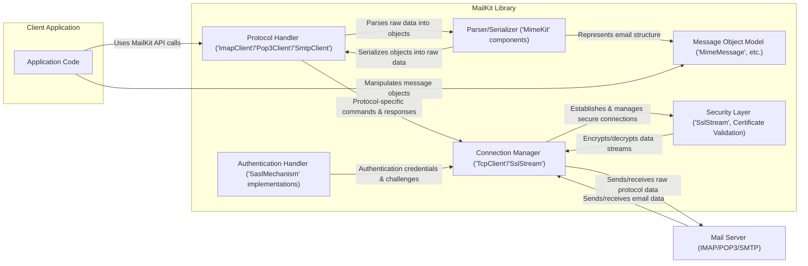

# Project Design Document: MailKit

**Version:** 1.1
**Date:** October 26, 2023
**Author:** AI Software Architect

## 1. Introduction

This document provides an enhanced architectural overview of the MailKit project, a cross-platform .NET library for email protocols such as IMAP, POP3, and SMTP. This refined document aims to provide a more detailed foundation for subsequent threat modeling activities. It elaborates on the key components, data flows, and security considerations inherent in the library's design, offering a more granular perspective.

## 2. Goals and Non-Goals

### 2.1. Goals

*   Provide a clear and comprehensive description of MailKit's architecture, with increased detail on key modules.
*   Identify the key components and their interactions, specifying sub-components where relevant.
*   Illustrate the data flow within the library and with external systems, highlighting sensitive data paths.
*   Highlight potential security-relevant aspects of the design with more specific examples.
*   Serve as a robust basis for conducting thorough threat modeling exercises.

### 2.2. Non-Goals

*   Provide a complete code-level analysis of the MailKit library, including every class and method signature.
*   Detail the implementation specifics of every single feature or edge case.
*   Document the nuances of every supported email server configuration or protocol extension.
*   Include a comprehensive list of all possible error codes or exception types.
*   Perform an actual threat modeling exercise or provide a list of specific vulnerabilities within this document.

## 3. System Architecture

MailKit is designed as a modular and extensible library, providing a rich set of classes and interfaces for interacting with email servers. Its client-side nature means it's primarily used by applications to establish connections and communicate with remote mail services.

### 3.1. Core Components

*   **Protocol Implementations:**
    *   **IMAP Client (`MailKit.Net.Imap`):**
        *   Handles connection management, authentication, and command execution for the IMAP protocol.
        *   Includes modules for fetching messages, managing mailboxes, and handling server events.
        *   Supports various IMAP extensions.
    *   **POP3 Client (`MailKit.Net.Pop3`):**
        *   Manages connections, authentication, and message retrieval for the POP3 protocol.
        *   Provides functionality for downloading and deleting messages.
    *   **SMTP Client (`MailKit.Net.Smtp`):**
        *   Handles connection management, authentication, and message submission for the SMTP protocol.
        *   Supports various SMTP extensions, including secure submission.
*   **Authentication Mechanisms (`MailKit.Security`):**
    *   Provides implementations for various authentication schemes:
        *   `SaslMechanism`: Base class for SASL mechanisms.
        *   Specific implementations: `SaslMechanismPlain`, `SaslMechanismLogin`, `SaslMechanismCramMd5`, `SaslMechanismNtlm`, `SaslMechanismOAuth2`.
    *   Handles secure storage and retrieval of credentials (delegated to the application using MailKit).
*   **Connection Management (`MailKit.Net`):**
    *   `TcpClient`: Handles the underlying TCP connection.
    *   `SslStream`: Provides secure communication over TLS/SSL.
    *   Connection pooling and management for efficient resource utilization.
    *   Timeout mechanisms for handling unresponsive servers.
*   **Parsing and Serialization (`MimeKit`):**
    *   This is a separate but tightly integrated library.
    *   Parses email messages according to RFC standards (e.g., RFC 5322, MIME).
    *   Serializes email messages into the appropriate formats for sending.
    *   Handles various character encodings and MIME types.
*   **Message Handling (`MimeKit`):**
    *   Provides a comprehensive object model for representing email messages:
        *   `MimeMessage`: Represents an entire email message.
        *   `HeaderList`: Collection of email headers.
        *   `BodyBuilder`: Helps construct email bodies with text and attachments.
        *   `MimePart`: Represents individual parts of a MIME message (e.g., text, attachments).
*   **Error Handling and Logging:**
    *   Uses .NET exception handling mechanisms for reporting errors.
    *   Provides logging capabilities through standard .NET logging interfaces (e.g., `ILogger`).
    *   Includes specific exception types for different error scenarios (e.g., `AuthenticationException`, `IOException`).
*   **Security Features (`MailKit.Security`, `MimeKit.Cryptography`):**
    *   **TLS/SSL Encryption:** Enforces secure communication using `SslStream`.
    *   **Secure Authentication:** Implements various SASL mechanisms for secure authentication.
    *   **Certificate Validation:** Allows customization of certificate validation logic.
    *   **Message Signing and Encryption (S/MIME, PGP):**  Provided by `MimeKit.Cryptography`.
    *   Mechanisms to mitigate potential vulnerabilities like header injection by providing structured APIs for email construction.
*   **Extension Points:**
    *   Abstract classes and interfaces for customizing authentication mechanisms, protocol implementations, and other functionalities.
    *   Event-driven architecture for certain operations, allowing applications to react to events.

### 3.2. External Dependencies

*   **Operating System:** Relies on the underlying OS for network socket operations and cryptographic services.
*   **.NET Runtime:** Requires a compatible .NET runtime environment providing core functionalities.
*   **Mail Servers (IMAP, POP3, SMTP):** The external systems MailKit interacts with.
*   **MimeKit:** A core dependency for email parsing, serialization, and message object representation.

### 3.3. Deployment Model

MailKit is distributed as a set of NuGet packages that are included in a .NET application. The application then instantiates and uses the MailKit client classes to interact with email servers.

## 4. Data Flow Diagram

**Data Flow Description:**

1. The **Application Code** initiates an email operation (e.g., fetching emails, sending an email) by calling methods on the MailKit API (e.g., `ImapClient.Connect()`, `SmtpClient.Send()`).
2. The appropriate **Protocol Handler** (`ImapClient`, `Pop3Client`, or `SmtpClient`) interprets the API call and orchestrates the necessary protocol-specific commands and data exchange.
3. The **Authentication Handler** (various `SaslMechanism` implementations) manages the authentication handshake with the mail server, exchanging credentials and challenge/response tokens.
4. The **Connection Manager** (`TcpClient` and `SslStream`) establishes and maintains a network connection to the **Mail Server**, potentially using TLS/SSL for encryption.
5. The **Security Layer** (`SslStream` and certificate validation logic) encrypts outgoing data and decrypts incoming data, ensuring confidentiality and integrity of the communication channel.
6. Raw protocol data is sent and received between MailKit and the **Mail Server** over the established connection.
7. The **Parser/Serializer** (components from the `MimeKit` library) converts raw email data into structured email objects (`MimeMessage`, `HeaderList`, etc.) and vice-versa.
8. The **Message Object Model** represents the parsed email message in a structured, object-oriented manner, allowing the application code to easily access and manipulate its components.

## 5. Security Considerations

This section provides a more detailed examination of security considerations relevant to MailKit's architecture, offering specific examples for threat identification.

*   **Credential Management:**
    *   **Application Responsibility:** MailKit itself doesn't persistently store credentials. The application using MailKit is responsible for secure storage (e.g., using the .NET `CredentialCache` or secure key vaults).
    *   **In-Memory Handling:**  Consider the lifespan and security of credentials held in memory during authentication.
    *   **Token Handling (OAuth2):**  Ensure secure storage and handling of OAuth2 access and refresh tokens.
    *   **Risk:** Exposure of credentials leading to unauthorized access to mail accounts.
*   **TLS/SSL Implementation:**
    *   **Default Enforcement:** MailKit encourages and defaults to secure connections, but applications can override this.
    *   **Certificate Validation:** Improper certificate validation (e.g., blindly accepting all certificates) can lead to man-in-the-middle attacks.
    *   **Cipher Suite Negotiation:**  Ensure strong and modern cipher suites are negotiated.
    *   **Protocol Downgrade Attacks:** Consider potential vulnerabilities if older TLS versions are allowed.
    *   **Risk:** Interception of sensitive email content and credentials.
*   **Authentication Protocol Security:**
    *   **Plain Text Authentication:** Using insecure authentication methods like `PLAIN` over unencrypted connections is highly vulnerable.
    *   **SASL Vulnerabilities:**  Certain SASL mechanisms might have inherent weaknesses.
    *   **Brute-Force Attacks:** While MailKit doesn't directly prevent server-side brute-force, applications should implement appropriate retry logic and potentially account lockout mechanisms.
    *   **Risk:** Unauthorized access to mail accounts through compromised authentication.
*   **Email Parsing Vulnerabilities (within MimeKit):**
    *   **Buffer Overflows:**  Potential vulnerabilities in parsing complex or malformed email headers or bodies.
    *   **Denial of Service:**  Processing extremely large or deeply nested MIME structures could lead to resource exhaustion.
    *   **Format String Bugs:**  Less likely in managed code but worth considering in the context of any native interop.
    *   **Risk:** Application crashes, denial of service, or potentially even remote code execution if parsing vulnerabilities exist.
*   **Header Injection:**
    *   MailKit provides structured APIs to construct email headers, mitigating direct header injection. However, incorrect usage of these APIs or manual header manipulation could introduce vulnerabilities.
    *   **Risk:** Attackers injecting malicious headers to redirect emails, spoof senders, or inject spam.
*   **Dependency Security:**
    *   Regularly check for known vulnerabilities in MailKit's dependencies (primarily MimeKit).
    *   Keep dependencies updated to patch security flaws.
    *   **Risk:** Exploiting vulnerabilities in dependent libraries.
*   **Error Handling and Information Disclosure:**
    *   Verbose error messages or logs might reveal sensitive information about the application's configuration or internal workings.
    *   Unhandled exceptions could potentially leak stack traces containing sensitive data.
    *   **Risk:** Exposure of sensitive information aiding attackers.
*   **State Management:**
    *   Improper handling of connection state could lead to unexpected behavior or vulnerabilities.
    *   Ensure proper cleanup of resources and secure closure of connections.
    *   **Risk:** Potential for resource leaks or unexpected interactions with the mail server.
*   **Extension Security:**
    *   If custom authentication mechanisms or protocol extensions are implemented, they must be developed with security in mind.
    *   Ensure proper input validation and secure coding practices in extensions.
    *   **Risk:** Introduction of vulnerabilities through custom extensions.

## 6. Deployment Considerations

*   MailKit's security is intertwined with the security of the host application. Secure coding practices in the application are crucial.
*   Application developers are responsible for configuring TLS/SSL settings, including certificate validation policies.
*   The security posture of the mail servers MailKit interacts with is a significant factor. Ensure communication with trusted and secure servers.
*   Consider the environment where the application is deployed (e.g., secure network, access controls).

## 7. Future Considerations

*   Exploration of more advanced authentication protocols and security features.
*   Continuous monitoring for and mitigation of emerging threats.
*   Potential integration with hardware security modules (HSMs) for enhanced key management.
*   Improvements to the API to further reduce the risk of misuse leading to vulnerabilities.

This enhanced document provides a more detailed architectural understanding of the MailKit project, offering a stronger foundation for comprehensive threat modeling. By delving deeper into the components, data flows, and specific security considerations, security professionals can more effectively identify and address potential risks associated with the use of this powerful email library.