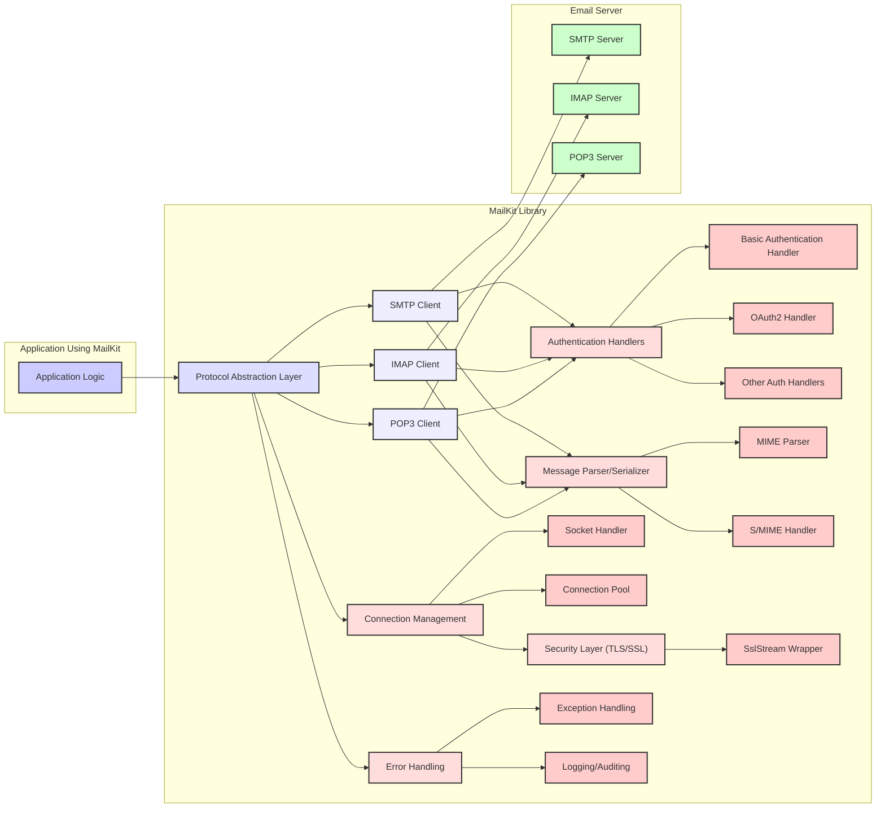
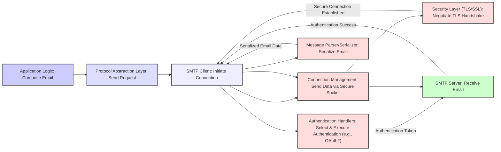

# Project Design Document: MailKit

**Version:** 1.1
**Date:** October 26, 2023
**Author:** Gemini (AI Language Model)

## 1. Introduction

This document provides an enhanced and more detailed design overview of the MailKit project, an open-source .NET library providing comprehensive cross-platform email functionality. This revised document aims to provide an even clearer articulation of the architecture, components, and data flow within MailKit, specifically tailored for subsequent threat modeling activities. It expands on the previous version with more specific details relevant to security considerations.

## 2. Goals and Scope

The primary goal of this document is to provide a highly detailed architectural description of MailKit, optimized for threat modeling. This includes:

*   Clearly identifying all key components and their specific responsibilities, with a focus on security-relevant functions.
*   Precisely describing the interactions and data flow between these components, highlighting potential attack vectors.
*   Detailing the supported protocols and their implementation nuances within MailKit that impact security.
*   Explicitly highlighting security-relevant aspects of the design, including potential vulnerabilities and mitigation strategies.

The scope of this document encompasses the core functionalities of MailKit related to sending and receiving emails using various protocols. It maintains a focus on the logical architecture but provides more granular detail where it directly impacts security analysis. Implementation specifics are still avoided unless they are crucial for understanding potential threats.

## 3. Target Audience

This document is primarily intended for:

*   Security engineers and architects performing threat modeling on systems utilizing MailKit, requiring a deep understanding of its internal workings.
*   Developers integrating MailKit into their applications who need to be aware of the security implications of their choices.
*   Security researchers auditing MailKit for potential vulnerabilities.
*   Anyone requiring a detailed understanding of MailKit's architecture with a security-centric perspective.

## 4. System Overview

MailKit is a powerful and flexible .NET library that implements the core email protocols, enabling applications to interact with email servers. Its key functionalities revolve around:

*   **Sending Emails:** Utilizing the SMTP protocol with various authentication and security options.
*   **Receiving and Managing Emails:** Employing the IMAP protocol for advanced mailbox management and the POP3 protocol for basic email retrieval.
*   **Secure Communication:**  Enforcing and managing secure connections via TLS/SSL.
*   **Authentication:** Supporting a wide range of authentication mechanisms to interact with different email server configurations.
*   **Message Handling:**  Parsing, creating, and manipulating email messages in various formats.

MailKit's cross-platform nature makes it a versatile choice for diverse application environments.

## 5. Architectural Design

The following diagram illustrates the detailed architecture of MailKit, emphasizing security-relevant components and interactions:



### 5.1. Detailed Component Descriptions

*   **Application Logic:** The custom code within an application that leverages MailKit's functionalities. Security vulnerabilities here (e.g., hardcoded credentials) can directly impact MailKit's security.
*   **Protocol Abstraction Layer:** Provides a unified interface, shielding the application from protocol-specific complexities. This layer is crucial for consistent security practices across different protocols but could introduce vulnerabilities if not implemented carefully (e.g., improper input validation).
*   **SMTP Client:**  Handles the intricacies of the SMTP protocol, including STARTTLS negotiation, various SMTP extensions, and error handling. Potential vulnerabilities include improper handling of server responses or insecure fallback mechanisms.
*   **IMAP Client:** Implements the full range of IMAP commands and extensions, including secure authentication and data retrieval. Vulnerabilities might arise from improper command construction or handling of server-side errors.
*   **POP3 Client:** Provides basic email retrieval functionality. While simpler, vulnerabilities can still exist in authentication handling or message parsing.
*   **Authentication Handlers:** A collection of components responsible for authenticating with email servers.
    *   **Basic Authentication Handler:** Handles username/password authentication. Susceptible to credential theft if TLS is not enforced.
    *   **OAuth2 Handler:** Implements the OAuth2 flow for secure delegated authorization. Requires careful implementation to prevent token theft or misuse.
    *   **Other Auth Handlers:** Includes handlers for other mechanisms like CRAM-MD5, DIGEST-MD5, Kerberos, etc. Each has its own security considerations and potential weaknesses.
*   **Message Parser/Serializer:** Responsible for converting raw email data into structured objects and vice-versa.
    *   **MIME Parser:** Handles the parsing of MIME-encoded email messages, including attachments and different content types. A critical component for security, as vulnerabilities here can lead to various attacks (e.g., arbitrary code execution via crafted attachments).
    *   **S/MIME Handler:**  Provides support for S/MIME encryption and signing. Improper handling of keys or certificates can lead to security breaches.
*   **Connection Management:** Manages the underlying network connections.
    *   **Socket Handler:**  Manages the raw socket connections, including establishing, maintaining, and closing connections. Vulnerabilities here could involve connection hijacking or denial-of-service attacks.
    *   **Connection Pool:** Optimizes connection reuse but needs careful management to prevent issues like credential leakage or use-after-free vulnerabilities.
*   **Security Layer (TLS/SSL):** Provides encryption and integrity checks for network communication.
    *   **SslStream Wrapper:**  Wraps the underlying network stream with TLS/SSL encryption. Proper configuration and handling of certificate validation are crucial. Vulnerabilities in the underlying TLS implementation can also affect MailKit.
*   **Error Handling:** Manages errors and exceptions that occur during email operations.
    *   **Exception Handling:**  Ensures that errors are handled gracefully and do not expose sensitive information.
    *   **Logging/Auditing:**  Records events and errors. Proper logging is essential for security monitoring and incident response but must be done carefully to avoid logging sensitive data.

### 5.2. Enhanced Data Flow Diagrams

The data flow diagrams are enhanced to highlight security-relevant steps.

#### 5.2.1. Securely Sending an Email (SMTP with TLS and Authentication)



#### 5.2.2. Securely Receiving Emails (IMAP with TLS and Authentication)

```mermaid
graph LR
    A["Application Logic: Request Emails"] --> B["Protocol Abstraction Layer: Fetch Request"]
    B --> D["IMAP Client: Initiate Connection"]
    D --> H["Connection Management: Open Socket"]
    H --> I["Security Layer (TLS/SSL): Negotiate TLS Handshake"]
    I -- "Secure Connection Established" --> D
    D --> F["Authentication Handlers: Select & Execute Authentication"]
    F -- "Credentials" --> L["IMAP Server: Verify Credentials"]
    L -- "Authentication Success" --> D
    D -- "Fetch Command" --> L
    L -- "Encrypted Email Data" --> I
    I -- "Decrypted Email Data" --> D
    D --> G["Message Parser/Serializer: Parse Emails"]
    G -- "Parsed Emails" --> B
    style A fill:#ccf,stroke:#333,stroke-width:2px
    style B fill:#ddf,stroke:#333,stroke-width:2px
    style D fill:#eef,stroke:#333,stroke-width:2px
    style H fill:#fdd,stroke:#333,stroke-width:2px
    style I fill:#fdd,stroke:#333,stroke-width:2px
    style F fill:#fdd,stroke:#333,stroke-width:2px
    L fill:#cfc,stroke:#333,stroke-width:2px
    style G fill:#fdd,stroke:#333,stroke-width:2px
```

## 6. Enhanced Security Considerations

This section provides a more detailed breakdown of security considerations for threat modeling:

*   **Confidentiality:**
    *   **Threat:** Eavesdropping on network traffic to intercept email content and credentials.
    *   **Mitigation:** Mandatory use of TLS/SSL for all connections. Proper certificate validation to prevent man-in-the-middle attacks. Secure handling of authentication tokens (e.g., OAuth2).
    *   **Threat:** Exposure of sensitive information through insecure logging or error messages.
    *   **Mitigation:** Careful filtering of logged data. Avoiding the inclusion of credentials or email content in error messages.
*   **Integrity:**
    *   **Threat:** Tampering with email messages during transit.
    *   **Mitigation:** TLS/SSL provides integrity checks. S/MIME can be used for end-to-end message signing.
    *   **Threat:** Modification of stored emails on the server without authorization.
    *   **Mitigation:** Rely on the security of the IMAP/POP3 server. MailKit itself does not directly control server-side security.
*   **Availability:**
    *   **Threat:** Denial-of-service attacks against the application or the email server.
    *   **Mitigation:** Implementing appropriate timeouts and resource management within MailKit. Rate limiting and other server-side protections are also crucial.
    *   **Threat:** Vulnerabilities in MailKit leading to crashes or unexpected behavior.
    *   **Mitigation:** Thorough testing and security audits of the MailKit library.
*   **Authentication and Authorization:**
    *   **Threat:** Brute-force attacks against authentication mechanisms.
    *   **Mitigation:**  Enforcing strong password policies (application responsibility). Utilizing more secure authentication methods like OAuth2. Implementing lockout mechanisms (application responsibility or server-side).
    *   **Threat:**  Credential theft or reuse.
    *   **Mitigation:** Secure storage of credentials within the application (outside MailKit's scope). Encouraging the use of short-lived tokens.
*   **Message Parsing Vulnerabilities:**
    *   **Threat:** Exploiting vulnerabilities in the MIME parser to execute arbitrary code or cause denial-of-service.
    *   **Mitigation:**  Regularly updating MailKit to benefit from security patches. Input validation and sanitization (though primarily handled by MailKit's parser).
*   **Dependency Vulnerabilities:**
    *   **Threat:**  Vulnerabilities in third-party libraries used by MailKit.
    *   **Mitigation:**  Regularly updating MailKit's dependencies and monitoring for security advisories.

## 7. Deployment Considerations

Securing applications using MailKit requires careful consideration during deployment:

*   **Credential Management:**  Employ secure methods for storing email server credentials, such as using dedicated secrets management services or encrypted configuration files. Avoid hardcoding credentials.
*   **TLS Configuration:** Ensure that the operating system and .NET environment have up-to-date root certificates for proper TLS certificate validation.
*   **Network Segmentation:** Isolate the application server from untrusted networks.
*   **Regular Updates:** Keep MailKit and its dependencies updated to patch known vulnerabilities.
*   **Security Audits:** Conduct regular security audits of the application and its integration with MailKit.

## 8. Dependencies

MailKit relies on various .NET framework libraries and potentially third-party packages. The security of these dependencies is critical. A non-exhaustive list includes:

*   `System.Net.Security`: For TLS/SSL implementation.
*   `System.Net.Sockets`: For network communication.
*   Cryptographic libraries: For secure authentication and encryption.

It is crucial to review the specific dependencies listed in the MailKit project's files (e.g., `.csproj` file) and ensure they are regularly updated and free from known vulnerabilities.

## 9. Future Considerations

Future security enhancements for MailKit could include:

*   **Improved handling of untrusted email content:**  More robust sandboxing or isolation techniques for parsing potentially malicious emails.
*   **Enhanced logging and auditing capabilities:**  More detailed security-related logging for easier threat detection and incident response.
*   **Built-in protection against common email-based attacks:**  Features to automatically detect and mitigate phishing or malware attempts.
*   **Formal security audits:**  Regular independent security assessments to identify and address potential vulnerabilities.

This enhanced design document provides a more granular and security-focused view of the MailKit project, facilitating more effective threat modeling and the development of secure applications that utilize this powerful library.