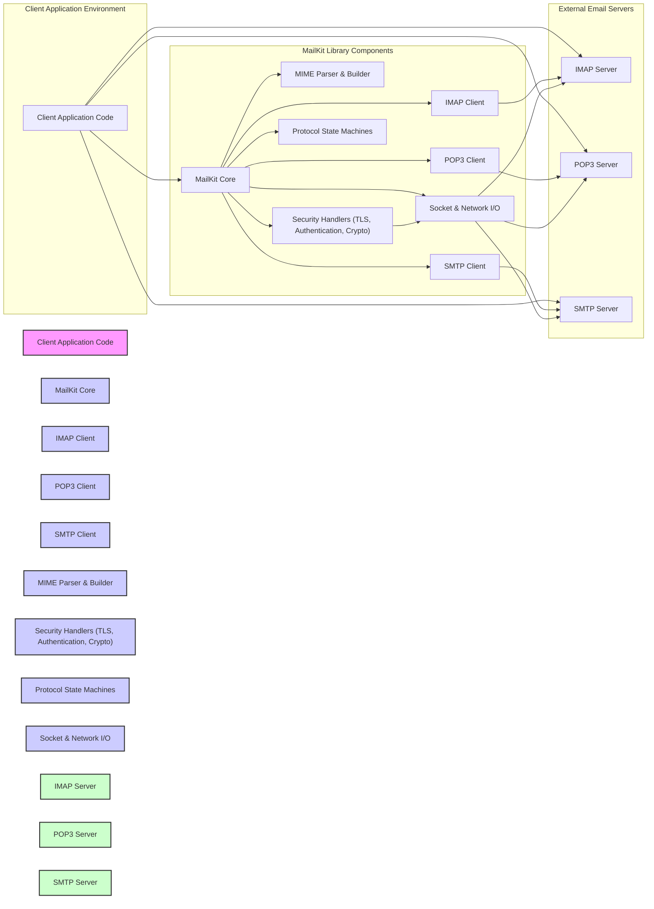
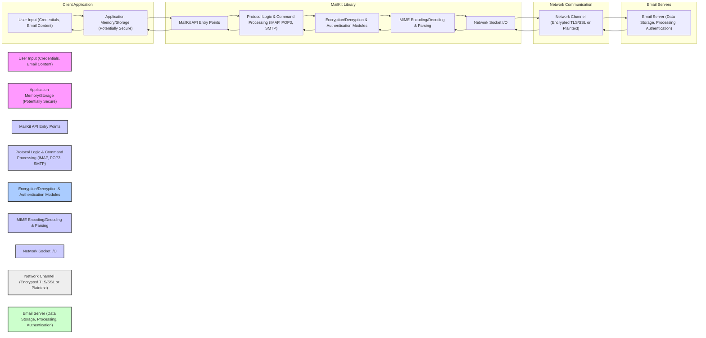

# Project Design Document: MailKit Library for Threat Modeling

**Project Name:** MailKit Library

**Project Repository:** [https://github.com/jstedfast/mailkit](https://github.com/jstedfast/mailkit)

**Version:** (Based on latest commit at the time of document creation - please update regularly) -  Commit SHA: `[Insert Latest Commit SHA from GitHub here - e.g., 1a2b3c4d]`
**Document Version:** 1.1
**Date:** 2023-10-27
**Author:** [Your Name/Organization]

## 1. Introduction

This document provides a detailed design overview of the MailKit library, a robust and widely used cross-platform .NET library for IMAP, POP3, and SMTP protocols.  It is specifically designed to facilitate threat modeling and security analysis of systems that integrate MailKit. This document outlines the library's architecture, key components, data flow pathways, and critical security considerations. It serves as a foundational resource for identifying potential threats and vulnerabilities within applications utilizing MailKit, enabling proactive security measures.

## 2. Project Overview

MailKit is a mature and actively developed .NET library that simplifies the implementation of email communication functionalities within applications. It offers comprehensive and efficient implementations of the core email protocols:

*   **IMAP (Internet Message Access Protocol):** Enables complex email management on servers, including retrieval, organization, searching, and manipulation of emails and folders.
*   **POP3 (Post Office Protocol version 3):** Facilitates simple email retrieval from servers, typically downloading emails to a client and often removing them from the server.
*   **SMTP (Simple Mail Transfer Protocol):**  Provides robust email sending capabilities, handling message delivery to mail servers.

MailKit is designed with a focus on performance, security, and feature richness, offering a wide range of functionalities including:

*   **Comprehensive MIME Support:**  Advanced parsing and creation of MIME-encoded email messages, handling complex structures with various content types (text, HTML, multipart), attachments, and encoding schemes.
*   **Robust TLS/SSL Encryption:**  Secure communication channels using industry-standard TLS/SSL protocols, protecting data in transit. Supports various TLS versions and cipher suites.
*   **Extensive Authentication Mechanisms:**  Support for a wide array of authentication methods for connecting to email servers, including PLAIN, LOGIN, CRAM-MD5, NTLM, OAuth 2.0, and more, catering to diverse server configurations.
*   **Asynchronous Operations:**  Support for asynchronous programming patterns, improving application responsiveness and scalability when dealing with network operations.
*   **Extensibility and Customization:**  Designed to be extensible, allowing developers to customize and extend its functionality through interfaces and events to meet specific application requirements.

This design document focuses on the core architectural elements of MailKit and its interactions with external systems, providing the necessary context for effective threat modeling and security assessments.

## 3. System Architecture

MailKit is architected as a library intended for seamless integration into .NET applications. It acts as a crucial intermediary layer, abstracting the complexities of email protocols and providing a simplified API for applications to interact with email servers. The following diagram illustrates the high-level architecture of a system incorporating MailKit:

**Detailed Component Description:**

*   **"Client Application Code"**: Represents the custom .NET application that integrates and utilizes the MailKit library. This component embodies the application's specific business logic, user interface, and workflows, and it invokes MailKit APIs to perform email-related tasks.
*   **"MailKit Core"**: The central architectural component of the MailKit library. It provides the fundamental classes, interfaces, and core logic shared across all protocol-specific clients and modules. It manages the overall library operation and coordination between different components.
*   **"IMAP Client"**: Implements the full IMAP protocol specification for interacting with IMAP servers. It handles a wide range of IMAP commands for message retrieval, manipulation (flagging, moving, deleting), folder management (creation, deletion, renaming), server-side searching, and advanced IMAP features.
*   **"POP3 Client"**: Implements the POP3 protocol for basic email retrieval from POP3 servers. It focuses on downloading emails, typically in a simple download-and-delete model, with support for basic POP3 commands.
*   **"SMTP Client"**: Implements the SMTP protocol for sending emails to SMTP servers. It handles message formatting according to SMTP standards, message delivery, queueing (if implemented by the client application), and various SMTP extensions.
*   **"MIME Parser & Builder"**: A critical component responsible for both parsing incoming MIME-encoded email messages and constructing valid MIME messages for sending. It handles the complexities of MIME structures, including content types, character sets, transfer encodings, and attachments. It ensures correct interpretation and generation of MIME data.
*   **"Security Handlers (TLS, Authentication, Crypto)"**: Manages all security-related aspects of communication. This includes:
    *   Establishing and managing TLS/SSL encrypted connections to email servers, negotiating cipher suites, and handling certificate validation.
    *   Implementing various authentication mechanisms as per protocol specifications, securely handling credentials and authentication exchanges.
    *   Potentially incorporating cryptographic operations for message signing or encryption (S/MIME - though S/MIME support might be in a separate module or extension, core crypto for TLS/Auth is here).
*   **"Protocol State Machines"**:  Internal components that manage the state of the communication with email servers according to the respective protocol specifications (IMAP, POP3, SMTP). They ensure correct sequencing of commands and responses, handling protocol-specific nuances and error conditions.
*   **"Socket & Network I/O"**:  Handles the low-level network communication, managing socket connections, data transmission and reception over the network. This component abstracts the underlying network operations from the higher-level protocol logic.
*   **"IMAP Server"**: An external IMAP server system that stores and manages email messages and folders. MailKit's IMAP client communicates with this server to access and manipulate email data.
*   **"POP3 Server"**: An external POP3 server system that stores email messages for retrieval. MailKit's POP3 client interacts with this server to download emails.
*   **"SMTP Server"**: An external SMTP server system responsible for receiving, relaying, and delivering outgoing emails. MailKit's SMTP client interacts with this server to send emails.

## 4. Data Flow

The following data flow diagram illustrates the movement of sensitive data within a system using MailKit, emphasizing critical operations and security boundaries:

**Detailed Data Flow Description:**

1.  **User Input & Application Storage (A -> B):** Users provide sensitive input, including email credentials (usernames, passwords, OAuth tokens, API keys), email content (message body, attachments, headers), and recipient information through the Client Application's interface. This data is initially held in the application's memory and potentially persisted in application storage (e.g., configuration files, databases, secure storage). The security of storage at this stage is the responsibility of the client application.
2.  **Application to MailKit API (B -> C):** The Client Application utilizes MailKit's API to initiate email operations (e.g., connect, authenticate, send, retrieve). Sensitive data, such as credentials and email content, is passed to MailKit through these API calls as parameters and method arguments.
3.  **MailKit API to Protocol Logic (C -> D):** MailKit's API entry points route the requests to the appropriate protocol logic modules (IMAP, POP3, or SMTP) based on the requested operation and the target email server type. This stage involves parsing commands and preparing protocol-specific requests.
4.  **Protocol Logic to Security Modules (D -> E):**  Before transmitting data over the network, the Protocol Logic interacts with the Security Modules. If encryption (TLS/SSL) is configured, the Security Modules initiate the TLS handshake to establish an encrypted channel. Authentication credentials are also processed and securely handled by these modules, preparing authentication requests according to the chosen mechanism.
5.  **Security Modules to MIME Processing (E -> F):** MIME Processing is involved in both sending and receiving emails. For sending, the Security Modules pass the email content to the MIME Encoding module to format it into a valid MIME structure. For receiving, the MIME Decoding module parses the MIME structure received from the network after decryption (if applicable).
6.  **MIME Processing to Network I/O (F -> G):** The MIME-encoded email data (for sending) or the raw network data (for receiving) is passed to the Network Socket I/O module. This module handles the actual transmission and reception of data over the network sockets.
7.  **Network I/O to Network Channel (G -> H):** Data is transmitted over the Network Channel. If TLS/SSL is enabled, this channel is encrypted, protecting data in transit. Otherwise, communication might occur in plaintext.
8.  **Network Channel to Email Server (H -> I):** The data reaches the Email Server. For SMTP, this is the email message being delivered. For IMAP/POP3, this could be commands to retrieve emails or server responses containing email data. The Email Server processes the data, performing actions like email delivery, storage, or authentication validation.
9.  **Email Server to Network Channel (I -> H):** When retrieving emails (IMAP/POP3) or receiving server responses, the Email Server sends data back over the Network Channel.
10. **Network Channel to Network I/O (H -> G):** Received data from the network is handled by the Network Socket I/O module.
11. **Network I/O to MIME Processing (G -> F):** For received emails, the raw network data is passed to the MIME Decoding module to parse the MIME structure and extract email content and attachments.
12. **MIME Processing to Security Modules (F -> E):** If encryption was used (TLS/SSL), the MIME-decoded data (email content) is passed to the Decryption module to decrypt the content. Authentication responses from the server are also processed by the Authentication modules.
13. **Security Modules to Protocol Logic (E -> D):** Decrypted and processed data, along with authentication results, are passed back to the Protocol Logic modules.
14. **Protocol Logic to MailKit API (D -> C):** The Protocol Logic modules format the data and return it to the Client Application through the MailKit API.
15. **MailKit API to Application Storage/Memory (C -> B):** The Client Application receives the data from MailKit and stores it in memory or potentially persists it in application storage for further processing, display, or user interaction.
16. **Application Storage/Memory to User Input (B -> A):** The Client Application may present retrieved email content, status updates, or prompts for further user input based on the processed email data.

**Sensitive Data Traversed:**

*   **User Credentials:** Usernames, passwords, OAuth tokens, API keys used for authentication with email servers.
*   **Email Content:** Full email messages, including headers, body (plain text and HTML), attachments, sender and recipient addresses, subject lines.
*   **Session Tokens/Cookies:** Potentially used for maintaining authenticated sessions with email servers, especially with modern authentication methods like OAuth 2.0.
*   **Email Metadata:**  Information about emails, such as timestamps, flags (read/unread), folder information, which can be sensitive depending on context.

## 5. Technology Stack

MailKit is developed using a modern and cross-platform technology stack:

*   **Primary Programming Language:** C# (.NET) - Leverages the features and capabilities of the .NET ecosystem.
*   **Target Framework:** .NET Standard - Targets .NET Standard to ensure broad cross-platform compatibility, running on .NET Framework, .NET Core, .NET 5+, Mono, Xamarin, and other .NET implementations.
*   **Build System & Package Management:** NuGet - Uses NuGet for package management and distribution, facilitating easy integration into .NET projects.
*   **Dependencies:** MailKit relies on a limited set of well-established .NET libraries, primarily from the .NET Base Class Library (BCL).  Key dependencies might include libraries for:
    *   **Networking:**  System.Net.Sockets, System.Net.Security for socket operations and TLS/SSL.
    *   **Cryptography:** System.Security.Cryptography for cryptographic operations related to TLS and authentication mechanisms.
    *   **Text Encoding:** System.Text.Encoding for handling various character encodings in email messages.
    *   **MIME Parsing:**  Potentially uses internal or BCL components for MIME parsing, but MailKit primarily implements its own robust MIME parser for performance and control.

    **Dependency Analysis for Threat Modeling:** It is crucial to perform a thorough analysis of MailKit's dependencies for threat modeling. This involves:
    *   **Identifying all direct and transitive dependencies:**  Using NuGet package manager or dependency analysis tools.
    *   **Checking for known vulnerabilities:**  Using vulnerability databases (e.g., CVE, NVD) and security scanning tools to identify known vulnerabilities in dependencies.
    *   **Monitoring dependency updates:**  Staying informed about security updates and patches for dependencies and updating them promptly.
    *   **Evaluating the security posture of dependencies:**  Assessing the development practices and security track record of the maintainers of dependent libraries.

## 6. Security Considerations

The following are critical security considerations for MailKit and systems that integrate it. Each consideration includes potential threats and recommended mitigations:

*   **Authentication Security:**
    *   **Consideration:** MailKit supports a wide range of authentication mechanisms, but the security strength varies significantly. Weak authentication methods or insecure implementation can lead to unauthorized access.
    *   **Threats:**
        *   **Weak Authentication Methods:** Use of inherently weak methods like PLAIN or LOGIN over unencrypted connections, susceptible to credential sniffing.
        *   **Credential Stuffing/Brute-Force Attacks:** Attempts to gain unauthorized access by trying compromised credentials or systematically guessing passwords.
        *   **Insecure Credential Storage (Client-Side):** Storing credentials in plaintext or weakly encrypted forms within the client application, making them vulnerable to theft.
        *   **Man-in-the-Middle (MITM) Attacks (Authentication Phase):** If authentication is performed over an unencrypted channel, attackers can intercept credentials during the authentication handshake.
    *   **Mitigations:**
        *   **Prioritize Strong Authentication:**  Favor OAuth 2.0 or other modern, token-based authentication methods where supported by the email server. Use CRAM-MD5 or similar challenge-response mechanisms over basic authentication if OAuth is not feasible.
        *   **Enforce TLS/SSL for Authentication:** Always enforce TLS/SSL encryption for all connections, especially during the authentication phase, to protect credentials in transit.
        *   **Secure Credential Storage (Client-Side):** Never store credentials in plaintext. Utilize OS-level credential management systems (e.g., Credential Manager on Windows, Keychain on macOS) or secure key vaults to store credentials securely. If application-level storage is necessary, use strong encryption with robust key management.
        *   **Implement Rate Limiting and Account Lockout:** Implement mechanisms to limit login attempts and lock accounts after multiple failed attempts to mitigate brute-force attacks.
        *   **Multi-Factor Authentication (MFA):** Encourage or enforce MFA where possible to add an extra layer of security beyond passwords.

*   **Data in Transit Encryption (TLS/SSL):**
    *   **Consideration:** MailKit's support for TLS/SSL is crucial for protecting email data during transmission. Misconfiguration or lack of enforcement can expose sensitive information.
    *   **Threats:**
        *   **Man-in-the-Middle (MITM) Attacks:** If TLS/SSL is not enabled or properly enforced, attackers can intercept and eavesdrop on email communications, potentially reading sensitive email content and credentials.
        *   **Downgrade Attacks:** Attackers might attempt to force the use of weaker or outdated TLS versions or cipher suites, which are more vulnerable to exploitation.
        *   **Certificate Validation Bypass:**  If certificate validation is disabled or improperly implemented in the client application, MITM attacks become easier to execute as rogue servers can impersonate legitimate email servers.
    *   **Mitigations:**
        *   **Enforce TLS/SSL for All Connections:**  Configure MailKit to always use TLS/SSL encryption for all communication with email servers (IMAP, POP3, SMTP).
        *   **Use Strong Cipher Suites:** Configure MailKit to prefer and use strong and modern cipher suites. Avoid outdated or weak ciphers known to be vulnerable.
        *   **Strict Server Certificate Validation:**  Implement and enforce strict server certificate validation in the client application. Verify the server certificate's validity, chain of trust, and hostname to prevent MITM attacks. Do not disable certificate validation unless absolutely necessary and with extreme caution.
        *   **Opportunistic TLS with STARTTLS:** For protocols that support STARTTLS (like SMTP), ensure MailKit is configured to initiate STARTTLS to upgrade to an encrypted connection whenever possible.
        *   **HSTS (HTTP Strict Transport Security) for Web Clients:** If MailKit is used in conjunction with a web-based email client, implement HSTS to instruct browsers to always connect to the web server over HTTPS, reducing the risk of protocol downgrade attacks.

*   **Data at Rest Security (Client-Side Storage):**
    *   **Consideration:** Client applications using MailKit might cache or persistently store email data (messages, attachments, credentials) locally. Insecure local storage can lead to data breaches.
    *   **Threats:**
        *   **Unauthorized Access to Local Storage:** Attackers gaining physical or remote access to the client device could access locally stored email data if it is not properly protected.
        *   **Data Theft from Compromised Devices:** Loss or theft of devices containing unencrypted email data can result in data breaches.
        *   **Malware and Data Exfiltration:** Malware running on the client device could access and exfiltrate locally stored email data.
    *   **Mitigations:**
        *   **Encrypt Local Storage:** Encrypt sensitive email data at rest if it is stored locally. Use strong encryption algorithms and robust key management practices. Consider using OS-level encryption features (e.g., full disk encryption, file-level encryption).
        *   **Secure Credential Storage (Reiteration):**  As mentioned before, securely store email credentials using OS-level credential managers or secure key vaults.
        *   **Minimize Local Data Storage:**  Avoid storing sensitive email data locally unless absolutely necessary. If caching is needed, limit the duration and scope of caching.
        *   **Secure File Permissions:**  Use appropriate file system permissions to restrict access to locally stored email data to authorized users and processes only.
        *   **Secure Deletion:** Implement secure deletion mechanisms to ensure that sensitive email data is securely erased when it is no longer needed, preventing data recovery.

*   **Input Validation and Output Encoding (MIME Processing):**
    *   **Consideration:** MailKit's MIME parser handles complex email structures. Vulnerabilities in MIME parsing or improper handling of email content can lead to various attacks.
    *   **Threats:**
        *   **MIME Parsing Vulnerabilities:** Exploitable flaws in the MIME parser could lead to buffer overflows, denial of service, or remote code execution if malformed or maliciously crafted MIME messages are processed.
        *   **Email Header Injection:** Attackers could inject malicious headers into emails, potentially manipulating email routing, spoofing sender addresses, or bypassing security filters.
        *   **HTML Injection/Cross-Site Scripting (XSS):** If email content (especially HTML bodies) is rendered in a web browser or application without proper sanitization, attackers could inject malicious scripts that execute in the user's context.
        *   **Attachment-Based Attacks:** Malicious attachments could contain malware, exploits, or phishing content.
    *   **Mitigations:**
        *   **Robust MIME Parsing:**  MailKit's MIME parser is generally robust, but it's essential to keep MailKit updated to benefit from any security patches and improvements in parsing logic.
        *   **Input Validation and Sanitization:** Implement input validation and sanitization on email headers and content before processing or displaying them. Sanitize HTML content to remove or neutralize potentially malicious scripts and elements.
        *   **Output Encoding:**  Properly encode email content when displaying it in applications, especially in web browsers. Use context-appropriate encoding (e.g., HTML entity encoding, JavaScript escaping) to prevent XSS attacks.
        *   **Attachment Security:** Implement robust attachment scanning and sandboxing to detect and prevent malicious attachments from harming users or systems. Warn users about potentially risky attachments and encourage caution when opening attachments from unknown senders.
        *   **Content Security Policy (CSP) for Web Clients:** If rendering email content in a web browser, utilize Content Security Policy (CSP) to restrict the sources from which scripts and other resources can be loaded, mitigating XSS risks.

*   **Dependency Management Security (Third-Party Libraries):**
    *   **Consideration:** MailKit relies on external .NET libraries. Vulnerabilities in these dependencies can indirectly introduce security risks into MailKit and applications using it.
    *   **Threats:**
        *   **Exploitation of Vulnerabilities in Dependencies:** Known vulnerabilities in dependent libraries could be exploited to compromise MailKit or applications using it.
        *   **Supply Chain Attacks:** Compromised dependencies could be maliciously modified to introduce backdoors or vulnerabilities.
    *   **Mitigations:**
        *   **Regularly Update Dependencies:** Keep MailKit and all its dependencies updated to the latest versions to patch known vulnerabilities.
        *   **Dependency Scanning:** Use dependency scanning tools (e.g., NuGet audit, OWASP Dependency-Check) to automatically identify known vulnerabilities in project dependencies.
        *   **Vulnerability Monitoring:** Subscribe to security advisories and vulnerability databases to stay informed about newly discovered vulnerabilities in dependencies.
        *   **Dependency Pinning/Locking:** Use dependency pinning or lock files to ensure consistent dependency versions across environments and prevent unexpected updates that might introduce vulnerabilities.
        *   **Security Audits of Dependencies:** For critical applications, consider performing security audits of MailKit's dependencies to assess their security posture and identify potential risks.

*   **Denial of Service (DoS) Resilience:**
    *   **Consideration:** Processing extremely large or malformed emails could potentially lead to denial-of-service attacks by consuming excessive resources.
    *   **Threats:**
        *   **Resource Exhaustion:** Processing very large emails (e.g., with huge attachments or deeply nested MIME structures) could exhaust server or client resources (CPU, memory, network bandwidth), leading to DoS.
        *   **Algorithmic Complexity Exploits:**  Vulnerabilities in parsing logic or protocol handling could be exploited by sending specially crafted emails that trigger computationally expensive operations, causing DoS.
    *   **Mitigations:**
        *   **Resource Limits:** Implement resource limits for email processing, such as maximum message size limits, attachment size limits, and limits on MIME nesting depth.
        *   **Timeouts:** Set appropriate timeouts for network operations and email processing to prevent indefinite delays and resource blocking.
        *   **Input Validation and Rate Limiting (Protocol Level):** Implement input validation at the protocol level to reject malformed commands or requests that could lead to DoS. Consider rate limiting connections and requests from specific IP addresses to mitigate DoS attempts.
        *   **Thorough Testing:** Perform thorough testing with various email formats, sizes, and potentially malicious email samples to identify and address potential DoS vulnerabilities.

*   **Error Handling and Logging Security:**
    *   **Consideration:** Improper error handling and insecure logging practices can expose sensitive information or create vulnerabilities.
    *   **Threats:**
        *   **Information Leakage through Error Messages:** Verbose error messages might reveal sensitive information about the system, configuration, or internal workings, aiding attackers.
        *   **Insecure Logging of Sensitive Data:** Logging sensitive data like passwords, email content, or session tokens in plaintext can create security vulnerabilities if logs are compromised.
    *   **Mitigations:**
        *   **Secure Error Handling:** Implement robust error handling that avoids revealing sensitive information in error messages. Provide generic error messages to users while logging detailed error information securely for debugging and monitoring purposes.
        *   **Secure Logging Practices:**  Log relevant security events and application activity for auditing and security monitoring. However, avoid logging sensitive data like passwords, email content, or personal information in plaintext. If logging sensitive data is absolutely necessary, encrypt the logs and implement strict access controls.
        *   **Log Rotation and Management:** Implement log rotation and retention policies to manage log file size and storage. Securely store and manage log files, restricting access to authorized personnel only.

## 7. Assumptions and Out of Scope

**Assumptions:**

*   **Secure Email Server Infrastructure:** It is assumed that the external email servers (IMAP, POP3, SMTP) that MailKit interacts with are themselves securely configured, maintained, and operated by reputable email service providers or system administrators. Security vulnerabilities within the email server infrastructure itself are generally outside the scope of this document, except where they directly relate to MailKit's interaction protocols and security features.
*   **Secure Client Application Environment:** This document assumes that the client applications utilizing MailKit are developed and deployed within reasonably secure environments. This includes secure operating systems, up-to-date security patches, and general security best practices applied at the application level, beyond just the usage of MailKit.
*   **Underlying Network Security:** We assume a baseline level of security for the underlying network infrastructure. While MailKit addresses data in transit encryption, this document does not delve into detailed network security measures like firewall configurations, intrusion detection systems, or network segmentation, which are assumed to be in place.

**Out of Scope:**

*   **Detailed Email Server Security Analysis:**  In-depth security analysis of specific IMAP, POP3, and SMTP server implementations (e.g., Postfix, Exchange, Dovecot) is outside the scope. This document focuses on MailKit's role in interacting with these servers securely.
*   **Client Application Business Logic Vulnerabilities:** Security vulnerabilities originating from the client application's code *outside* of its direct interaction with MailKit are not comprehensively covered. This includes application-specific business logic flaws, UI-related vulnerabilities (beyond XSS in email rendering, which is addressed), or authorization issues within the application itself.
*   **Physical Security of Endpoints and Servers:** Physical security aspects of the devices running client applications or the physical security of email server infrastructure are not considered.
*   **Social Engineering and Phishing Attacks (User-Level):**  Threats related to social engineering attacks targeting end-users (e.g., phishing emails designed to steal credentials) are outside the direct scope of MailKit's security design, although MailKit's secure email handling can indirectly contribute to mitigating some phishing risks.
*   **Operating System and Hardware Vulnerabilities (General):**  General vulnerabilities specific to the underlying operating systems or hardware platforms on which MailKit or email servers are running are not directly addressed, unless they have a direct and specific impact on MailKit's security functionality.

## 8. Conclusion

This detailed design document provides a comprehensive security-focused overview of the MailKit library's architecture, data flow, and critical security considerations. It is intended to be a valuable resource for conducting thorough threat modeling and security assessments of systems that integrate MailKit for email communication. By understanding the components, data interactions, potential security risks, and recommended mitigations outlined in this document, developers, security architects, and penetration testers can effectively identify, analyze, and proactively mitigate threats in applications leveraging the MailKit library. Regular review and updates of this document are recommended as MailKit evolves, new security threats emerge, and best practices advance in the email security landscape.