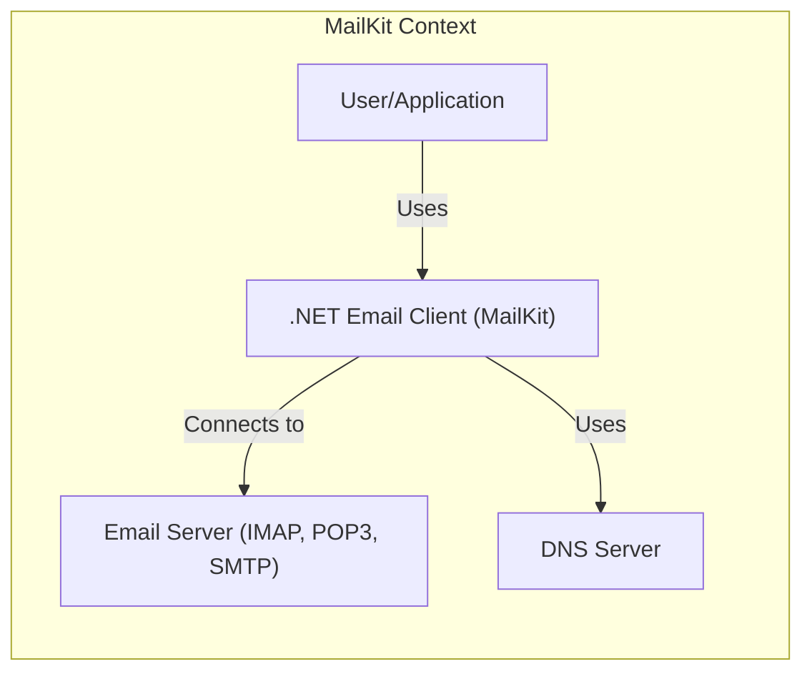
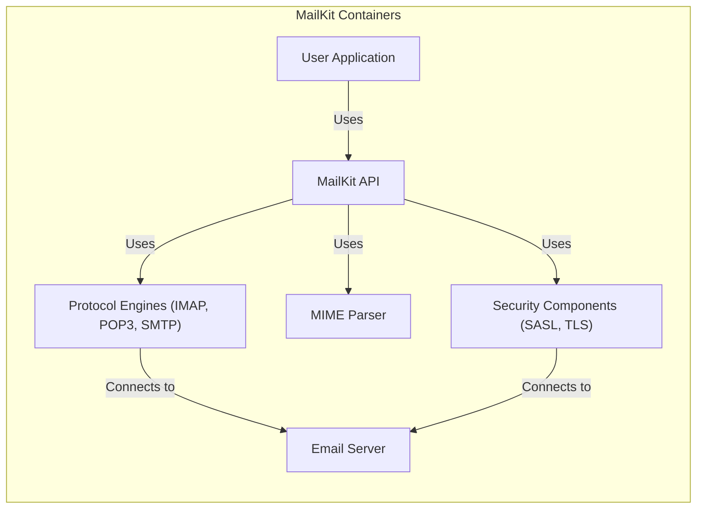
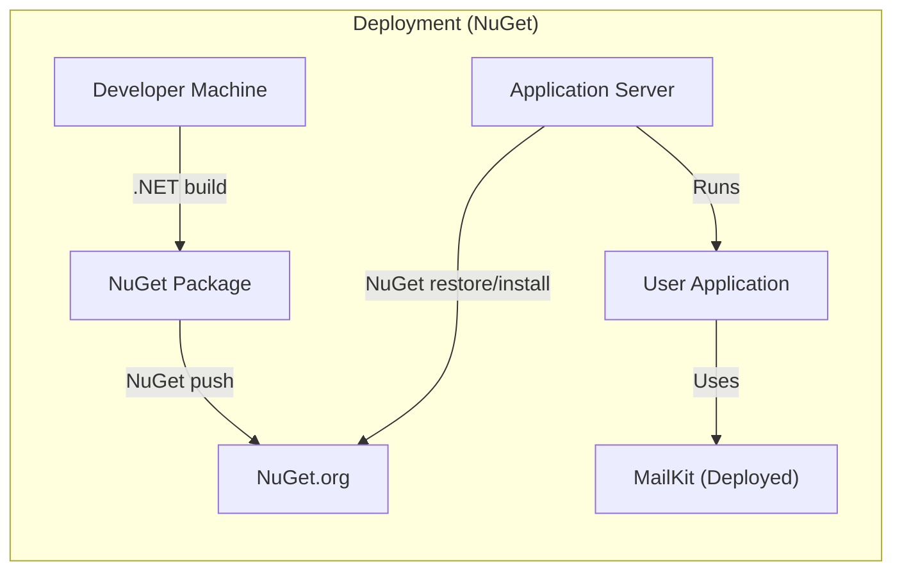
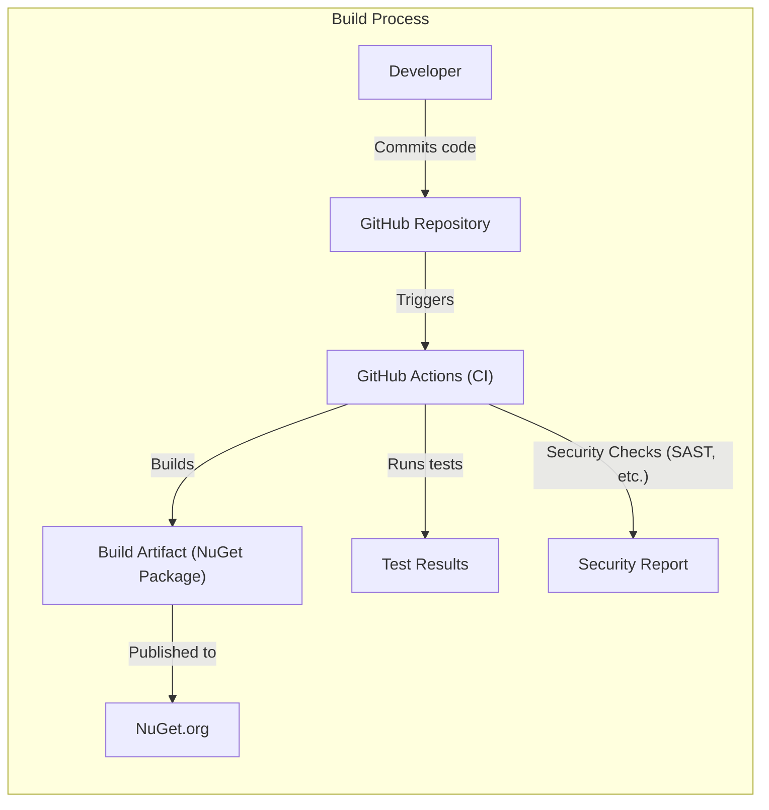

# BUSINESS POSTURE

Business Priorities and Goals:

*   Provide a comprehensive, robust, and efficient .NET library for email creation, parsing, and processing (IMAP, POP3, SMTP).
*   Offer a cross-platform solution compatible with various .NET implementations.
*   Maintain high performance and reliability for handling large volumes of email data.
*   Ensure compliance with relevant email standards and protocols.
*   Provide a well-documented and easy-to-use API for developers.
*   Foster an active open-source community for contributions and support.
*   Minimize security vulnerabilities to protect user data and system integrity.

Most Important Business Risks:

*   Data breaches: Unauthorized access to sensitive email data (content, metadata, credentials).
*   Service disruption: Denial of service or performance degradation affecting email processing capabilities.
*   Reputational damage: Security vulnerabilities or data breaches eroding user trust.
*   Compliance violations: Non-compliance with email standards or data privacy regulations.
*   Supply chain attacks: Compromised dependencies or build processes introducing vulnerabilities.

# SECURITY POSTURE

Existing Security Controls:

*   security control: Secure coding practices: The project appears to follow secure coding practices, as evidenced by the use of established .NET libraries and attention to detail in handling email protocols. (Source: Code review of the GitHub repository).
*   security control: Input validation: The library likely performs input validation to prevent injection attacks and handle malformed email data. (Source: Inferred from the nature of the library and common security practices).
*   security control: Protocol compliance: The library adheres to relevant email standards (RFCs) for IMAP, POP3, and SMTP, reducing the risk of protocol-specific vulnerabilities. (Source: Project description and code).
*   security control: Regular updates: The project is actively maintained, with frequent updates and bug fixes, suggesting timely patching of vulnerabilities. (Source: GitHub repository activity).
*   security control: Authentication mechanisms: The library supports various authentication mechanisms, including SASL, for secure access to email servers. (Source: Project documentation and code).
*   security control: Encryption in transit: The library supports TLS/SSL for encrypting communication with email servers. (Source: Project documentation and code).

Accepted Risks:

*   accepted risk: Dependency vulnerabilities: The project relies on external dependencies, which may contain vulnerabilities that could be exploited.
*   accepted risk: Zero-day exploits: The library may be vulnerable to unknown (zero-day) exploits targeting email protocols or underlying .NET components.
*   accepted risk: Misconfiguration: Users may misconfigure the library or their email servers, leading to security weaknesses.

Recommended Security Controls:

*   security control: Implement comprehensive fuzz testing to identify potential vulnerabilities related to input handling and protocol parsing.
*   security control: Conduct regular security audits and penetration testing to identify and address potential weaknesses.
*   security control: Integrate static application security testing (SAST) and dynamic application security testing (DAST) tools into the build process.
*   security control: Implement a Software Bill of Materials (SBOM) to track and manage dependencies, facilitating vulnerability management.
*   security control: Provide clear security documentation and guidelines for users, including best practices for secure configuration and usage.
*   security control: Establish a vulnerability disclosure program to encourage responsible reporting of security issues.

Security Requirements:

*   Authentication:
    *   Support secure authentication mechanisms (e.g., SASL, OAuth 2.0) for accessing email servers.
    *   Protect user credentials from unauthorized access and disclosure.
    *   Implement appropriate session management to prevent session hijacking.
*   Authorization:
    *   Enforce access controls based on user roles and permissions.
    *   Restrict access to sensitive email data and operations based on the principle of least privilege.
*   Input Validation:
    *   Validate all input data (email addresses, headers, content) to prevent injection attacks (e.g., command injection, cross-site scripting).
    *   Handle malformed or unexpected input gracefully, without crashing or exposing sensitive information.
    *   Sanitize input data to remove potentially harmful characters or sequences.
*   Cryptography:
    *   Use strong, industry-standard cryptographic algorithms and protocols (e.g., TLS/SSL) for secure communication.
    *   Protect cryptographic keys from unauthorized access and disclosure.
    *   Ensure proper implementation of cryptographic operations (e.g., random number generation, key exchange).
    *   Support S/MIME for email encryption and digital signatures.

# DESIGN

## C4 CONTEXT

Element List:

*   Element:
    *   Name: User/Application
    *   Type: Person/Software System
    *   Description: A user or application that utilizes the MailKit library to interact with email servers.
    *   Responsibilities: Initiates email operations (sending, receiving, managing emails). Provides user credentials and configuration settings.
    *   Security controls: Implements appropriate authentication and authorization mechanisms. Follows secure coding practices.

*   Element:
    *   Name: .NET Email Client (MailKit)
    *   Type: Software System
    *   Description: The MailKit library itself, providing email functionality.
    *   Responsibilities: Handles email parsing, creation, and communication with email servers. Implements email protocols (IMAP, POP3, SMTP). Provides an API for developers.
    *   Security controls: Input validation, protocol compliance, secure authentication, encryption in transit, secure coding practices.

*   Element:
    *   Name: Email Server (IMAP, POP3, SMTP)
    *   Type: Software System
    *   Description: An external email server that stores and manages user mailboxes.
    *   Responsibilities: Receives and delivers emails. Stores email data. Authenticates users.
    *   Security controls: Implements server-side security measures (firewalls, intrusion detection systems, access controls).

*   Element:
    *   Name: DNS Server
    *   Type: Software System
    *   Description: Provides DNS resolution services.
    *   Responsibilities: Resolves hostnames to IP addresses.
    *   Security controls: DNSSEC, secure zone transfers.

## C4 CONTAINER

Element List:

*   Element:
    *   Name: User Application
    *   Type: Software System
    *   Description: An application that uses the MailKit library.
    *   Responsibilities: Integrates with MailKit API to perform email operations.
    *   Security controls: Secure coding practices, proper handling of user credentials.

*   Element:
    *   Name: MailKit API
    *   Type: API
    *   Description: The public interface of the MailKit library.
    *   Responsibilities: Provides methods for interacting with email servers and manipulating email data.
    *   Security controls: Input validation, access control.

*   Element:
    *   Name: Protocol Engines (IMAP, POP3, SMTP)
    *   Type: Component
    *   Description: Components responsible for implementing email protocols.
    *   Responsibilities: Handle communication with email servers using specific protocols.
    *   Security controls: Protocol compliance, secure connection establishment.

*   Element:
    *   Name: MIME Parser
    *   Type: Component
    *   Description: Component responsible for parsing MIME messages.
    *   Responsibilities: Parse email headers and body, handle attachments.
    *   Security controls: Input validation, robust parsing logic to prevent vulnerabilities.

*   Element:
    *   Name: Security Components (SASL, TLS)
    *   Type: Component
    *   Description: Components responsible for handling security aspects.
    *   Responsibilities: Implement authentication mechanisms (SASL), secure communication (TLS).
    *   Security controls: Secure key management, proper implementation of cryptographic algorithms.

*   Element:
    *   Name: Email Server
    *   Type: Software System
    *   Description: An external email server.
    *   Responsibilities: Store and manage emails, authenticate users.
    *   Security controls: Server-side security measures.

## DEPLOYMENT

Possible Deployment Solutions:

1.  NuGet Package: The most common deployment method is via NuGet. Developers include MailKit as a dependency in their .NET projects, and the NuGet package manager handles the download and installation of the library.
2.  Manual DLL Reference: Developers can download the compiled DLL files and manually reference them in their projects.
3.  Source Code Integration: Developers can include the MailKit source code directly in their projects and compile it along with their application code.

Chosen Solution (NuGet Package):

Element List:

*   Element:
    *   Name: Developer Machine
    *   Type: Infrastructure Node
    *   Description: The machine where the MailKit library is built.
    *   Responsibilities: Compiles the source code, creates the NuGet package.
    *   Security controls: Secure development environment, code signing.

*   Element:
    *   Name: NuGet Package
    *   Type: Artifact
    *   Description: The packaged MailKit library.
    *   Responsibilities: Contains the compiled DLLs and other necessary files.
    *   Security controls: Package signing, integrity checks.

*   Element:
    *   Name: NuGet.org
    *   Type: Infrastructure Node
    *   Description: The public NuGet repository.
    *   Responsibilities: Hosts the MailKit NuGet package.
    *   Security controls: Repository security measures, access controls.

*   Element:
    *   Name: Application Server
    *   Type: Infrastructure Node
    *   Description: The server where the user application is deployed.
    *   Responsibilities: Runs the user application, which uses MailKit.
    *   Security controls: Server hardening, network security.

*   Element:
    *   Name: User Application
    *   Type: Software System
    *   Description: The application that uses the MailKit library.
    *   Responsibilities: Performs email operations using MailKit.
    *   Security controls: Secure coding practices, proper handling of user credentials.

*   Element:
    *   Name: MailKit (Deployed)
    *   Type: Software System
    *   Description: The deployed instance of the MailKit library.
    *   Responsibilities: Provides email functionality to the user application.
    *   Security controls: Inherited from the NuGet package and application server.

## BUILD

Build Process Description:

1.  Developers commit code changes to the GitHub repository.
2.  GitHub Actions, the CI/CD system, is triggered by the commit.
3.  GitHub Actions builds the project, creating a NuGet package as the build artifact.
4.  GitHub Actions runs unit tests and integration tests, generating test results.
5.  GitHub Actions performs security checks, such as static application security testing (SAST) using tools like SonarQube or similar, generating a security report. Other checks can include dependency scanning and code quality analysis.
6.  If all tests and security checks pass, the build artifact (NuGet package) is published to NuGet.org.

Security Controls in Build Process:

*   security control: CI/CD Automation: GitHub Actions automates the build and testing process, ensuring consistency and reducing manual errors.
*   security control: SAST: Static analysis tools scan the codebase for potential vulnerabilities.
*   security control: Dependency Scanning: Tools check for known vulnerabilities in project dependencies.
*   security control: Code Signing: The NuGet package can be signed to ensure its authenticity and integrity.
*   security control: Build Artifact Verification: Hashes and checksums can be used to verify the integrity of the build artifact.
*   security control: Least Privilege: Build agents should run with minimal necessary permissions.

# RISK ASSESSMENT

Critical Business Processes to Protect:

*   Email communication: Ensuring the confidentiality, integrity, and availability of email processing.
*   User authentication and authorization: Protecting user credentials and ensuring proper access control to email data.
*   Data storage and retrieval: Securely storing and retrieving email data from servers.

Data to Protect and Sensitivity:

*   Email content: Highly sensitive, containing personal or business communications.
*   Email metadata (sender, recipient, subject, timestamps): Sensitive, revealing communication patterns and relationships.
*   User credentials (usernames, passwords, API keys): Highly sensitive, providing access to email accounts.
*   Configuration settings: Potentially sensitive, revealing details about the email infrastructure.

# QUESTIONS & ASSUMPTIONS

Questions:

*   Are there any specific compliance requirements (e.g., GDPR, HIPAA) that apply to the use of MailKit?
*   What are the expected usage patterns and performance requirements for applications using MailKit?
*   Are there any existing security policies or guidelines that should be considered?
*   What is the threat model for typical applications using MailKit?
*   What level of logging and auditing is required for security monitoring?
*   Are there any specific security concerns related to the use of third-party email providers?

Assumptions:

*   BUSINESS POSTURE: The primary business goal is to provide a reliable and secure email library for .NET developers.
*   SECURITY POSTURE: The project follows secure coding practices and addresses common security vulnerabilities.
*   DESIGN: The library is designed to be modular and extensible, allowing for future enhancements and security improvements. The deployment model is primarily via NuGet packages. The build process utilizes GitHub Actions for automation and security checks.