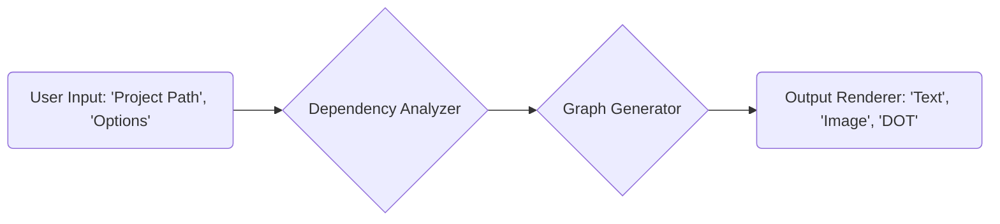
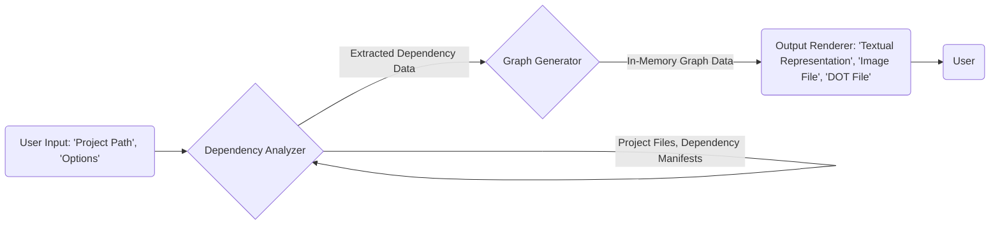

## Project Design Document: Dependencies Visualization Tool (Improved)

**1. Introduction**

This document provides an enhanced design specification for the "Dependencies" project, a command-line tool designed to visualize software project dependencies. This detailed design serves as a crucial foundation for subsequent threat modeling activities by clearly outlining the system's architecture, components, data flow, and potential security considerations. The primary goal of this tool is to offer developers an intuitive graphical representation of their project's dependency structure, facilitating a deeper understanding of complex relationships and potential vulnerabilities.

**2. Goals and Objectives**

* **Primary Goal:** To deliver a user-friendly and secure command-line tool for visualizing software project dependencies.
* **Objectives:**
    * Broad Language Support:  Support a wide range of programming languages and their associated package managers (e.g., Python/pip, JavaScript/npm/yarn, Ruby/gem, Go/mod).
    * Accurate Dependency Extraction: Precisely identify and extract both direct and transitive project dependencies.
    * Informative Graph Generation: Generate clear, customizable, and easily interpretable dependency graphs.
    * Flexible Output Options: Offer various output formats (text, image, graph description language) and customization levels.
    * Cross-Platform Compatibility: Ensure seamless installation and operation across different operating systems (Linux, macOS, Windows).
    * Security Focus: Design and implement the tool with security best practices in mind to minimize potential vulnerabilities.

**3. High-Level Architecture**

The "Dependencies" tool employs a pipeline architecture, processing user input through distinct stages: dependency analysis, graph construction, and output rendering.

**4. Component Details**

* **User Input:**
    * **Description:** This initial component manages user interaction, receiving the target project's file system path and any optional configuration parameters.
    * **Functionality:**
        * Accepts the project directory path as a mandatory command-line argument.
        * Parses command-line options and flags (e.g., output format, depth of analysis).
        * Performs rigorous validation of the provided project path to ensure it exists and is accessible.
        * Sanitizes input to prevent command injection or path traversal attacks.
    * **Potential Security Considerations:**
        * **Path Traversal:**  Insufficient validation could allow users to specify paths outside the intended project directory, potentially exposing sensitive information.
        * **Command Injection:** Improper handling of command-line options could allow attackers to inject malicious commands.

* **Dependency Analyzer:**
    * **Description:** The core logic resides within this component, responsible for identifying and extracting dependency information from the target project.
    * **Functionality:**
        * **Language Detection:** Automatically detects the project's programming language and package manager by examining project files (e.g., `requirements.txt`, `package.json`, `go.mod`).
        * **Parsing Logic:** Utilizes language-specific parsing modules to extract dependency declarations from relevant files. This includes handling various dependency specification formats (e.g., version ranges, specific versions).
        * **External Command Execution (Conditional):** In some cases, may execute external package manager commands (e.g., `pip show`, `npm list --depth=0`) to retrieve detailed dependency information. This is done with extreme caution and with sanitized inputs.
        * **Dependency Resolution:**  Attempts to resolve transitive dependencies based on the project's dependency specifications.
    * **Potential Security Considerations:**
        * **Code Injection:** If external commands are executed without thorough sanitization of inputs derived from project files or user input.
        * **Denial of Service (DoS):**  Maliciously crafted dependency files with excessively deep or circular dependencies could potentially cause the analysis to consume excessive resources.
        * **Information Disclosure:** Errors during parsing or external command execution could inadvertently expose sensitive information from project files or the environment.
        * **Vulnerable Dependency Parsing Libraries:**  Using outdated or vulnerable parsing libraries could introduce security flaws.

* **Graph Generator:**
    * **Description:** This component takes the extracted dependency data and constructs an in-memory graph representation of the project's dependencies.
    * **Functionality:**
        * **Node Creation:** Creates nodes representing individual dependencies (packages, libraries).
        * **Edge Creation:** Creates directed edges representing the "depends on" relationship between dependencies.
        * **Graph Attributes:**  May add attributes to nodes and edges (e.g., dependency version, dependency type).
        * **Graph Layout (Optional):** May implement basic graph layout algorithms to improve visual clarity.
    * **Potential Security Considerations:**
        * **Resource Exhaustion:**  Projects with a very large number of dependencies could lead to excessive memory consumption during graph generation. Defensive measures like limiting the depth of analysis might be necessary.

* **Output Renderer:**
    * **Description:** This component transforms the in-memory dependency graph into a user-friendly output format.
    * **Functionality:**
        * **Text-Based Output:** Generates a textual representation of the dependency graph (e.g., a list of dependencies and their relationships).
        * **Image Output:**  Utilizes graph visualization libraries to generate image formats like PNG or SVG. Care is taken to sanitize any user-controlled data that might be incorporated into the image (e.g., labels).
        * **DOT Language Output:**  Generates output in the DOT language, allowing users to use external tools like Graphviz for more advanced rendering and customization.
        * **Customization Options:** Allows users to control aspects of the output, such as the level of detail and the format.
    * **Potential Security Considerations:**
        * **Cross-Site Scripting (XSS):** If generating SVG output and user-provided data (e.g., dependency names) is not properly sanitized, it could lead to XSS vulnerabilities if the SVG is viewed in a web browser.
        * **Information Disclosure:**  Including sensitive information in the output without proper filtering could expose it to unauthorized users.

**5. Data Flow Diagram**

This diagram illustrates the movement and transformation of data within the "Dependencies" tool.

**6. Security Considerations (Detailed)**

This section expands on the initial security considerations, providing more specific examples and mitigation strategies.

* **Input Validation and Sanitization:**
    * **Threat:** Path traversal attacks, command injection.
    * **Mitigation:** Implement strict input validation for the project path, ensuring it resolves to a valid directory within the expected scope. Sanitize command-line options to prevent the execution of arbitrary commands. Use parameterized commands when interacting with the operating system.
* **Dependency Parsing Security:**
    * **Threat:** Code injection through maliciously crafted dependency files, denial of service due to resource-intensive parsing.
    * **Mitigation:** Utilize well-vetted and regularly updated parsing libraries. Implement safeguards against excessively deep or circular dependencies. Avoid directly executing code embedded within dependency files.
* **External Command Execution Security:**
    * **Threat:** Command injection if inputs to external commands are not properly sanitized.
    * **Mitigation:** Minimize the use of external commands. When necessary, sanitize all inputs passed to external commands. Consider using safer alternatives to shell execution where possible. Implement whitelisting of allowed commands.
* **Output Sanitization:**
    * **Threat:** Cross-site scripting (XSS) if generating web-viewable output formats like SVG.
    * **Mitigation:**  Sanitize all user-controlled data that is included in the output, especially for formats like SVG. Use appropriate encoding techniques to prevent the injection of malicious scripts.
* **Dependency on Third-Party Libraries:**
    * **Threat:** Vulnerabilities in third-party libraries used by the tool.
    * **Mitigation:**  Maintain a clear inventory of all third-party dependencies. Regularly scan dependencies for known vulnerabilities using automated tools. Keep dependencies updated to the latest stable versions.
* **Error Handling and Information Disclosure:**
    * **Threat:** Sensitive information being leaked in error messages or logs.
    * **Mitigation:** Implement robust error handling that prevents the disclosure of sensitive information. Log errors securely and avoid exposing internal details to users.
* **Permissions and Least Privilege:**
    * **Threat:** The tool operating with excessive privileges, potentially allowing it to perform actions it shouldn't.
    * **Mitigation:** Design the tool to operate with the minimum necessary permissions. Avoid requiring root or administrator privileges.

**7. Technologies Used**

* **Programming Language:** Python (likely, based on the linked repository and common use case for such tools).
* **Dependency Management (for the tool itself):**  `setuptools` or `poetry` for packaging and distribution.
* **Graph Generation Library:** `networkx` (Python) is a strong candidate for creating and manipulating graph structures.
* **Output Rendering Libraries:**
    * **Image Generation:** Libraries like `Pillow` (Python Imaging Library) for generating PNG images.
    * **SVG Generation:** Libraries like `svgwrite` (Python) for creating SVG files.
    * **DOT Language Generation:**  String formatting or dedicated libraries for generating DOT language syntax.
* **Command-line Argument Parsing:** `argparse` (Python) for handling command-line arguments and options securely.

**8. Deployment Model**

* **Distribution:** Primarily distributed as a command-line tool via package managers like `pip` (for Python). Potentially also through other distribution methods like standalone executables.
* **Installation:** Users will typically install the tool using `pip install dependencies-visualizer` or similar commands.
* **Execution:** Users will execute the tool from their terminal using commands like `dependencies --path /path/to/project`.

**9. Future Considerations**

* **Interactive Web Interface:** Developing a web-based interface to provide a more interactive and visually appealing way to explore dependency graphs. This would require careful consideration of web security best practices.
* **Advanced Graph Analysis:** Incorporating features for analyzing the dependency graph, such as identifying dependency cycles or unused dependencies.
* **Integration with IDEs:**  Developing plugins or extensions for popular Integrated Development Environments (IDEs) to provide seamless dependency visualization within the development workflow.
* **Security Vulnerability Scanning Integration:** Directly integrating with vulnerability databases (e.g., the National Vulnerability Database) to highlight known vulnerabilities in project dependencies within the visualization.

This improved design document provides a more detailed and security-focused blueprint for the "Dependencies" project. It serves as a valuable resource for understanding the system's architecture and identifying potential threats during the threat modeling process.
