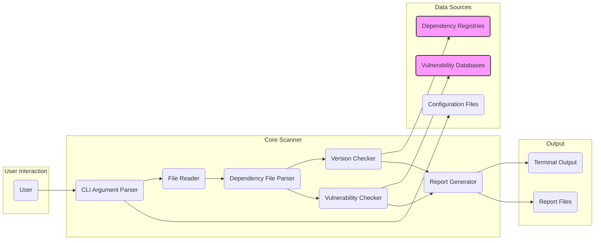
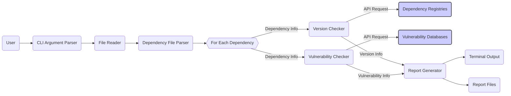

# Project Design Document: Dependencies

**Project Name:** Dependencies

**Project Repository:** https://github.com/lucasg/dependencies

**Version:** 1.1

**Date:** October 26, 2023

**Author:** Gemini (AI Model)

## 1. Introduction

This document provides a detailed design overview of the `dependencies` project, a command-line tool meticulously crafted to identify outdated or insecure dependencies within software projects. This document aims to furnish a clear and comprehensive understanding of the project's architecture, individual components, the flow of data, and critical design considerations. It is specifically intended to serve as a robust foundation for subsequent threat modeling exercises.

## 2. Goals and Non-Goals

### 2.1. Goals

*   Offer a user-friendly command-line interface (CLI) for initiating scans of project dependency files.
*   Provide comprehensive support for a variety of prevalent dependency file formats, including but not limited to `requirements.txt` (Python), `package.json` (Node.js), and `pom.xml` (Java).
*   Accurately identify outdated dependencies by rigorously comparing the currently utilized versions against the most recent versions available in their respective registries.
*   Effectively identify dependencies harboring known security vulnerabilities by actively consulting and cross-referencing information from established vulnerability databases.
*   Present scan results in a manner that is both clear and actionable, facilitating prompt remediation.
*   Enable users to customize the scanning behavior through a range of configurable options, catering to diverse project needs.
*   Maintain a design that prioritizes lightweight operation and efficient execution, minimizing resource consumption.

### 2.2. Non-Goals

*   Implement functionality to automatically update dependencies to newer versions.
*   Provide real-time, continuous monitoring of dependencies for changes or newly discovered vulnerabilities.
*   Develop a graphical user interface (GUI) for interacting with the tool. The focus remains solely on the CLI.
*   Expand the tool's scope to function as a comprehensive dependency management solution beyond the core functionalities of vulnerability and outdatedness detection.
*   Offer specific remediation suggestions or automated fixes beyond simply identifying the vulnerable or outdated dependency.

## 3. Architecture Overview

The `dependencies` project adopts a modular architecture, with a central scanning engine at its core. This design facilitates interaction with various external data sources to retrieve essential dependency information and vulnerability data.

## 4. Component Details

*   **User:** The individual or automated system (e.g., CI/CD pipeline) initiating the execution of the `dependencies` tool.
*   **CLI Argument Parser:** This component is responsible for interpreting command-line arguments provided by the user. It validates the input and extracts relevant configuration parameters, such as the target project directory, desired output format (e.g., JSON, CSV), and any specified configuration file paths. Error handling for invalid or missing arguments is a key function.
    *   Input: Command-line arguments passed to the tool.
    *   Output: A structured representation of the parsed configuration parameters.
*   **File Reader:** This component handles the task of reading the content of specified dependency files from the target project directory. It needs to be robust enough to handle file not found errors and potentially different file encodings.
    *   Input: File path(s) to the dependency files.
    *   Output: The raw content of the dependency files as strings.
*   **Dependency File Parser:** This is a crucial component responsible for parsing the content of various dependency file formats. It employs format-specific logic to accurately extract a list of dependencies along with their specified versions or version ranges. Different sub-components or modules will handle formats like `requirements.txt`, `package.json`, and `pom.xml`. Error handling for malformed dependency files is essential.
    *   Input: The content of a single dependency file.
    *   Output: A structured list of dependencies, each with its name and specified version.
*   **Version Checker:** This component interacts with external dependency registries (e.g., PyPI, npm registry, Maven Central) to determine the latest available versions for the identified dependencies. It typically involves making API calls to these registries. Consideration for API rate limiting and handling potential network errors is important.
    *   Input: A dependency name and its currently specified version.
    *   Output: The latest available version of the dependency in the relevant registry.
*   **Vulnerability Checker:** This component queries established vulnerability databases (e.g., CVE databases, the OSV database, Snyk API) to identify known security vulnerabilities associated with the identified dependencies and their specific versions. This often involves API interactions with these databases. Handling different vulnerability database formats and potential API limitations is necessary.
    *   Input: A dependency name and its currently specified version.
    *   Output: A list of known vulnerabilities (including details like CVE IDs and severity scores, if available) associated with that dependency and version, or an indication that no vulnerabilities were found.
*   **Report Generator:** This component takes the scan results – including identified outdated dependencies and known vulnerabilities – and formats them into a user-friendly output. It supports multiple output formats, such as displaying results directly in the terminal with appropriate formatting, or generating reports in structured formats like JSON or CSV for automated processing.
    *   Input: Results from the Version Checker (current vs. latest versions) and the Vulnerability Checker (list of vulnerabilities).
    *   Output: A formatted report of the scan results, presented in the user-specified format.
*   **Dependency Registries (e.g., PyPI, npm, Maven Central):** These are external services that host software packages and associated metadata, including version history. The Version Checker interacts with these registries' APIs to retrieve version information.
    *   Interaction: The Version Checker sends API requests to these registries, typically using HTTP(S).
*   **Vulnerability Databases (e.g., CVE, OSV):** These are external databases that aggregate and maintain information about known software vulnerabilities. The Vulnerability Checker interacts with these databases' APIs to retrieve vulnerability information.
    *   Interaction: The Vulnerability Checker sends API requests to these databases, potentially requiring API keys or authentication.
*   **Configuration Files (.dependencies.yaml):** These optional files allow users to customize the behavior of the tool. Configurations might include specifying ignored dependencies, custom vulnerability database URLs, or thresholds for considering a dependency "outdated."  The CLI Argument Parser reads and applies these configurations.
    *   Input: The content of the configuration file.
    *   Output: Configuration settings that influence the behavior of other components.
*   **Terminal Output:** This is the default output mechanism, displaying the scan results directly in the user's command-line terminal. Formatting for readability and clarity is important.
    *   Input: The formatted report generated by the Report Generator.
    *   Output: Textual representation of the scan results displayed in the terminal.
*   **Report Files (e.g., JSON, CSV):** These are alternative output methods that store the scan results in structured file formats. This allows for easier integration with other tools and automated processing of the scan data.
    *   Input: The formatted report generated by the Report Generator.
    *   Output: A file containing the scan results in the specified format (e.g., `report.json`, `report.csv`).

## 5. Data Flow

The typical data flow within the `dependencies` project proceeds as follows:

1. The **User** initiates the `dependencies` tool execution by providing command-line arguments, potentially including the target project directory and output format preferences.
2. The **CLI Argument Parser** meticulously parses these arguments, extracting and validating the provided configuration parameters.
3. The **File Reader** then reads the content of the specified dependency files from the designated project directory.
4. The appropriate **Dependency File Parser** analyzes the content of each dependency file, extracting a structured list of dependencies along with their specified versions.
5. For each identified dependency:
    *   The **Version Checker** queries the relevant **Dependency Registries** to retrieve the latest available version information for that specific dependency.
    *   The **Vulnerability Checker** queries pertinent **Vulnerability Databases** to identify any known vulnerabilities associated with the dependency and its currently used version.
6. The **Report Generator** aggregates the results obtained from the Version Checker and the Vulnerability Checker.
7. Finally, the **Report Generator** formats these results into a user-friendly report, outputting it to the **Terminal Output** and/or generating **Report Files** based on the user's configured preferences.

## 6. Security Considerations (Initial)

This section outlines preliminary security considerations relevant to the `dependencies` project. A more comprehensive threat model will be developed subsequently, leveraging this design document as its foundation.

*   **Dependency Confusion/Substitution Attacks:** The tool relies on the integrity of external dependency registries. A significant risk exists where an attacker could publish a malicious package with the same name as a legitimate one.
    *   Mitigation: Consider implementing mechanisms to verify package integrity (e.g., checking package signatures or using trusted registry mirrors). Explore options for pinning dependencies based on content hashes.
*   **API Key Management for External Services:** If accessing vulnerability databases or dependency registries requires API keys, secure management of these keys is paramount.
    *   Mitigation: Avoid hardcoding API keys directly in the codebase. Utilize environment variables, dedicated secret management solutions (e.g., HashiCorp Vault), or credential management features provided by cloud platforms. Ensure proper access control and encryption for stored secrets.
*   **Data Injection Vulnerabilities:** The tool parses dependency files, which are essentially user-provided input. Maliciously crafted dependency files could potentially exploit vulnerabilities in the parsing logic.
    *   Mitigation: Implement robust input validation and sanitization techniques for parsing dependency files. Employ secure parsing libraries and follow best practices to prevent injection attacks. Consider using a sandboxed environment for parsing untrusted files.
*   **Denial of Service (DoS) against External Services:** Uncontrolled or excessive requests to dependency registries or vulnerability databases could lead to temporary service disruptions or rate limiting, impacting the tool's functionality.
    *   Mitigation: Implement rate limiting and request throttling mechanisms to avoid overwhelming external services. Utilize caching strategies to reduce redundant requests for the same dependency information. Implement exponential backoff with jitter for retrying failed requests.
*   **Output Sanitization Issues:** When generating reports, especially for terminal output, failure to sanitize data could lead to terminal injection vulnerabilities, allowing malicious actors to execute arbitrary commands on the user's system.
    *   Mitigation: Implement proper output encoding and sanitization techniques to neutralize any potentially malicious characters or escape sequences before displaying results in the terminal or writing to report files.
*   **Insecure Communication with External Services:** If communication with dependency registries or vulnerability databases is not conducted over HTTPS, sensitive data transmitted during these interactions could be intercepted.
    *   Mitigation: Enforce the use of HTTPS for all communication with external services. Verify SSL/TLS certificates to ensure secure connections.
*   **Configuration File Security:** If configuration files are used to store sensitive information (e.g., custom API keys), improper file permissions could expose this information to unauthorized users.
    *   Mitigation: Ensure that configuration files have appropriate file permissions (e.g., read/write access only for the user running the tool). Avoid storing highly sensitive information directly in configuration files if possible; consider alternative secure storage mechanisms.
*   **Supply Chain Security of the `dependencies` Tool Itself:** The security of the `dependencies` tool is also critical. Vulnerabilities in its own dependencies could be exploited.
    *   Mitigation: Follow secure development practices. Regularly scan the `dependencies` tool's own dependencies for vulnerabilities and update them promptly. Utilize dependency pinning to ensure predictable builds. Consider using software composition analysis (SCA) tools.

## 7. Deployment Considerations

The `dependencies` project is designed for deployment as a command-line tool. Users will typically install it using package managers specific to their environment (e.g., `pip` for Python, `npm` for Node.js) or by downloading pre-built executable binaries. Its intended use cases span various environments:

*   **Local Development Environments:** Developers can readily integrate the tool into their local workflows to proactively scan their projects for dependency issues before committing code changes.
*   **Continuous Integration/Continuous Deployment (CI/CD) Pipelines:** The tool is well-suited for integration into CI/CD pipelines, enabling automated checks for outdated or vulnerable dependencies as an integral part of the software build and deployment process.
*   **Security Audits and Assessments:** Security teams can leverage the tool to conduct periodic security audits of project dependencies, identifying potential risks and vulnerabilities.

## 8. Future Considerations

*   **Expanded Support for Dependency File Formats:** Broaden the tool's compatibility by adding support for a wider array of dependency file formats used across different programming languages and package management systems.
*   **Integration with Dependency Management Tools:** Explore potential integrations with existing dependency management tools (e.g., `pip-tools`, `Poetry`, `yarn`, `npm`) to provide a more seamless and comprehensive dependency management experience.
*   **Enhanced Remediation Guidance:** Provide more specific and actionable guidance on how to address identified vulnerabilities or outdated dependencies, potentially suggesting specific version updates or alternative secure packages.
*   **Policy Enforcement Capabilities:** Implement functionality to allow users to define and enforce policies regarding acceptable dependency versions, license types, or vulnerability severity thresholds.
*   **Improved Reporting and Visualization:** Enhance the reporting features with more detailed information, filtering options, and potentially graphical visualizations to better understand dependency relationships and vulnerability landscapes.

## 9. Glossary

*   **Dependency:** A software library or package that a project relies on for its functionality.
*   **Dependency File:** A structured file that lists the dependencies required by a specific software project (e.g., `requirements.txt`, `package.json`, `pom.xml`).
*   **Vulnerability:** A weakness or flaw in software that can be exploited by an attacker to compromise the system's security or functionality.
*   **CVE (Common Vulnerabilities and Exposures):** A standardized dictionary or list of publicly known information security vulnerabilities and exposures. Each CVE entry provides a unique identifier and descriptive information about the vulnerability.
*   **OSV (Open Source Vulnerabilities):** A distributed, community-driven, and open-source database of vulnerabilities specifically affecting open-source software projects.
*   **Dependency Registry:** A centralized repository or service that hosts software packages and their associated metadata, including version history and other relevant information (e.g., PyPI for Python packages, the npm registry for Node.js packages, Maven Central for Java packages).

This revised design document provides a more detailed and comprehensive overview of the `dependencies` project. It aims to offer a clearer understanding of the project's architecture, components, and data flow, serving as a more robust foundation for conducting thorough and effective threat modeling activities.
