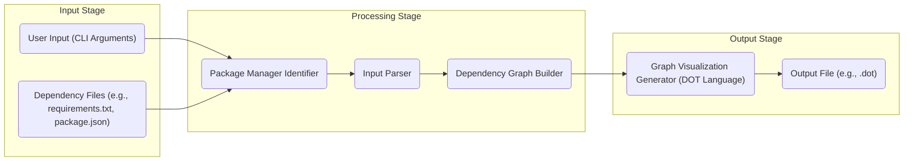
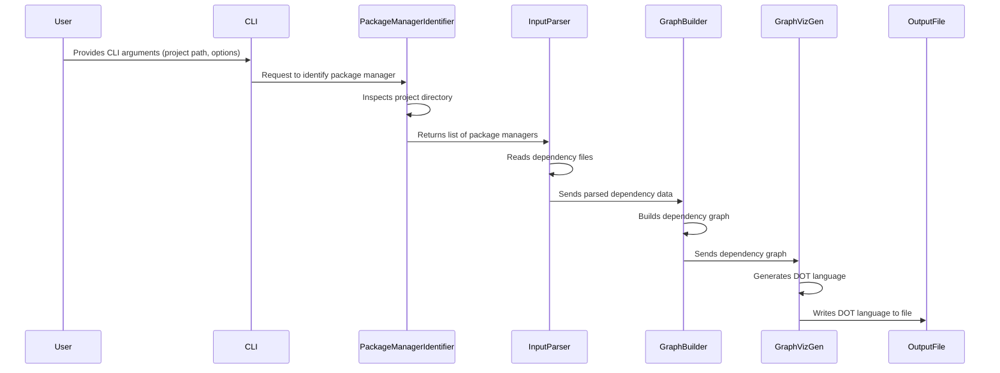

# Project Design Document: Dependencies Visualization Tool

**Project Repository:** https://github.com/lucasg/dependencies

**Version:** 1.1
**Date:** October 26, 2023
**Author:** AI Software Architect

## 1. Introduction

This document provides an enhanced and more detailed design for the `dependencies` project, a command-line tool that visualizes dependencies for various package managers. This revised document aims to provide an even clearer and more comprehensive outline of the system's architecture, components, data flow, and key considerations, specifically tailored for effective threat modeling.

### 1.1. Purpose

The primary purpose of this document is to offer a refined and more granular architectural overview of the `dependencies` tool. This enhanced detail will empower stakeholders with a deeper understanding of the system's structure, functionality, and potential security vulnerabilities. This document is explicitly designed to facilitate more precise and effective threat modeling by providing detailed insights into the system's components and their interactions.

### 1.2. Scope

This document comprehensively covers the design of the core functionality of the `dependencies` tool, including:

*   Parsing dependency files for a range of package managers (e.g., pip, npm, gem, cargo, go modules).
*   Constructing a robust and accurate dependency graph from the parsed data, handling various dependency types and constraints.
*   Generating visualizations of the dependency graph using the DOT language, suitable for rendering with Graphviz or similar tools.
*   Providing a user-friendly command-line interface (CLI) for seamless user interaction and configuration.
*   Handling potential errors and exceptions during the parsing and graph building processes.

This document explicitly excludes:

*   The internal implementation details of specific parsers for each package manager, focusing on their interfaces and data exchange.
*   The detailed design of external visualization rendering engines like Graphviz.
*   Specific deployment strategies, infrastructure setup, or platform-specific considerations.
*   Detailed user interface design beyond the structure and arguments of the CLI.

### 1.3. Goals

The goals of this enhanced design document are to:

*   Clearly and comprehensively define the architecture and components of the `dependencies` tool, providing greater detail on their responsibilities and interactions.
*   Describe the data flow within the system with more precision, highlighting data transformations and potential bottlenecks.
*   Identify key areas for security consideration and potential threats with greater specificity, enabling more targeted threat modeling.
*   Provide a robust and detailed basis for thorough threat modeling and security analysis, facilitating the identification of a wider range of potential vulnerabilities.

## 2. High-Level Architecture

The `dependencies` tool employs a modular architecture, logically divided into three primary stages: Input, Processing, and Output. This structure promotes maintainability and allows for independent development and testing of each stage.

### 2.1. Components

*   **User Input (CLI Arguments):**  This component represents the command-line arguments provided by the user. These arguments specify the target project directory, the specific package manager to analyze (or auto-detection), the desired output format, and other configuration options.
*   **Dependency Files:** These are the package manager-specific files that list the project's dependencies. Examples include `requirements.txt` for Python pip, `package.json` for Node.js npm, `Gemfile` for Ruby Gems, `Cargo.toml` for Rust Cargo, and `go.mod` for Go modules.
*   **Package Manager Identifier:** This component analyzes the input (either explicit user input or by inspecting the project directory) to determine the relevant package manager(s) for the project.
*   **Input Parser:** This component is responsible for reading and parsing the dependency files. It dynamically selects the appropriate parser based on the identified package manager.
*   **Dependency Graph Builder:** This component takes the structured dependency information from the parser and constructs an in-memory graph representation.
*   **Graph Visualization Generator (DOT Language):** This component translates the in-memory dependency graph into the DOT language, a plain text graph description language.
*   **Output File:** This is the final output of the tool, a file containing the graph visualization in the DOT language format. This file can then be processed by tools like Graphviz to generate visual representations.

## 3. Component Details

### 3.1. Package Manager Identifier

*   **Description:** This component determines the package manager(s) used by the target project.
*   **Functionality:**
    *   Examines CLI arguments for explicitly specified package managers.
    *   If not specified, it inspects the project directory for the presence of characteristic files (e.g., `requirements.txt`, `package.json`).
    *   Returns a list of identified package managers.
    *   Handles cases where multiple package managers might be present.
    *   Provides error handling for cases where no known package manager is detected.
*   **Technology:** Likely implemented in Python, using file system operations and string matching.
*   **Security Considerations:**
    *   **Path Traversal:** Ensure directory inspection is limited to the specified project directory to prevent unauthorized file access.
    *   **Spoofing:** Consider the possibility of malicious actors placing fake package manager files to mislead the identifier.

### 3.2. Input Parser

*   **Description:** The Input Parser is responsible for reading and interpreting dependency files for the identified package manager(s).
*   **Functionality:**
    *   Receives the list of package managers and the project directory.
    *   Dynamically selects the appropriate parsing logic for each package manager.
    *   Reads the relevant dependency file(s).
    *   Parses the file content according to the specific syntax of the package manager's format.
    *   Extracts package names, versions (including constraints), and dependency relationships.
    *   Handles different dependency types (e.g., regular dependencies, development dependencies).
    *   Implements error handling for malformed or invalid dependency file syntax.
*   **Technology:** Implemented in Python, potentially utilizing libraries specific to parsing each package manager's file format (e.g., regular expressions, dedicated parser libraries).
*   **Security Considerations:**
    *   **Path Traversal:**  Strictly limit file access to the intended dependency files within the project directory.
    *   **Malicious Dependency Files:** Implement robust parsing to prevent crashes or unexpected behavior from intentionally crafted or malformed files. This includes handling excessively long lines, unusual characters, or deeply nested structures.
    *   **Regular Expression Denial of Service (ReDoS):** If using regular expressions for parsing, ensure they are carefully crafted to avoid ReDoS vulnerabilities.
    *   **Code Injection (Mitigation):** While less common in standard dependency formats, if any form of code evaluation is performed (which should be avoided), rigorous sanitization is crucial.

### 3.3. Dependency Graph Builder

*   **Description:** This component takes the structured dependency information from the parser and constructs an in-memory graph representation of the project's dependencies.
*   **Functionality:**
    *   Creates nodes in the graph, where each node represents a package.
    *   Creates directed edges between nodes to represent dependency relationships.
    *   Stores package version information and dependency constraints as node or edge attributes.
    *   Detects and handles circular dependencies (e.g., by flagging them or breaking the cycle).
    *   May offer options to include or exclude different types of dependencies (e.g., development dependencies).
    *   Implements error handling for inconsistencies or conflicts in the dependency data.
*   **Technology:** Likely implemented using Python data structures (e.g., dictionaries, lists) and potentially graph libraries (e.g., `networkx`).
*   **Security Considerations:**
    *   **Resource Exhaustion:**  Large dependency graphs can consume significant memory. Implementations should consider memory-efficient data structures and potentially limits on graph size.
    *   **Denial of Service:** Maliciously crafted dependency information (e.g., extremely deep or wide dependency trees, circular dependencies) could lead to excessive resource consumption and denial of service. Implement safeguards against such scenarios.

### 3.4. Graph Visualization Generator (DOT Language)

*   **Description:** This component translates the in-memory dependency graph into the DOT language, a plain text graph description language used by Graphviz and other graph visualization tools.
*   **Functionality:**
    *   Iterates through the nodes and edges of the dependency graph.
    *   Generates DOT language syntax to represent the graph structure, including nodes, edges, labels (package names and versions), and visual attributes (e.g., node shapes, colors).
    *   Allows for customization of the generated DOT output based on user preferences (e.g., different layouts, color schemes).
    *   Ensures the generated DOT code is valid and well-formed.
*   **Technology:** Likely implemented in Python, using string formatting or template engines to generate the DOT language syntax.
*   **Security Considerations:**
    *   **Command Injection (Indirect):** The generated DOT file is typically passed to an external program like Graphviz for rendering. While the tool itself doesn't execute commands, carefully sanitize any user-provided data that influences the generated DOT code to prevent potential injection vulnerabilities in the rendering tool.
    *   **Information Disclosure:** The generated DOT file contains information about the project's dependencies, including package names and versions. Ensure appropriate handling and access controls for the output file, especially if it contains sensitive information.

## 4. Data Flow

The data flows through the system in a well-defined sequence, with each component transforming the data as it progresses:

1. The **User** provides input through the **CLI**, specifying the target project and any desired options.
2. The **CLI** passes the project path to the **Package Manager Identifier**.
3. The **Package Manager Identifier** analyzes the project directory and returns a list of identified package managers to the **Input Parser**.
4. The **Input Parser**, using the identified package managers, reads and parses the corresponding **Dependency Files**.
5. The **Input Parser** extracts structured dependency information and sends it to the **Dependency Graph Builder**.
6. The **Dependency Graph Builder** constructs an in-memory graph representation of the dependencies.
7. The **Dependency Graph Builder** passes the graph data to the **Graph Visualization Generator**.
8. The **Graph Visualization Generator** translates the graph into the **DOT Language**.
9. The **DOT Language** output is written to the **Output File**.

## 5. Security Considerations

Building upon the component details, here are more specific security considerations for the `dependencies` tool:

*   **Input Validation and Sanitization:**
    *   Thoroughly validate all user inputs (CLI arguments) to prevent command injection, path traversal, and other injection attacks. Sanitize inputs before using them in file system operations or when generating output.
    *   Validate the project path to ensure it points to a legitimate project directory.
*   **Path Traversal Prevention:**
    *   Implement strict checks to ensure that file access is limited to the intended project directory and its immediate subdirectories containing dependency files. Avoid allowing users to specify arbitrary file paths.
*   **Dependency File Parsing Security:**
    *   Employ robust parsing techniques to handle malformed, excessively large, or intentionally crafted dependency files that could lead to crashes, resource exhaustion, or unexpected behavior.
    *   Implement safeguards against ReDoS vulnerabilities in regular expressions used for parsing. Consider using alternative parsing methods if necessary.
*   **Resource Management and Denial of Service Prevention:**
    *   Implement mechanisms to prevent resource exhaustion (memory, CPU) when processing projects with a large number of dependencies. This might involve setting limits on graph size or using more memory-efficient data structures.
    *   Guard against malicious dependency structures (e.g., deeply nested or circular dependencies) that could lead to excessive processing time or memory consumption.
*   **Output Sanitization (Indirect Command Injection):**
    *   When generating the DOT language output, carefully sanitize any data derived from user input or dependency files that is incorporated into the DOT code. This helps mitigate potential indirect command injection vulnerabilities if the output is processed by a vulnerable rendering tool.
*   **Information Disclosure:**
    *   Recognize that the generated DOT file contains information about the project's dependencies. Consider the sensitivity of this information and implement appropriate measures if the output file needs to be protected (e.g., secure storage, access controls).
*   **Error Handling and Logging:**
    *   Implement comprehensive error handling to gracefully manage unexpected situations during parsing, graph building, and output generation.
    *   Log errors and warnings appropriately to aid in debugging and security monitoring. Avoid logging sensitive information.

## 6. Deployment

The `dependencies` tool, being primarily a command-line application, is typically deployed as follows:

*   **Packaging:** The Python code is packaged into a distributable format, such as a Python package installable via `pip` (using `setuptools` or `poetry`).
*   **Dependencies:**  The deployment process ensures that all necessary Python dependencies (libraries used for parsing, graph manipulation, etc.) are either bundled with the package or listed as requirements for installation.
*   **Installation:** Users can install the tool using standard Python package management tools (e.g., `pip install dependencies`).
*   **Execution:** The tool is executed from the command line, providing the necessary arguments.

The tool is designed for local execution on a user's development machine or within CI/CD pipelines. Containerization (e.g., using Docker) is also a viable deployment option for creating isolated and reproducible environments.

## 7. Future Considerations

*   **Expanded Package Manager Support:** Continuously add support for new and emerging package managers to broaden the tool's applicability.
*   **Interactive Visualization Options:** Explore options for generating interactive visualizations (e.g., using web technologies) instead of solely relying on static images.
*   **Vulnerability Scanning Integration:** Integrate with vulnerability databases or APIs to identify and highlight known vulnerabilities within the project's dependencies directly in the visualization.
*   **Dependency Conflict Analysis:** Enhance the tool to detect and visualize dependency conflicts, aiding developers in resolving them.
*   **Filtering and Customization:** Provide more advanced filtering options to allow users to focus on specific subsets of dependencies. Offer greater customization of the visualization appearance.
*   **Alternative Output Formats:** Support additional output formats beyond DOT language, such as JSON or other graph data formats.
*   **Performance Optimization:** Continuously optimize the parsing and graph building processes to handle very large projects efficiently.

This enhanced design document provides a more detailed and comprehensive understanding of the `dependencies` tool's architecture, data flow, and security considerations. This level of detail is crucial for conducting thorough threat modeling and ensuring the tool's robustness and security.