# Project Design Document: `dependencies` - Dependency Analysis Tool

**Document Version:** 1.1
**Date:** 2023-10-27
**Author:** AI Expert (Based on User Request)

## 1. Project Overview

### 1.1. Project Name

`dependencies`

### 1.2. Project Description

The `dependencies` project, available at [https://github.com/lucasg/dependencies](https://github.com/lucasg/dependencies), is a versatile command-line tool designed for in-depth analysis of project dependencies. It empowers users to gain a comprehensive understanding of their project's dependency landscape by:

*   **Comprehensive Dependency Identification:**  Parsing a wide array of project manifest files across different ecosystems (e.g., `package.json` for Node.js, `pom.xml` for Java, `requirements.txt` for Python, `Gemfile` for Ruby, `Cargo.toml` for Rust, and more) to meticulously extract dependency declarations.
*   **Hierarchical Dependency Graph Construction:** Building a robust, in-memory graph representation that accurately models the intricate relationships between project components and their dependencies, including transitive dependencies.
*   **Multi-Format Dependency Visualization & Reporting:** Generating output in diverse formats to cater to various analytical and reporting needs. Supported formats include:
    *   Plain text for quick command-line inspection.
    *   JSON for structured data exchange and programmatic analysis.
    *   Graphviz DOT language for creating detailed visual dependency graphs using Graphviz tools.
    *   Mermaid syntax for embedding interactive dependency diagrams directly into Markdown documents and web platforms.
*   **Extensible Multi-Language & Package Manager Support:** Architected for broad compatibility and future growth, supporting a wide spectrum of programming languages and their associated package management systems through a modular parser design.

### 1.3. Project Goals

*   **User-Centric CLI Experience:** Provide an intuitive and efficient command-line interface, simplifying dependency analysis for developers of all skill levels.
*   **Broad Ecosystem Coverage:**  Maintain and expand support for a comprehensive range of programming languages and package managers to maximize utility across diverse projects.
*   **Accurate and Reliable Dependency Graph Generation:** Ensure the generated dependency graphs are precise, reflecting the true dependency structure of projects, including handling of version constraints and ranges where applicable.
*   **Flexible and Adaptable Output Options:** Offer a variety of output formats and customization options to meet diverse user needs, from quick command-line checks to detailed reporting and visualization.
*   **Maintainable and Extensible Architecture:** Design the tool with modularity and extensibility in mind, facilitating easy addition of new language parsers and output formats, and ensuring long-term maintainability.

### 1.4. Target Audience

*   **Software Developers:**  To understand, manage, and optimize project dependencies, identify potential conflicts, and ensure dependency integrity.
*   **Security Auditors & Researchers:** To analyze dependency chains for known vulnerabilities (e.g., using tools that consume the output of `dependencies`), identify vulnerable transitive dependencies, and assess supply chain risks.
*   **DevOps Engineers:** To automate dependency analysis within CI/CD pipelines for early detection of dependency issues, ensure compliance with dependency policies, and generate dependency reports for build artifacts.
*   **Project Managers & Technical Leads:** To gain high-level visibility into project dependencies, understand project complexity, and manage technical debt related to dependencies.

## 2. Architecture Overview

The `dependencies` tool is designed with a modular, plugin-based architecture to ensure extensibility and maintainability. The core components interact to process project dependency information and generate various outputs.

```mermaid
graph LR
    subgraph "User Interaction Layer"
    "CLI" --> "Input Handler"
    end

    subgraph "Core Processing Layer"
    "Input Handler" --> "Parser Dispatcher"
    "Parser Dispatcher" --> "Language Parser: JavaScript"
    "Parser Dispatcher" --> "Language Parser: Python"
    "Parser Dispatcher" --> "Language Parser: Java"
    "Parser Dispatcher" --> "Language Parser: ..."
    "Language Parser: JavaScript" & "Language Parser: Python" & "Language Parser: Java" & "Language Parser: ..." --> "Dependency Graph Builder"
    "Dependency Graph Builder" --> "Output Formatter"
    end

    subgraph "Output Layer"
    "Output Formatter" --> "Console Output"
    "Output Formatter" --> "File Output: JSON"
    "Output Formatter" --> "File Output: Graphviz DOT"
    "Output Formatter" --> "File Output: Mermaid"
    end
```

**Component Descriptions:**

*   **"CLI" (Command Line Interface):** The entry point for user interaction. Responsible for argument parsing, command dispatch, and presenting output.  Leverages libraries like `argparse` (Python) or similar for robust CLI handling.
*   **"Input Handler":**  Validates and processes user input (project path, options). Detects project type if not explicitly provided, preparing data for the Parser Dispatcher.
*   **"Parser Dispatcher":**  Dynamically selects and invokes the appropriate "Language Parser" based on the detected project type. Acts as a central point for parser management and extension.
*   **"Language Parser: [Language Name]":**  A set of modular components, each dedicated to parsing dependency manifest files for a specific programming language and package manager (e.g., JavaScript/npm/yarn, Python/pip/poetry, Java/Maven/Gradle).  These parsers extract dependency information into a standardized format.
*   **"Dependency Graph Builder":**  Constructs an in-memory graph representation of the project's dependencies from the parsed data.  This graph is the central data structure for subsequent output generation.
*   **"Output Formatter":**  Transforms the "Dependency Graph" into various output formats (text, JSON, Graphviz, Mermaid) based on user-specified options.  Provides flexibility in how dependency information is presented.
*   **"Console Output":**  Directly displays formatted output in the user's terminal for immediate feedback.
*   **"File Output: [Format Name]":** Writes formatted output to files in specified formats (JSON, DOT, Mermaid) for further processing, reporting, or visualization.

## 3. Component Details

### 3.1. "CLI" (Command Line Interface)

*   **Responsibility:** User interaction, command parsing, option handling, output presentation.
*   **Functionality:**
    *   Utilizes a robust argument parsing library (e.g., `argparse` in Python).
    *   Supports commands and subcommands for potential future feature expansion.
    *   Provides comprehensive help messages and usage instructions.
    *   Handles errors gracefully and provides informative error messages.
    *   Initiates the dependency analysis workflow by invoking the "Input Handler".
*   **Technology:** Python standard library or a dedicated CLI framework like `click` or `Typer` could be used for enhanced features.

### 3.2. "Input Handler"

*   **Responsibility:** Input validation, project path processing, project type detection.
*   **Functionality:**
    *   Validates the provided project path to ensure it's a valid directory and accessible.
    *   Attempts to automatically detect the project type (language/package manager) by inspecting project files (e.g., presence of `package.json`, `pom.xml`, `requirements.txt`).
    *   Allows users to explicitly specify the project type as a command-line option, overriding auto-detection.
    *   Handles errors related to invalid project paths or unsupported project types.
*   **Technology:** Python standard library for file system operations and string manipulation.

### 3.3. "Parser Dispatcher"

*   **Responsibility:** Parser selection and invocation based on project type.
*   **Functionality:**
    *   Maintains a registry or mapping of project types to corresponding "Language Parser" modules.
    *   Dynamically loads or instantiates the appropriate parser based on the detected or user-specified project type.
    *   Implements a fallback mechanism if the project type cannot be determined or a suitable parser is not available, providing informative error messages.
*   **Technology:** Python's import mechanisms for dynamic module loading, potentially using design patterns like Strategy or Factory for parser management.

### 3.4. "Language Parser: [Language Name]" (e.g., "Language Parser: JavaScript", "Language Parser: Python", "Language Parser: Java")

*   **Responsibility:** Language-specific dependency manifest parsing and dependency extraction.
*   **Functionality (General):**
    *   Each parser is responsible for understanding the syntax and structure of dependency manifest files for its target language and package manager.
    *   Parses files like `package.json`, `pom.xml`, `requirements.txt`, `Gemfile`, `Cargo.toml`, etc.
    *   Extracts key dependency information: package names, versions (including version ranges and constraints), dependency types (e.g., dependencies, devDependencies), and dependency relationships.
    *   Returns a standardized data structure representing the parsed dependencies to the "Dependency Graph Builder".
*   **Functionality (Specific Examples):**
    *   **"Language Parser: JavaScript":** Parses `package.json`, `package-lock.json`, `yarn.lock`. Handles npm and yarn package managers.
    *   **"Language Parser: Python":** Parses `requirements.txt`, `setup.py`, `Pipfile`, `poetry.lock`. Handles pip, poetry, and potentially other Python package managers.
    *   **"Language Parser: Java":** Parses `pom.xml` (Maven), `build.gradle` (Gradle). Handles Maven and Gradle build systems.
*   **Technology:** Language-specific parsing libraries:
    *   **JavaScript:**  Python's `json` module for `package.json`. Potentially custom parsers or libraries for lock files.
    *   **Python:**  Regular expressions, custom parsers, or libraries like `requirements-parser` for `requirements.txt`, XML parsing for `setup.py` if needed.
    *   **Java:**  Python's `xml.etree.ElementTree` for `pom.xml`, potentially custom parsers for `build.gradle`.

### 3.5. "Dependency Graph Builder"

*   **Responsibility:** Construction of the in-memory dependency graph.
*   **Functionality:**
    *   Receives parsed dependency data from "Language Parsers".
    *   Creates nodes in the graph representing packages/modules.
    *   Creates edges representing dependency relationships between packages.
    *   Stores dependency version information and potentially other relevant metadata as node or edge attributes.
    *   May implement graph optimization or simplification logic if needed for performance or clarity.
*   **Technology:** Python's built-in data structures (dictionaries, lists) to represent the graph.  For more complex graph operations, libraries like `networkx` could be considered.

### 3.6. "Output Formatter"

*   **Responsibility:** Transformation of the dependency graph into various output formats.
*   **Functionality:**
    *   **Text Output:** Generates human-readable text representations (e.g., indented lists, tree-like structures) for console display.
    *   **JSON Output:** Serializes the dependency graph into JSON format, preserving graph structure and data.
    *   **Graphviz DOT Output:** Generates output in the Graphviz DOT language, allowing users to create visual graphs using Graphviz.
    *   **Mermaid Output:** Generates output in Mermaid syntax for embedding diagrams in Markdown and web environments.
    *   Offers options to customize output verbosity, level of detail, and specific information to include in the output.
*   **Technology:** Python standard library for string formatting, `json` module for JSON serialization. String manipulation for generating DOT and Mermaid syntax.

## 4. Data Flow Diagram

This diagram illustrates the flow of data through the `dependencies` tool, from user input to formatted output.

```mermaid
graph LR
    A["User Input: Project Path & Options"] --> B["CLI"];
    B["CLI"] --> C["Input Handler"];
    C["Input Handler"] --> D["Parser Dispatcher"];
    D["Parser Dispatcher"] --> E["Language Parser"];
    E["Language Parser"] --> F["Parsed Dependency Data"];
    F["Parsed Dependency Data"] --> G["Dependency Graph Builder"];
    G["Dependency Graph Builder"] --> H["Dependency Graph"];
    H["Dependency Graph"] --> I["Output Formatter"];
    I["Output Formatter"] --> J["Formatted Output"];
    J["Formatted Output"] --> K["Output: Console/File"];

    style A fill:#f9f,stroke:#333,stroke-width:2px
    style B fill:#ccf,stroke:#333,stroke-width:2px
    style C fill:#ccf,stroke:#333,stroke-width:2px
    style D fill:#ccf,stroke:#333,stroke-width:2px
    style E fill:#eee,stroke:#333,stroke-width:1px
    style F fill:#eee,stroke:#333,stroke-width:1px
    style G fill:#ccf,stroke:#333,stroke-width:2px
    style H fill:#ccf,stroke:#333,stroke-width:2px
    style I fill:#ccf,stroke:#333,stroke-width:2px
    style J fill:#f9f,stroke:#333,stroke-width:2px
    style K fill:#f9f,stroke:#333,stroke-width:2px
```



**Data Flow Steps:**

1.  **"User Input: Project Path & Options"**: The user provides the project path and any command-line options to the "CLI".
2.  **"CLI"**: Parses user input and passes relevant information to the "Input Handler".
3.  **"Input Handler"**: Validates the project path, detects project type, and prepares input for the "Parser Dispatcher".
4.  **"Parser Dispatcher"**: Selects the appropriate "Language Parser" based on project type.
5.  **"Language Parser"**: Parses dependency manifest files and extracts "Parsed Dependency Data".
6.  **"Parsed Dependency Data"**: Structured dependency information is passed to the "Dependency Graph Builder".
7.  **"Dependency Graph Builder"**: Constructs the "Dependency Graph" in memory.
8.  **"Dependency Graph"**: The graph representation is passed to the "Output Formatter".
9.  **"Output Formatter"**: Transforms the graph into "Formatted Output" based on user options.
10. **"Formatted Output"**: The formatted output is delivered to the "Output: Console/File" for display or file writing.

## 5. Technology Stack

*   **Primary Language:** Python (chosen for its ecosystem, parsing libraries, and cross-platform compatibility).
*   **CLI Argument Parsing:** `argparse` (Python standard library) or potentially `click`, `Typer` for more advanced CLI features.
*   **File Parsing:**
    *   **JSON:** `json` module (Python standard library) for `package.json` and similar JSON-based manifests.
    *   **XML:** `xml.etree.ElementTree` (Python standard library) or `lxml` for more robust XML parsing of `pom.xml` and potentially other XML-based manifests.
    *   **Text-based formats (requirements.txt, Gemfile, etc.):** Regular expressions (`re` module in Python), custom parsers, or dedicated parsing libraries like `requirements-parser` for Python requirements files.
*   **Graph Data Structure:** Python dictionaries and lists for basic graph representation.  `networkx` library could be used for more advanced graph algorithms and analysis if needed in the future.
*   **Output Formatting:** Python string formatting (f-strings, `.format()`), `json` module for JSON output. String manipulation for generating Graphviz DOT and Mermaid syntax.
*   **Testing:** `unittest` or `pytest` for unit, integration, and potentially end-to-end testing.
*   **Packaging & Distribution:** `setuptools` or `poetry` for packaging and distribution via PyPI.

## 6. Security Considerations & Threat Model (Initial)

This section provides an initial security consideration and threat model outline to guide further in-depth threat modeling activities. We will use the STRIDE model for categorization.

**STRIDE Threat Model:**

*   **Spoofing:**
    *   **Threat:**  A malicious actor could potentially provide a crafted project path that leads the tool to analyze unintended directories or files outside the user's intended project scope.
    *   **Mitigation:** Robust input validation for project paths. Implement path canonicalization and restrict access to only within the intended project directory and its subdirectories. Principle of least privilege for file system access.

*   **Tampering:**
    *   **Threat:**  Maliciously crafted manifest files within the project could attempt to exploit vulnerabilities in the parsers, potentially leading to unexpected behavior or even code execution (though less likely in this context).
    *   **Mitigation:**  Input sanitization and validation within parsers.  Use secure parsing libraries and avoid dynamic code execution based on manifest file content. Implement resource limits for parsing to prevent DoS.

*   **Repudiation:**
    *   **Threat:**  Not directly applicable to the core functionality of this tool as it's primarily an analysis tool and doesn't involve transactions or user authentication. However, logs of tool usage could be relevant in a larger security context.
    *   **Mitigation:**  Consider logging relevant actions (e.g., project path analyzed, errors encountered) for auditing purposes if needed in future enhancements.

*   **Information Disclosure:**
    *   **Threat:**  The tool might inadvertently disclose sensitive information present in project files or the user's environment in its output (e.g., API keys, internal paths, environment variables if accidentally included in manifest files).
    *   **Mitigation:**  Carefully review output formats to ensure no sensitive information is unintentionally included.  Avoid processing or outputting data beyond dependency information.  Consider options to filter or redact sensitive data from output if necessary.

*   **Denial of Service (DoS):**
    *   **Threat:**  Maliciously crafted manifest files, especially very large or deeply nested ones, could cause parsers or the graph builder to consume excessive resources (CPU, memory), leading to DoS.
    *   **Mitigation:** Implement resource limits (e.g., parsing time limits, memory limits) within parsers and the graph builder.  Employ efficient parsing algorithms and data structures.

*   **Elevation of Privilege:**
    *   **Threat:**  Less likely in this tool's design as it primarily operates with user-level permissions. However, if vulnerabilities exist in parsing or file handling, there's a theoretical risk of privilege escalation if the tool were to be executed in a privileged context (unlikely but worth considering in extreme scenarios).
    *   **Mitigation:**  Follow secure coding practices. Minimize the tool's required permissions.  Regular security audits and vulnerability scanning of dependencies.

**Dependency on External Libraries:**

*   **Threat:** Vulnerabilities in external Python libraries used by `dependencies` (e.g., parsing libraries, CLI frameworks) could introduce security risks.
*   **Mitigation:**  Maintain up-to-date dependencies. Regularly scan project dependencies for known vulnerabilities using vulnerability scanning tools. Pin dependency versions to ensure reproducible builds and mitigate against supply chain attacks.

**Further Threat Modeling Steps:**

This initial threat model should be expanded upon by:

1.  **Detailed Component Analysis:**  Conduct a deeper analysis of each component, especially "Language Parsers" and "Input Handler", to identify specific potential vulnerabilities.
2.  **Attack Surface Mapping:**  Map the attack surface of the tool, considering inputs (command-line arguments, project files), outputs, and external dependencies.
3.  **Threat Prioritization:**  Prioritize identified threats based on likelihood and impact.
4.  **Mitigation Implementation & Testing:** Implement the identified mitigations and thoroughly test their effectiveness.
5.  **Regular Security Reviews:**  Incorporate security reviews and penetration testing into the development lifecycle.

## 7. Deployment Model

*   **Distribution Method:** Primarily distributed as a command-line tool via:
    *   **PyPI (Python Package Index):**  The recommended installation method for Python users using `pip install dependencies`.
    *   **GitHub Releases:** Providing pre-built, self-contained executables (e.g., using tools like `PyInstaller` or `Nuitka`) for various platforms (Windows, macOS, Linux) to simplify installation for users who may not have Python installed.
*   **Installation:**
    *   **PyPI:**  `pip install dependencies` (requires Python and pip to be installed).
    *   **Pre-built Executables:** Download and extract the executable for the target platform from GitHub Releases. No Python installation required.
*   **Execution Environment:** Designed to be executed locally on user machines (desktops, laptops, servers). Requires a compatible operating system (Windows, macOS, Linux) and potentially Python runtime if installed via PyPI.
*   **Dependencies (Runtime):** When installed via PyPI, runtime dependencies are automatically managed by `pip` and listed in `requirements.txt` or `setup.py`. Pre-built executables bundle all necessary dependencies.
*   **No Server-Side Infrastructure:** The tool is entirely client-side and does not require any server-side components or network connectivity for its core dependency analysis functionality (except potentially for downloading pre-built executables or PyPI packages during installation).

This improved design document provides a more detailed and structured overview of the `dependencies` project, incorporating enhanced security considerations and a more comprehensive description of its architecture and components. It is now better suited for use in threat modeling and further development.