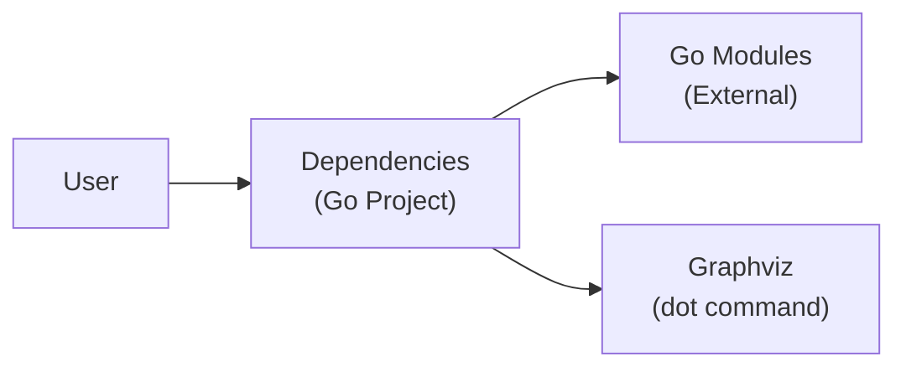
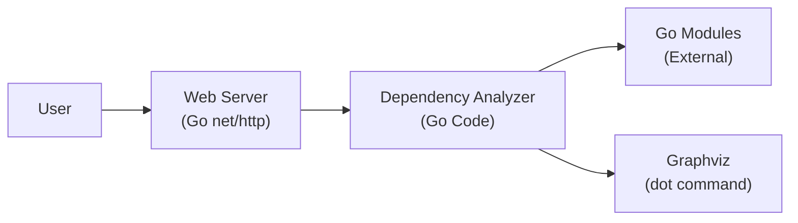
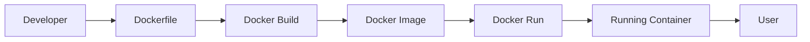

Okay, let's create a design document for the `dependencies` project.

# BUSINESS POSTURE

Business Priorities and Goals:

*   Provide a simple, fast, and reliable way to visualize Go project dependencies.
*   Offer a self-hosted solution for dependency analysis, potentially appealing to organizations with strict data residency or security requirements.
*   Minimize external dependencies to reduce the project's attack surface and maintenance overhead.
*   Enable easy integration with existing development workflows.

Most Important Business Risks:

*   Inaccurate dependency analysis leading to incorrect security assessments or build issues.
*   Vulnerabilities within the `dependencies` project itself exposing the analyzed codebase or the hosting environment.
*   Performance bottlenecks hindering usability, especially for large projects.
*   Lack of adoption due to complexity or insufficient features compared to existing solutions.
*   Exposure of sensitive information if the tool is misconfigured or compromised.

# SECURITY POSTURE

Existing Security Controls:

*   security control: Minimal external dependencies: The project explicitly aims to minimize external dependencies, reducing the attack surface. (README.md)
*   security control: Go language: Go is a memory-safe language, mitigating common vulnerability classes like buffer overflows. (Implicit in the choice of Go)
*   security control: Simple HTTP server: The project uses a basic HTTP server, likely reducing the complexity and potential attack surface compared to a full-fledged web framework. (main.go)

Accepted Risks:

*   accepted risk: Limited input validation: The project appears to primarily rely on Go's built-in parsing and the `dot` command's output. There might be limited explicit input validation, potentially leading to vulnerabilities if the input is maliciously crafted.
*   accepted risk: No authentication/authorization: The provided code doesn't implement any authentication or authorization mechanisms. This means anyone with network access to the server can view dependency graphs.
*   accepted risk: No HTTPS: The server runs on HTTP, not HTTPS, meaning traffic is unencrypted.
*   accepted risk: No containerization: The project is not currently containerized, which could simplify deployment and improve security isolation.
*   accepted risk: No automated security scanning: There's no indication of automated security scanning (SAST, DAST, dependency analysis) in the build process.

Recommended Security Controls:

*   Implement robust input validation to prevent potential vulnerabilities related to graph generation.
*   Add authentication and authorization mechanisms to restrict access to the dependency graphs.
*   Enable HTTPS to encrypt communication between the client and server.
*   Containerize the application (e.g., using Docker) for easier deployment, improved security isolation, and consistent environment management.
*   Integrate automated security scanning into the build process.

Security Requirements:

*   Authentication: Not implemented.
*   Authorization: Not implemented.
*   Input Validation:
    *   The application should validate the input received from the user (e.g., the project path) to ensure it's safe to process.
    *   The application should handle errors gracefully and avoid exposing sensitive information in error messages.
*   Cryptography:
    *   HTTPS should be used to encrypt communication.
    *   If sensitive data is stored (which is not the case currently), it should be encrypted at rest.
*   Output Encoding:
    *   The application should properly encode the output to prevent cross-site scripting (XSS) vulnerabilities. Since the output is an SVG image, this is less of a concern, but still good practice.

# DESIGN

## C4 CONTEXT

Element Descriptions:

*   Element:
    *   Name: User
    *   Type: Person
    *   Description: A developer or system interacting with the `dependencies` project.
    *   Responsibilities:
        *   Provides the path to the Go project to be analyzed.
        *   Views the generated dependency graph.
    *   Security Controls:
        *   None (in the current implementation).

*   Element:
    *   Name: Dependencies
    *   Type: Software System
    *   Description: The `dependencies` Go project itself.
    *   Responsibilities:
        *   Parses Go project dependencies.
        *   Generates a dependency graph in DOT format.
        *   Serves the graph as an SVG image via an HTTP server.
    *   Security Controls:
        *   Uses a memory-safe language (Go).
        *   Minimizes external dependencies.

*   Element:
    *   Name: Go Modules
    *   Type: External Dependency
    *   Description: The Go modules used by the analyzed project.
    *   Responsibilities:
        *   Provide the functionality used by the analyzed project.
    *   Security Controls:
        *   Managed by Go's module system.

*   Element:
    *   Name: Graphviz
    *   Type: External Dependency
    *   Description: The `dot` command-line tool from the Graphviz package.
    *   Responsibilities:
        *   Converts the DOT representation of the graph into an SVG image.
    *   Security Controls:
        *   External dependency; security relies on the Graphviz project.

## C4 CONTAINER

Element Descriptions:

*   Element:
    *   Name: User
    *   Type: Person
    *   Description: A developer or system interacting with the `dependencies` project.
    *   Responsibilities:
        *   Provides the path to the Go project to be analyzed.
        *   Views the generated dependency graph.
    *   Security Controls:
        *   None (in the current implementation).

*   Element:
    *   Name: Web Server
    *   Type: Container (Go net/http)
    *   Description: A simple HTTP server built using Go's `net/http` package.
    *   Responsibilities:
        *   Handles incoming HTTP requests.
        *   Serves the generated SVG image.
    *   Security Controls:
        *   Uses Go's built-in HTTP server (relatively simple and well-tested).

*   Element:
    *   Name: Dependency Analyzer
    *   Type: Container (Go Code)
    *   Description: The core logic of the `dependencies` project.
    *   Responsibilities:
        *   Parses Go project dependencies using `go list`.
        *   Generates a dependency graph in DOT format.
        *   Invokes the `dot` command to convert the DOT graph to SVG.
    *   Security Controls:
        *   Uses a memory-safe language (Go).
        *   Minimizes external dependencies.

*   Element:
    *   Name: Go Modules
    *   Type: External Dependency
    *   Description: The Go modules used by the analyzed project.
    *   Responsibilities:
        *   Provide the functionality used by the analyzed project.
    *   Security Controls:
        *   Managed by Go's module system.

*   Element:
    *   Name: Graphviz
    *   Type: External Dependency
    *   Description: The `dot` command-line tool from the Graphviz package.
    *   Responsibilities:
        *   Converts the DOT representation of the graph into an SVG image.
    *   Security Controls:
        *   External dependency; security relies on the Graphviz project.

## DEPLOYMENT

Possible Deployment Solutions:

1.  Manual Deployment: Build the Go binary and run it directly on a server.
2.  Containerized Deployment (Docker): Package the application in a Docker container for easier deployment and portability.
3.  Cloud Deployment (e.g., AWS, GCP, Azure): Deploy the containerized application to a cloud provider's container orchestration service (e.g., ECS, GKE, AKS).

Chosen Solution (Containerized Deployment with Docker):

Element Descriptions:

*    Element:
    *   Name: Developer
    *   Type: Person
    *   Description: The person building and deploying the application.
    *   Responsibilities:
        *   Writes the Dockerfile.
        *   Initiates the Docker build process.
    *   Security Controls: None

*    Element:
    *   Name: Dockerfile
    *   Type: File
    *   Description: A text file containing instructions for building a Docker image.
    *   Responsibilities:
        *   Defines the base image.
        *   Copies the application code.
        *   Builds Go binary.
        *   Sets the command to run the application.
    *   Security Controls: None

*    Element:
    *   Name: Docker Build
    *   Type: Process
    *   Description: The process of building a Docker image from a Dockerfile.
    *   Responsibilities:
        *   Executes the instructions in the Dockerfile.
        *   Creates a Docker image.
    *   Security Controls: None

*    Element:
    *   Name: Docker Image
    *   Type: Artifact
    *   Description: A read-only template with instructions for creating a Docker container.
    *   Responsibilities:
        *   Serves as the basis for running containers.
    *   Security Controls: None

*    Element:
    *   Name: Docker Run
    *   Type: Process
    *   Description: The process of creating and running a Docker container from a Docker image.
    *   Responsibilities:
        *   Creates a writable container layer on top of the image.
        *   Starts the container.
    *   Security Controls: None

*    Element:
    *   Name: Running Container
    *   Type: Container
    *   Description: A running instance of a Docker image.
    *   Responsibilities:
        *   Executes the application.
        *   Provides an isolated environment.
    *   Security Controls:
        *   Container isolation.

*    Element:
    *   Name: User
    *   Type: Person
    *   Description:  A developer or system interacting with the `dependencies` project.
    *   Responsibilities:
        *   Provides the path to the Go project to be analyzed.
        *   Views the generated dependency graph.
    *   Security Controls:
        *   None (in the current implementation).

## BUILD

```mermaid
graph LR
    Developer["Developer"] --> Git["Git Repository"]
    Git --> BuildServer["Build Server\n(e.g., GitHub Actions)"]
    BuildServer --> GoBuild["Go Build"]
    GoBuild --> Tests["Run Tests\n(go test)"]
    Tests --> SAST["SAST\n(e.g., gosec)"]
    SAST --> Binary["Go Binary"]
    Binary --> Dockerfile["Dockerfile"]
    Dockerfile --> DockerBuild["Docker Build"]
    DockerBuild --> DockerImage["Docker Image\n(Tagged)"]
    DockerImage --> ImageRegistry["Image Registry\n(e.g., Docker Hub)"]

```

Build Process Description:

1.  Developer pushes code changes to a Git repository.
2.  A build server (e.g., GitHub Actions) is triggered by the push.
3.  The build server checks out the code.
4.  Go build process is initiated.
5.  Unit tests are run using `go test`.
6.  Static Application Security Testing (SAST) is performed using a tool like `gosec`.
7.  If tests and SAST pass, a Go binary is created.
8.  Dockerfile is used to build docker image.
9.  Docker image is build and tagged.
10. The Docker image is pushed to an image registry (e.g., Docker Hub, a private registry).

Security Controls:

*   Automated Build: The build process is automated using a build server, ensuring consistency and reducing manual errors.
*   Unit Tests: Unit tests are run to verify the correctness of the code.
*   SAST: SAST is used to identify potential security vulnerabilities in the code.
*   Signed Docker Image: The Docker image can be signed to ensure its integrity and authenticity.
*   Secure Image Registry: The Docker image is pushed to a secure image registry, which may have access controls and vulnerability scanning.

# RISK ASSESSMENT

Critical Business Processes:

*   Dependency analysis and visualization.
*   Providing a self-hosted service for internal use.

Data to Protect and Sensitivity:

*   Go project source code (potentially sensitive, depending on the project).
*   Dependency information (potentially revealing internal architecture and third-party libraries used).
*   No user data or credentials are stored by the application itself (in its current form).

# QUESTIONS & ASSUMPTIONS

Questions:

*   What is the expected size of the Go projects to be analyzed (number of modules, lines of code)? This impacts performance considerations.
*   What is the target deployment environment (on-premise, cloud, specific cloud provider)?
*   Are there any existing security tools or processes in place that this project should integrate with?
*   What level of access control is required? Should it integrate with existing authentication systems (e.g., LDAP, OAuth)?
*   Is there a need for auditing or logging of user activity?

Assumptions:

*   BUSINESS POSTURE: The primary goal is to provide a simple, self-hosted dependency visualization tool for internal use.
*   SECURITY POSTURE: The organization has a moderate risk appetite, but prioritizes basic security hygiene.
*   DESIGN: The `dot` command is available in the environment where the application is running. The analyzed Go projects are accessible to the application.