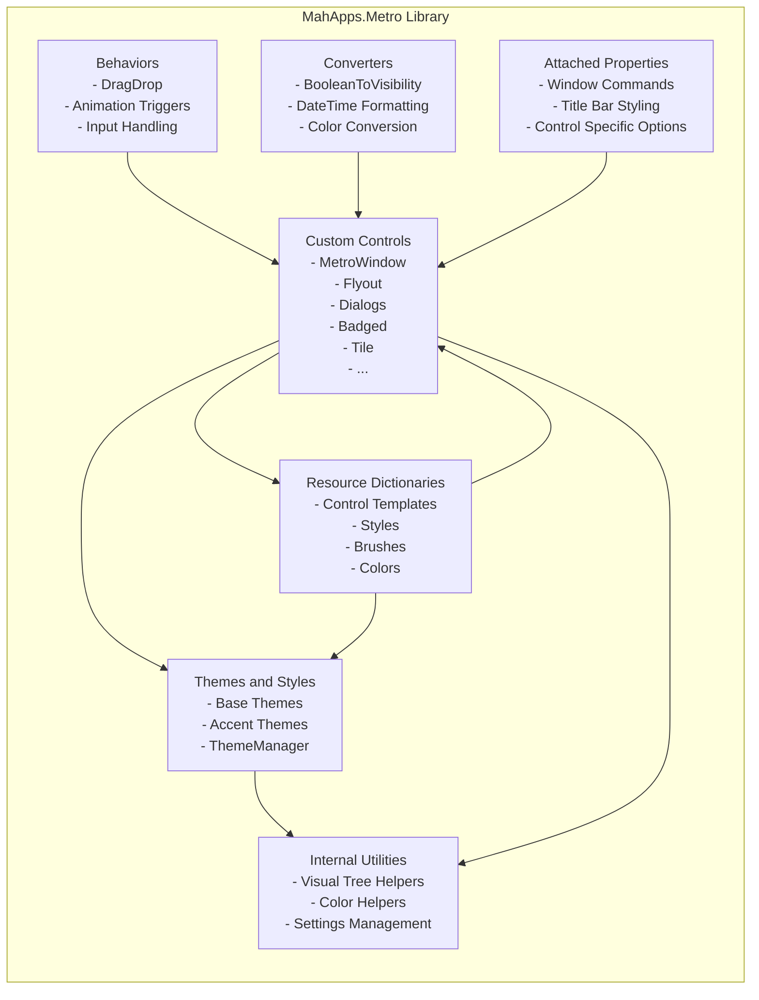
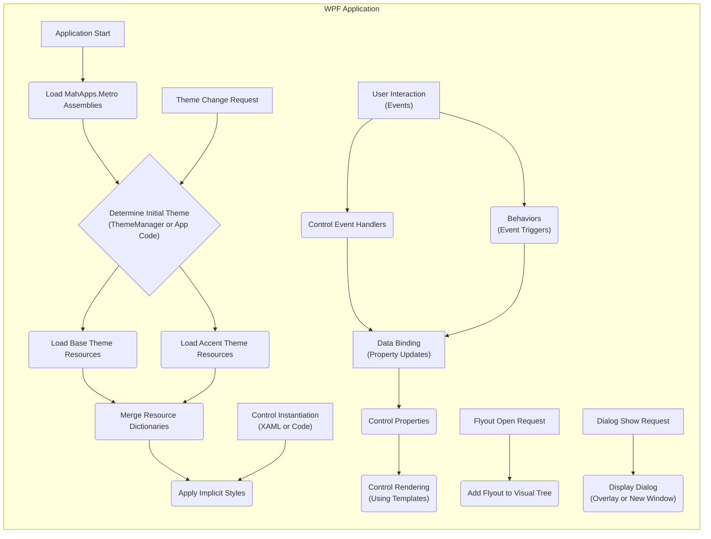

# Project Design Document: MahApps.Metro

**Version:** 1.1
**Date:** October 26, 2023
**Author:** AI Software Architect

## 1. Introduction

This document provides a detailed architectural design of the MahApps.Metro project. It outlines the key components, their interactions, data flow, and security considerations. This document serves as a foundation for future threat modeling activities, enabling a deeper understanding of potential vulnerabilities.

### 1.1. Purpose

The primary purpose of this document is to provide a comprehensive and granular understanding of the MahApps.Metro project's architecture to facilitate effective threat modeling. It aims to identify potential vulnerabilities and security risks associated with the project's design and implementation at a more detailed level.

### 1.2. Scope

This document focuses on the architectural design of the MahApps.Metro library itself, delving into the internal workings of key components. It covers the core components, their relationships, and the detailed flow of data within the library. It does not cover applications that consume the MahApps.Metro library, nor does it delve into the implementation specifics of individual control methods unless architecturally significant for understanding data flow or security implications.

### 1.3. Target Audience

This document is intended for:

* Security engineers and architects involved in detailed threat modeling and security assessments.
* Developers contributing to the MahApps.Metro project, requiring a deep understanding of its architecture.
* Anyone seeking a highly detailed understanding of the project's internal architecture for security analysis or contribution purposes.

## 2. Project Overview

MahApps.Metro is an open-source UI toolkit for creating modern, flat, and "metro-style" desktop applications using the Windows Presentation Foundation (WPF) framework. It empowers developers to build visually appealing and consistent user interfaces with significantly less effort than building from scratch. It provides a cohesive set of styles and controls that promote a consistent user experience across an application.

### 2.1. Key Features

* **Comprehensive Themes and Styles:** Offers a variety of pre-built, customizable themes (e.g., Light, Dark) and accent color schemes. The `ThemeManager` component allows for dynamic theme switching at runtime. Styles are defined for all standard WPF controls as well as custom MahApps.Metro controls.
* **Extensive Set of Custom Controls:** Provides a rich and diverse set of custom controls that extend the standard WPF control library, offering enhanced functionality and visual appeal. Examples include:
    * `MetroWindow`: A customizable window with features like title bar buttons, overlay support, and window commands.
    * `Flyout`: A panel that slides in from the side of the window, often used for settings or secondary actions.
    * `Dialogs`: Asynchronous and customizable dialog implementations for message boxes, input prompts, and progress indicators.
    * `Badged`: Controls that can display visual indicators (badges) for notifications or status.
    * `Tile`: Interactive rectangular elements often used for navigation or launching actions.
* **Helper Classes and Extensions:** Includes a variety of utility classes and extension methods to simplify common WPF development tasks, such as visual tree manipulation, resource management, and theming operations.
* **Localization Support:**  Provides mechanisms and guidelines for localizing application resources, ensuring support for multiple languages and cultures.
* **Animation and Transition Effects:** Incorporates subtle animations and transitions to enhance the user experience and provide visual feedback.

## 3. Architectural Design

MahApps.Metro is structured as a set of interconnected components that work together to provide its functionality. The core architectural elements are:

* **Themes and Styles:**
    * Defined primarily through XAML resource dictionaries (`.xaml` files).
    * Organized into different base themes (e.g., `BaseLight.xaml`, `BaseDark.xaml`) and accent themes (e.g., `AccentColors.xaml`).
    * Applied to controls through implicit styling (styles without an `x:Key`) and explicit resource references (styles with an `x:Key`).
    * The `ThemeManager` class is responsible for managing and switching themes at runtime by manipulating merged resource dictionaries.
* **Custom Controls:**
    * Implemented as custom WPF controls, typically inheriting from standard WPF controls (`ContentControl`, `ItemsControl`, etc.) or the base `Control` class.
    * Heavily utilize dependency properties for customization, data binding, and styling.
    * Often include custom logic within their code-behind (`.cs` files) to handle user interactions, state management, and visual updates.
    * Employ `ControlTemplate` and `Style` definitions within resource dictionaries to define their visual appearance and behavior.
* **Behaviors:**
    * Implemented using the `System.Windows.Interactivity` library (or its successor, `Microsoft.Xaml.Behaviors.Wpf`).
    * Allow developers to add reusable pieces of functionality to existing controls without resorting to subclassing.
    * Used for a variety of tasks, including:
        * Implementing drag-and-drop functionality.
        * Adding visual effects or animations based on control state.
        * Handling specific input events or gestures.
        * Implementing custom validation logic.
* **Converters:**
    * Implement the `IValueConverter` or `IMultiValueConverter` interfaces.
    * Used to transform data from one type or format to another for display or processing within the UI.
    * Examples include:
        * Converting boolean values to `Visibility` (Visible/Collapsed).
        * Formatting dates and times for display.
        * Converting color values between different representations.
        * Transforming text for specific display purposes.
* **Attached Properties:**
    * Static properties defined in a class that can be attached to instances of other `DependencyObject` classes.
    * Used to extend the functionality and appearance of existing controls in a non-invasive way.
    * Examples include:
        * Properties on `MetroWindow` to control title bar appearance or window commands.
        * Properties on other controls to customize their MahApps.Metro specific styling.
* **Resource Dictionaries:**
    * Centralized storage for styles, templates, brushes, colors, and other resources used throughout the library.
    * Organized hierarchically, with base theme dictionaries being merged with accent theme dictionaries to create the final visual appearance.
    * Allow for easy customization and theming of the entire application.
* **Internal Utilities and Helpers:**
    * A collection of classes and methods that provide common functionality used across various parts of the library.
    * Examples include:
        * Helper methods for traversing the visual tree.
        * Utility classes for color manipulation and calculations.
        * Services for managing application settings or theme preferences.
        * Extensions to standard WPF classes for convenience.

### 3.1. Component Diagram (Detailed)

### 3.2. Data Flow

The primary data flow within MahApps.Metro revolves around the initialization, rendering, styling, and interaction with UI elements. Key data flow paths include:

* **Application Startup and Theme Initialization:**
    * The WPF application starts and loads the MahApps.Metro assemblies.
    * The `ThemeManager` (or application code) determines the initial theme to be applied.
    * Resource dictionaries corresponding to the selected base and accent themes are loaded and merged into the application's resource dictionary hierarchy.
    * Implicit styles within these dictionaries are automatically applied to matching controls in the visual tree.
* **Control Rendering and Styling:**
    * When a MahApps.Metro control is instantiated (either in XAML or code), WPF's styling mechanism searches for applicable styles in the merged resource dictionaries.
    * The `ControlTemplate` defined in the style dictates the visual structure of the control.
    * Property values (including those set through data binding) influence the rendering of the control.
    * Converters transform bound data before it's displayed by the control.
* **User Interaction and Event Handling:**
    * User actions (e.g., mouse clicks, keyboard input) trigger routed events within the WPF framework.
    * Controls handle these events, potentially updating their internal state or triggering further actions.
    * Behaviors attached to controls can intercept or react to these events, executing custom logic.
    * Data binding can update the underlying data source based on user input in controls.
* **Dynamic Theme Changes:**
    * When a request to change the theme occurs (e.g., through user interaction or application logic), the `ThemeManager` updates the merged resource dictionaries.
    * WPF's property invalidation mechanism detects these changes and re-renders the affected parts of the visual tree, applying the new styles and templates.
* **Flyout and Dialog Display:**
    * When a `Flyout` is opened, it's typically added to the visual tree as a child of the `MetroWindow`.
    * Animations and transitions (often implemented using behaviors or visual state managers) control the appearance and disappearance of the `Flyout`.
    * `Dialogs` are often presented in a separate visual layer or as modal overlays on the `MetroWindow`, blocking interaction with the underlying content.

### 3.3. Data Flow Diagram (Detailed)

## 4. Security Considerations

This section outlines potential security considerations related to the design and implementation of MahApps.Metro, providing more specific examples and potential mitigations.

* **XAML Injection:**
    * **Vulnerability:** If user-provided data is directly embedded into XAML strings and then parsed (e.g., using `XamlReader.Parse`), it can lead to arbitrary code execution or UI manipulation. For example, a malicious string could define a new object with harmful side effects.
    * **Mitigation:**  Avoid dynamic XAML generation from untrusted sources. If necessary, sanitize user input rigorously before incorporating it into XAML. Consider using data binding and converters to display user data instead of directly embedding it in XAML.
* **Resource Dictionary Tampering:**
    * **Vulnerability:** While less common in typical usage, if an attacker gains write access to the application's resource files (or the MahApps.Metro library files), they could modify styles, templates, or even inject malicious code through event handlers defined in styles. This could lead to UI spoofing or arbitrary code execution when the tampered resources are loaded.
    * **Mitigation:** Ensure proper file system permissions to protect application resources. Implement integrity checks for critical resource files. Consider signing the MahApps.Metro assemblies to detect tampering.
* **Dependency Vulnerabilities:**
    * **Vulnerability:** MahApps.Metro relies on external NuGet packages. Vulnerabilities in these dependencies (e.g., in `ControlzEx` or `Microsoft.Xaml.Behaviors.Wpf`) could be exploited by attackers if not patched.
    * **Mitigation:** Regularly update dependencies to their latest stable and secure versions. Utilize dependency scanning tools (e.g., OWASP Dependency-Check) to identify known vulnerabilities in dependencies. Monitor security advisories for any reported issues in the used libraries.
* **Data Binding Issues:**
    * **Vulnerability:** Incorrectly implemented data binding or converters could unintentionally expose sensitive information in the UI (e.g., displaying passwords or API keys). Furthermore, poorly written converters might introduce vulnerabilities if they don't handle unexpected input types or formats correctly, potentially leading to exceptions or unexpected behavior.
    * **Mitigation:**  Thoroughly review and test data binding implementations, especially when dealing with sensitive data. Ensure converters handle edge cases, null values, and potential errors gracefully. Avoid displaying sensitive information directly in the UI if possible.
* **Build Process Security:**
    * **Vulnerability:** If the build process for MahApps.Metro is compromised, malicious code could be injected into the library's assemblies before distribution.
    * **Mitigation:** Implement secure build pipelines with access controls, code signing, and integrity checks. Regularly audit the build infrastructure for security vulnerabilities. Use trusted build environments and artifact repositories.
* **Custom Control Vulnerabilities:**
    * **Vulnerability:** Security flaws could exist within the custom control implementations themselves, such as:
        * **Improper Input Validation:** Controls might not adequately validate user input, leading to unexpected behavior or potential crashes.
        * **Logic Flaws:** Bugs in the control's logic could be exploited to bypass security checks or cause unintended actions.
        * **State Management Issues:** Incorrect handling of control state could lead to vulnerabilities.
    * **Mitigation:** Follow secure coding practices during custom control development. Conduct thorough testing, including unit tests and integration tests. Perform code reviews to identify potential security flaws. Be mindful of potential race conditions or concurrency issues within control logic.
* **Implicit Styles and Overrides:**
    * **Vulnerability:** While providing flexibility, implicit styles can be unintentionally overridden by consuming applications with styles that introduce vulnerabilities or weaken security measures. For example, a custom style might remove security-related visual cues or introduce new attack vectors.
    * **Mitigation:** Provide clear documentation and guidance on how to properly customize and override styles. Emphasize the importance of understanding the security implications of style modifications. Consider providing secure base styles that are difficult to accidentally compromise.

## 5. Dependencies

MahApps.Metro relies on the following external libraries and frameworks:

* **.NET Framework or .NET (Core/5+):** The underlying platform for WPF development.
* **Windows Presentation Foundation (WPF):** The UI framework itself.
* **ControlzEx:** A library providing base classes, helper functions, and extended functionality for custom WPF controls, crucial for MahApps.Metro's control development.
* **Microsoft.Xaml.Behaviors.Wpf:**  Used for implementing behaviors, allowing for adding interactive functionality to controls without subclassing.
* **System.ComponentModel.Annotations:**  Provides types used to define metadata for data models, potentially used in data binding scenarios.
* **Possibly other NuGet packages:** Depending on the specific version and features used, such as libraries for specific UI elements or utilities.

## 6. Deployment

MahApps.Metro is primarily deployed as a NuGet package (`MahApps.Metro`) that developers can easily integrate into their WPF projects using the NuGet Package Manager in Visual Studio or the .NET CLI. The library's compiled assemblies (`.dll` files) are then included in the application's output directory during the build process.

## 7. Future Considerations

* **Continued Migration and Optimization for .NET (Core/5+):** Ongoing efforts to fully support and optimize performance for newer .NET versions, potentially leveraging new features and APIs.
* **Enhanced Accessibility Features:**  Continued focus on improving the accessibility of controls and themes to ensure usability for users with disabilities, adhering to accessibility standards and guidelines.
* **Performance Enhancements:**  Ongoing efforts to optimize the performance and responsiveness of the library, addressing potential bottlenecks and improving rendering efficiency.
* **Exploration of New Control Concepts and Patterns:**  Potential development of new custom controls and UI patterns to further enhance the capabilities of the library.
* **Improved Theming Capabilities and Customization Options:**  Exploring ways to provide even more flexible and powerful theming options for developers.

## 8. Conclusion

This document provides a detailed and granular overview of the architectural design of the MahApps.Metro project. By understanding the key components, detailed data flow, and specific security considerations outlined here, security engineers and developers can effectively perform in-depth threat modeling, identify potential vulnerabilities, and implement appropriate security measures. This document serves as a valuable resource for ensuring the security, integrity, and robustness of applications built using the MahApps.Metro library.