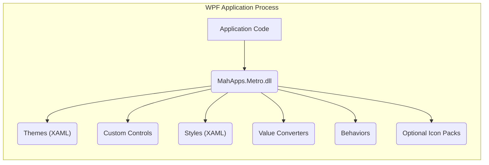
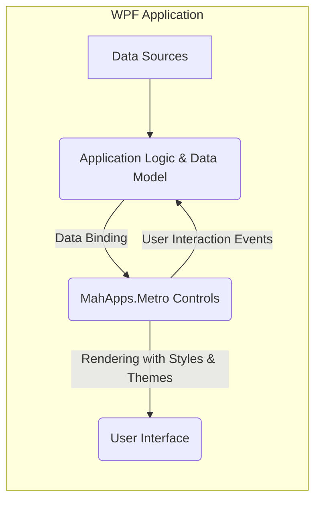
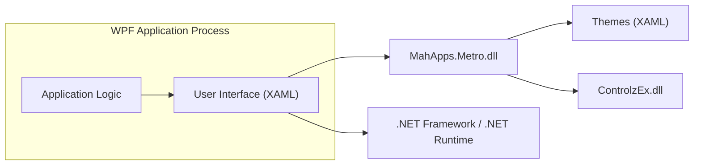
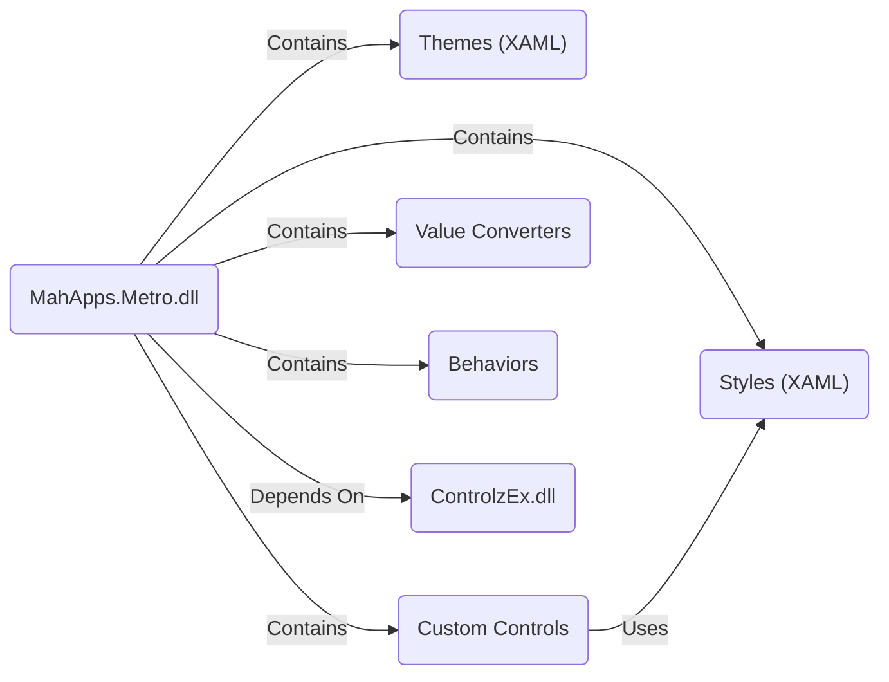

# Project Design Document: MahApps.Metro (Improved)

**Document Version:** 2.0
**Date:** October 26, 2023
**Author:** AI Software Architect

## 1. Introduction

This document provides an enhanced design overview of the MahApps.Metro project, an open-source user interface toolkit for building modern Windows Presentation Foundation (WPF) applications. It details the project's architecture, key components, and data flow, serving as a crucial foundation for subsequent threat modeling and security assessments. This document focuses on aspects relevant to understanding the system's security posture.

## 2. Goals and Objectives

The core goals of MahApps.Metro are:

*   To offer a library of visually appealing and customizable UI controls and themes for WPF applications.
*   To simplify the creation of modern "Metro" style user interfaces within the WPF framework.
*   To promote a consistent and intuitive user experience across applications utilizing the toolkit's elements.
*   To maintain an open-source and community-driven development model.

## 3. Target Audience

This document is primarily intended for:

*   Security engineers and architects tasked with performing threat modeling and security evaluations.
*   Software developers who contribute to or integrate the MahApps.Metro library into their applications.
*   Project managers and stakeholders requiring a high-level technical understanding of the project's design.

## 4. System Architecture

MahApps.Metro is a client-side library seamlessly integrated into WPF applications. It functions as a set of UI enhancements and does not operate as an independent service or application. Its architecture is centered around providing UI elements and their associated styling.

*   **Primary Library (`MahApps.Metro.dll`):** The core assembly containing the majority of the custom controls, visual themes, styles, and utility classes.
*   **Themes (XAML Resource Dictionaries):** Collections of XAML files defining the visual appearance of controls, enabling consistent styling. Themes can be applied at the application or individual control level.
*   **Custom Controls (WPF UserControls and Custom Controls):**  A suite of pre-built, visually enhanced WPF controls that extend or replace standard WPF controls, offering additional functionality and a modern aesthetic. Examples include:
    *   `MetroWindow`: A styled window providing a custom title bar and window management features.
    *   `Flyout`: A sliding panel typically used for navigation or displaying additional information.
    *   `Dialogs`: Customizable dialog implementations for user interaction.
    *   `Badged`: A decorator control to display status indicators or notifications on other elements.
    *   Various styled input controls, buttons, and layout containers.
*   **Styles (XAML Resource Dictionaries):** XAML resources defining the specific visual properties (colors, fonts, borders, etc.) of the controls, ensuring a consistent look and feel.
*   **Value Converters (Classes Implementing `IValueConverter`):** Classes responsible for transforming data for display purposes within the UI, facilitating data binding.
*   **Behaviors (Classes Implementing `System.Windows.Interactivity.Behavior`):** Classes that enable adding interactive functionality to controls without resorting to subclassing, promoting code reusability.
*   **Optional Icon Packs (Integration Libraries):** Support for integrating vector icon libraries like Font Awesome or Material Design Icons, providing a convenient way to use icons within the controls.

## 5. Key Components

This section provides a more detailed look at the core components of MahApps.Metro and their respective roles:

*   **`MahApps.Metro.dll` (Core Library):**
    *   Serves as the central component, housing the fundamental building blocks of the library.
    *   Provides base classes, interfaces, and abstract implementations for creating custom controls and managing styling.
    *   Handles the application and switching of visual themes.
    *   Includes various utility functions and helper classes used throughout the library.
*   **Themes:**
    *   Reside within the `Themes` directory of the library (typically within the NuGet package).
    *   Defined as XAML resource dictionaries (`.xaml` files).
    *   Dictate the overall visual appearance of the application, including colors, fonts, and control templates.
    *   Offer mechanisms for customization and extension by application developers to create unique branding.
*   **Custom Controls:**
    *   Implement specific UI elements with enhanced visual styling and extended functionality compared to standard WPF controls.
    *   Often inherit from base classes provided by WPF or `ControlzEx` (a dependency).
    *   Expose properties, methods, and events for interaction and data binding with the application's logic.
    *   Examples include `MetroButton` (a styled button), `MetroTextBox` (a styled text input), `Flyout` (for side panels), and `MetroDialog` (for custom dialog windows).
*   **Styles:**
    *   Define the granular visual attributes of individual controls and elements within the UI.
    *   Organized into XAML resource dictionaries and applied to controls either implicitly or explicitly.
    *   Ensure visual consistency and allow for centralized modification of visual properties.
*   **Value Converters:**
    *   Implement the `IValueConverter` interface to transform data from one format to another before it's displayed in the UI.
    *   Essential for scenarios where the data model doesn't directly match the required UI representation.
    *   Examples include converting boolean values to visibility states or formatting dates and numbers.
*   **Behaviors:**
    *   Attach reusable pieces of functionality to UI elements declaratively in XAML, without needing to modify the control's code-behind.
    *   Implement interactive effects, custom input handling, and other dynamic behaviors.
    *   Example: A behavior to enable dragging a `MetroWindow` by clicking and dragging its content area.
*   **Optional Icon Packs:**
    *   Provide a collection of scalable vector icons that can be easily integrated into MahApps.Metro controls.
    *   Typically added to the project as separate NuGet packages and referenced within XAML using specific syntax.

## 6. Data Flow

MahApps.Metro primarily operates within the presentation layer of a WPF application. It's responsible for rendering and displaying data but doesn't inherently manage or process application-specific business logic or persistent data. The typical data flow is as follows:

1. **Application Data Retrieval:** The WPF application retrieves or generates data from its underlying data sources (e.g., databases, web APIs, local files, in-memory objects).
2. **Data Binding to Controls:** The application establishes data bindings between its data objects and the properties of MahApps.Metro controls in the UI (defined in XAML).
3. **Control Rendering and Display:** MahApps.Metro controls utilize the bound data, along with their defined styles and themes, to render the visual representation of the data to the user. Value converters may be involved in transforming the data before display.
4. **User Interaction with Controls:** Users interact with the MahApps.Metro controls (e.g., clicking buttons, entering text in text boxes, selecting items in lists).
5. **Event Handling and Data Updates:** User interactions trigger events on the controls. The application's logic handles these events, potentially updating its internal data based on the user's actions.
6. **UI Refresh via Data Binding:** When the application's data changes, the data binding mechanism automatically updates the corresponding MahApps.Metro controls in the UI to reflect the new data.

## 7. Security Considerations

While MahApps.Metro focuses on UI presentation, several security aspects are relevant when considering applications that utilize it:

*   **Dependency Chain Vulnerabilities:** MahApps.Metro relies on the .NET framework, WPF, and potentially other third-party libraries (like `ControlzEx`). Vulnerabilities in these dependencies could indirectly impact applications using MahApps.Metro. Regularly updating dependencies is crucial.
*   **XAML Injection Risks:** If application developers dynamically generate XAML markup based on untrusted user input and use it with MahApps.Metro controls, it can create opportunities for XAML injection attacks. This could lead to unexpected UI rendering, potentially executing arbitrary code or accessing sensitive data within the application's context.
*   **Theme Tampering (Context Dependent):** In scenarios where application themes are loaded from external or untrusted sources, there's a potential risk of theme tampering. Maliciously crafted themes could alter the application's appearance to mislead users or hide malicious actions. This risk is lower when themes are bundled within the application.
*   **Vulnerabilities in Custom Controls:** If developers create custom controls that extend MahApps.Metro and introduce security vulnerabilities in their implementation (e.g., improper input validation), these vulnerabilities could be exploited within the application.
*   **Supply Chain Security of MahApps.Metro:** Ensuring the integrity of the MahApps.Metro NuGet package and its source code repository is vital to prevent the introduction of malicious code into applications that depend on it. Developers should verify package integrity and be aware of the project's development practices.
*   **Information Disclosure through UI Design:** While MahApps.Metro doesn't directly handle sensitive data, improper use of its controls or poorly designed UI elements could inadvertently expose sensitive information to unauthorized users. Careful consideration of data displayed and access control within the application is necessary.
*   **Clickjacking (Mitigation by Application):** While MahApps.Metro itself doesn't introduce clickjacking vulnerabilities, applications using it need to implement standard clickjacking defenses (e.g., frame busting headers) if displaying sensitive information.
*   **Right-to-Left (RTL) Override Attacks:**  Improper handling of RTL languages and text directionality could potentially be exploited in UI rendering. Developers should ensure proper localization and internationalization practices.

## 8. Dependencies

MahApps.Metro has the following primary dependencies, typically managed through NuGet:

*   **.NET Framework (or .NET):** The fundamental platform for WPF applications. Specific versions may be required by MahApps.Metro.
*   **Windows Presentation Foundation (WPF):** The core UI framework that MahApps.Metro extends and builds upon.
*   **ControlzEx:** A library providing base classes, helper functions, and custom controls that MahApps.Metro utilizes internally.
*   **XamlAnimatedGif (Optional):** Used for displaying animated GIFs within certain MahApps.Metro controls.
*   **Optional Icon Pack Libraries:**  Such as `FontAwesome.WPF` or `MaterialDesignThemes`, if the application chooses to integrate specific icon sets.

Maintaining awareness of these dependencies and their security status is crucial for the overall security of applications using MahApps.Metro.

## 9. Deployment Model

MahApps.Metro is primarily distributed and integrated into WPF applications as a NuGet package. The typical deployment process involves:

*   **Adding the NuGet Package:** Developers add the `MahApps.Metro` NuGet package to their WPF project using the NuGet Package Manager in Visual Studio or the .NET CLI. This downloads the necessary libraries and resources.
*   **Referencing in XAML:** Developers reference the MahApps.Metro namespace within their XAML files to access and utilize the library's controls and styles.
*   **Applying Themes:** A theme is typically applied to the application, often within the `App.xaml` file, to define the overall visual style.
*   **Utilizing Controls:** Developers then use the provided MahApps.Metro controls in their application's user interface design.

The `MahApps.Metro.dll` and its associated resources are then included as part of the deployed WPF application.

## 10. Diagrams

### 10.1. Architectural Overview

### 10.2. Key Component Relationships

## 11. Conclusion

This improved design document provides a more detailed and security-focused overview of the MahApps.Metro project. Understanding its architecture, key components, data flow, and dependencies is crucial for effectively identifying and mitigating potential security risks in applications that utilize this UI toolkit. The outlined security considerations serve as a valuable starting point for conducting comprehensive threat modeling exercises and implementing appropriate security measures. This document aims to be a useful resource for security professionals, developers, and anyone involved in building secure WPF applications with MahApps.Metro.