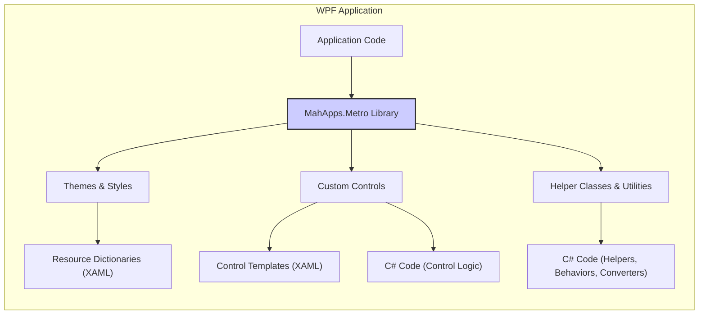
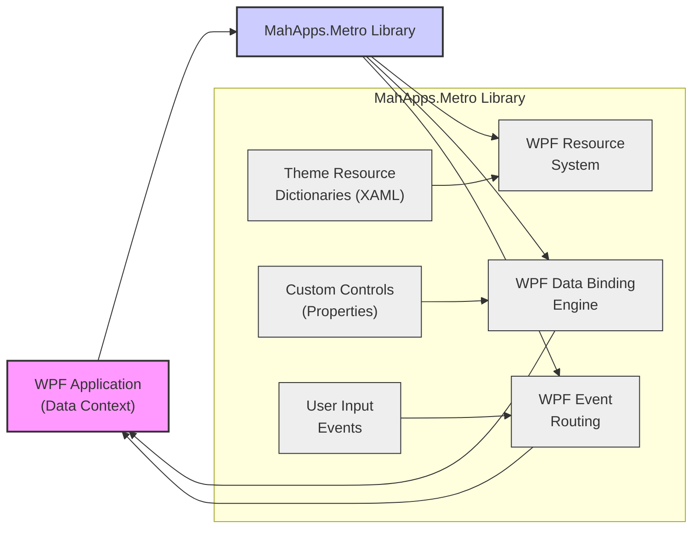

# Project Design Document: MahApps.Metro UI Toolkit

**Project Name:** MahApps.Metro

**Project Repository:** [https://github.com/mahapps/mahapps.metro](https://github.com/mahapps/mahapps.metro)

**Document Version:** 1.1
**Date:** 2023-10-27
**Author:** AI Software Architect

**Changes from Version 1.0:**

*   Improved clarity and conciseness throughout the document.
*   Enhanced descriptions of component functionalities, especially regarding security implications.
*   Expanded the "Security Considerations" section with more specific examples and potential threat scenarios.
*   Refined the "Threat Modeling Next Steps" section for better actionability.
*   Minor formatting and wording improvements.

## 1. Introduction

This document provides a detailed design overview of the MahApps.Metro project, a free, open-source UI toolkit for creating modern, Metro/Modern UI styled applications in WPF (Windows Presentation Foundation). This document is specifically crafted to serve as a robust foundation for subsequent threat modeling and security analysis. It meticulously outlines the project's architecture, delineating key components, data flow pathways, and the underlying technology stack. The aim is to provide a comprehensive understanding of MahApps.Metro from a security perspective.

## 2. Project Overview

MahApps.Metro is a community-driven project dedicated to providing a rich and versatile set of custom controls, styles, and themes for WPF applications. It empowers developers to create visually engaging and user-friendly applications that adhere to the principles of the modern "Metro" or "Modern UI" design language (now often referred to as Fluent Design). The project's core objective is to streamline the development of visually consistent and contemporary WPF applications by offering pre-built, readily customizable components and styles that extend and enhance the capabilities of the standard WPF framework.

**Key Features:**

*   **Modern UI Styles and Themes:** Offers a diverse collection of pre-defined themes and styles inspired by the Metro/Modern UI design language. This facilitates effortless customization of application aesthetics, allowing for quick adaptation to different branding or user preferences.
*   **Custom Controls:** Provides an extensive suite of custom WPF controls that significantly expand the standard WPF control library. These controls are designed for modern UI paradigms and include:
    *   Window styles (`MetroWindow`) with enhanced chrome and customization options.
    *   Buttons, Checkboxes, RadioButtons, and other interactive elements with contemporary visual styles and animations.
    *   Flyouts and Dialogs for non-modal and modal user interactions, respectively, with consistent styling.
    *   Progress bars and indicators to provide feedback on long-running operations in a visually appealing manner.
    *   Data grids and other data display controls optimized for modern UI layouts and data presentation.
    *   Various input controls (`TextBox`, `ComboBox`, etc.) styled to match the overall Metro/Modern UI aesthetic.
*   **Theming Engine:** Features a flexible and powerful theming engine that enables developers to seamlessly switch between themes, customize color palettes, and even create entirely bespoke themes. This engine is crucial for maintaining visual consistency and brand identity across applications.
*   **Helper Classes and Utilities:** Includes a range of helper classes, behaviors (attached properties for extending control functionality), and converters (for data transformation in bindings). These utilities simplify common WPF development tasks and enhance the overall usability and maintainability of applications.
*   **Open Source and Community Driven:**  Actively developed and maintained by a vibrant community of developers. This ensures continuous improvement, timely bug fixes, and ongoing support, fostering a collaborative and evolving project.

## 3. Architectural Overview

MahApps.Metro is designed as a library that seamlessly integrates into WPF applications. It is not a standalone application or service but rather a set of reusable UI components and styling resources. Its architectural focus is solely on providing these UI enhancements to WPF applications.

**High-Level Architecture Diagram:**

**Description of Components:**

*   **"WPF Application"**: Represents the target WPF application being developed by a user. This application integrates the MahApps.Metro library to enhance its UI.
*   **"MahApps.Metro Library"**: The core of the UI toolkit, distributed as a NuGet package or buildable from source code. It provides the following key components:
    *   **"Themes & Styles"**: Contains XAML Resource Dictionaries that define the visual styles and themes. These are loaded by the WPF application to apply the Metro/Modern UI look and feel to standard and custom controls.
    *   **"Custom Controls"**: Implements the custom WPF controls that extend or replace standard WPF controls. These are built using XAML for the UI structure (Control Templates) and C# for the underlying logic and behavior.
    *   **"Helper Classes & Utilities"**: Provides C# classes, behaviors, and converters that simplify common WPF development tasks and enhance the functionality of both standard and custom controls within the MahApps.Metro ecosystem.
    *   **"Resource Dictionaries (XAML)"**: XAML files containing style definitions, theme color palettes, and other visual resources. These are the building blocks of the themes and styles system.
    *   **"Control Templates (XAML)"**: XAML files that define the visual structure and appearance of the custom controls. They dictate how the controls are rendered on screen.
    *   **"C# Code (Control Logic)"**: C# code that implements the behavior, properties, event handling, and core functionality of the custom controls.
    *   **"C# Code (Helpers, Behaviors, Converters)"**: C# code for utility classes, attached behaviors that extend control capabilities, and value converters used for data transformation in WPF bindings.

## 4. Component Details

### 4.1. "Themes & Styles"

*   **Functionality:** Provides pre-defined visual themes (e.g., Light, Dark, Accent colors) and styles for WPF controls. Enables applications to easily switch between themes, customize the overall visual appearance, and maintain a consistent UI aesthetic.
*   **Implementation:** Primarily implemented using XAML Resource Dictionaries. These dictionaries contain Style definitions for various WPF controls (both standard WPF controls and MahApps.Metro custom controls). Themes are typically implemented by dynamically switching or merging different sets of resource dictionaries at runtime.
*   **Dependencies:** Relies on standard WPF styling mechanisms, the WPF Resource Dictionary system, and the .NET Framework/ .NET runtime's XAML parsing and rendering engine.
*   **Key Files/Folders (within the repository):**
    *   `MahApps.Metro/Styles` folder: Contains core XAML resource dictionaries defining base styles and control styles.
    *   `MahApps.Metro/Themes` folder: Contains specific theme definitions (e.g., Light.xaml, Dark.xaml) and accent color definitions.
*   **Security Considerations:**
    *   **Resource Dictionary Loading & Integrity:** While WPF resource dictionary loading is generally considered safe, it's crucial to ensure the integrity of the XAML files within MahApps.Metro. Tampering with these files could potentially lead to unexpected UI behavior or, in extreme cases, if maliciously crafted, could theoretically exploit vulnerabilities in the XAML parsing engine (though highly unlikely in typical scenarios).  The risk is low as these resources are typically embedded within the library assembly.
    *   **Theme Customization & Injection (Low Risk):**  MahApps.Metro's theming engine is designed for customization through defined properties and resource overrides.  While theoretically, if an application were to allow *untrusted* external input to directly manipulate resource dictionaries (which is not a standard use case for MahApps.Metro), there *could* be a very remote risk of XAML injection. However, the library itself does not provide such mechanisms, and standard usage patterns are safe.

### 4.2. "Custom Controls"

*   **Functionality:** Provides a rich set of custom WPF controls designed to offer enhanced functionality, improved user experience, and modern UI styling compared to standard WPF controls. Examples include `MetroWindow` (custom window chrome), `Flyout` (slide-in panels), `Dialog` (styled message boxes), `Tile` (interactive tiles), etc.
*   **Implementation:** Implemented using a combination of XAML for UI definition (Control Templates, visual structure) and C# for control logic (properties, methods, event handling, state management). Custom controls often inherit from or compose standard WPF controls, extending their functionality and appearance.
*   **Dependencies:** Depends on standard WPF controls, WPF styling and templating mechanisms, data binding, and the .NET Framework/ .NET runtime.
*   **Key Files/Folders (within the repository):**
    *   `MahApps.Metro/Controls` folder: Contains C# and XAML files for the implementation of all custom controls. Subfolders often categorize controls by type (e.g., `Dialogs`, `Flyouts`).
*   **Security Considerations:**
    *   **Control Logic Vulnerabilities (C# Code):** Bugs or vulnerabilities in the C# code of custom controls are the primary security concern. These could manifest as:
        *   **Denial of Service (DoS):** Resource exhaustion due to inefficient algorithms, infinite loops, or excessive memory allocation within control logic, potentially triggered by specific user interactions or data inputs.
        *   **Unexpected Behavior & State Corruption:** Incorrect handling of user input, edge cases, or asynchronous operations could lead to unexpected application states, UI glitches, or data corruption within the application using the control.
        *   **Information Disclosure (Unintentional):**  Accidental exposure of sensitive information through control properties, events, or logging, especially if controls handle or display user-sensitive data.
        *   **Input Validation Issues:** Lack of proper input validation within control logic could potentially allow injection attacks (though less common in UI controls compared to web applications), or lead to crashes or unexpected behavior when processing malformed input.
    *   **XAML Vulnerabilities (Control Templates - Low Risk):** While less frequent, vulnerabilities related to XAML parsing or processing within Control Templates are theoretically possible. However, the WPF framework itself provides a robust XAML parsing engine, mitigating most common XAML-related vulnerabilities.  The risk is low unless highly complex or dynamically generated XAML is used within control templates (which is not typical in MahApps.Metro).

### 4.3. "Helper Classes & Utilities"

*   **Functionality:** Provides a collection of utility classes, behaviors (attached properties that add declarative functionality to existing WPF controls), and value converters (for data transformation in data binding). These components aim to simplify common WPF development patterns and enhance the overall usability and flexibility of MahApps.Metro and applications using it. Examples include helpers for theme management, window interaction, input processing, and visual effects.
*   **Implementation:** Implemented primarily in C# code. Behaviors are typically implemented as classes that attach to WPF DependencyObjects, modifying their behavior through attached properties. Converters are classes implementing value conversion logic for WPF data binding scenarios. Helper classes are standard C# classes providing utility functions.
*   **Dependencies:** Depends on the .NET Framework/ .NET runtime, WPF framework, and core MahApps.Metro components.
*   **Key Files/Folders (within the repository):**
    *   `MahApps.Metro/Behaviours` folder: Contains implementations of attached behaviors.
    *   `MahApps.Metro/Converters` folder: Contains implementations of value converters.
    *   `MahApps.Metro/Helper` or `MahApps.Metro/Helpers` folder: Contains various helper classes and utility functions.
*   **Security Considerations:**
    *   **Logic Vulnerabilities in Helpers/Behaviors/Converters (C# Code):** Similar to custom controls, bugs in the C# code of these utility components can introduce vulnerabilities:
        *   **DoS:** Inefficient algorithms or resource leaks in helpers, behaviors, or converters could lead to performance degradation or application crashes under specific conditions.
        *   **Unexpected Behavior & Side Effects:**  Incorrect logic in helpers, behaviors, or converters could cause unexpected application behavior, UI glitches, or data inconsistencies. Behaviors, in particular, as they modify existing control behavior, need careful design to avoid unintended side effects.
        *   **Information Disclosure:**  Accidental logging or exposure of sensitive data within helper functions, behaviors, or converters.
    *   **Behavior Injection/Manipulation (Less Likely):** While behaviors are designed to extend control functionality, if an application were to dynamically load or manipulate behaviors from untrusted sources (not a typical MahApps.Metro scenario), there *could* be a theoretical risk of malicious behavior injection. However, standard usage of MahApps.Metro behaviors is safe as they are part of the library itself.

## 5. Data Flow

MahApps.Metro, as a UI library, primarily deals with UI-related data and resources. It does not inherently manage application-specific business data. Data flow within MahApps.Metro is primarily focused on:

*   **Theme Resource Loading & Application:** When a WPF application utilizes MahApps.Metro themes, the library loads XAML resource dictionaries from its assembly or the application's resources. This data flow is about applying visual styles and resources to the UI.
*   **Control Property Binding & Data Context:** Custom controls and styles extensively leverage WPF data binding. Data flows between the application's data context (business data) and the properties of MahApps.Metro controls (UI representation). This data flow is managed by the WPF data binding engine and is crucial for displaying and interacting with application data in the UI.
*   **Event Handling & User Interaction:** User interactions with MahApps.Metro controls (e.g., button clicks, text input, selection changes) trigger WPF routed events. These events propagate up the visual tree and are handled by the application code to implement application logic and respond to user actions.

**Data Flow Diagram (Simplified & Security Focused):**

**Description of Data Flow (Security Perspective):**

1.  **"Theme Resource Dictionaries" to "WPF Resource System"**: This flow is primarily about UI styling. Security risks are low, mainly related to resource integrity as discussed in section 4.1.
2.  **"Custom Controls (Properties)" to "WPF Data Binding Engine" and back to "WPF Application (Data Context)"**: This is a crucial data flow for security.
    *   **Data Exposure:** If controls are bound to sensitive data in the application's data context, vulnerabilities in control templates or control logic could potentially lead to unintended data exposure in the UI.
    *   **Data Manipulation:**  Two-way data binding allows UI controls to modify data in the application's data context. Input validation and proper data handling within the application are essential to prevent malicious or incorrect data manipulation via UI interactions.
3.  **"User Input Events" to "WPF Event Routing" and then to "WPF Application"**: User input events are the primary interaction point.
    *   **Input Handling Vulnerabilities:**  If application code handling events from MahApps.Metro controls does not properly validate or sanitize user input, it could be vulnerable to injection attacks or other input-related vulnerabilities.
    *   **Event Handling Logic Flaws:** Bugs in event handlers within the application could lead to unexpected application behavior or security issues if they mishandle user actions or control events.

**Note:** MahApps.Metro itself acts as a conduit for data flow between the WPF framework and the application. The primary responsibility for secure data handling lies within the application code that *uses* MahApps.Metro controls and styles.

## 6. Technology Stack

*   **Programming Language:** C# (.NET)
*   **UI Framework:** WPF (Windows Presentation Foundation)
*   **Markup Language:** XAML (Extensible Application Markup Language)
*   **Target Platform:** Windows (.NET Framework or .NET - primarily desktop applications)
*   **Distribution:** NuGet Package (primary), Source Code (GitHub)
*   **Build System:** MSBuild (standard .NET build system), likely using Visual Studio for development.
*   **Dependency Management:** NuGet (for managing dependencies of MahApps.Metro itself, if any, and for applications using MahApps.Metro).

## 7. Security Considerations (Detailed for Threat Modeling)

This section expands on the initial security considerations and provides more specific examples and potential threat scenarios to guide the threat modeling process.

*   **Dependency Management & Supply Chain Security:**
    *   **Threat:** MahApps.Metro depends on the .NET Framework/ .NET runtime and WPF. Vulnerabilities in these underlying frameworks could indirectly affect applications using MahApps.Metro.  Furthermore, if MahApps.Metro were to introduce dependencies on third-party NuGet packages, vulnerabilities in *those* dependencies could also pose a risk.
    *   **Mitigation:** Regularly update to the latest stable versions of .NET and WPF. Implement dependency scanning tools to detect known vulnerabilities in dependencies (both direct and transitive).  Carefully vet any third-party dependencies before incorporating them into MahApps.Metro.
*   **Code Quality, Bug Management, and Secure Development Practices:**
    *   **Threat:** Bugs in MahApps.Metro's code, especially in complex custom controls, helper classes, and event handling logic, could lead to vulnerabilities (DoS, information disclosure, unexpected behavior).
    *   **Mitigation:** Implement rigorous code review processes, static code analysis, and comprehensive unit and integration testing. Follow secure coding practices to minimize common vulnerabilities (e.g., input validation, secure data handling). Establish a clear bug reporting and fixing process with security vulnerabilities prioritized. Consider security-focused code analysis tools and penetration testing.
*   **Resource Handling & Resource Exhaustion:**
    *   **Threat:**  Inefficient resource handling (memory leaks, excessive CPU usage) in themes, styles, or control logic could lead to Denial of Service (DoS) conditions in applications using MahApps.Metro. Maliciously crafted themes or control interactions could potentially exacerbate this.
    *   **Mitigation:**  Conduct performance testing and profiling to identify and address resource bottlenecks. Implement resource management best practices in code (e.g., proper disposal of resources, efficient algorithms).  Consider rate limiting or input validation to prevent abuse that could lead to resource exhaustion.
*   **Input Validation and Data Sanitization (within Controls & Application Usage):**
    *   **Threat:** Custom controls that accept user input (e.g., text boxes within custom dialogs) might lack proper input validation. If applications using MahApps.Metro do not sanitize data retrieved from controls before using it in further operations (e.g., database queries, file system access), they could be vulnerable to injection attacks (SQL injection, command injection, etc.) or cross-site scripting (XSS) if the UI displays untrusted data.
    *   **Mitigation:** Implement input validation within relevant custom controls to prevent common input-related vulnerabilities.  Educate developers using MahApps.Metro about the importance of input validation and output encoding in their application code, especially when handling data from UI controls. Provide guidance and examples of secure data handling practices in documentation.
*   **XAML Security & Dynamic XAML Loading (Low Risk, but consider):**
    *   **Threat:** While WPF XAML is generally secure, vulnerabilities related to XAML parsing or processing are theoretically possible, especially if dynamically loading or processing XAML from untrusted sources. Although MahApps.Metro itself does not typically load external XAML, applications using it *might* in certain scenarios.
    *   **Mitigation:** Avoid dynamic loading of XAML from untrusted sources in applications using MahApps.Metro. If dynamic XAML loading is necessary, carefully sanitize and validate the XAML content before loading it. Stay informed about any reported XAML security vulnerabilities in the .NET framework and apply relevant patches.
*   **Third-Party Component Vulnerabilities (If Introduced):**
    *   **Threat:** If MahApps.Metro introduces dependencies on third-party libraries (beyond standard .NET/WPF), vulnerabilities in these third-party components could directly impact the security of MahApps.Metro and applications using it.
    *   **Mitigation:**  Minimize the use of third-party dependencies.  Thoroughly vet any third-party libraries for security before incorporating them.  Implement a process for monitoring and updating third-party dependencies to address security vulnerabilities promptly.

**Next Steps (Threat Modeling Process):**

This design document will be the foundation for a structured threat modeling exercise. The threat modeling process will follow these key steps:

1.  **"Identify Assets"**:  Clearly define the key assets relevant to security within the context of MahApps.Metro. These assets include:
    *   **"MahApps.Metro Library Codebase"**: The source code itself, including C# code, XAML styles, and control templates. Integrity and confidentiality of the codebase are important.
    *   **"Compiled MahApps.Metro Library (NuGet Package)"**: The distributed NuGet package. Integrity of the package is crucial to prevent supply chain attacks.
    *   **"Applications Using MahApps.Metro"**: Applications that depend on and integrate MahApps.Metro. The security of these applications can be affected by vulnerabilities in MahApps.Metro.
    *   **"User Data Displayed/Handled by Applications Using MahApps.Metro"**: Sensitive user data that might be displayed or processed through UI elements provided by MahApps.Metro.
2.  **"Identify Threats"**: Systematically brainstorm potential threats to the identified assets. We will use the STRIDE model (Spoofing, Tampering, Repudiation, Information Disclosure, Denial of Service, Elevation of Privilege) to categorize threats and ensure comprehensive coverage. Examples of threats include:
    *   **"Tampering with NuGet Package" (Supply Chain Attack):** A malicious actor compromises the NuGet package distribution channel and injects malicious code into the MahApps.Metro NuGet package.
    *   **"Denial of Service via Resource Exhaustion"**: An attacker crafts specific UI interactions or inputs that cause MahApps.Metro controls to consume excessive resources, leading to application crashes or performance degradation.
    *   **"Information Disclosure via Control Logic Bug"**: A bug in a custom control's C# code unintentionally exposes sensitive data to unauthorized users or logs sensitive information insecurely.
    *   **"Input Validation Bypass in Custom Dialog"**:  A custom dialog control lacks proper input validation, allowing an attacker to inject malicious input that is then processed by the application, leading to further vulnerabilities.
3.  **"Vulnerability Analysis"**: Analyze the design and implementation details of MahApps.Metro (based on this document and code inspection) to identify potential vulnerabilities that could be exploited by the identified threats. This involves:
    *   **"Code Review"**: Manually reviewing the source code, focusing on complex control logic, data handling, and areas identified as potential risk points in this document.
    *   **"Static Code Analysis"**: Using automated tools to scan the codebase for potential vulnerabilities (e.g., code defects, security weaknesses).
    *   **"Dynamic Testing/Penetration Testing"**:  Potentially conducting dynamic testing or penetration testing on sample applications using MahApps.Metro to identify runtime vulnerabilities.
4.  **"Risk Assessment"**: Assess the likelihood and impact of each identified threat and vulnerability. This involves:
    *   **"Likelihood Rating"**: Estimating the probability of each threat occurring (e.g., Low, Medium, High).
    *   **"Impact Rating"**:  Estimating the potential damage or consequences if a threat is realized (e.g., Low, Medium, High - considering confidentiality, integrity, availability).
    *   **"Risk Prioritization"**: Prioritizing risks based on their likelihood and impact (e.g., using a risk matrix).
5.  **"Mitigation Strategies"**: Develop and document concrete mitigation strategies to address the identified high and medium priority risks. These strategies will be specific and actionable, and may include:
    *   **"Code Fixes"**:  Addressing identified vulnerabilities in the MahApps.Metro codebase.
    *   **"Security Enhancements"**: Implementing new security features or improving existing security mechanisms.
    *   **"Security Guidelines and Documentation"**: Providing clear security guidelines and best practices for developers using MahApps.Metro to build secure applications.
    *   **"Security Testing and Auditing"**:  Establishing ongoing security testing and auditing processes to proactively identify and address security issues.

This enhanced design document, with its detailed component descriptions, data flow analysis, and expanded security considerations, provides a strong foundation for conducting a thorough and effective threat modeling exercise for the MahApps.Metro project. The threat modeling process will be crucial for proactively identifying and mitigating potential security risks, ultimately contributing to a more secure and robust UI toolkit for the WPF community.