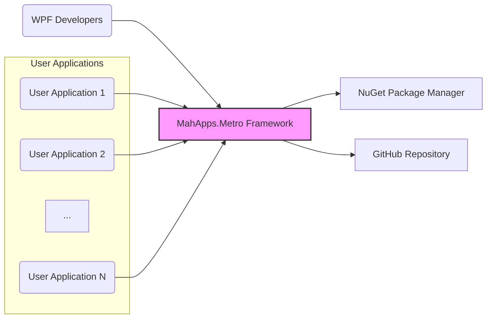
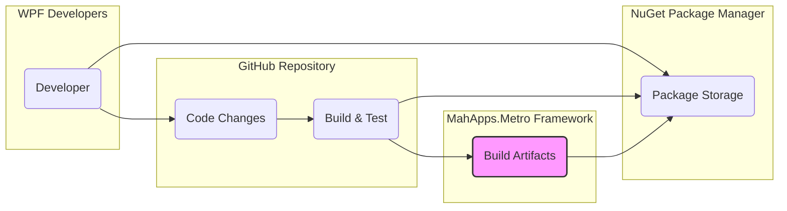
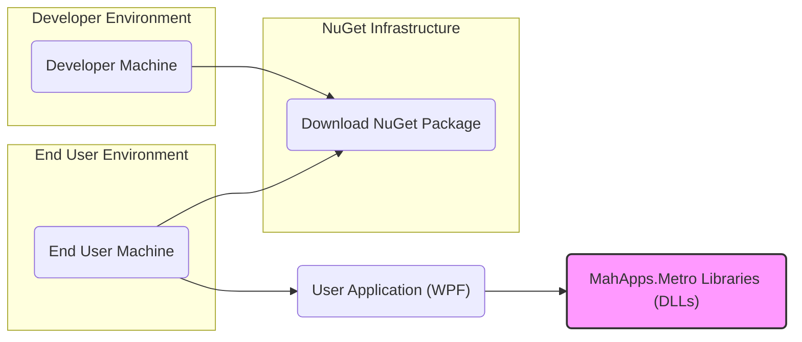

# BUSINESS POSTURE

This project, MahApps.Metro, provides a set of UI controls, themes, and styles for WPF (Windows Presentation Foundation) applications. It aims to enable developers to create modern, visually appealing, and consistent desktop applications using WPF.

* Business priorities:
 - Enhance developer productivity by providing reusable and customizable UI components.
 - Improve the user experience of WPF applications built with MahApps.Metro by offering modern and visually appealing themes.
 - Maintain a stable and reliable UI framework that developers can depend on.
 - Foster a community around the project to encourage contributions and ensure long-term sustainability.

* Business goals:
 - Increase adoption of MahApps.Metro among WPF developers.
 - Provide a comprehensive and feature-rich UI toolkit for WPF.
 - Ensure compatibility with various WPF versions and .NET frameworks.
 - Maintain high code quality and address bug fixes and feature requests promptly.

* Most important business risks:
 - Security vulnerabilities in the framework could be inherited by applications using MahApps.Metro, leading to potential exploits in end-user applications.
 - Supply chain risks associated with dependencies and build process could compromise the integrity of the framework.
 - Lack of maintenance or community support could lead to stagnation and decreased adoption.
 - Breaking changes or instability could negatively impact developers relying on the framework.

# SECURITY POSTURE

* Security controls:
 - security control: Source code is hosted on GitHub, providing version control and transparency. (Implemented: GitHub)
 - security control: Project is open source, allowing community review and contributions, potentially leading to earlier identification of vulnerabilities. (Implemented: GitHub)
 - security control: NuGet package distribution provides a standardized and widely used mechanism for distributing and consuming the framework. (Implemented: NuGet)

* Accepted risks:
 - accepted risk: As an open-source project, there is reliance on community contributions for security reviews and vulnerability identification.
 - accepted risk: Potential for vulnerabilities to be present in dependencies used by MahApps.Metro.
 - accepted risk: Risk of malicious contributions if contribution review process is not robust.

* Recommended security controls:
 - security control: Implement automated security scanning (SAST/DAST) in the CI/CD pipeline to detect potential vulnerabilities in the code.
 - security control: Introduce dependency scanning to identify and manage vulnerabilities in third-party libraries.
 - security control: Establish a clear process for reporting and handling security vulnerabilities, including a security policy and contact information.
 - security control: Perform regular security code reviews, especially for critical components and new features.
 - security control: Implement code signing for NuGet packages to ensure integrity and authenticity.

* Security requirements:
 - Authentication: Not directly applicable to a UI framework itself. Authentication is the responsibility of applications built using MahApps.Metro.
 - Authorization: Not directly applicable to a UI framework itself. Authorization is the responsibility of applications built using MahApps.Metro.
 - Input validation: MahApps.Metro controls should be designed to handle various inputs safely and prevent common input validation vulnerabilities (e.g., XSS, injection). Input validation should primarily be implemented within the controls themselves to ensure robustness.
 - Cryptography:  MahApps.Metro itself is unlikely to require extensive cryptography. If any cryptographic operations are performed (e.g., for secure storage of settings, though unlikely in a UI framework), established and secure cryptographic libraries should be used. Applications using MahApps.Metro may require cryptography, but this is outside the scope of the framework itself.

# DESIGN

## C4 CONTEXT



* Context Diagram Elements:
 - Element:
  - Name: WPF Developers
  - Type: User
  - Description: Software developers who build WPF desktop applications.
  - Responsibilities: Use MahApps.Metro to develop visually appealing and consistent WPF applications. Integrate the framework into their projects.
  - Security controls: Responsible for securely integrating and using MahApps.Metro in their applications. Following secure coding practices in their applications.
 - Element:
  - Name: MahApps.Metro Framework
  - Type: Software System
  - Description: A WPF UI framework providing controls, themes, and styles.
  - Responsibilities: Provide reusable UI components, themes, and styles for WPF applications. Ensure the framework is stable, reliable, and secure.
  - Security controls: Implement secure coding practices during development. Conduct security testing. Manage dependencies securely. Secure build and release process.
 - Element:
  - Name: NuGet Package Manager
  - Type: Software System
  - Description: A package manager for .NET, used to distribute and consume MahApps.Metro.
  - Responsibilities: Host and distribute MahApps.Metro packages. Ensure package integrity and availability.
  - Security controls: Package signing. Infrastructure security. Access controls.
 - Element:
  - Name: GitHub Repository
  - Type: Software System
  - Description: Hosting platform for MahApps.Metro source code, issue tracking, and collaboration.
  - Responsibilities: Store and manage source code. Facilitate collaboration among developers. Track issues and feature requests.
  - Security controls: Access controls. Code review processes. Vulnerability scanning on the platform.
 - Element:
  - Name: User Applications
  - Type: Software System
  - Description: WPF desktop applications built by developers using MahApps.Metro.
  - Responsibilities: Provide functionality to end-users. Utilize MahApps.Metro components for UI.
  - Security controls: Application-level security controls (authentication, authorization, input validation, etc.). Securely use and integrate MahApps.Metro framework.

## C4 CONTAINER



* Container Diagram Elements:
 - Element:
  - Name: MahApps.Metro Libraries (DLLs)
  - Type: Container - Libraries
  - Description: Compiled .NET libraries (DLLs) containing the UI controls, themes, and styles of MahApps.Metro.
  - Responsibilities: Provide the core functionality of the framework. Be consumed by WPF applications.
  - Security controls: Code signing of DLLs. Secure compilation process. Vulnerability scanning of dependencies.
 - Element:
  - Name: NuGet Server
  - Type: Container - Package Registry
  - Description: Server hosting NuGet packages, distributing MahApps.Metro to developers.
  - Responsibilities: Store and serve MahApps.Metro NuGet packages. Manage package versions.
  - Security controls: Access controls to package management. Package integrity checks. Infrastructure security.
 - Element:
  - Name: GitHub Repository
  - Type: Container - Code Repository
  - Description: Git repository hosting the source code of MahApps.Metro.
  - Responsibilities: Version control. Source code management. Collaboration platform.
  - Security controls: Access controls. Branch protection. Code review processes.
 - Element:
  - Name: GitHub Actions CI
  - Type: Container - CI/CD System
  - Description: GitHub Actions workflows for building, testing, and publishing MahApps.Metro.
  - Responsibilities: Automate build process. Run tests. Package creation. Publish NuGet packages.
  - Security controls: Secure workflow definitions. Secret management for credentials. Build environment security.

## DEPLOYMENT

MahApps.Metro is primarily deployed as a NuGet package. Applications using MahApps.Metro will have their own deployment architectures. We will focus on the NuGet package deployment and general application deployment considerations.

Possible Deployment Architectures for Applications using MahApps.Metro:
1.  Desktop Deployment (Common for WPF applications): Applications are installed directly on user's Windows machines.
2.  Enterprise Deployment: Applications deployed within a corporate network, potentially using centralized deployment mechanisms.
3.  Cloud-based Desktop (Less common for WPF, but possible): Applications virtualized or streamed from the cloud.

We will focus on the most common scenario: Desktop Deployment.



* Deployment Diagram Elements:
 - Element:
  - Name: NuGet Registry (nuget.org)
  - Type: Infrastructure - Package Registry
  - Description: Public NuGet package registry where MahApps.Metro packages are hosted.
  - Responsibilities: Host and distribute NuGet packages. Ensure package availability and integrity.
  - Security controls: Infrastructure security. Package signing verification. Access controls.
 - Element:
  - Name: Developer Machine
  - Type: Infrastructure - Development Environment
  - Description: Developer's local machine used for development and publishing packages.
  - Responsibilities: Development of MahApps.Metro. Building and publishing NuGet packages.
  - Security controls: Developer machine security. Secure development practices. Secure credential management for publishing.
 - Element:
  - Name: End User Machine
  - Type: Infrastructure - End User Environment
  - Description: User's Windows machine where WPF applications using MahApps.Metro are installed and run.
  - Responsibilities: Run WPF applications. Download and install applications and their dependencies (including MahApps.Metro).
  - Security controls: Operating system security. Application security controls.
 - Element:
  - Name: User Application (WPF)
  - Type: Software - Application
  - Description: WPF desktop application built using MahApps.Metro.
  - Responsibilities: Provide application functionality to the end-user. Utilize MahApps.Metro for UI.
  - Security controls: Application-level security controls. Secure integration of MahApps.Metro.
 - Element:
  - Name: MahApps.Metro Libraries (DLLs)
  - Type: Software - Libraries
  - Description: Deployed MahApps.Metro DLLs within the user application's directory.
  - Responsibilities: Provide UI framework functionality to the user application at runtime.
  - Security controls: Integrity of DLLs (potentially verified during application installation).

## BUILD

```mermaid
graph LR
    subgraph "Developer"
        Dev("Developer")
    end
    subgraph "GitHub"
        GitHubRepoBuild("GitHub Repository")
        GitHubActionsBuild("GitHub Actions")
    end
    subgraph "Build Environment"
        BuildAgent("Build Agent")
    end
    subgraph "Artifact Repository"
        NuGetArtifacts("NuGet Package Repository")
    end

    Dev --> GitHubRepoBuild("Code Commit")
    GitHubRepoBuild --> GitHubActionsBuild("Trigger Build")
    GitHubActionsBuild --> BuildAgent("Build Job")
    BuildAgent --> BuildArtifacts("Build Output (DLLs, NuGet Package)")
    BuildArtifacts --> NuGetArtifacts("Publish NuGet Package")

    subgraph "Security Checks in Build"
        style SecurityChecks fill:#ccf,stroke:#333,stroke-width:1px
        SecurityChecks([Security Checks:
        - Compilation
        - Unit Tests
        - Linters
        - Dependency Scan
        - SAST (if applicable)])
    end
    BuildAgent --> SecurityChecks

    SecurityChecks --> BuildArtifacts

    style NuGetArtifacts fill:#f9f,stroke:#333,stroke-width:2px
```

* Build Process Elements:
 - Element:
  - Name: Developer
  - Type: Actor
  - Description: Software developer committing code changes.
  - Responsibilities: Write and commit code. Follow secure coding practices.
  - Security controls: Secure development environment. Code review participation.
 - Element:
  - Name: GitHub Repository
  - Type: System - Code Repository
  - Description: Git repository hosting the source code.
  - Responsibilities: Store and manage source code. Trigger CI/CD pipelines.
  - Security controls: Access controls. Branch protection. Audit logs.
 - Element:
  - Name: GitHub Actions
  - Type: System - CI/CD Platform
  - Description: GitHub's CI/CD service used for build automation.
  - Responsibilities: Orchestrate build pipeline. Execute build steps. Manage build agents.
  - Security controls: Secure workflow definitions. Secret management. Access controls. Audit logs.
 - Element:
  - Name: Build Agent
  - Type: System - Build Environment
  - Description: Virtual machine or container executing build jobs.
  - Responsibilities: Compile code. Run tests. Create build artifacts. Perform security checks.
  - Security controls: Hardened build environment. Regularly updated. Secure access.
 - Element:
  - Name: Build Artifacts
  - Type: Data - Build Output
  - Description: Compiled DLLs and NuGet package.
  - Responsibilities: Package framework components. Be published to NuGet repository.
  - Security controls: Code signing. Integrity checks. Access controls to build artifacts.
 - Element:
  - Name: NuGet Package Repository
  - Type: System - Artifact Repository
  - Description: Repository for storing and distributing NuGet packages.
  - Responsibilities: Store and serve NuGet packages. Ensure package integrity and availability.
  - Security controls: Access controls. Package signing verification. Infrastructure security.
 - Element:
  - Name: Security Checks
  - Type: Process - Security Validation
  - Description: Automated security checks performed during the build process. Includes compilation, unit tests, linters, dependency scanning, and potentially SAST.
  - Responsibilities: Identify potential vulnerabilities and code quality issues early in the development cycle. Improve the security posture of the framework.
  - Security controls: Automated security scanning tools. Defined security check policies. Fail-fast mechanism on security check failures.

# RISK ASSESSMENT

* Critical business process:
 - Development and distribution of MahApps.Metro framework.
 - Adoption and usage of MahApps.Metro by WPF application developers.
 - Functionality of applications built using MahApps.Metro.

* Data we are trying to protect:
 - Source code of MahApps.Metro: Sensitivity - Publicly available, but integrity and confidentiality during development are important.
 - NuGet packages: Sensitivity - Publicly available, but integrity and authenticity are critical to prevent supply chain attacks.
 - Build environment and credentials: Sensitivity - Confidential, compromise could lead to malicious package releases.

* Data sensitivity:
 - Publicly available source code and NuGet packages, but integrity and authenticity are paramount.
 - Build environment and credentials are highly sensitive and require strong protection.

# QUESTIONS & ASSUMPTIONS

* Questions:
 - What is the process for reporting and handling security vulnerabilities in MahApps.Metro? (Assumption: A process should be established and clearly documented).
 - Are there any specific security requirements or compliance standards that MahApps.Metro needs to adhere to? (Assumption: General secure development practices are sufficient for an open-source UI framework).
 - What is the process for reviewing and accepting contributions to ensure code quality and security? (Assumption: Code review process is in place, but its security focus needs to be strengthened).
 - Are there any plans to implement automated security scanning (SAST/DAST) and dependency scanning in the CI/CD pipeline? (Assumption: These are recommended security controls that should be considered for implementation).

* Assumptions:
 - MahApps.Metro is intended for general-purpose WPF desktop applications and does not handle highly sensitive data directly within the framework itself.
 - Security is a shared responsibility between the MahApps.Metro project and the developers using the framework in their applications.
 - The primary security concern is ensuring the integrity and security of the MahApps.Metro framework itself to prevent vulnerabilities from being inherited by consuming applications.
 - The project operates with a reasonable level of security awareness, but there is room for improvement in implementing more proactive security measures, especially in the build and release pipeline.