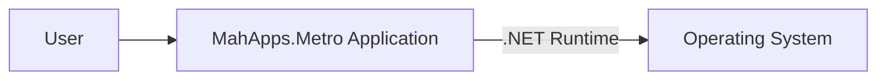
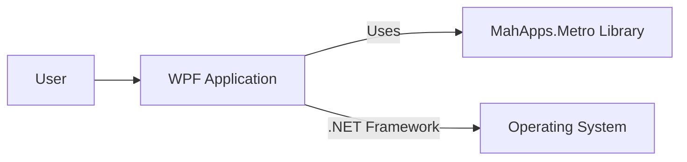
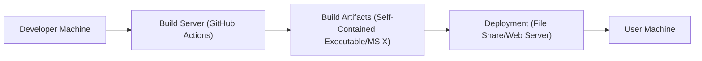
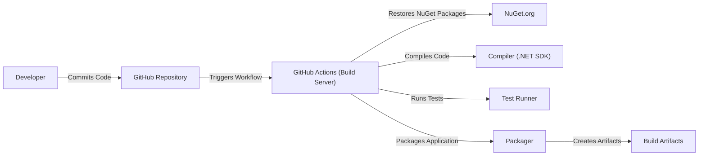

Okay, let's create a design document for the MahApps.Metro project.

# BUSINESS POSTURE

Business Priorities and Goals:

*   Provide a toolkit for easily creating modern-looking WPF applications.
*   Offer a consistent and customizable UI experience aligned with the "Metro" (now Fluent) design language.
*   Reduce development time for WPF developers by providing pre-built controls and styles.
*   Maintain an active and supportive open-source community.
*   Ensure the library is well-documented and easy to use.
*   Provide a free and open-source solution, fostering broad adoption.

Business Risks:

*   Dependency on the WPF framework, which may see reduced investment from Microsoft in the future compared to newer UI frameworks (e.g., MAUI, WinUI 3).
*   Maintaining compatibility with newer versions of .NET and Visual Studio.
*   Keeping up with evolving design trends and user expectations.
*   Reliance on community contributions for maintenance and feature development. A drop in community engagement could lead to stagnation.
*   Security vulnerabilities in the library or its dependencies could impact applications built using it.
*   Lack of commercial support options might deter some enterprise users.

# SECURITY POSTURE

Existing Security Controls:

*   security control: The project is open-source, allowing for community review and scrutiny of the codebase. (GitHub repository)
*   security control: Standard .NET security best practices are expected to be followed, given the nature of the project and its reliance on the WPF framework. (Implicit in the use of .NET/WPF)
*   security control: The project uses GitHub for issue tracking, allowing for public reporting and tracking of security vulnerabilities. (GitHub Issues)
*   security control: The project appears to use automated builds and releases via GitHub Actions. (GitHub Actions workflows)

Accepted Risks:

*   accepted risk: The library itself does not handle sensitive data directly. It's a UI framework; data handling is the responsibility of the applications using it.
*   accepted risk: The project relies on third-party dependencies (e.g., NuGet packages). Vulnerabilities in these dependencies could impact the security of applications using MahApps.Metro.
*   accepted risk: There's no explicit mention of a dedicated security response team or formal security vulnerability disclosure process beyond GitHub Issues.

Recommended Security Controls:

*   security control: Implement static code analysis (SAST) in the build pipeline to identify potential security vulnerabilities early in the development process.
*   security control: Integrate dependency scanning (SCA) to identify and track known vulnerabilities in third-party libraries.
*   security control: Establish a clear security vulnerability disclosure policy (e.g., a SECURITY.md file) to guide researchers on how to report vulnerabilities responsibly.
*   security control: Consider code signing releases to ensure the integrity of distributed binaries.
*   security control: Regularly review and update dependencies to mitigate known vulnerabilities.
*   security control: Provide security-focused documentation and guidance for developers using the library, emphasizing secure coding practices when handling data and interacting with external resources.

Security Requirements:

*   Authentication: Not directly applicable to the library itself. Authentication is the responsibility of the consuming application.
*   Authorization: Not directly applicable to the library itself. Authorization is the responsibility of the consuming application.
*   Input Validation: The library should ensure that user input within its controls is handled safely to prevent common vulnerabilities like XSS (Cross-Site Scripting) if applicable (e.g., in any controls that display user-provided content).  This is primarily relevant to the application using MahApps.Metro, but controls should be designed to minimize the risk of misuse.
*   Cryptography: Not directly applicable to the library itself, unless specific controls are added that handle encryption/decryption.  If such features are added, industry-standard cryptographic algorithms and secure key management practices must be followed.

# DESIGN

## C4 CONTEXT

Element Descriptions:

*   Element: User
    *   Name: User
    *   Type: Person
    *   Description: A user interacting with a WPF application built using MahApps.Metro.
    *   Responsibilities: Interacts with the application's UI.
    *   Security Controls: None (handled by the application).

*   Element: MahApps.Metro Application
    *   Name: MahApps.Metro Application
    *   Type: Software System
    *   Description: A WPF application that utilizes the MahApps.Metro library for its UI.
    *   Responsibilities: Provides application-specific functionality. Uses MahApps.Metro for a consistent and modern UI.
    *   Security Controls: Application-specific security controls, including input validation, authentication, and authorization.

*   Element: .NET Runtime
    *   Name: .NET Runtime
    *   Type: Software System
    *   Description: The .NET runtime environment required to execute the WPF application.
    *   Responsibilities: Executes the application's code. Provides core libraries and services.
    *   Security Controls: .NET security features, including Code Access Security (CAS) and sandboxing (though CAS is less relevant in modern .NET).

*   Element: Operating System
    *   Name: Operating System
    *   Type: Software System
    *   Description: The underlying operating system (typically Windows) on which the application runs.
    *   Responsibilities: Provides fundamental system services, including memory management, process scheduling, and file system access.
    *   Security Controls: OS-level security features, such as user accounts, access control lists, and firewall.

## C4 CONTAINER

Element Descriptions:

*   Element: User
    *   Name: User
    *   Type: Person
    *   Description: A user interacting with the WPF application.
    *   Responsibilities: Interacts with the application's UI.
    *   Security Controls: None (handled by the application).

*   Element: WPF Application
    *   Name: WPF Application
    *   Type: Container (Application)
    *   Description: The main WPF application executable.
    *   Responsibilities: Contains the application's business logic, data access, and UI code.  Uses MahApps.Metro for UI components and styling.
    *   Security Controls: Application-specific security controls, including input validation, authentication, and authorization.

*   Element: MahApps.Metro Library
    *   Name: MahApps.Metro Library
    *   Type: Container (Library/DLL)
    *   Description: The MahApps.Metro library, providing UI controls and styles.
    *   Responsibilities: Provides pre-built UI components and styles.  Handles UI-related events and interactions.
    *   Security Controls: Internal input validation within controls (where applicable).  Relies on the .NET Framework's security features.

*   Element: Operating System
    *   Name: Operating System
    *   Type: Software System
    *   Description: The underlying operating system (typically Windows).
    *   Responsibilities: Provides fundamental system services.
    *   Security Controls: OS-level security features.

## DEPLOYMENT

Possible Deployment Solutions:

1.  **ClickOnce:** A deployment technology for easily installing and updating Windows applications.
2.  **MSIX:** A modern Windows application package format that provides a clean install and uninstall experience.
3.  **Traditional Installer (MSI):** Using a setup project to create an installer for the application.
4.  **Self-Contained Deployment:** Packaging the .NET runtime with the application, creating a standalone executable.

Chosen Solution: Self-Contained Deployment (with potential for MSIX in the future)

Description:

The WPF application, along with the MahApps.Metro library and all necessary dependencies (excluding the .NET runtime in the case of a framework-dependent deployment), is packaged into a directory. For a self-contained deployment, the .NET runtime is also included. This directory can then be distributed to users. An MSIX package could also be created to provide a more modern installation experience.

Element Descriptions:

*   Element: Developer Machine
    *   Name: Developer Machine
    *   Type: Infrastructure Node
    *   Description: The machine used by developers to write and build the application.
    *   Responsibilities: Code development, testing, and triggering builds.
    *   Security Controls: Developer machine security best practices (e.g., up-to-date OS, antivirus, strong passwords).

*   Element: Build Server (GitHub Actions)
    *   Name: Build Server (GitHub Actions)
    *   Type: Infrastructure Node
    *   Description: The GitHub Actions environment used to build the application.
    *   Responsibilities: Compiles the code, runs tests, and creates build artifacts.
    *   Security Controls: GitHub Actions security features, including secrets management and workflow permissions.

*   Element: Build Artifacts (Self-Contained Executable/MSIX)
    *   Name: Build Artifacts
    *   Type: Artifact
    *   Description: The output of the build process, including the application executable, dependencies, and potentially an MSIX package.
    *   Responsibilities: Represents the deployable application.
    *   Security Controls: Code signing (if implemented).

*   Element: Deployment (File Share/Web Server)
    *   Name: Deployment
    *   Type: Infrastructure Node
    *   Description: The location from which users can download or install the application.
    *   Responsibilities: Hosts the build artifacts for distribution.
    *   Security Controls: Access controls on the file share or web server. HTTPS for web-based distribution.

*   Element: User Machine
    *   Name: User Machine
    *   Type: Infrastructure Node
    *   Description: The machine on which the user runs the application.
    *   Responsibilities: Executes the application.
    *   Security Controls: User machine security best practices (e.g., up-to-date OS, antivirus, firewall).

## BUILD

The build process for MahApps.Metro applications typically involves the following steps:

1.  **Code Checkout:** The developer checks out the source code from the GitHub repository.
2.  **Dependency Resolution:** NuGet packages (including MahApps.Metro) are restored.
3.  **Compilation:** The code is compiled using the .NET SDK.
4.  **Testing:** (Optional, but recommended) Unit tests and integration tests are executed.
5.  **Packaging:** The application is packaged for deployment (e.g., as a self-contained executable or an MSIX package).
6.  **Artifact Publication:** The build artifacts are published to a location accessible for deployment.

This process is automated using GitHub Actions.

Security Controls in Build Process:

*   security control: GitHub Actions provides a secure build environment.
*   security control: Secrets management in GitHub Actions can be used to store sensitive information (e.g., code signing certificates).
*   security control: (Recommended) SAST and SCA tools can be integrated into the GitHub Actions workflow to scan for vulnerabilities.
*   security control: (Recommended) Code signing can be performed as part of the build process to ensure the integrity of the released binaries.

# RISK ASSESSMENT

Critical Business Processes:

*   Providing a stable and reliable UI framework for WPF developers.
*   Maintaining an active and engaged open-source community.

Data to Protect:

*   Source code (low sensitivity, publicly available).
*   Build artifacts (medium sensitivity, as they represent the released product).
*   Any user data handled by *applications* built using MahApps.Metro (sensitivity varies depending on the application). The library itself does not handle user data directly.

# QUESTIONS & ASSUMPTIONS

Questions:

*   Are there any specific compliance requirements (e.g., GDPR, HIPAA) that applications built using MahApps.Metro are expected to meet?  (This is primarily the responsibility of the application developer, but the library should not hinder compliance.)
*   Is there a plan to migrate to a newer UI framework (e.g., MAUI, WinUI 3) in the future?
*   What is the process for handling security vulnerabilities reported by external researchers?
*   Are there any plans to offer commercial support or licensing options?

Assumptions:

*   BUSINESS POSTURE: The primary goal is to provide a free and open-source UI library for WPF developers.
*   SECURITY POSTURE: Security is a concern, but there may be limited resources dedicated specifically to security. Reliance on community contributions and standard .NET security practices is assumed.
*   DESIGN: The design is based on the information available in the GitHub repository and general knowledge of WPF development. The diagrams and descriptions are based on reasonable assumptions about how the library is used and deployed.