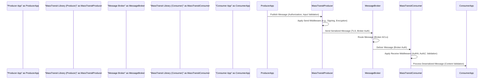

# Project Design Document: MassTransit

**Version:** 1.1
**Date:** October 26, 2023
**Author:** AI Software Architect

## 1. Introduction

This document provides a detailed architectural design overview of the MassTransit project, an open-source distributed application framework for .NET. The information contained herein is specifically tailored to facilitate a comprehensive threat modeling exercise. This document emphasizes the key components, data flow, and architectural decisions that are relevant to security considerations. The primary source of information for this document is the official MassTransit GitHub repository: [https://github.com/masstransit/masstransit](https://github.com/masstransit/masstransit).

## 2. Goals and Objectives

The primary goal of this document is to provide a clear, detailed, and security-focused description of the MassTransit architecture to enable effective threat modeling. The objectives are to:

*   Clearly identify the core components of the MassTransit framework and their security-relevant responsibilities.
*   Precisely describe the interactions and data flow between these components, highlighting potential security vulnerabilities at each stage.
*   Elucidate key architectural decisions and their direct implications for the security posture of systems built with MassTransit.
*   Provide sufficient technical detail to allow security professionals to systematically identify potential vulnerabilities, attack vectors, and mitigation strategies.

## 3. Architectural Overview

MassTransit is a message bus implementation that facilitates loosely coupled communication between different services and applications. It abstracts the complexities of interacting directly with message brokers, offering a consistent API for asynchronous message sending and receiving based on the publish/subscribe pattern and message queues.

Here's a high-level architectural diagram illustrating the core interactions:

```mermaid
graph LR
    subgraph "Producer Application"
        A["'Producer'"]
    end
    subgraph "MassTransit Library"
        B["'Publish Endpoint'"] --> C("'Message Broker Transport'");
        D("'Receive Endpoint'"] --> E["'Consumer'"];
    end
    subgraph "Message Broker (e.g., RabbitMQ, Azure Service Bus)"
        C -- "'Messages'" --> D
    end
    subgraph "Consumer Application"
        E
    end
```

**Key Architectural Principles with Security Implications:**

*   **Transport Abstraction:** While simplifying development, this abstraction means security configurations and vulnerabilities can vary significantly between underlying message brokers.
*   **Loose Coupling:**  Reduces direct dependencies but necessitates careful consideration of message contracts and potential for malicious message injection.
*   **Asynchronous Communication:**  Can complicate tracing and auditing of message flow for security purposes.
*   **Message Routing:** Misconfigured routing rules could lead to unintended message delivery and information disclosure.
*   **Extensibility through Middleware:**  Provides flexibility but introduces the risk of vulnerabilities in custom or third-party middleware components.

## 4. Key Components and Security Considerations

This section details the major components of the MassTransit framework, focusing on their security-relevant aspects:

*   **Producers:** Applications or services responsible for initiating communication by sending messages.
    *   **Security Consideration:**  Producers must be authorized to publish specific message types to prevent unauthorized actions. Input validation at the producer level is crucial to prevent injection of malicious data.
*   **Consumers:** Applications or services that process messages received from the message bus.
    *   **Security Consideration:** Consumers must authenticate the source of messages and authorize the processing of specific message types. They are the primary point for validating message content to prevent attacks.
*   **Message Broker:** The underlying infrastructure responsible for message storage and delivery.
    *   **Security Consideration:** The security of the message broker itself is paramount. This includes access control, encryption of data at rest and in transit, and protection against denial-of-service attacks. MassTransit relies on the broker's security features.
*   **Publish Endpoint:** The MassTransit abstraction used by producers to send messages to the bus.
    *   **Security Consideration:**  The publish endpoint is where outgoing middleware pipelines are applied, offering an opportunity for applying security policies like message signing or encryption.
*   **Receive Endpoint:** The MassTransit abstraction that listens for messages on queues or topics and delivers them to consumers.
    *   **Security Consideration:** The receive endpoint is where incoming middleware pipelines are applied, allowing for security checks like authentication and authorization before message processing.
*   **Message Contracts:**  Define the structure and schema of messages.
    *   **Security Consideration:** Well-defined and versioned contracts help prevent interpretation errors and potential vulnerabilities arising from unexpected data structures. Lack of clear contracts can lead to deserialization issues and potential exploits.
*   **Message Serialization:** The process of converting messages to and from byte streams.
    *   **Security Consideration:** The choice of serializer impacts security. Some serializers might be vulnerable to deserialization attacks if not handled carefully. Configuration of allowed types for deserialization is crucial.
*   **Middleware Pipeline (Send and Receive):** A chain of interceptors for processing messages.
    *   **Security Consideration:** Middleware can enforce security policies (authentication, authorization, logging, encryption). However, vulnerabilities in custom or third-party middleware can introduce significant risks. The order of middleware execution is also important for security.
*   **Sagas:** Manage long-running business processes through message exchange.
    *   **Security Consideration:** Saga state persistence needs to be secure. Access control to saga instances and prevention of unauthorized state transitions are critical. Consider the risk of replay attacks on saga events.
*   **Transport Implementations (e.g., RabbitMQ, Azure Service Bus):**  Libraries for interacting with specific message brokers.
    *   **Security Consideration:** Each transport has its own security configuration and potential vulnerabilities. Ensure the chosen transport is configured according to security best practices (e.g., TLS, authentication).
*   **Configuration:** Settings for endpoints, transports, and other aspects of MassTransit.
    *   **Security Consideration:** Secure storage and management of configuration data, especially connection strings and credentials, is essential. Avoid storing sensitive information in plain text.
*   **Monitoring and Logging:** Mechanisms for observing message flow and recording events.
    *   **Security Consideration:**  Logging security-relevant events (authentication attempts, authorization failures, message processing errors) is crucial for auditing and incident response. Ensure sensitive data is not inadvertently logged.

## 5. Data Flow with Security Touchpoints

The typical data flow within a MassTransit system, highlighting key security considerations at each step:

1. A **Producer Application** creates a message. **Security Touchpoint:** Ensure the producer is authorized to create this type of message and that input validation is performed.
2. The Producer uses the `IPublishEndpoint`. **Security Touchpoint:** Outgoing middleware can be applied here for actions like message signing or encryption.
3. MassTransit serializes the message. **Security Touchpoint:** The chosen serializer must be secure and configured to prevent deserialization vulnerabilities.
4. The message is sent to the **Message Broker**. **Security Touchpoint:** The connection to the broker must be secured with TLS/SSL, and the producer must be authenticated and authorized to publish to the target exchange/topic.
5. The Message Broker routes the message. **Security Touchpoint:** Ensure proper access control lists (ACLs) and routing rules are configured on the broker to prevent unauthorized message delivery.
6. A **Consumer Application**, via a **Receive Endpoint**, receives the message. **Security Touchpoint:** The connection from MassTransit to the broker must be authenticated.
7. Incoming middleware is applied. **Security Touchpoint:** This is a critical point for performing authentication, authorization, and message validation before processing.
8. MassTransit deserializes the message. **Security Touchpoint:** Again, secure deserialization practices are vital.
9. The message is dispatched to the **Consumer**. **Security Touchpoint:** Ensure the consumer is authorized to process this specific message type.
10. The Consumer processes the message. **Security Touchpoint:**  The consumer must validate the message content to prevent malicious actions.



## 6. Security Considerations (Detailed)

This section provides a more detailed breakdown of security considerations:

*   **Transport Security (TLS/SSL):**
    *   **Threat:** Man-in-the-middle attacks, eavesdropping on message content.
    *   **Mitigation:** Enforce TLS/SSL for all communication with the message broker. Properly configure certificates and ensure they are regularly updated.
*   **Message Security (Encryption and Integrity):**
    *   **Threat:** Confidential data disclosure, message tampering.
    *   **Mitigation:** Implement message-level encryption for sensitive data. Use message signing or MACs to ensure integrity. Consider using established cryptographic libraries.
*   **Authentication and Authorization:**
    *   **Broker Authentication:**
        *   **Threat:** Unauthorized access to the message broker.
        *   **Mitigation:** Use strong, unique credentials for MassTransit to authenticate with the broker. Securely store and manage these credentials (e.g., using secrets management solutions).
    *   **Message-Level Authorization:**
        *   **Threat:** Unauthorized processing of messages by consumers.
        *   **Mitigation:** Implement authorization checks within consumers or using middleware to verify that the recipient is authorized to handle the message type and content.
*   **Input Validation:**
    *   **Threat:** Injection attacks, processing of malformed data leading to errors or vulnerabilities.
    *   **Mitigation:** Implement robust input validation on both the producer (before sending) and the consumer (after receiving) to ensure messages conform to the expected schema and data types.
*   **Deserialization Security:**
    *   **Threat:** Deserialization of untrusted data leading to remote code execution or other vulnerabilities.
    *   **Mitigation:** Use secure serialization libraries and configure them to only allow deserialization of expected types. Avoid deserializing data from untrusted sources without thorough validation.
*   **Error Handling and Logging:**
    *   **Threat:** Information leakage through verbose error messages, insufficient logging for security audits.
    *   **Mitigation:** Implement secure error handling that avoids exposing sensitive information. Log security-relevant events, including authentication attempts, authorization failures, and message processing errors.
*   **Dependency Management:**
    *   **Threat:** Using vulnerable versions of MassTransit or its dependencies.
    *   **Mitigation:** Regularly update MassTransit and all its dependencies to patch known security vulnerabilities. Use dependency scanning tools to identify and address vulnerabilities.
*   **Middleware Security:**
    *   **Threat:** Vulnerabilities in custom or third-party middleware components, misconfiguration of middleware.
    *   **Mitigation:** Thoroughly review and audit all middleware components. Follow secure coding practices when developing custom middleware. Ensure middleware is configured correctly and securely.
*   **Saga Security:**
    *   **Threat:** Unauthorized access to saga state, manipulation of saga progress, replay attacks.
    *   **Mitigation:** Securely store saga state. Implement access control to saga instances. Design sagas to be idempotent to mitigate replay attacks.
*   **Configuration Security:**
    *   **Threat:** Exposure of sensitive configuration data, such as connection strings and credentials.
    *   **Mitigation:** Store configuration data securely, preferably using environment variables or dedicated secrets management solutions. Avoid storing sensitive information in plain text in configuration files.
*   **Denial of Service (DoS) Prevention:**
    *   **Threat:** Malicious actors overwhelming the message broker or consumers with excessive messages.
    *   **Mitigation:** Implement rate limiting on producers or consumers. Configure queue limits and resource allocation on the message broker. Implement circuit breakers in consumers to prevent cascading failures.

## 7. Deployment Considerations (Security Focused)

Secure deployment practices are crucial for the overall security of a MassTransit system:

*   **Network Segmentation:** Isolate the message broker and application components within secure network segments with appropriate firewall rules.
*   **Containerization Security:** When using containers, follow security best practices for building and managing container images. Scan images for vulnerabilities and implement least privilege principles.
*   **Cloud Security:** Leverage security features provided by cloud platforms, such as network security groups, IAM roles, and encryption services.
*   **Secrets Management:** Utilize dedicated secrets management services (e.g., HashiCorp Vault, Azure Key Vault) to securely store and manage sensitive credentials and connection strings.
*   **Monitoring and Alerting:** Implement comprehensive security monitoring and alerting to detect suspicious activity, such as unusual message traffic patterns or failed authentication attempts.

## 8. Dependencies

MassTransit's security posture is also influenced by its dependencies:

*   **.NET Runtime:** Ensure the .NET runtime is up-to-date with the latest security patches.
*   **Transport-Specific Libraries:** Regularly update libraries for interacting with message brokers (e.g., `RabbitMQ.Client`, `Azure.Messaging.ServiceBus`) to address potential vulnerabilities.
*   **Serialization Libraries:** Keep serialization libraries (e.g., `Newtonsoft.Json`, `System.Text.Json`) updated to mitigate deserialization vulnerabilities.
*   **Logging Libraries:** Ensure logging libraries are secure and configured to prevent information leakage.
*   **Dependency Injection Container:** The security of the DI container itself is generally less of a direct concern for MassTransit, but it's still good practice to keep it updated.

Regularly audit and update these dependencies to maintain a strong security posture.

## 9. Future Considerations

Continuously monitor the MassTransit project for new features and security updates:

*   **New Transport Implementations:**  Evaluate the security implications of any new supported message brokers.
*   **Serialization Changes:**  Be aware of any changes to default or supported serialization mechanisms and their potential security impact.
*   **Middleware Enhancements:**  Review new middleware components or features for potential security benefits or risks.
*   **Saga Improvements:**  Assess any changes to saga implementation for their impact on security, especially around state management and access control.

Staying informed about project updates is crucial for proactively addressing potential security concerns.