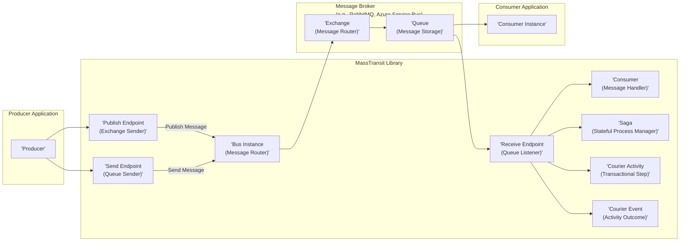
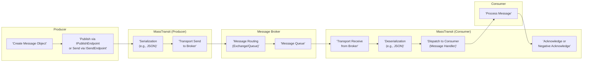

# Project Design Document: MassTransit

**Version:** 1.1
**Date:** October 26, 2023
**Author:** AI Software Architect

## 1. Introduction

This document details the architectural design of MassTransit, an open-source distributed application framework for .NET that simplifies building loosely coupled, message-based applications. MassTransit provides an abstraction layer over various message transport technologies, enabling diverse messaging patterns. This document is specifically crafted to serve as a foundation for subsequent threat modeling activities by clearly outlining the system's components, interactions, and security considerations.

## 2. Goals and Objectives

MassTransit aims to:

*   Simplify the development of asynchronous, message-driven applications in .NET.
*   Abstract away the complexities of specific message transport implementations.
*   Enable various messaging patterns, including publish/subscribe, point-to-point, and request/response.
*   Improve application resilience and scalability through asynchronous communication.
*   Offer a consistent and intuitive programming model for message handling.

This design document aims to:

*   Clearly define the core components within the MassTransit framework.
*   Illustrate the interactions and dependencies between these components.
*   Detail the flow of messages and data within the system.
*   Explicitly highlight security-relevant aspects and potential vulnerabilities.
*   Provide a comprehensive resource for conducting thorough threat modeling exercises.

## 3. System Architecture

### 3.1. High-Level Architecture

This diagram illustrates the fundamental interaction pattern: a producer application sends messages via the MassTransit library to a message broker, which then delivers them to consumer applications, also utilizing the MassTransit library.

### 3.2. Component-Level Architecture

MassTransit is composed of several interconnected components:

*   **Bus Instance (Message Router):** The central orchestrator within MassTransit. It manages connections to the message broker, configures message routing rules, and coordinates message sending and receiving.
*   **Publish Endpoint (Exchange Sender):**  The interface used by producers to publish messages to an exchange. The bus instance determines the target exchange based on message type and configured conventions.
*   **Send Endpoint (Queue Sender):** The interface used by producers to send messages directly to a specific queue, typically for point-to-point communication.
*   **Receive Endpoint (Queue Listener):** Configured within consumer applications to establish a connection to a specific queue and listen for incoming messages.
*   **Consumer (Message Handler):** A user-defined class within a consumer application responsible for processing specific message types. MassTransit automatically routes messages to the appropriate consumer based on message type registration.
*   **Saga (Stateful Process Manager):** A component for managing long-running, stateful business processes. Sagas react to events (messages) and maintain their state over time.
*   **Courier Activity (Transactional Step):**  A building block for implementing distributed sagas with compensation logic. Activities define individual steps in a distributed transaction.
*   **Courier Event (Activity Outcome):** Represents the outcome (success or failure) of a Courier Activity, allowing the saga to proceed or compensate accordingly.
*   **Message Broker Abstraction:** MassTransit provides an abstraction layer, allowing it to work with various message brokers. This abstraction includes:
    *   **Transport Implementations:**  Specific implementations for interacting with different brokers (e.g., RabbitMQ, Azure Service Bus).
    *   **Connection Management:** Handles establishing and maintaining connections to the message broker.
    *   **Error Handling:** Provides mechanisms for handling transport-level errors.
*   **Serialization:** Responsible for converting message objects into a byte stream for transmission and vice versa. Supported serializers include:
    *   **JSON (Newtonsoft.Json):** The default serializer.
    *   **System.Text.Json:**  A performant JSON serializer.
    *   **MessagePack:** A binary serialization format.
*   **Middleware Pipeline:** A chain of interceptors applied to both sending and receiving messages. Middleware can be used for cross-cutting concerns such as:
    *   **Logging:** Recording message processing activities.
    *   **Error Handling:** Implementing custom error handling logic.
    *   **Message Transformation:** Modifying messages before sending or after receiving.
    *   **Authentication/Authorization:** Enforcing security policies.
*   **Retry and Error Handling:** Built-in mechanisms for automatically retrying message delivery in case of transient errors and for handling message failures (e.g., dead-letter queues).
*   **Message Scheduling:**  Allows messages to be scheduled for delivery at a future time.
*   **Request/Response:**  Facilitates a request/response communication pattern over the asynchronous message transport.
*   **Monitoring and Diagnostics:**  Integration points for monitoring message flow, performance metrics, and potential issues.

## 4. Data Flow

The typical lifecycle of a message within a MassTransit system involves these steps:

1. **Message Creation:** A producer application instantiates a message object containing the data to be transmitted.
2. **Message Publication/Sending:** The producer utilizes the `IPublishEndpoint` (for publish/subscribe) or `ISendEndpoint` (for point-to-point) obtained from the MassTransit bus instance.
3. **Serialization:** MassTransit serializes the message object into a byte array using the configured serializer (e.g., JSON).
4. **Message Transmission:** The serialized message is sent to the designated exchange or queue on the message broker via the underlying transport implementation.
5. **Message Routing (Broker):** The message broker routes the message to the appropriate queue(s) based on exchange bindings, routing keys, or the target queue address.
6. **Message Persistence (Broker):** The message broker typically persists the message to disk (depending on configuration) to ensure durability.
7. **Message Delivery (Broker):** The message broker delivers the message to a listening consumer's queue.
8. **Message Reception:** The consumer's receive endpoint, configured with MassTransit, retrieves the message from the queue.
9. **Deserialization:** MassTransit deserializes the byte array back into the original message object using the configured serializer.
10. **Message Consumption:** The deserialized message is dispatched to the appropriate consumer method based on the message type registration.
11. **Acknowledgement/Negative Acknowledgement:** The consumer signals successful processing (acknowledgement) or failure (negative acknowledgement) of the message to the message broker. Negative acknowledgements may trigger retry mechanisms or message dead-lettering.

## 5. Security Considerations

Security is paramount in distributed systems. Here are key security considerations for MassTransit deployments:

*   **Message Broker Security:**
    *   **Authentication and Authorization:**  Producers and consumers must authenticate with the message broker using strong credentials. Implement fine-grained authorization to control access to specific exchanges and queues. Potential threats include unauthorized message publication or consumption.
    *   **Transport Layer Security (TLS):**  Encrypt all communication between MassTransit instances and the message broker using TLS to protect message confidentiality and integrity during transit. Without TLS, messages can be intercepted and read.
    *   **Broker Hardening:**  Secure the message broker itself by following vendor-recommended hardening guidelines. This includes patching vulnerabilities, restricting network access, and disabling unnecessary features.
*   **Message Security:**
    *   **Message Encryption:** Encrypt sensitive data within message payloads before publishing. Consider using libraries like `System.Security.Cryptography` or dedicated encryption services. Without encryption, sensitive data is vulnerable to exposure if the broker is compromised or traffic is intercepted.
    *   **Message Signing:** Digitally sign messages to ensure their integrity and authenticity. This prevents tampering and allows consumers to verify the message source.
*   **Application Security:**
    *   **Input Validation:**  Thoroughly validate the content of received messages in consumers to prevent injection attacks (e.g., SQL injection if message data is used in database queries) or unexpected behavior.
    *   **Error Handling:** Implement robust error handling to prevent information leakage through verbose error messages. Avoid exposing internal system details in error responses.
    *   **Dependency Management:** Regularly update MassTransit and its dependencies to patch known security vulnerabilities. Use dependency scanning tools to identify potential risks.
    *   **Secure Configuration:** Store connection strings, API keys, and other sensitive configuration data securely using environment variables, secrets management services (e.g., Azure Key Vault, HashiCorp Vault), or secure configuration providers. Avoid hardcoding sensitive information.
*   **MassTransit Specific Security:**
    *   **Middleware for Security:** Leverage MassTransit's middleware pipeline to implement custom authentication, authorization, or message validation logic.
    *   **Idempotency:** Design consumers to be idempotent, especially for critical operations, to mitigate the risk of processing the same message multiple times due to retries.
*   **Access Control within MassTransit:** While primarily relying on the broker, consider application-level authorization checks within consumers for finer-grained control based on message content or user context.
*   **Monitoring and Auditing:** Implement comprehensive logging and monitoring to track message flow, identify suspicious activity, and audit message processing for compliance and security investigations.
*   **Denial of Service (DoS) Attacks:** Implement rate limiting or other mechanisms at the producer or broker level to protect against DoS attacks that could overwhelm consumers or the message broker.
*   **Replay Attacks:** For critical operations, implement mechanisms to detect and prevent replay attacks, such as including unique message identifiers and timestamps, and tracking processed messages.

## 6. Deployment Considerations

Deploying MassTransit applications involves several key considerations:

*   **Message Broker Selection and Configuration:** Choose a message broker that meets the application's scalability, reliability, and security requirements. Properly configure the broker for high availability, persistence, and security.
*   **Network Configuration:** Ensure proper network connectivity and firewall rules are in place to allow communication between producers, consumers, and the message broker. Consider network segmentation for enhanced security.
*   **Scalability and High Availability:** Design the application and message broker infrastructure to handle expected message volumes and ensure high availability through techniques like load balancing and message broker clustering.
*   **Monitoring and Logging Infrastructure:** Implement a robust monitoring and logging solution to track application health, performance, and potential errors. Integrate with centralized logging systems for easier analysis.
*   **Deployment Environment:** MassTransit applications can be deployed in various environments:
    *   **On-Premises:** Requires managing the infrastructure and message broker.
    *   **Cloud Environments (AWS, Azure, GCP):** Leverage managed message broker services for simplified operations and scalability.
    *   **Containerized Environments (Docker, Kubernetes):** Enables consistent deployments and easier scaling.
*   **Security Best Practices:** Apply security best practices for the chosen deployment environment, including secure image management for containers, proper IAM roles in cloud environments, and regular security patching.

## 7. Technologies Used

*   **Programming Language:** C# (.NET Standard/.NET)
*   **Message Broker Client Libraries:**
    *   `RabbitMQ.Client` (for RabbitMQ)
    *   `Azure.Messaging.ServiceBus` (for Azure Service Bus)
    *   Other transport-specific libraries.
*   **Serialization Libraries:**
    *   `Newtonsoft.Json` (default JSON serializer)
    *   `System.Text.Json`
    *   `MessagePack`
*   **Testing Frameworks:**
    *   `xUnit`
    *   `NUnit`
*   **Logging Frameworks:**
    *   `Serilog`
    *   `NLog`
    *   `Microsoft.Extensions.Logging`
*   **Dependency Injection:**  Leverages `Microsoft.Extensions.DependencyInjection`.

## 8. Future Considerations

*   **Enhanced Security Auditing:**  Improve built-in auditing capabilities to provide more detailed logs of security-relevant events within MassTransit.
*   **Simplified Security Configuration:** Explore ways to simplify the configuration of common security settings and provide more secure defaults.
*   **Integration with Security Scanning Tools:**  Develop integrations with static and dynamic application security testing (SAST/DAST) tools to automate vulnerability detection in MassTransit-based applications.
*   **Improved Documentation on Security Best Practices:**  Provide more comprehensive and readily accessible documentation on security best practices for developing and deploying MassTransit applications.
*   **Standardized Message Security Policies:**  Investigate the possibility of defining and enforcing standardized message security policies (e.g., encryption requirements) within MassTransit.

This improved design document provides a more detailed and security-focused overview of the MassTransit architecture, making it a more effective resource for threat modeling activities.