# Project Design Document: MassTransit

**Project Name:** MassTransit

**Project Repository:** [https://github.com/masstransit/masstransit](https://github.com/masstransit/masstransit)

**Document Version:** 1.1
**Date:** 2023-10-27
**Author:** AI Software Architect

## 1. Introduction

This document provides a comprehensive design overview of the MassTransit project, an open-source distributed application framework for .NET. It serves as a foundation for threat modeling and security analysis of systems leveraging MassTransit. The document details key components, architectural patterns, data flow, and crucial security considerations inherent in message-based systems built with MassTransit. This document is intended for security professionals, developers, and operations teams involved in designing, developing, deploying, and securing applications using MassTransit.

## 2. Project Overview

MassTransit is a powerful, free, and open-source distributed application framework tailored for .NET developers. It significantly simplifies the complexities of building message-driven architectures, enabling the creation of loosely coupled, asynchronous services. By providing a consistent abstraction layer, MassTransit supports a wide array of message brokers and transport technologies, allowing developers to focus on business logic rather than infrastructure intricacies.  MassTransit is designed for developers building scalable, resilient, and maintainable distributed systems.

**Key Features:**

*   **Message Bus Abstraction:** Offers a unified API to interact with diverse message brokers, including RabbitMQ, Azure Service Bus, Amazon SQS, and more, promoting transport independence.
*   **Message Routing & топология:** Supports flexible message routing patterns such as Publish-Subscribe, Point-to-Point Queues, Request-Response, and message exchange topologies for complex routing scenarios.
*   **Message Serialization & Transformation:** Handles message serialization and deserialization transparently, with support for various formats like JSON, XML, and binary, and allows for message transformation during processing.
*   **Consumer Framework:** Provides a robust framework for developing message consumers that process incoming messages, including support for dependency injection, middleware pipelines, and concurrency management.
*   **Producer Framework:** Simplifies message publishing and sending from services to the message bus, abstracting away transport-specific details.
*   **Saga Orchestration (State Machine):** Facilitates the implementation of sagas (state machines) to manage intricate, long-lived business transactions spanning multiple services, ensuring data consistency in distributed environments.
*   **Fault Tolerance & Reliability:** Incorporates features for message retry policies, dead-letter queues (DLQ) for handling failed messages, message idempotency to prevent duplicate processing, and message redelivery mechanisms.
*   **Monitoring, Diagnostics & Observability:** Offers tools and interfaces for comprehensive monitoring of message flow, performance metrics, error tracking, and logging, enhancing system observability.
*   **Extensibility & Customization:** Designed for extensibility through middleware pipelines, custom transports, and serialization strategies, allowing tailoring to specific application needs.

## 3. Architectural Overview

MassTransit employs a layered architecture to abstract the complexities of underlying message transport technologies. This layered approach promotes modularity and maintainability. The core components work in concert to enable seamless message-based communication between applications.

```mermaid
graph LR
    subgraph "MassTransit Application"
        A["Message Producer Application"] --> B("MassTransit Bus Instance");
        C["Message Consumer Application"] <-- B;
        B --> D["Transport Abstraction Layer"];
        D --> E["Message Broker (e.g., RabbitMQ, Azure Service Bus)"];
        F["Serialization/Deserialization Engine"] <-- B --> G["Message Routing Engine"];
        H["Saga Orchestration Engine (Optional)"] <-- B;
        I["Monitoring & Diagnostics Subsystem"] <-- B;
    end
    style A fill:#f9f,stroke:#333,stroke-width:2px
    style C fill:#f9f,stroke:#333,stroke-width:2px
    style E fill:#ccf,stroke:#333,stroke-width:2px
```

**Components:**

*   **"Message Producer Application":**  The application component responsible for initiating message-based communication by publishing messages onto the MassTransit bus. Producers define the message type and payload.
*   **"Message Consumer Application":** The application component that subscribes to specific message types and processes them upon receipt from the MassTransit bus. Consumers implement the business logic for handling messages.
*   **"MassTransit Bus Instance":** The central runtime component of MassTransit within an application. It orchestrates message flow, manages routing rules, handles serialization/deserialization, interacts with the transport layer, and executes middleware pipelines. It acts as the in-process message bus.
*   **"Transport Abstraction Layer":**  Provides a consistent interface for MassTransit to interact with various message brokers. This layer encapsulates broker-specific protocols, connection management, message sending/receiving, and error handling, ensuring transport independence.
*   **"Message Broker (e.g., RabbitMQ, Azure Service Bus)":** The external message infrastructure responsible for message queuing, routing, persistence, and delivery. Examples include RabbitMQ, Azure Service Bus, Amazon SQS, and Apache Kafka.
*   **"Serialization/Deserialization Engine":**  Handles the conversion of messages between application-specific objects (e.g., .NET classes) and a transportable format (e.g., JSON, binary) suitable for transmission over the message broker.
*   **"Message Routing Engine":**  Determines how messages are directed to appropriate consumers based on message types, topics, exchange bindings, or other routing criteria defined within MassTransit.
*   **"Saga Orchestration Engine (Optional)":**  A component for implementing and managing long-running, distributed transactions using the Saga pattern. It coordinates message exchanges and maintains saga state across multiple services to ensure eventual consistency.
*   **"Monitoring & Diagnostics Subsystem":** Provides capabilities for observing the health, performance, and message flow within the MassTransit system. This includes metrics collection, logging, tracing, and integration with monitoring tools.

## 4. Component Details and Security Considerations

This section provides a detailed breakdown of each component and highlights security considerations crucial for threat modeling and secure system design.

### 4.1. "Message Producer Application"

*   **Functionality:**  Application code responsible for creating and publishing messages to the MassTransit bus. Producers encapsulate business events or commands as messages.
*   **Security Considerations:**
    *   **Data Sensitivity Exposure:** Producers handle application data, which may include sensitive information (PII, financial data, etc.).  Implement robust data handling practices within the producer application, including encryption at rest and in transit where applicable *before* messages are published.
    *   **Input Validation & Data Sanitization (Producer-Side):** While MassTransit handles message transport, input validation and sanitization must be performed *within the producer application* before message publication. This prevents injection attacks (e.g., command injection via message content) and ensures data integrity. Example: Validate user input before including it in a message payload.
    *   **Authorization & Access Control (Producer-Side):** Implement authorization checks within the producer application to ensure only authorized services or components can publish specific message types or messages to particular endpoints. Example: Verify API keys or JWT tokens before allowing message publication.
    *   **Message Content Security:**  Consider the security implications of the message content itself. Avoid including secrets or highly sensitive data directly in messages if possible. If necessary, encrypt sensitive portions of the message payload before publishing.

### 4.2. "Message Consumer Application"

*   **Functionality:** Application code that subscribes to and processes messages from the MassTransit bus. Consumers execute business logic in response to received messages.
*   **Security Considerations:**
    *   **Critical Input Validation & Sanitization (Consumer-Side):** Consumers receive messages from potentially untrusted sources (other services, external systems).  **Rigorous input validation and sanitization are paramount.** Failure to do so can lead to critical vulnerabilities:
        *   **Injection Attacks:** SQL injection (if message data is used in database queries), NoSQL injection, command injection, LDAP injection, etc. Example: Sanitize message data before using it in database queries or system commands.
        *   **Deserialization Vulnerabilities:** If using deserialization formats like JSON or XML, protect against deserialization attacks. Use secure deserialization practices and keep libraries updated.
        *   **Business Logic Flaws:** Malicious message content could exploit vulnerabilities in consumer business logic, leading to unexpected behavior or security breaches.
    *   **Authorization & Access Control (Consumer-Side):** Consumers should only process messages they are authorized to handle. Message routing configuration and consumer subscription setup should enforce access control. Example: Configure message routing to ensure sensitive messages are only delivered to authorized consumers.
    *   **Resource Exhaustion & Denial of Service (DoS):** Malicious or compromised producers could flood consumers with messages, leading to resource exhaustion and DoS. Implement rate limiting, message throttling, and queue depth monitoring to mitigate this risk. Example: Configure message broker queue limits and implement consumer-side throttling.
    *   **Error Handling & Exception Management:**  Robust error handling in consumers is crucial to prevent application crashes and potential information leakage through verbose error messages. Implement secure logging of errors for auditing and debugging, avoiding exposure of sensitive data in logs.
    *   **Message Tampering:**  If message integrity is critical, implement mechanisms to verify message authenticity and integrity upon receipt. This could involve message signing or using message brokers with built-in integrity features.

### 4.3. "MassTransit Bus Instance"

*   **Functionality:** The core in-process component managing message flow, routing, serialization, and transport interactions within an application.
*   **Security Considerations:**
    *   **Configuration Management Security:**  Bus configuration (connection strings, broker endpoints, serialization settings, security credentials) must be securely managed. **Never hardcode sensitive information.** Utilize secure configuration mechanisms:
        *   **Environment Variables:** Store sensitive configuration in environment variables.
        *   **Secrets Management Services:** Use dedicated secrets management services (e.g., Azure Key Vault, AWS Secrets Manager, HashiCorp Vault) to store and retrieve credentials.
        *   **Configuration Encryption:** Encrypt configuration files containing sensitive data at rest.
    *   **Middleware Pipeline Security:** MassTransit uses a middleware pipeline for message processing. Custom middleware components introduce potential security risks. **Thoroughly review and test custom middleware for vulnerabilities.** Ensure middleware components do not introduce new attack vectors or bypass existing security measures.
    *   **Dependency Management & Supply Chain Security:** MassTransit relies on external libraries and transport-specific packages. **Regularly audit and update dependencies to address known vulnerabilities.** Employ dependency scanning tools to identify and remediate vulnerable dependencies.
    *   **Logging & Auditing (Bus Instance):** Configure MassTransit to log relevant security events for auditing and security monitoring. Log connection attempts, authorization failures, message processing errors, and security-related configuration changes. Securely store and manage these logs.
    *   **Transport Protocol Selection:** Choose secure transport protocols for communication with the message broker. Prefer encrypted protocols like TLS/SSL for all communication channels.

### 4.4. "Transport Abstraction Layer"

*   **Functionality:**  Provides a consistent API to interact with different message brokers, abstracting away broker-specific implementation details.
*   **Security Considerations:**
    *   **Transport Layer Security (TLS/SSL):** **Enforce TLS/SSL encryption for all communication between MassTransit and the message broker.** This protects messages in transit from eavesdropping and tampering. Configure MassTransit and the message broker to use strong TLS versions and cipher suites.
    *   **Authentication & Authorization (Transport Level):** Transport configurations include credentials for connecting to message brokers. **Securely store and manage these credentials using secrets management.** Implement robust authentication and authorization mechanisms provided by the chosen message broker. Example: Use username/password authentication, API keys, or certificate-based authentication.
    *   **Connection Management Security:**  Securely manage connections to message brokers. Implement connection pooling and retry mechanisms to handle connection failures gracefully and securely, avoiding exposing credentials in error messages or logs.
    *   **Broker-Specific Security Features:**  Leverage and properly configure security features offered by the specific message broker being used. This might include access control lists (ACLs), network policies, and encryption features.

### 4.5. "Message Broker (e.g., RabbitMQ, Azure Service Bus)"

*   **Functionality:**  The underlying message infrastructure responsible for message queuing, routing, and delivery. It acts as the central message hub.
*   **Security Considerations:**
    *   **Broker Hardening & Security Best Practices:**  **Follow security hardening guidelines and best practices specific to the chosen message broker.** This is critical for overall system security. Key areas include:
        *   **Strong Authentication & Authorization:** Implement robust authentication (e.g., username/password, certificate-based) and fine-grained authorization mechanisms (e.g., ACLs, roles) to control access to broker resources (queues, exchanges, topics).
        *   **Network Security & Firewalling:** Secure network access to the broker. Use firewalls and network segmentation to restrict access to only authorized networks and clients. Minimize exposed ports.
        *   **Encryption in Transit (TLS/SSL):** **Mandatory: Enable TLS/SSL encryption for all communication with the message broker.**
        *   **Encryption at Rest (Data Persistence):** If message persistence is required and messages contain sensitive data, consider enabling encryption at rest for message queues and broker storage if supported by the broker and mandated by security policies.
        *   **Regular Security Updates & Patching:** **Keep the message broker software and underlying operating system up-to-date with the latest security patches.** Regularly apply security updates to mitigate known vulnerabilities.
        *   **Auditing & Security Logging (Broker Level):** **Enable broker auditing to track security-related events.** Log authentication attempts, authorization decisions, access to resources, and configuration changes. Securely store and monitor broker audit logs.
        *   **Resource Quotas & Limits:** Configure resource quotas and limits (e.g., queue limits, connection limits, message size limits) to prevent resource exhaustion and DoS attacks against the broker itself.
    *   **Broker-Specific Security Features Exploitation:**  **Actively leverage broker-specific security features.** For example, RabbitMQ's access control lists, Azure Service Bus's Shared Access Signatures (SAS), or Amazon SQS's IAM policies. Configure these features correctly to enforce least privilege and access control.

### 4.6. "Serialization/Deserialization Engine"

*   **Functionality:**  Converts messages between application-specific objects and a transportable format.
*   **Security Considerations:**
    *   **Deserialization Vulnerabilities (Critical Risk):** **Deserialization vulnerabilities are a significant security risk.**  Be acutely aware of potential deserialization attacks, especially when using formats like JSON, XML, or binary formats that can be exploited.
        *   **Choose Secure Serialization Libraries:** Carefully select serialization libraries known for their security and actively maintained. Avoid libraries with known deserialization vulnerabilities.
        *   **Keep Libraries Updated:** Ensure serialization libraries are always up-to-date with the latest security patches.
        *   **Input Validation (Serialized Data):** Even with secure libraries, perform validation on the *structure* and *type* of deserialized data to prevent unexpected object creation or manipulation.
        *   **Avoid Deserializing Untrusted Data:** **Never deserialize data from completely untrusted sources without extreme caution and rigorous security measures.** If possible, avoid deserialization of complex objects from external sources.
    *   **Data Integrity & Tampering Detection:**  Ensure message integrity during serialization and deserialization. Consider using message signing (e.g., digital signatures) or checksums (e.g., HMAC) to detect message tampering in transit or at rest.
    *   **Data Confidentiality & Encryption (Payload):** If messages contain sensitive data, **encrypt the message payload *after* serialization but *before* sending it to the broker.** Decrypt the payload *after* receiving and *before* deserialization in the consumer. Use strong encryption algorithms and secure key management practices.

### 4.7. "Message Routing Engine"

*   **Functionality:**  Determines how messages are routed to consumers based on configured routing rules (e.g., message types, topics, exchange bindings).
*   **Security Considerations:**
    *   **Routing Logic Security & Access Control:**  Ensure routing rules are correctly configured and do not inadvertently expose messages to unauthorized consumers. **Implement access control on routing configurations to prevent unauthorized modifications.**
    *   **Message Interception & Misrouting Prevention:**  In complex routing topologies, carefully consider the potential for message interception or misrouting due to misconfigurations or vulnerabilities. Implement mechanisms to verify message delivery to intended consumers and prevent unauthorized access to message streams.
    *   **Denial of Service via Routing Misconfiguration:**  Incorrect routing configurations could lead to message loops or excessive message fan-out, potentially causing DoS conditions. Thoroughly test and validate routing configurations.

### 4.8. "Saga Orchestration Engine (Optional)"

*   **Functionality:**  Manages long-running, distributed transactions using the Saga pattern. Persists saga state and coordinates message exchanges across services to maintain eventual consistency.
*   **Security Considerations:**
    *   **Saga State Persistence Security:**  **Securely store saga state.** If state is persisted in a database, apply comprehensive database security measures:
        *   **Authentication & Authorization (Database Access):** Strong authentication and authorization to control access to the saga state database.
        *   **Encryption at Rest (Database):** Encrypt saga state data at rest in the database, especially if it contains sensitive information.
        *   **Database Hardening:** Follow database security hardening best practices.
        *   **Network Security (Database Access):** Secure network access to the database server.
    *   **Saga State Integrity & Tamper-Proofing:**  Protect saga state from unauthorized modification or tampering. Implement data integrity checks and consider using techniques to ensure state immutability or audit logging of state changes.
    *   **Concurrency Control & Race Conditions:**  Implement robust concurrency control mechanisms to prevent race conditions and data corruption in saga state management, especially in highly concurrent environments.
    *   **Saga State Confidentiality:** If saga state contains sensitive information, ensure appropriate access controls and encryption mechanisms are in place to protect its confidentiality.

### 4.9. "Monitoring & Diagnostics Subsystem"

*   **Functionality:**  Provides tools for monitoring message flow, performance metrics, error tracking, and system health.
*   **Security Considerations:**
    *   **Information Disclosure via Monitoring Data:**  Monitoring and diagnostic data may inadvertently contain sensitive information (message content snippets, performance metrics revealing business logic, error details). **Secure access to monitoring dashboards, logs, and metrics endpoints.**
    *   **Access Control & Authorization (Monitoring):** **Restrict access to monitoring and diagnostic tools and data to authorized personnel only.** Implement role-based access control (RBAC) to manage access permissions.
    *   **Secure Logging Practices:**  **Ensure logs are stored securely and access is controlled.** Avoid logging highly sensitive data in plain text. Implement log rotation, retention policies, and secure log aggregation and analysis systems.
    *   **Monitoring System Security:**  Secure the monitoring system itself. Protect monitoring infrastructure from unauthorized access and attacks. Regularly update monitoring tools and components to address security vulnerabilities.

## 5. Data Flow Diagram

This diagram illustrates the typical data flow within a MassTransit system, highlighting security boundaries.

```mermaid
graph LR
    A["Message Producer Application"] --> B("MassTransit Bus Instance (Producer Side)");
    B --> C("Transport Abstraction (Producer Side)");
    C --> D("Message Broker (Secure Network Boundary)");
    D --> E("Transport Abstraction (Consumer Side)");
    E --> F("MassTransit Bus Instance (Consumer Side)");
    F --> G["Message Consumer Application"];

    subgraph "Producer Process (Application Boundary)"
        B
        C
        style B fill:#e0ffe0,stroke:#333,stroke-width:1px
        style C fill:#e0ffe0,stroke:#333,stroke-width:1px
    end

    subgraph "Consumer Process (Application Boundary)"
        E
        F
        style E fill:#e0ffe0,stroke:#333,stroke-width:1px
        style F fill:#e0ffe0,stroke:#333,stroke-width:1px
    end

    style A fill:#f9f,stroke:#333,stroke-width:2px
    style G fill:#f9f,stroke:#333,stroke-width:2px
    style D fill:#ccf,stroke:#333,stroke-width:2px
    style D stroke-dasharray: 5 5;
    linkStyle 2,3,4,5 stroke:#ccf,stroke-width:2px;
```



**Data Flow Description:**

1.  **"Message Production":** The "Message Producer Application" creates a message and sends it to the "MassTransit Bus Instance (Producer Side)".
2.  **"Transport Interaction (Producer)":** The Producer-side Bus Instance utilizes the "Transport Abstraction (Producer Side)" to communicate with the configured "Message Broker". This communication should be secured (e.g., TLS/SSL).
3.  **"Message Broker Routing & Queuing (Secure Network Boundary)":** The "Message Broker" receives the message, routes it based on configured rules, and queues it for delivery. The Message Broker represents a secure network boundary, and all communication crossing this boundary should be encrypted and authenticated.
4.  **"Transport Interaction (Consumer)":** The "Transport Abstraction (Consumer Side)" in the "Consumer Process" retrieves messages from the "Message Broker" over a secure channel.
5.  **"Message Consumption":** The Consumer-side Bus Instance delivers the message to the "Message Consumer Application" for processing.

## 6. Deployment Model Considerations

MassTransit applications can be deployed in diverse environments, each presenting unique security challenges and opportunities:

*   **Cloud Environments (e.g., AWS, Azure, GCP):**
    *   **Security Benefits:** Cloud providers offer robust security infrastructure, including network security (VPCs, security groups), access control (IAM), compliance certifications, and managed message broker services (Azure Service Bus, Amazon SQS, Google Cloud Pub/Sub) which simplify broker management and security.
    *   **Security Considerations:** **Properly configure cloud security services is crucial.**  Utilize VPCs for network isolation, configure security groups/network ACLs for granular network access control, leverage IAM roles for least privilege access, and securely manage cloud provider credentials. Ensure compliance with cloud security best practices and relevant compliance frameworks (e.g., SOC 2, ISO 27001, HIPAA).
*   **On-Premise Environments:**
    *   **Security Benefits:** Organizations have greater control over infrastructure and security configurations, potentially aligning with stringent internal security policies.
    *   **Security Considerations:** **Organizations bear full responsibility for managing and securing all infrastructure components,** including message brokers, servers, networks, and operating systems. This requires strong internal security expertise, robust security processes, and ongoing security monitoring and maintenance. Implement network segmentation, firewalls, intrusion detection/prevention systems, and regular security audits.
*   **Hybrid Environments:**
    *   **Security Considerations:** **Hybrid deployments introduce complexity in managing security across both cloud and on-premise environments.** Securely connect on-premise and cloud components using VPNs or dedicated interconnects. Address potential security gaps arising from the integration of different security models and infrastructure. Implement consistent security policies and monitoring across both environments.

In all deployment models, prioritize the following overarching security practices:

*   **Network Segmentation & Micro-segmentation:** Isolate message broker and application components within secure network segments or micro-segments to limit the blast radius of potential security breaches.
*   **Firewall Configuration & Network Access Control:**  Configure firewalls and network access control lists (ACLs) to restrict network access to only necessary ports and services, following the principle of least privilege.
*   **Intrusion Detection/Prevention Systems (IDS/IPS):**  Implement IDS/IPS at network boundaries and within critical segments to detect and prevent malicious network activity targeting MassTransit components or the message broker.
*   **Regular Security Audits & Penetration Testing:**  Conduct regular security assessments, vulnerability scans, and penetration testing to proactively identify and address vulnerabilities in the deployed system, including MassTransit applications, message brokers, and infrastructure.
*   **Security Monitoring & Incident Response:** Implement comprehensive security monitoring and logging for all MassTransit components and infrastructure. Establish a robust incident response plan to handle security incidents effectively.

## 7. Threat Modeling Focus Areas

Based on the design, component details, and security considerations outlined in this document, the following areas should be prioritized during threat modeling exercises for systems built with MassTransit. These areas represent key attack surfaces and potential vulnerabilities:

1.  **"Message Broker Security Hardening":**  Primary focus on the security configuration and hardening of the chosen message broker. Threats include unauthorized access, data breaches, DoS attacks against the broker, and compromise of broker infrastructure.
2.  **"Transport Security & Encryption":** Analyze the security of communication channels between MassTransit applications and the message broker. Threats include eavesdropping, man-in-the-middle attacks, and data tampering during message transit.
3.  **"Deserialization Vulnerabilities in Message Consumers":**  Critically assess the risk of deserialization attacks in message consumers. Threats include remote code execution, data corruption, and DoS attacks exploiting deserialization flaws.
4.  **"Message Consumer Input Validation & Sanitization":** Thoroughly examine input validation and sanitization within message consumers. Threats include injection attacks (SQL, command, etc.), business logic bypass, and data integrity issues due to malicious message content.
5.  **"Authorization & Access Control across System":** Analyze authorization mechanisms at both the message broker and application level. Threats include unauthorized message publication, consumption, and access to sensitive data or system resources.
6.  **"Saga State Security & Integrity (if applicable)":** If sagas are used, focus on the security of saga state persistence and management. Threats include data breaches, data tampering, and unauthorized modification of saga state leading to business logic failures.
7.  **"Monitoring & Logging System Security":**  Assess the security of monitoring and logging systems. Threats include information disclosure through monitoring data, unauthorized access to logs, and manipulation of logs to conceal malicious activity.
8.  **"Dependency Vulnerabilities & Supply Chain Risks":**  Regularly assess and mitigate vulnerabilities in MassTransit dependencies and transport-specific libraries. Threats include exploitation of known vulnerabilities in dependencies leading to system compromise.
9.  **"Configuration Management Security & Secrets Management":**  Ensure secure management of MassTransit configuration, especially sensitive information like connection strings, API keys, and credentials. Threats include exposure of credentials leading to unauthorized access and system compromise.
10. **"Denial of Service Attacks":** Consider various DoS attack vectors targeting MassTransit components, message brokers, and consumers. Threats include resource exhaustion, message flooding, and routing misconfigurations leading to DoS.

This design document provides a robust foundation for understanding the architecture and security considerations of MassTransit. It serves as a crucial starting point for conducting detailed threat modeling exercises tailored to specific applications, deployment environments, and organizational security requirements.  Subsequent threat modeling activities should leverage frameworks like STRIDE or PASTA to systematically identify, analyze, and mitigate potential threats.