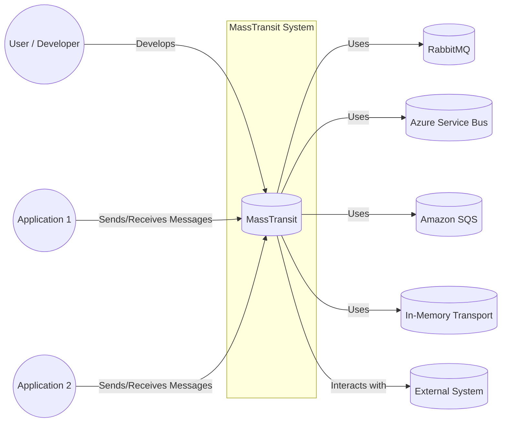
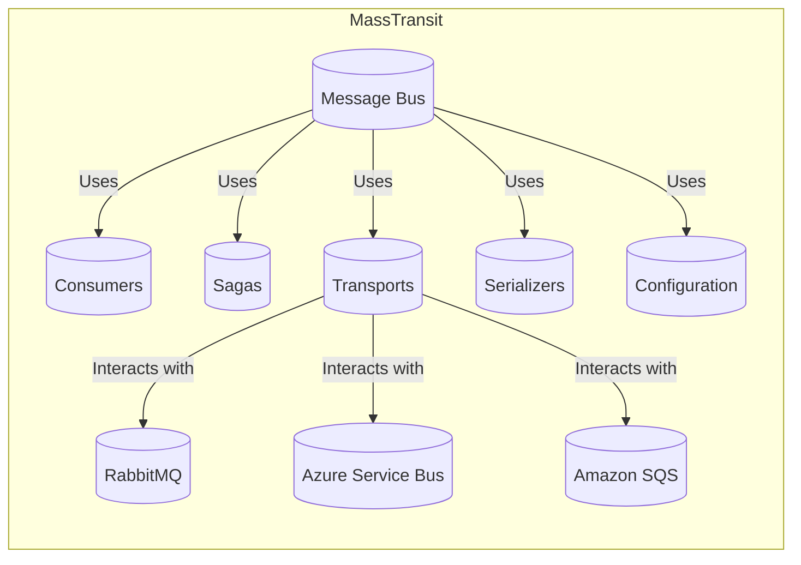
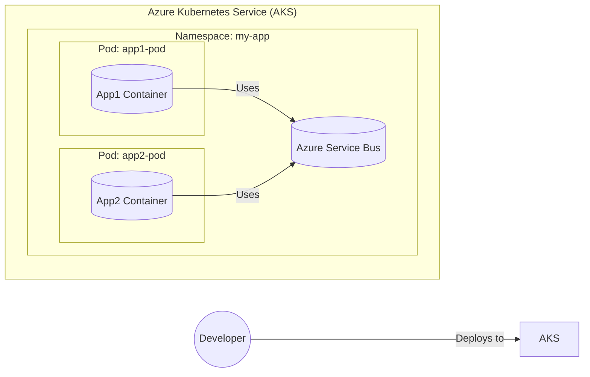
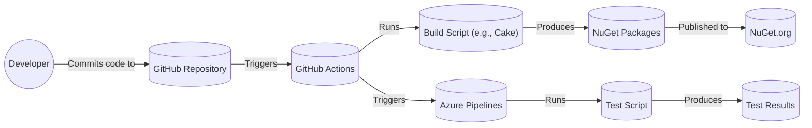

Okay, let's create a design document for the MassTransit project, focusing on aspects relevant for threat modeling.

# BUSINESS POSTURE

MassTransit is an open-source distributed application framework for .NET.  It simplifies building message-based, loosely coupled applications.  The business priorities and goals can be inferred as follows:

*   Enable developers to build reliable and scalable distributed systems using the .NET ecosystem.
*   Provide a consistent and easy-to-use abstraction over various message brokers (RabbitMQ, Azure Service Bus, Amazon SQS, etc.).
*   Foster a strong community and ecosystem around the project.
*   Reduce the complexity and boilerplate code associated with message-based architectures.
*   Offer a production-ready solution suitable for enterprise applications.

Based on these, the most important business risks are:

*   Security vulnerabilities in MassTransit itself could compromise applications built upon it, leading to data breaches, service disruptions, or reputational damage.
*   Incorrect usage of MassTransit by developers (due to lack of understanding or documentation gaps) could lead to application instability, message loss, or security weaknesses.
*   Lack of support for new message broker technologies or evolving .NET features could limit the project's adoption and long-term viability.
*   Performance bottlenecks in MassTransit could impact the scalability and responsiveness of applications built with it.
*   Inadequate error handling and resilience mechanisms could lead to application failures in production environments.

# SECURITY POSTURE

MassTransit, as a framework, provides building blocks and relies on underlying message brokers for many security features.  Here's a breakdown:

*   security control: Transport Layer Security (TLS): MassTransit supports TLS for secure communication with message brokers. This is configured at the transport level (e.g., RabbitMQ, Azure Service Bus). Where it's implemented: Transport configuration.
*   security control: Message Encryption: MassTransit provides message encryption capabilities, allowing sensitive data to be encrypted at rest and in transit. Where it's implemented: Configurable via `IEncryptionConfigurator`.
*   security control: Message Serialization: MassTransit uses serializers (like JSON, XML, BSON) to convert messages to byte streams. Secure serializers should be chosen to prevent injection vulnerabilities. Where it's implemented: Configurable via `ISerializerConfigurator`.
*   security control: Authentication and Authorization: MassTransit leverages the authentication and authorization mechanisms provided by the underlying message broker. For example, with RabbitMQ, this would involve configuring users, virtual hosts, and permissions. Where it's implemented: Message broker configuration.
*   security control: Retry Policies and Dead-Letter Queues: MassTransit provides built-in mechanisms for handling message processing failures, including retry policies and dead-letter queues. This helps prevent message loss and improve application resilience. Where it's implemented: Configurable via `IRetryConfigurator` and endpoint configuration.
*   security control: Input Validation: While MassTransit itself doesn't perform direct input validation on message content, it encourages developers to implement validation logic within their message consumers. Where it's implemented: Consumer code.
*   security control: Auditing: MassTransit can be integrated with logging frameworks (like Serilog, NLog) to provide audit trails of message processing activities. Where it's implemented: Logging configuration and integration.
*   accepted risk: Developers are responsible for implementing appropriate security measures within their message consumers, including input validation, data sanitization, and access control.
*   accepted risk: The security of the overall system depends heavily on the secure configuration and management of the underlying message broker.
*   accepted risk: Supply chain security of MassTransit dependencies is a concern, as vulnerabilities in third-party libraries could impact the framework.

Recommended Security Controls (High Priority):

*   security control: Implement a comprehensive security review process for all code changes to MassTransit, including static analysis, dynamic analysis, and manual code review.
*   security control: Provide clear and detailed security documentation for developers, covering topics such as secure configuration, message encryption, authentication, authorization, and input validation.
*   security control: Offer security hardening guides for different deployment scenarios (e.g., cloud, on-premises).
*   security control: Establish a vulnerability disclosure program to encourage responsible reporting of security issues.
*   security control: Regularly audit and update dependencies to mitigate supply chain risks.
*   security control: Integrate with security scanning tools to automatically detect vulnerabilities in the codebase and dependencies.

Security Requirements:

*   Authentication:
    *   Applications using MassTransit must authenticate with the message broker using secure credentials.
    *   Support for multi-factor authentication should be considered where appropriate.
    *   Credentials should be stored securely and never hardcoded.

*   Authorization:
    *   Access to message queues and topics should be restricted based on the principle of least privilege.
    *   Consumers should only be able to access messages they are authorized to process.
    *   Producers should only be able to publish messages to authorized destinations.

*   Input Validation:
    *   Message consumers must validate the structure and content of incoming messages before processing them.
    *   Validation should be based on a predefined schema or set of rules.
    *   Invalid messages should be rejected or handled appropriately (e.g., logged, sent to a dead-letter queue).

*   Cryptography:
    *   Sensitive data within messages should be encrypted at rest and in transit.
    *   Strong encryption algorithms and key management practices should be used.
    *   Consider using digital signatures to ensure message integrity and authenticity.

# DESIGN

## C4 CONTEXT

Element Descriptions:

*   Element:
    *   Name: User / Developer
    *   Type: Person
    *   Description: Developers who build applications using the MassTransit framework.
    *   Responsibilities: Writing code, configuring MassTransit, defining message contracts, implementing consumers.
    *   Security controls: Follow secure coding practices, use strong passwords, adhere to organizational security policies.

*   Element:
    *   Name: MassTransit
    *   Type: Software System
    *   Description: The core MassTransit framework, providing abstractions for message-based communication.
    *   Responsibilities: Managing message routing, serialization, deserialization, error handling, and transport interactions.
    *   Security controls: TLS, message encryption, integration with message broker authentication/authorization.

*   Element:
    *   Name: RabbitMQ
    *   Type: Message Broker
    *   Description: One of the supported message brokers (others include Azure Service Bus, Amazon SQS, etc.).
    *   Responsibilities: Storing and forwarding messages, managing queues and exchanges.
    *   Security controls: TLS, access control lists (ACLs), user authentication, virtual host isolation.

*   Element:
    *   Name: Azure Service Bus
    *   Type: Message Broker
    *   Description: Microsoft Azure's cloud-based message broker.
    *   Responsibilities: Storing and forwarding messages, managing queues and topics.
    *   Security controls: TLS, Shared Access Signatures (SAS), Azure Active Directory integration.

*   Element:
    *   Name: Amazon SQS
    *   Type: Message Broker
    *   Description: Amazon's Simple Queue Service.
    *   Responsibilities: Storing and forwarding messages, managing queues.
    *   Security controls: TLS, IAM roles and policies, server-side encryption.

*   Element:
    *   Name: InMemory Transport
    *   Type: Message Broker
    *   Description: An in-memory transport for testing and development purposes.
    *   Responsibilities: Simulating message sending and receiving within a single process.
    *   Security controls: Not intended for production use; security relies on the application's process security.

*   Element:
    *   Name: Application 1
    *   Type: Software System
    *   Description: An application built using MassTransit that sends and/or receives messages.
    *   Responsibilities: Implementing business logic, processing messages.
    *   Security controls: Input validation, output encoding, authentication, authorization, secure coding practices.

*   Element:
    *   Name: Application 2
    *   Type: Software System
    *   Description: Another application built using MassTransit.
    *   Responsibilities: Implementing business logic, processing messages.
    *   Security controls: Input validation, output encoding, authentication, authorization, secure coding practices.

*   Element:
    *   Name: External System
    *   Type: Software System
    *   Description: Any external system that interacts with applications built using MassTransit.
    *   Responsibilities: Varies depending on the specific system.
    *   Security controls: Depends on the external system; should be assessed and secured appropriately.

## C4 CONTAINER

Element Descriptions:

*   Element:
    *   Name: Message Bus
    *   Type: Container
    *   Description: The central component of MassTransit, responsible for routing messages.
    *   Responsibilities: Receiving messages, routing messages to consumers, managing subscriptions.
    *   Security controls: Relies on transport-level security and message encryption.

*   Element:
    *   Name: Consumers
    *   Type: Container
    *   Description: Components that handle incoming messages.
    *   Responsibilities: Processing messages, executing business logic.
    *   Security controls: Input validation, data sanitization, access control.

*   Element:
    *   Name: Sagas
    *   Type: Container
    *   Description: Components that manage long-running, stateful conversations.
    *   Responsibilities: Orchestrating message flows, maintaining state.
    *   Security controls: Secure state management, access control, input validation.

*   Element:
    *   Name: Transports
    *   Type: Container
    *   Description: Abstractions for interacting with different message brokers.
    *   Responsibilities: Sending and receiving messages, managing connections.
    *   Security controls: TLS, authentication with message brokers.

*   Element:
    *   Name: Serializers
    *   Type: Container
    *   Description: Components that serialize and deserialize messages.
    *   Responsibilities: Converting messages to/from byte streams.
    *   Security controls: Use secure serializers (e.g., avoid vulnerable serializers like BinaryFormatter).

*   Element:
    *   Name: Configuration
    *   Type: Container
    *   Description: Settings and options for configuring MassTransit.
    *   Responsibilities: Defining endpoints, transports, serializers, retry policies, etc.
    *   Security controls: Secure storage of sensitive configuration data (e.g., connection strings).

*   Element:
    *   Name: RabbitMQ, Azure Service Bus, Amazon SQS
    *   Type: External Systems (Message Brokers)
    *   Description:  (Same as in the Context diagram)
    *   Responsibilities: (Same as in the Context diagram)
    *   Security controls: (Same as in the Context diagram)

## DEPLOYMENT

Possible Deployment Solutions:

1.  **Cloud-Based (Azure, AWS, GCP):** Deploy applications using MassTransit to cloud platforms like Azure, AWS, or GCP. Utilize managed message broker services (Azure Service Bus, Amazon SQS, Google Cloud Pub/Sub).
2.  **On-Premises:** Deploy applications to on-premises servers, using a message broker like RabbitMQ or ActiveMQ.
3.  **Hybrid:** Combine cloud and on-premises deployments, using a message broker that supports hybrid scenarios.
4.  **Containers (Docker, Kubernetes):** Containerize applications and deploy them using Docker and Kubernetes. This approach can be used in both cloud and on-premises environments.

Chosen Solution (for detailed description): **Containers (Docker, Kubernetes) on Azure**

Element Descriptions:

*   Element:
    *   Name: Developer
    *   Type: Person
    *   Description: The developer deploying the application.
    *   Responsibilities: Building and deploying the application.
    *   Security controls: Secure coding practices, strong authentication, access control to deployment resources.

*   Element:
    *   Name: Azure Kubernetes Service (AKS)
    *   Type: Infrastructure
    *   Description: Managed Kubernetes service on Azure.
    *   Responsibilities: Orchestrating container deployments, managing resources.
    *   Security controls: Network security groups, role-based access control (RBAC), pod security policies.

*   Element:
    *   Name: Namespace: my-app
    *   Type: Logical Isolation
    *   Description: A Kubernetes namespace for isolating the application's resources.
    *   Responsibilities: Providing a scope for names and resources.
    *   Security controls: Network policies, resource quotas.

*   Element:
    *   Name: Pod: app1-pod
    *   Type: Kubernetes Pod
    *   Description: A pod running the App1 container.
    *   Responsibilities: Running the application code.
    *   Security controls: Pod security context, resource limits.

*   Element:
    *   Name: App1 Container
    *   Type: Docker Container
    *   Description: The containerized application (App1) using MassTransit.
    *   Responsibilities: Running the application code, interacting with Azure Service Bus.
    *   Security controls: Secure base image, minimal privileges, vulnerability scanning.

*   Element:
    *   Name: Pod: app2-pod
    *   Type: Kubernetes Pod
    *   Description: A pod running the App2 container.
    *   Responsibilities: Running the application code.
    *   Security controls: Pod security context, resource limits.

*   Element:
    *   Name: App2 Container
    *   Type: Docker Container
    *   Description: The containerized application (App2) using MassTransit.
    *   Responsibilities: Running the application code, interacting with Azure Service Bus.
    *   Security controls: Secure base image, minimal privileges, vulnerability scanning.

*   Element:
    *   Name: Azure Service Bus
    *   Type: External Service (Message Broker)
    *   Description:  (Same as in the Context diagram)
    *   Responsibilities: (Same as in the Context diagram)
    *   Security controls: (Same as in the Context diagram)

## BUILD

The MassTransit project uses a combination of GitHub Actions and Azure Pipelines for its build and release process.

Security Controls in the Build Process:

*   security control: Source Code Management (GitHub): All code changes are tracked in a Git repository on GitHub, providing version control and auditability.
*   security control: Build Automation (GitHub Actions, Azure Pipelines): The build process is automated using CI/CD pipelines, ensuring consistency and reducing manual errors.
*   security control: Static Analysis (SAST): The build process likely includes static analysis tools to identify potential security vulnerabilities in the code. This is not explicitly mentioned in the repository's readily available documentation, but it's a standard practice for mature projects.
*   security control: Dependency Scanning: The build process should include dependency scanning to identify known vulnerabilities in third-party libraries.  Again, this is a standard practice and likely implemented, though not explicitly documented in the top-level README.
*   security control: Code Signing: NuGet packages should be signed to ensure their integrity and authenticity. This is a standard practice for publishing to NuGet.org.
*   security control: Automated Testing: The build process includes automated tests (unit tests, integration tests) to verify the functionality and security of the code.
*   security control: Branch Protection Rules (GitHub): Branch protection rules can be configured on GitHub to enforce code review requirements and prevent unauthorized merges.

# RISK ASSESSMENT

*   Critical Business Processes:
    *   Reliable message delivery and processing between distributed application components.
    *   Maintaining the integrity and confidentiality of data transmitted through messages.
    *   Ensuring the availability and scalability of applications built using MassTransit.

*   Data Sensitivity:
    *   The sensitivity of data handled by MassTransit depends entirely on the applications using it. MassTransit itself is a framework and doesn't inherently handle specific data.
    *   Applications may transmit Personally Identifiable Information (PII), financial data, health information, or other sensitive data. The sensitivity level of this data must be determined by the application developers and appropriate security measures implemented.
    *   MassTransit configuration data (e.g., connection strings to message brokers) is highly sensitive and must be protected.

# QUESTIONS & ASSUMPTIONS

*   Questions:
    *   What specific static analysis and dependency scanning tools are used in the MassTransit build process?
    *   Are there any specific security hardening guidelines or recommendations for deploying MassTransit in production environments?
    *   What is the process for reporting and addressing security vulnerabilities in MassTransit?
    *   Are there any plans to support additional message brokers or transport protocols?
    *   What level of support is provided for different versions of .NET?
    *   What is the long-term roadmap for MassTransit development?
    *   Is there a dedicated security team or point of contact for security-related inquiries?
    *   Are there any performance benchmarks or guidelines available for MassTransit?
    *   What mechanisms are in place to prevent message replay attacks?
    *   How are secrets (like API keys or connection strings) managed in different deployment scenarios?

*   Assumptions:
    *   BUSINESS POSTURE: The MassTransit project prioritizes security and follows industry best practices for secure software development.
    *   SECURITY POSTURE: Developers using MassTransit are responsible for implementing appropriate security measures within their applications. The underlying message broker is securely configured and managed.
    *   DESIGN: The build process includes security checks (SAST, dependency scanning) and automated testing. NuGet packages are signed. The deployment environment (e.g., Kubernetes cluster) is securely configured.