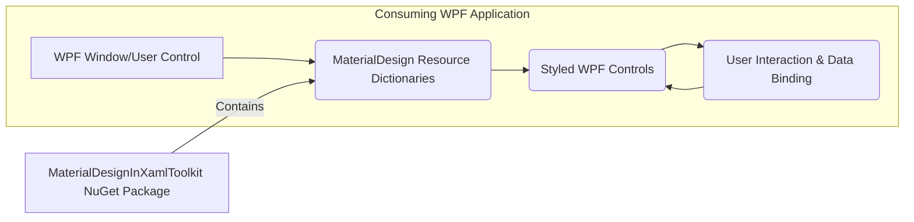
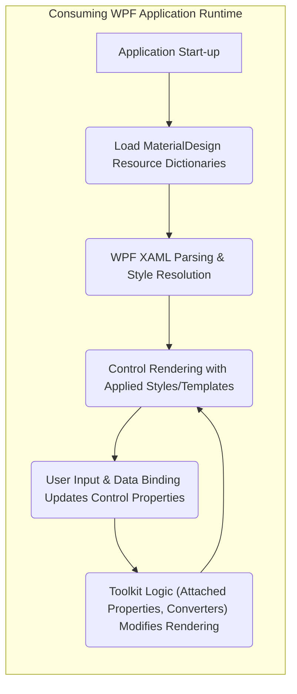

## Project Design Document: MaterialDesignInXamlToolkit (Improved)

**1. Introduction**

This document provides an enhanced design overview of the MaterialDesignInXamlToolkit, an open-source toolkit designed to facilitate the creation of modern user interfaces in Windows Presentation Foundation (WPF) applications, adhering to the principles of Google's Material Design. This detailed design serves as a critical input for subsequent threat modeling activities, enabling a comprehensive assessment of potential security risks.

**2. Goals and Objectives**

*   To offer a comprehensive and well-structured library of UI controls and styles that strictly adhere to the Material Design specification.
*   To empower developers to effortlessly construct visually appealing, consistent, and user-friendly WPF applications with minimal effort.
*   To provide a high degree of customization and flexible theming capabilities, allowing for adaptation to specific application branding.
*   To maintain seamless compatibility with standard WPF development methodologies and best practices.
*   To cultivate a thriving and supportive open-source community around the toolkit, encouraging contributions and feedback.

**3. Scope**

This design document comprehensively covers the essential components and functionalities of the MaterialDesignInXamlToolkit, specifically focusing on aspects relevant to security considerations. This includes:

*   The core library encompassing fundamental styles, control templates, attached properties, and utility classes.
*   The intricate workings of the theming engine and its various customization options.
*   The interaction points and data flow between the toolkit and consuming WPF applications at runtime.
*   Key extension points and mechanisms for customizing the toolkit's behavior and appearance.

This document explicitly excludes:

*   Fine-grained implementation details of individual controls' internal logic.
*   The inherent functionalities and security mechanisms of the underlying WPF framework itself.
*   The intricacies of the open-source project's development lifecycle, contribution guidelines, and issue tracking.
*   Specific code examples, usage scenarios, or detailed architecture of demonstration applications included within the repository.

**4. Architecture Overview**

The MaterialDesignInXamlToolkit functions as a curated collection of XAML resources (including styles, templates, and attached properties) and associated C# code-behind (primarily view models, converters, and helper classes). It's designed to be integrated into and operate within the context of a consuming WPF application, enhancing the appearance and behavior of standard WPF controls.

The high-level architecture can be represented as follows:

*   **"Consuming WPF Application"**: Represents the target application where the toolkit is integrated to provide Material Design styling and controls.
*   **"WPF Window/User Control"**:  The fundamental building blocks of the WPF application's user interface, which will utilize the toolkit's resources.
*   **"MaterialDesign Resource Dictionaries"**: A set of XAML files containing pre-defined styles, control templates, themes, and other resources that define the Material Design aesthetic. These are typically merged into the application's resource hierarchy.
*   **"Styled WPF Controls"**: Standard WPF controls (e.g., `Button`, `TextBox`, `ComboBox`) whose default appearance and behavior are modified or extended by the styles and templates provided by the toolkit.
*   **"User Interaction & Data Binding"**: Represents user actions within the consuming application interacting with the styled controls, as well as the flow of data between the application's data model and the UI.
*   **"MaterialDesignInXamlToolkit NuGet Package"**: The primary distribution mechanism for the toolkit, containing all necessary resource dictionaries, compiled assemblies, and other assets.

**5. Component Breakdown**

The MaterialDesignInXamlToolkit comprises several key components working in concert:

*   **Core Library (Compiled Assembly):**
    *   **Styles:** XAML definitions that dictate the visual appearance of controls, including colors, fonts, and spacing. These are applied implicitly or explicitly to WPF controls.
    *   **Control Templates:** XAML structures that redefine the visual composition and structure of WPF controls, allowing for significant customization of their look and feel.
    *   **Attached Properties:** Static properties that can be attached to existing WPF elements to extend their functionality or appearance, often used for applying Material Design specific behaviors.
    *   **Value Converters:** Classes that transform data for display purposes, ensuring data is presented according to Material Design principles (e.g., formatting text, converting boolean values to visibility).
    *   **Markup Extensions:** Classes that provide a way to extend XAML syntax, often used for simplifying the application of styles or accessing theme resources.
    *   **Helper Classes and Utilities:** C# classes providing utility functions for tasks like color manipulation, theme management, and animation.
*   **Themes (Resource Dictionaries):**
    *   **Color Palettes:** Predefined sets of primary and accent colors that define the overall visual theme of the application.
    *   **Base Theme Definitions:** Resource dictionaries that establish the foundational styles and values for common UI elements.
    *   **Theme Switching Logic:** Mechanisms (often through attached properties or helper classes) that allow developers to switch between different themes (e.g., light and dark mode).
*   **Custom Controls (Compiled Assembly):**
    *   Specific controls built from scratch to implement unique Material Design components not readily available in standard WPF (e.g., `Card`, `Snackbar`, `DialogHost`, `NavigationDrawer`).
    *   These controls often have their own dedicated view models and logic to manage their state and behavior.
*   **Icon Integration (Resource Dictionaries/Fonts):**
    *   Integration with icon packs (typically Material Design Icons) through font glyphs or vector graphics.
    *   Styles and helper classes that facilitate the easy use of these icons within the application.
*   **Demo Application (Source Code):**
    *   A separate WPF application within the repository that showcases the toolkit's features and provides usage examples. While not a deployed component, it's crucial for understanding the toolkit's capabilities.

**6. Data Flow**

The primary data flow relevant to the toolkit occurs within a consuming WPF application during runtime, specifically when the toolkit's resources are applied and interacted with.

*   **"Application Start-up"**: The WPF application begins its execution lifecycle.
*   **"Load MaterialDesign Resource Dictionaries"**: The WPF application loads the resource dictionaries provided by the MaterialDesignInXamlToolkit. This typically happens during application initialization, often defined in `App.xaml`.
*   **"WPF XAML Parsing & Style Resolution"**: The WPF rendering engine parses the XAML for windows and controls. It identifies controls and resolves applicable styles and templates based on type, key, and resource dictionary precedence. The MaterialDesign resources are considered during this resolution process.
*   **"Control Rendering with Applied Styles/Templates"**: WPF renders the visual representation of the controls on the screen, utilizing the styles and templates provided by the MaterialDesignInXamlToolkit. This determines the control's appearance, layout, and any defined animations.
*   **"User Input & Data Binding Updates Control Properties"**: User interactions (e.g., clicking a button, typing in a text box) and data binding mechanisms update the properties of the WPF controls.
*   **"Toolkit Logic (Attached Properties, Converters) Modifies Rendering"**:  Attached properties and value converters provided by the toolkit react to property changes or are involved in the rendering pipeline. For example, an attached property might trigger a ripple effect on a button click, or a converter might format text displayed in a `TextBlock`. This logic influences how the control is visually presented based on its state and data.

**7. Technology Stack**

*   **Primary Programming Language:** C#
*   **Target Framework:** .NET Framework (primarily targeting WPF - Windows Presentation Foundation)
*   **User Interface Markup Language:** XAML (Extensible Application Markup Language)
*   **Package Management and Distribution:** NuGet (for distributing the toolkit as a library)
*   **Iconography Standard:** Primarily integrates with Material Design Icons (often implemented as a font or SVG resources)
*   **Build Automation:** Typically utilizes MSBuild or a similar .NET build system.

**8. Deployment Model**

The MaterialDesignInXamlToolkit is deployed and integrated into consuming WPF applications via the following process:

*   **NuGet Package Distribution:** The toolkit is packaged and published as a NuGet package to a NuGet feed (e.g., nuget.org).
*   **Package Installation:** Developers add a reference to the `MaterialDesignThemes` NuGet package to their WPF project using the Visual Studio NuGet Package Manager or the .NET CLI.
*   **Resource Dictionary Merging:**  Developers typically merge the toolkit's resource dictionaries (e.g., `MaterialDesignThemes.xaml`, `MaterialDesignControls.xaml`) into their application's resource hierarchy. This is commonly done in the `App.xaml` file or within specific window or user control resources.
*   **Control Usage:** Once the resources are merged, developers can utilize the styled standard WPF controls or the toolkit's custom controls within their XAML markup.

**9. Security Considerations (Detailed)**

Considering the architecture and components, here are potential security considerations relevant for threat modeling:

*   **Dependency Vulnerabilities:**
    *   The toolkit relies on the .NET Framework and potentially other NuGet packages. Vulnerabilities in these dependencies could indirectly affect applications using the toolkit.
    *   Regularly updating the toolkit and its dependencies is crucial to mitigate known vulnerabilities.
*   **Maliciously Crafted Styles/Templates:**
    *   While less likely in the official toolkit, if a developer were to introduce custom styles or templates without proper scrutiny, these could potentially contain malicious code (e.g., event handlers that perform unintended actions).
    *   Care should be taken when incorporating styles or templates from untrusted sources.
*   **XAML Injection:**
    *   If an application dynamically generates XAML that incorporates user-provided data and then uses this XAML to render UI elements styled by the toolkit, there's a risk of XAML injection. Attackers could inject malicious XAML that could lead to unexpected behavior or information disclosure.
    *   Input validation and sanitization are essential when dynamically generating XAML.
*   **Resource Exhaustion:**
    *   Complex animations or overly intricate styles could potentially lead to excessive resource consumption (CPU, memory), causing performance issues or denial-of-service conditions on the client machine.
    *   Careful design and testing of styles and animations are necessary.
*   **Custom Control Vulnerabilities:**
    *   The custom controls provided by the toolkit (e.g., `DialogHost`) have their own code-behind logic. Vulnerabilities in this code (e.g., input validation issues, insecure data handling) could be exploited.
    *   Thorough code reviews and security testing of custom controls are important.
*   **Theming Issues:**
    *   While primarily visual, vulnerabilities could theoretically exist in the theming engine if it allowed for arbitrary code execution or access to sensitive information during theme application. This is less likely but should be considered.
*   **Data Binding Exploits:**
    *   If data binding is used in conjunction with toolkit controls in an insecure manner (e.g., binding directly to sensitive data without proper sanitization for display), it could lead to information disclosure.
    *   Follow secure data binding practices.
*   **Icon Font/SVG Vulnerabilities:**
    *   While less common, vulnerabilities could exist in the rendering of icon fonts or SVG images if they are not handled correctly by the underlying WPF framework. Ensure the icon resources are from trusted sources.

This improved design document provides a more detailed and security-conscious overview of the MaterialDesignInXamlToolkit, serving as a more robust foundation for subsequent threat modeling activities.