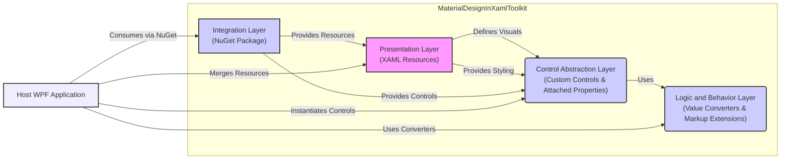
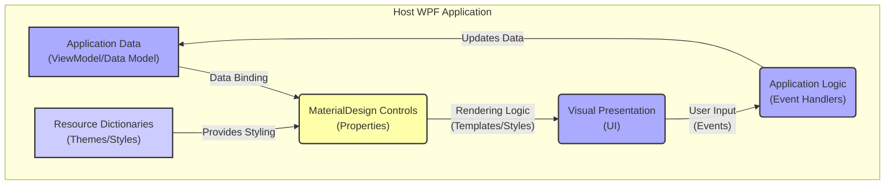

## Project Design Document: MaterialDesignInXamlToolkit (Improved)

**1. Introduction**

This document provides an enhanced and detailed design overview of the MaterialDesignInXamlToolkit project, accessible at [https://github.com/materialdesigninxaml/materialdesigninxamltoolkit](https://github.com/materialdesigninxaml/materialdesigninxamltoolkit). This revised document is specifically tailored to facilitate comprehensive threat modeling activities. It elaborates on the key components, architectural layers, data flow pathways, and critical dependencies of the toolkit. The intended audience includes security engineers, software architects, developers integrating the toolkit, and anyone responsible for evaluating the security implications of its use.

**2. Project Overview**

The MaterialDesignInXamlToolkit is a mature, open-source UI toolkit designed for building visually consistent and modern desktop applications using the Windows Presentation Foundation (WPF) framework. It offers a rich set of pre-built, customizable controls, comprehensive styling resources, and theming capabilities aligned with Google's Material Design guidelines. The primary goal of the toolkit is to abstract away the complexities of implementing Material Design in WPF, enabling developers to focus on application logic and user experience.

**3. System Architecture**

The toolkit's architecture is structured around distinct layers and components that interact to provide its functionality. Understanding these layers is crucial for identifying potential threat vectors.

*   **Presentation Layer (XAML Resources):** This layer defines the visual appearance and behavior of the toolkit's elements.
    *   **Themes:**  Collections of styles and resources defining the overall visual theme (e.g., light, dark).
    *   **Styles:**  Reusable definitions for the visual properties of controls and other UI elements.
    *   **Control Templates:**  Define the structure and visual representation of controls.
    *   **Resource Dictionaries:**  Containers for styles, templates, brushes, and other resources, merged into the host application.
*   **Control Abstraction Layer (Custom Controls & Attached Properties):** This layer provides the functional building blocks and extensions to standard WPF controls.
    *   **Custom Controls:**  New WPF controls built from scratch, implementing Material Design principles (e.g., `Button`, `TextField`, `Snackbar`).
    *   **Attached Properties:**  Static properties that can be attached to existing WPF elements to modify their behavior or appearance (e.g., ripple effect, elevation).
*   **Logic and Behavior Layer (Value Converters & Markup Extensions):** This layer handles data transformation and simplifies XAML usage.
    *   **Value Converters:**  Classes that transform data for display purposes (e.g., converting boolean to visibility).
    *   **Markup Extensions:**  Provide a shorthand way to reference resources or perform logic within XAML (e.g., accessing theme colors).
*   **Integration Layer (NuGet Package & Host Application Interaction):** This layer defines how the toolkit is integrated and interacts with the consuming WPF application.

**3.1. Detailed Component Breakdown**

*   **Themes & Styles:**
    *   **Base Theme:** Provides fundamental styling for all controls.
    *   **Color Schemes:** Defines primary, secondary, and accent color palettes.
    *   **Typography Styles:**  Sets font families, sizes, and styles for text elements.
    *   **Control-Specific Styles:**  Tailored styles for individual controls, inheriting from base styles.
    *   **Theme Switching Logic:** Mechanisms to dynamically change the application's theme.
*   **Controls:**
    *   **Input Controls:**  `TextBox`, `ComboBox`, `CheckBox`, `RadioButton`, `Slider`, etc.
    *   **Navigation Controls:** `NavigationDrawer`, `TabControl`, `Menu`.
    *   **Display Controls:** `Card`, `Chip`, `Snackbar`, `DialogHost`.
    *   **Button Controls:**  Various button styles (e.g., flat, raised, icon).
    *   **Layout Controls:**  Helpers for arranging UI elements.
*   **Attached Properties:**
    *   `ShadowElevation`:  Adds shadow effects to elements.
    *   `HintAssist`:  Provides hint text functionality for input controls.
    *   `RippleAssist`:  Enables ripple click effects.
    *   Properties for styling specific aspects of standard WPF controls.
*   **Value Converters:**
    *   `BooleanToVisibilityConverter`: Converts boolean values to `Visibility` enum values.
    *   `ColorToBrushConverter`: Converts color values to brush objects.
    *   Converters for formatting text or manipulating data for display.
*   **Resource Dictionaries:**
    *   `MaterialDesignTheme.xaml`:  Main theme dictionary.
    *   `MaterialDesignControls.xaml`:  Styles and templates for custom controls.
    *   `MaterialDesignColor.xaml`:  Defines color palettes.
    *   Dictionaries for specific control groups or features.
*   **Markup Extensions:**
    *   `StaticResource`:  Accesses statically defined resources.
    *   `DynamicResource`:  Accesses resources that can change at runtime.
    *   Custom markup extensions for simplifying toolkit usage.
*   **Demo Application:**
    *   Showcases the toolkit's features and provides usage examples.
    *   Includes various demos of different controls and styling options.

**3.2. Integration Points (Detailed)**

*   **NuGet Package (`MaterialDesignThemes`):**  Contains compiled assemblies (`.dll` files), XAML resource dictionaries, and other necessary files.
*   **XAML Namespace Declaration:** Developers declare a XAML namespace to access the toolkit's controls and resources (e.g., `xmlns:materialDesign="http://materialdesigninxaml.net/winfx/xaml/themes"`).
*   **Resource Dictionary Merging (App.xaml or Window/Control Level):**  Toolkit resource dictionaries are merged into the application's resource hierarchy, making the styles and templates available.
*   **Control Instantiation in XAML:** Developers instantiate and configure toolkit controls directly in their XAML markup.
*   **Property Binding:**  Standard WPF data binding is used to connect application data to the properties of toolkit controls.
*   **Event Handling:**  Developers handle events raised by toolkit controls in their code-behind.

**4. Data Flow (Enhanced)**

The data flow within an application utilizing the MaterialDesignInXamlToolkit involves the movement of data between the application's logic, the toolkit's controls, and the user interface.

*   **Application Data (ViewModel/Data Model):**  The source of truth for the application's state and information.
*   **Data Binding:**  Connects properties in the ViewModel to properties of Material Design controls. Changes in the ViewModel are reflected in the UI, and vice-versa (depending on binding mode).
*   **MaterialDesign Controls (Properties):**  The toolkit's controls hold and manage the data being displayed or interacted with.
*   **Rendering Logic (Templates/Styles):**  The visual representation of the controls is determined by their templates and styles, often defined in the toolkit's resource dictionaries.
*   **Visual Presentation (UI):**  The rendered user interface displayed to the user.
*   **User Input (Events):**  User interactions (e.g., clicks, keystrokes) trigger events on the controls.
*   **Application Logic (Event Handlers):**  Code-behind logic that responds to user input and updates the application's data.
*   **Resource Dictionaries (Themes/Styles):**  Provide the visual definitions that influence how data is presented.

**5. Security Considerations (Detailed for Threat Modeling)**

This section expands on potential security concerns, providing more specific examples and considerations for threat modeling.

*   **XAML Injection Vulnerabilities:**
    *   **Threat:** If user-provided input is directly embedded into XAML markup (e.g., through string formatting), it could allow an attacker to inject malicious XAML, potentially leading to code execution or UI manipulation.
    *   **Mitigation:**  Avoid dynamic XAML generation with user input. Sanitize user input if it must be used in XAML. Utilize data binding instead of string concatenation for displaying user-provided data.
*   **Resource Loading and Manipulation:**
    *   **Threat:**  If the toolkit attempts to load resources from untrusted sources or if an attacker can manipulate the resource loading process, it could lead to the loading of malicious resources (e.g., custom control templates with embedded malicious code).
    *   **Mitigation:** Ensure resource loading is restricted to trusted locations. Verify the integrity of loaded resources. Be cautious about dynamically loading themes or styles from external sources.
*   **Dependency Chain Vulnerabilities:**
    *   **Threat:**  The toolkit relies on other NuGet packages. Vulnerabilities in these dependencies could be exploited by attackers.
    *   **Mitigation:** Regularly update dependencies to their latest secure versions. Conduct Software Composition Analysis (SCA) to identify known vulnerabilities in dependencies.
*   **Custom Control Logic Flaws:**
    *   **Threat:**  Bugs or vulnerabilities in the custom code of the toolkit's controls could be exploited (e.g., input validation issues, buffer overflows, insecure state management).
    *   **Mitigation:**  Conduct thorough code reviews and security testing of the toolkit's source code. Follow secure coding practices.
*   **Denial of Service (DoS) through Resource Exhaustion:**
    *   **Threat:**  Maliciously crafted styles or templates could consume excessive resources (e.g., complex animations, deeply nested layouts), leading to application slowdown or crashes.
    *   **Mitigation:**  Implement limits on resource consumption. Review complex styles and templates for potential performance issues.
*   **Information Disclosure through Default Styles:**
    *   **Threat:**  Default styles or templates might inadvertently expose sensitive information (e.g., internal paths, configuration details).
    *   **Mitigation:**  Review default styles and templates to ensure they do not reveal sensitive information.
*   **UI Redressing/Clickjacking (Less likely but possible):**
    *   **Threat:**  While less direct, vulnerabilities in how the toolkit renders certain elements could potentially be exploited for UI redressing attacks if combined with vulnerabilities in the host application.
    *   **Mitigation:**  Follow general best practices for preventing clickjacking in web contexts, even though WPF is a desktop framework.

**6. Dependencies (Detailed)**

The MaterialDesignInXamlToolkit relies on a set of specific NuGet packages to function correctly. These dependencies should be carefully considered during security assessments.

*   **Primary Dependencies:**
    *   `ControlzEx`: Provides extended functionality and theming capabilities for WPF controls.
    *   `ShowMeTheXAML`:  A utility for displaying the XAML of visual elements at runtime (primarily for development/debugging).
    *   `XamlAnimatedGif`:  Allows the display of animated GIFs in WPF applications.
*   **Transitive Dependencies:**  The primary dependencies may themselves have further dependencies. A full dependency tree should be analyzed for potential vulnerabilities.
*   **.NET Framework/ .NET SDK:** The underlying framework is a critical dependency. Ensure the target framework version is up-to-date with security patches.

**7. Deployment (Elaborated)**

The deployment process involves integrating the toolkit into a WPF application project.

*   **NuGet Package Manager:** The most common method is using the NuGet Package Manager within Visual Studio to install the `MaterialDesignThemes` package.
*   **Package References (`PackageReference` in `.csproj`):**  The NuGet package installation adds references to the toolkit's assemblies in the project's `.csproj` file.
*   **Resource Dictionary Merging (Manual or Automatic):**
    *   **Manual:** Developers manually add `<ResourceDictionary>` elements to their `App.xaml` (or window/control resources) to merge the toolkit's resource dictionaries.
    *   **Automatic (Implicit Styling):** In some cases, the toolkit might implicitly apply styles based on its presence in the application's dependency graph.
*   **Assembly Deployment:** The toolkit's `.dll` files are deployed alongside the host application's executable.

**8. Future Considerations (Security Perspective)**

From a security standpoint, future development of the toolkit should consider:

*   **Regular Security Audits:**  Periodic security reviews and penetration testing of the toolkit's codebase.
*   **Static Analysis Integration:**  Incorporating static analysis tools into the development pipeline to identify potential vulnerabilities early.
*   **Input Sanitization Best Practices:**  Enforcing stricter input validation and sanitization within the toolkit's controls.
*   **Secure Defaults:**  Ensuring that default configurations and settings are secure.
*   **Clear Documentation on Security Considerations:**  Providing developers with clear guidance on how to use the toolkit securely and avoid common pitfalls.
*   **Community Engagement for Security:**  Encouraging security researchers to report vulnerabilities through a responsible disclosure process.

This improved design document provides a more detailed and security-focused overview of the MaterialDesignInXamlToolkit. The enhanced descriptions of components, data flow, and dependencies, along with the expanded security considerations, should provide a solid foundation for effective threat modeling.