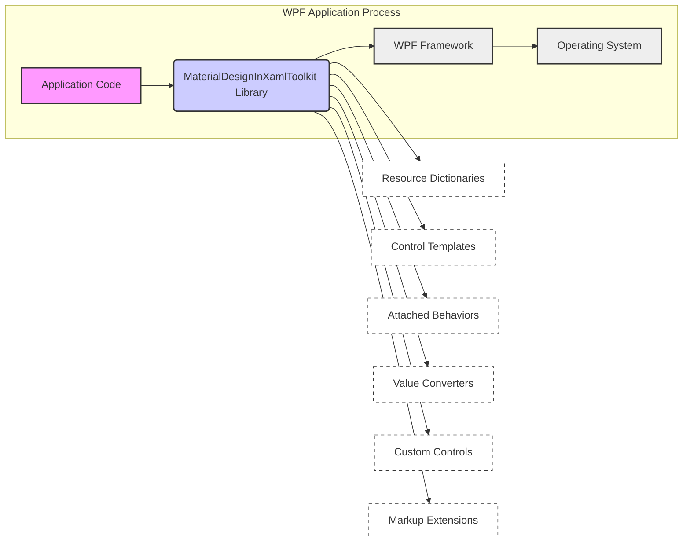
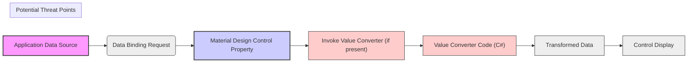

# Project Design Document: MaterialDesignInXamlToolkit for Threat Modeling (Improved)

**Project Name:** MaterialDesignInXamlToolkit

**Project Repository:** [https://github.com/materialdesigninxaml/materialdesigninxamltoolkit](https://github.com/materialdesigninxaml/materialdesigninxamltoolkit)

**Document Version:** 1.1
**Date:** October 26, 2023
**Author:** AI Software Architect

## 1. Introduction

This document provides an enhanced design overview of the MaterialDesignInXamlToolkit project, specifically tailored for threat modeling. Building upon the initial design document, this version offers more detailed security considerations and refined focus areas to facilitate a comprehensive threat analysis. It outlines the system architecture, data flow, technology stack, and key security considerations with a stronger emphasis on potential threats and vulnerabilities. This document will serve as a robust foundation for subsequent threat modeling activities.

### 1.1. Project Overview

MaterialDesignInXamlToolkit remains an open-source UI toolkit for .NET WPF applications, providing controls, styles, and themes based on Google's Material Design. It empowers developers to create modern WPF applications with consistent Material Design aesthetics. The toolkit simplifies UI development by offering pre-built, styled components.

### 1.2. Purpose of this Document

This improved design document is explicitly designed to enhance threat modeling for the MaterialDesignInXamlToolkit project. It aims to:

*   Provide a more granular understanding of the toolkit's architecture and component interactions relevant to security.
*   Clearly define data flows, including resource loading and data binding, with security implications in mind.
*   Elaborate on the technology stack and its inherent security characteristics.
*   Present a more detailed analysis of security considerations, including potential threat scenarios.
*   Offer refined and actionable threat modeling focus areas, guiding security assessments effectively.
*   Serve as a comprehensive and improved reference for security experts and developers during threat modeling exercises.

## 2. System Architecture

The architecture of MaterialDesignInXamlToolkit remains library-centric, integrating directly into WPF applications. It operates as a set of components within a consuming WPF application, not as a standalone entity.

### 2.1. High-Level Architecture Diagram

**Description of Components (Enhanced):**

*   **"WPF Application Process"**: Represents the runtime environment of the WPF application utilizing the toolkit.
    *   **"Application Code"**: Developer-written C# and XAML code defining application logic, UI, and data interactions. This code *consumes* the toolkit.
    *   **"MaterialDesignInXamlToolkit Library"**: The core library, providing Material Design UI components and styling. This is the *target* of our threat model.
    *   **"WPF Framework"**: The underlying .NET WPF framework, responsible for rendering, layout, and core UI functionalities. It provides the execution context for the toolkit.
    *   **"Operating System"**: The Windows OS, providing the runtime environment for WPF and the application.

*   **"MaterialDesignInXamlToolkit Library" (Internal Components - More Detail):**
    *   **"Resource Dictionaries"**: XAML files containing styles, themes (light/dark, color palettes), and global resources. These are loaded and parsed by WPF, representing a potential (though low-risk) attack surface if maliciously crafted.
    *   **"Control Templates"**: XAML definitions dictating the visual structure and behavior of Material Design controls. Improperly designed templates could *theoretically* lead to UI rendering issues or unexpected behavior.
    *   **"Attached Behaviors"**: C# code extending WPF control functionality. Behaviors, being code, are a more significant potential attack surface if they contain vulnerabilities (e.g., in event handling or data processing).
    *   **"Value Converters"**: C# classes for data transformation in data binding.  Converters, especially if complex or handling external data, could introduce vulnerabilities if not carefully implemented (e.g., format string vulnerabilities, incorrect data handling).
    *   **"Custom Controls"**: C# and XAML defining new Material Design controls. Custom controls, like behaviors, are a primary area for scrutiny due to custom code and logic.
    *   **"Markup Extensions"**: XAML markup extensions that provide dynamic or specialized behavior in XAML.  While generally safe, custom markup extensions could introduce vulnerabilities if they perform complex logic or interact with external resources.

### 2.2. Key Interactions (Security Perspective)

1.  **Application Integration (Dependency Introduction):** Integrating the toolkit introduces a dependency. Compromised NuGet packages or vulnerabilities in the toolkit itself become potential risks for the consuming application.
2.  **Resource Loading (XAML Parsing):** Loading resource dictionaries involves XAML parsing. While WPF XAML parsing is generally secure, vulnerabilities *could* theoretically exist. Maliciously crafted resource dictionaries (if sourced from an untrusted location - unlikely in typical NuGet usage but worth noting) could be a vector.
3.  **Control Instantiation and Styling (Style Application Logic):** WPF applies styles and templates.  The logic within styles and templates, while declarative, could *theoretically* contain subtle issues if overly complex or relying on external resources (though this is rare and not typical for UI styling).
4.  **Data Binding and Converters (Data Transformation Risks):** Data binding, especially with converters, involves data transformation. Vulnerabilities could arise in converters if they improperly handle data, especially if the data source is untrusted or external.
5.  **Behavior Application (Code Execution):** Attached behaviors execute C# code. Vulnerabilities in behavior code are a more direct and significant risk, as they represent arbitrary code execution within the application process.
6.  **Control Logic and Events (Control Vulnerabilities):** Custom controls encapsulate logic. Vulnerabilities in the control's C# code or event handling could be exploited by a malicious application or through manipulated data.

## 3. Data Flow (Security Focused)

Data flow within the toolkit, from a security perspective, primarily involves the flow of *resources* (styles, templates) and *data* (application data bound to controls).

### 3.1. Style and Theme Resource Loading Data Flow (Threat Perspective)

```mermaid
graph LR
    A["WPF Application Startup"] --> B("Request Resource Dictionaries");
    B --> C["MaterialDesignInXamlToolkit Library"];
    C --> D["Access Resource Dictionaries (XAML Files)"];
    D --> E["WPF XAML Parser"];
    E --> F["Load Styles and Templates into Memory"];
    F --> G["Style Application to Controls"];
    G --> H["UI Rendering"];

    subgraph "Potential Threat Points"
        style D fill:#fcc,stroke:#333,stroke-width:1px
        style E fill:#fcc,stroke:#333,stroke-width:1px
    end

    style A fill:#f9f,stroke:#333,stroke-width:2px
    style B fill:#eee,stroke:#333,stroke-width:1px
    style C fill:#ccf,stroke:#333,stroke-width:2px
    style F fill:#eee,stroke:#333,stroke-width:1px
    style G fill:#eee,stroke:#333,stroke-width:1px
    style H fill:#eee,stroke:#333,stroke-width:1px
```

**Data Flow Description (Security Context):**

1.  **"WPF Application Startup"**: Application initiates resource loading.
2.  **"Request Resource Dictionaries"**: Application requests resources from the toolkit.
3.  **"MaterialDesignInXamlToolkit Library"**: Toolkit provides access to resource files.
4.  **"Access Resource Dictionaries (XAML Files)"**: XAML resource files are accessed (from embedded resources or disk if deployed that way - less common for NuGet). **Potential Threat Point:** If resource files were somehow compromised or maliciously crafted (highly unlikely in typical NuGet scenario but consider supply chain risks in extreme scenarios).
5.  **"WPF XAML Parser"**: WPF parses the XAML. **Potential Threat Point:** Theoretical XAML parsing vulnerabilities.
6.  **"Load Styles and Templates into Memory"**: Styles and templates are loaded into the application's memory.
7.  **"Style Application to Controls"**: Styles are applied to controls.
8.  **"UI Rendering"**: UI is rendered.

### 3.2. Control Data Binding Data Flow (Threat Perspective)

**Data Flow Description (Security Context):**

1.  **"Application Data Source"**: Data originates from the consuming application (ViewModel, etc.).
2.  **"Data Binding Request"**: WPF data binding mechanism initiates data retrieval.
3.  **"Material Design Control Property"**: Data is bound to a control property.
4.  **"Invoke Value Converter (if present)"**: If a value converter is used in the binding. **Potential Threat Point:** Value converters are C# code and can be vulnerable if they handle data unsafely.
5.  **"Value Converter Code (C#)"**: Converter code executes. **Potential Threat Point:** Vulnerabilities in converter code (e.g., format string bugs, injection flaws if processing external input).
6.  **"Transformed Data"**: Data after conversion.
7.  **"Control Display"**: Control displays the data.

## 4. Technology Stack (Security Implications)

*   **Programming Language: C#**: C# is generally memory-safe, reducing risks of buffer overflows compared to languages like C/C++. However, logic errors, injection vulnerabilities, and other software flaws are still possible.
*   **Markup Language: XAML**: XAML parsing, while generally robust in WPF, is a potential (though low probability) attack surface.  Complex XAML or custom markup extensions could increase complexity and potential for subtle vulnerabilities.
*   **Framework: .NET Framework / .NET & WPF**: The .NET framework itself is regularly patched for security vulnerabilities. Keeping the consuming application's .NET framework up-to-date is crucial. WPF, as part of .NET, benefits from these security updates.
*   **Build System: MSBuild, NuGet**: The build process and dependency management (NuGet) are part of the software supply chain.  Compromised build tools or dependencies could introduce vulnerabilities. NuGet package integrity is important.
*   **Dependency Management: NuGet**: NuGet is the primary dependency management mechanism.  Dependency vulnerabilities are a significant concern. Regular scanning and updating of NuGet packages are essential.
*   **Version Control: Git (GitHub)**: While Git itself isn't a direct security vulnerability, the security of the GitHub repository (access control, code review processes) impacts the overall project security.

## 5. Security Considerations (Detailed Threat Scenarios)

Expanding on the initial considerations, here are more detailed security considerations with potential threat scenarios:

*   **Dependency Vulnerabilities (NuGet Packages):**
    *   **Threat Scenario:** A vulnerability is discovered in a NuGet package used by MaterialDesignInXamlToolkit (directly or transitively). Applications using the toolkit become indirectly vulnerable.
    *   **Mitigation:** Regular dependency scanning (e.g., using NuGet audit features, vulnerability scanners), timely updates of dependencies, monitoring security advisories for NuGet packages.
*   **Resource Loading and Parsing (XAML Injection - Low Probability):**
    *   **Threat Scenario (Highly Unlikely):**  A vulnerability in the WPF XAML parser is discovered that allows for code execution or denial of service through maliciously crafted XAML resource dictionaries.  An attacker could *theoretically* try to inject malicious XAML (though this is not a typical attack vector for UI libraries).
    *   **Mitigation:** Rely on the security of the WPF framework and .NET XAML parser (which is maintained by Microsoft).  Ensure up-to-date .NET framework. Code review of any custom XAML parsing logic (though unlikely in this toolkit).
*   **Code Quality and Bugs (Logic Flaws, Unexpected Behavior):**
    *   **Threat Scenario:** Bugs in C# code (behaviors, custom controls, converters) lead to unexpected behavior, data corruption, or denial of service in consuming applications. For example, a poorly written converter might crash the application when given unexpected input.
    *   **Mitigation:** Thorough code reviews, static analysis tools, unit testing, integration testing, and robust error handling within the toolkit's C# code.
*   **Value Converter Vulnerabilities (Data Handling Issues):**
    *   **Threat Scenario:** Value converters improperly handle data, leading to vulnerabilities like format string bugs (if using string formatting functions unsafely), or incorrect data transformations that could expose sensitive information or cause application errors.
    *   **Mitigation:** Secure coding practices in value converters, input validation (if converters process external input), careful use of string formatting, unit testing of converters with various input types (including potentially malicious or unexpected inputs).
*   **Attached Behavior Vulnerabilities (Code Execution Risks):**
    *   **Threat Scenario:** Vulnerabilities in attached behavior code allow for unintended actions or security breaches within the consuming application's context. For example, a behavior might incorrectly handle events or data, leading to a state where application logic can be bypassed or exploited.
    *   **Mitigation:** Rigorous code review of attached behaviors, security testing of behaviors, principle of least privilege (behaviors should only have necessary permissions), and careful event handling and data processing within behaviors.
*   **Custom Control Vulnerabilities (Control Logic Flaws):**
    *   **Threat Scenario:** Custom controls contain logic flaws or vulnerabilities in their C# code or XAML structure. These flaws could be exploited by a malicious application using the control, potentially leading to unexpected behavior or security issues within the application.
    *   **Mitigation:** Thorough code review and security testing of custom controls, following secure coding practices in control development, and ensuring controls handle input and data safely.

**Scope of Threat Model:**

*   **In Scope:** MaterialDesignInXamlToolkit library code (C#, XAML), resource dictionaries, control templates, behaviors, converters, custom controls, markup extensions, NuGet package dependencies.
*   **Out of Scope:** Consuming WPF applications (except as they *interact* with the toolkit), underlying .NET Framework/WPF framework (assume they are generally secure and patched by Microsoft), operating system, hardware.  The threat model focuses on vulnerabilities *introduced by or within* the MaterialDesignInXamlToolkit library itself.

## 6. Threat Modeling Focus Areas (Actionable Steps)

Based on the refined security considerations, the threat modeling process should focus on:

1.  **Automated Dependency Scanning:** Implement automated tools to regularly scan NuGet dependencies for known vulnerabilities. Integrate this into the CI/CD pipeline if possible.
    *   **Technique:** Software Composition Analysis (SCA) tools.
2.  **Static Code Analysis:** Use static analysis tools to scan the C# code (behaviors, converters, custom controls) for potential code quality issues, bugs, and potential vulnerabilities (e.g., using Roslyn analyzers, SonarQube, etc.).
    *   **Technique:** Static Application Security Testing (SAST).
3.  **Manual Code Review (Security Focused):** Conduct manual code reviews, specifically focusing on security aspects of behaviors, converters, custom controls, and any complex logic. Pay attention to data handling, event handling, and potential for unexpected behavior.
    *   **Technique:** Secure Code Review.
4.  **Dynamic Analysis/Fuzzing (Limited Applicability but Consider for Converters/Behaviors):**  While less directly applicable to a UI library, consider if dynamic analysis or fuzzing techniques could be used to test value converters or behaviors with a range of inputs, including potentially malicious or unexpected data.
    *   **Technique:** Dynamic Application Security Testing (DAST), Fuzzing (limited scope).
5.  **Threat Modeling Workshops (STRIDE, Attack Trees):** Conduct threat modeling workshops using methodologies like STRIDE or attack trees, focusing on the identified components and data flows. Brainstorm potential threats and attack scenarios based on the security considerations outlined in this document.
    *   **Technique:** STRIDE, Attack Trees.
6.  **Security Testing (Unit and Integration Tests with Security in Mind):** Expand unit and integration tests to include security-focused test cases. Test converters and behaviors with boundary conditions, invalid inputs, and potentially malicious data to ensure they handle these cases gracefully and securely.
    *   **Technique:** Security-focused Unit and Integration Testing.

## 7. Conclusion

This improved design document provides a more robust and security-focused foundation for threat modeling MaterialDesignInXamlToolkit. By detailing the architecture, data flows, technology stack, and elaborating on security considerations with concrete threat scenarios, it enables a more effective and targeted threat modeling process.  The refined threat modeling focus areas provide actionable steps for security assessments.  By focusing on dependency management, code quality, and potential vulnerabilities in behaviors, converters, and custom controls, the project can proactively identify and mitigate security risks, enhancing the overall security posture of applications utilizing this valuable UI toolkit.  Further threat modeling activities, using the suggested techniques, are crucial to achieve a comprehensive security assessment and ensure the ongoing security of MaterialDesignInXamlToolkit.