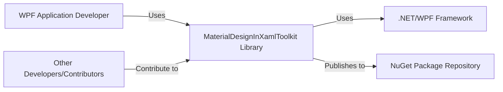
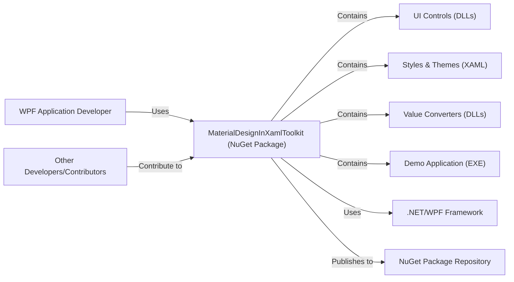
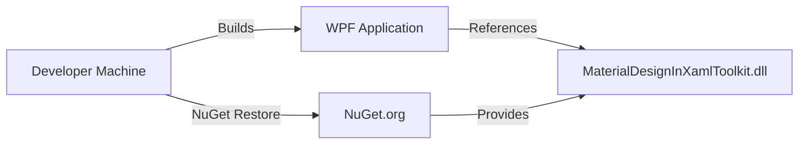
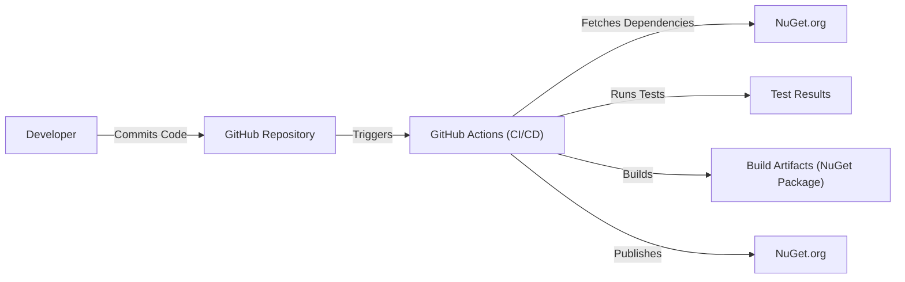

# BUSINESS POSTURE

Business Priorities and Goals:

*   Provide a comprehensive and easy-to-use Material Design UI library for WPF applications.
*   Enhance the visual appeal and user experience of WPF applications.
*   Reduce development time and effort for creating modern-looking WPF applications.
*   Maintain an active and supportive open-source community.
*   Ensure the library is well-documented and easy to learn.
*   Provide regular updates and bug fixes.
*   Maintain high code quality and test coverage.

Business Risks:

*   Malicious code injection through compromised dependencies or pull requests, potentially affecting applications using the library.
*   Lack of updates leading to compatibility issues with newer .NET/WPF versions.
*   Insufficient input validation leading to UI vulnerabilities (though less critical than in web apps).
*   Design inconsistencies or deviations from Material Design guidelines, affecting user experience.
*   Lack of community support or slow response to issues, hindering adoption and user satisfaction.
*   Licensing issues or violations, leading to legal problems.

# SECURITY POSTURE

Existing Security Controls:

*   security control: The project is open-source, allowing for community review and scrutiny of the codebase. (Described in the GitHub repository)
*   security control: The project uses GitHub for version control, providing a history of changes and facilitating collaboration. (Described in the GitHub repository)
*   security control: The project has a Contributor Covenant Code of Conduct. (Described in `CODE_OF_CONDUCT.md`)
*   security control: The project has contribution guidelines. (Described in `CONTRIBUTING.md`)
*   security control: The project uses automated builds and tests via GitHub Actions. (Described in `.github/workflows` directory)
*   security control: The project uses a package manager (NuGet) for dependency management. (Described in project files)
*   security control: The project has a license (MIT). (Described in `LICENSE`)

Accepted Risks:

*   accepted risk: The project relies on third-party dependencies (through NuGet), which could introduce vulnerabilities if those dependencies are compromised.
*   accepted risk: The project is primarily a UI library, so the attack surface is relatively smaller compared to server-side or network-facing applications. The primary risk is to the development environment and build process, rather than runtime exploitation in deployed applications.
*   accepted risk: While GitHub Actions are used, the specific security checks performed within those workflows are not fully detailed in the provided information. There may be gaps in static analysis, dependency scanning, etc.

Recommended Security Controls:

*   security control: Implement static code analysis (SAST) tools in the build pipeline to identify potential vulnerabilities in the codebase.
*   security control: Integrate dependency scanning tools (e.g., OWASP Dependency-Check, Snyk) to detect known vulnerabilities in third-party libraries.
*   security control: Implement Software Composition Analysis (SCA) to manage and monitor the use of open-source components and their licenses.
*   security control: Regularly review and update dependencies to mitigate the risk of using outdated or vulnerable components.
*   security control: Consider implementing code signing for released NuGet packages to ensure their integrity and authenticity.
*   security control: Enforce branch protection rules on the GitHub repository to require code reviews and passing CI checks before merging pull requests.

Security Requirements:

*   Authentication: Not directly applicable, as this is a UI library, not an application with user accounts.
*   Authorization: Not directly applicable, as this is a UI library. Access control would be handled by the applications using the library.
*   Input Validation:
    *   Controls should handle user input appropriately to prevent unexpected behavior or UI glitches.
    *   While XAML injection is less of a concern than, e.g., SQL injection, any dynamic loading of XAML from external sources should be carefully scrutinized.
    *   Text input controls should have appropriate length limitations.
*   Cryptography:
    *   If the library handles any sensitive data (which is unlikely), appropriate cryptographic algorithms and key management practices should be used. This is more relevant to applications *using* the library.

# DESIGN

## C4 CONTEXT

Element Descriptions:

*   Element:
    *   Name: WPF Application Developer
    *   Type: Person
    *   Description: A software developer building a WPF application.
    *   Responsibilities: Integrates the MaterialDesignInXamlToolkit library into their WPF application to enhance the UI.
    *   Security controls: N/A (External to the library)

*   Element:
    *   Name: MaterialDesignInXamlToolkit
    *   Type: Software System
    *   Description: A library providing Material Design components for WPF applications.
    *   Responsibilities: Provides UI controls, styles, and themes; Handles user interactions within those controls; Renders UI elements.
    *   Security controls: Input validation within controls; Dependency management; (Recommended) SAST, dependency scanning, code signing.

*   Element:
    *   Name: .NET/WPF Framework
    *   Type: Software System
    *   Description: The underlying framework for building Windows desktop applications.
    *   Responsibilities: Provides the base classes and functionality for WPF applications; Handles rendering, input, and other low-level operations.
    *   Security controls: Relies on the security features of the .NET framework itself.

*   Element:
    *   Name: NuGet Package Repository
    *   Type: Software System
    *   Description: A repository for hosting and distributing NuGet packages.
    *   Responsibilities: Stores and serves the MaterialDesignInXamlToolkit package; Allows developers to download and install the library.
    *   Security controls: Relies on the security features of the NuGet platform (e.g., package signing verification).

*   Element:
    *   Name: Other Developers/Contributors
    *   Type: Person
    *   Description: Developers who contribute to the MaterialDesignInXamlToolkit project.
    *   Responsibilities: Submit pull requests with code changes, bug fixes, or new features.
    *   Security controls: Code reviews; CI checks; Branch protection rules.

## C4 CONTAINER

Since this is a library, the container diagram is essentially an extension of the context diagram.

Element Descriptions:

*   Element:
    *   Name: MaterialDesignInXamlToolkit (NuGet Package)
    *   Type: Container (NuGet Package)
    *   Description: The distributable package containing the library's components.
    *   Responsibilities: Provides all necessary files for using the library in a WPF application.
    *   Security controls: Dependency management; (Recommended) Code signing.

*   Element:
    *   Name: UI Controls (DLLs)
    *   Type: Container (DLL)
    *   Description: Compiled assemblies containing the code for the UI controls.
    *   Responsibilities: Implement the logic and behavior of the Material Design controls.
    *   Security controls: Input validation; (Recommended) SAST.

*   Element:
    *   Name: Styles & Themes (XAML)
    *   Type: Container (XAML Files)
    *   Description: XAML files defining the visual appearance of the controls.
    *   Responsibilities: Provide the Material Design look and feel.
    *   Security controls: Careful handling of any dynamic XAML loading (if applicable).

*   Element:
    *   Name: Value Converters (DLLs)
    *   Type: Container (DLL)
    *   Description: Compiled assemblies containing value converters used for data binding.
    *   Responsibilities: Convert data between different types for display in the UI.
    *   Security controls: (Recommended) SAST.

*   Element:
    *   Name: Demo Application (EXE)
    *   Type: Container (Executable)
    *   Description: A sample application showcasing the use of the library.
    *   Responsibilities: Demonstrates how to use the library's controls and features.
    *   Security controls: N/A (primarily for demonstration purposes).

*   Element:
    *   Name: .NET/WPF Framework
    *   Type: Software System
    *   Description: The underlying framework.
    *   Responsibilities: As described in the Context diagram.
    *   Security controls: As described in the Context diagram.

*   Element:
    *   Name: NuGet Package Repository
    *   Type: Software System
    *   Description: The package repository.
    *   Responsibilities: As described in the Context diagram.
    *   Security controls: As described in the Context diagram.

*   Element:
    *   Name: Other Developers/Contributors
    *   Type: Person
    *   Description: Contributors to the project.
    *   Responsibilities: As described in the Context diagram.
    *   Security controls: As described in the Context diagram.

*   Element:
    *   Name: WPF Application Developer
    *   Type: Person
    *   Description: A software developer building a WPF application.
    *   Responsibilities: As described in the Context diagram.
    *   Security controls: As described in the Context diagram.

## DEPLOYMENT

Possible Deployment Solutions:

1.  **Direct NuGet Package Reference:** Developers reference the MaterialDesignInXamlToolkit NuGet package directly in their WPF application projects. This is the most common and recommended approach.
2.  **Local NuGet Feed:** For organizations with private package repositories, the package can be hosted on a local NuGet feed.
3.  **Manual Copying of DLLs (Not Recommended):** Developers could theoretically copy the necessary DLLs directly into their project, but this bypasses dependency management and is strongly discouraged.

Chosen Solution (Direct NuGet Package Reference):

Element Descriptions:

*   Element:
    *   Name: Developer Machine
    *   Type: Infrastructure Node (Computer)
    *   Description: The developer's workstation where the WPF application is built.
    *   Responsibilities: Hosts the development environment (e.g., Visual Studio); Fetches NuGet packages; Builds the application.
    *   Security controls: Development environment security best practices.

*   Element:
    *   Name: NuGet.org
    *   Type: Infrastructure Node (Server)
    *   Description: The public NuGet package repository.
    *   Responsibilities: Hosts the MaterialDesignInXamlToolkit package.
    *   Security controls: NuGet platform security measures.

*   Element:
    *   Name: WPF Application
    *   Type: Software System
    *   Description: The application being developed, which uses the MaterialDesignInXamlToolkit library.
    *   Responsibilities: Runs on the end-user's machine.
    *   Security controls: Application-level security controls (implemented by the developer).

*   Element:
    *   Name: MaterialDesignInXamlToolkit.dll
    *   Type: Software Component (DLL)
    *   Description: The compiled library assembly.
    *   Responsibilities: Provides the Material Design UI components.
    *   Security controls: (Recommended) Code signing.

## BUILD

Element Descriptions:

*   Element:
    *   Name: Developer
    *   Type: Person
    *   Description: A contributor to the MaterialDesignInXamlToolkit project.
    *   Responsibilities: Writes code, submits pull requests.
    *   Security controls: Code reviews; Branch protection rules.

*   Element:
    *   Name: GitHub Repository
    *   Type: Software System
    *   Description: The source code repository hosted on GitHub.
    *   Responsibilities: Stores the project's code, tracks changes, manages collaboration.
    *   Security controls: GitHub's built-in security features; Branch protection rules.

*   Element:
    *   Name: GitHub Actions (CI/CD)
    *   Type: Software System
    *   Description: The CI/CD pipeline defined using GitHub Actions.
    *   Responsibilities: Automates the build, test, and packaging process.
    *   Security controls: (Recommended) SAST, dependency scanning, configuration as code.

*   Element:
    *   Name: NuGet.org
    *   Type: Software System
    *   Description: The public NuGet package repository.
    *   Responsibilities: Provides dependencies during the build process; Hosts the published NuGet package.
    *   Security controls: NuGet platform security measures.

*   Element:
    *   Name: Test Results
    *   Type: Data
    *   Description: The results of the automated tests run during the build.
    *   Responsibilities: Indicate whether the build is successful and the code meets quality standards.
    *   Security controls: N/A (data generated by the build process).

*   Element:
    *   Name: Build Artifacts (NuGet Package)
    *   Type: Data
    *   Description: The output of the build process, a NuGet package containing the compiled library.
    *   Responsibilities: Represents the deployable unit of the library.
    *   Security controls: (Recommended) Code signing.

Security Controls in Build Process:

*   GitHub Actions workflows (in `.github/workflows`) define the build steps.
*   Automated tests are run as part of the build process.
*   NuGet is used for dependency management.
*   (Recommended) SAST, dependency scanning, and code signing should be integrated into the build pipeline.

# RISK ASSESSMENT

Critical Business Processes:

*   Maintaining the integrity and availability of the MaterialDesignInXamlToolkit library.
*   Ensuring the library is free of known vulnerabilities.
*   Providing a reliable and user-friendly UI library for WPF developers.

Data to Protect:

*   Source code: High sensitivity (intellectual property, potential for malicious code injection).
*   Build artifacts (NuGet packages): High sensitivity (potential for distribution of compromised code).
*   Documentation: Medium sensitivity (important for usability, but not as critical as code).
*   Issue tracker data: Low-Medium sensitivity (contains bug reports and feature requests, may include some user information).

# QUESTIONS & ASSUMPTIONS

Questions:

*   What specific static analysis tools are currently used (if any)?
*   What is the process for reviewing and updating dependencies?
*   Are there any plans to implement code signing for NuGet packages?
*   What is the expected frequency of releases and updates?
*   Are there any specific security concerns raised by the community or users?
*   What is the process for handling security vulnerabilities reported by external researchers?

Assumptions:

*   BUSINESS POSTURE: The project prioritizes ease of use and community contributions, with a moderate risk appetite.
*   SECURITY POSTURE: The project relies primarily on open-source community review and basic CI/CD practices for security. There is room for improvement in terms of proactive security measures.
*   DESIGN: The library is designed to be a self-contained UI component library, with minimal external dependencies beyond the .NET/WPF framework. The primary attack surface is through compromised dependencies or malicious contributions.